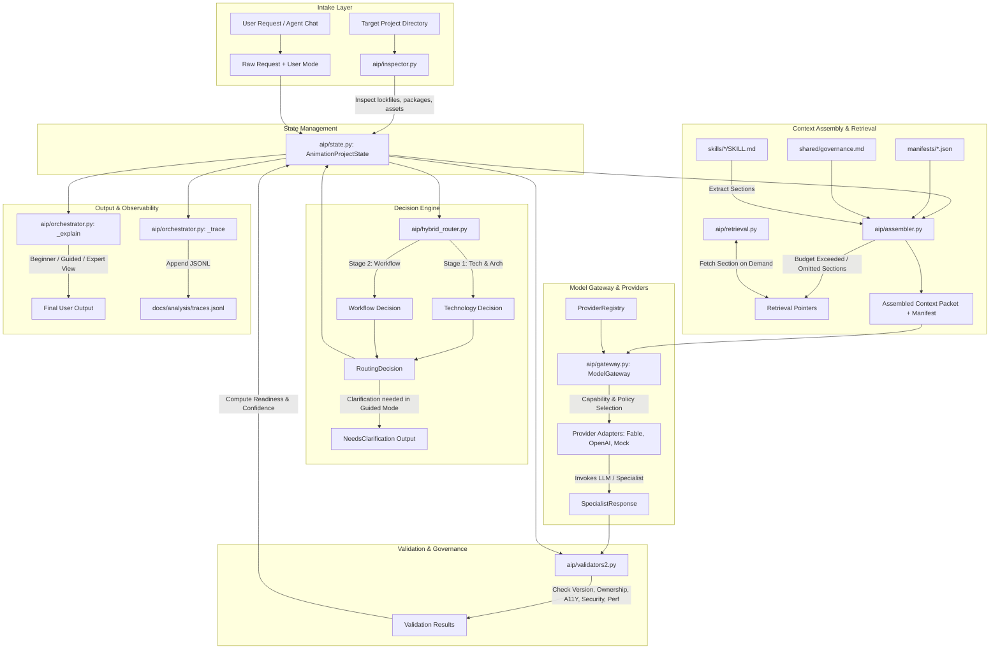
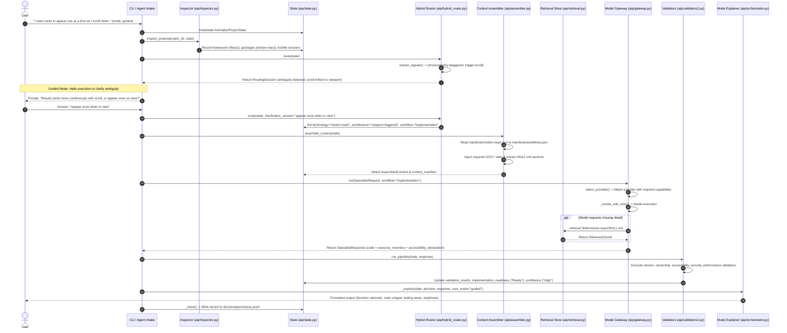

# PROJECT FINAL ARCHITECTURE REVIEW
## Frontend Animation Agent Skills (Animation Intelligence Platform)

---

## SECTION 1: EXECUTIVE SUMMARY

### What the Project Is
`frontend-animation-agent-skills` (operating as the **Animation Intelligence Platform** or **AIP**) is an enterprise-grade, agent-agnostic knowledge architecture, deterministic routing framework, and context-engineering runtime designed to govern how AI coding agents plan, implement, debug, review, optimize, and migrate frontend web animations.

### What It Does
Rather than serving as an arbitrary code generator or a static collection of prompts, the system sits between plain-language user requests (or developer chat interfaces) and underlying Large Language Models (LLMs) or AI coding agents (such as GitHub Copilot, Claude, Cursor, Codex, Gemini, Windsurf, Qwen, and Kimi). 

The platform intercepts animation requests, deterministically inspects target project environments (manifests, lockfiles, installed dependencies, verified exports, and assets), applies a two-stage hybrid decision engine to select appropriate technologies and workflows, dynamically assembles minimal, safety-gated context packets from manifest-mapped skill modules, enforces strict governance rules (accessibility, lifecycle cleanup, package versioning, security, and performance), executes requests through a provider-neutral model gateway, and runs post-execution validation gates before projecting tailored outputs to users across three distinct expertise modes (**Beginner**, **Guided**, **Expert**).

### Why It Was Built
AI coding models frequently generate frontend animation code that suffers from severe architectural defects:
1. **Tool Over-Engineering:** Using heavy JavaScript libraries (e.g., GSAP or Three.js) for simple micro-interactions easily solved by native CSS transitions or Web Animations API (WAAPI).
2. **Memory Leaks and Lifecycle Defects:** Failing to clean up event listeners, ScrollTrigger instances, WebGL contexts, or WASM/Canvas runtimes upon component unmounting.
3. **Accessibility Violations:** Neglecting system `prefers-reduced-motion` settings, breaking keyboard focus management, causing excessive screen flashing (>3Hz), or misusing ARIA attributes.
4. **Hallucinated Package APIs:** Invoking exported functions or methods from incorrect versions of libraries or non-existent packages.
5. **Security and Provenance Risks:** Treating external designer assets (`.json`, `.riv`, `.glb`) as implicitly safe same-origin files without validating origin or content security policies (CSP).

The project was created to transform prompt-based animation code generation into a deterministic, verifiable engineering process.

### Business Problem Solved
- **Reduces Maintenance and Technical Debt:** Prevents fragile, un-maintained animation snippets from entering enterprise codebases.
- **Ensures Legal and Regulatory Compliance:** Enforces Web Content Accessibility Guidelines (WCAG 2.2 AA) by default, protecting organizations from accessibility lawsuits and compliance failures.
- **Protects Application Performance:** Prevents animation-induced layout thrashing, main-thread jank, excessive bundle bloat, and memory retention in long-lived single-page applications (SPAs).
- **Vendor & Provider Independence:** Decouples enterprise AI workflows from proprietary LLM providers or specific agent tools, guaranteeing long-term platform portability.

### Technical Problem Solved
- **Prompt Bloat and Context Degradation:** Replaces massive, monolithic skill dumps (which waste model context windows and cause instruction drift) with a deterministic context assembler that dynamically loads only the required sections, reducing token consumption by up to **87.2%** while retaining 100% of safety-critical rules.
- **Nondeterministic Decision-Making:** Replaces pure LLM guessing with a deterministic two-stage hybrid router that extracts multi-signal intent, checks project lockfiles, and escalates to clarification or model routing only when genuine ambiguity exists.
- **Lack of Output Verification:** Introduces structured post-execution validation gates that enforce resource inventory tracking, accessibility declarations, and lockfile evidence before code is declared ready for production.

### Who It Is Designed For
- **Frontend Engineers & UI/UX Developers:** Seeking production-grade animation code adhering to library best practices.
- **AI Platform Leads & CTOs:** Requiring governed, predictable, and cost-efficient AI code generation integrated into enterprise pipelines.
- **Design Systems Teams:** Looking to enforce uniform motion tokens, accessibility standards, and runtime performance budgets across distributed teams.
- **Senior Architects & Maintainers:** Overseeing long-term codebase health, framework migrations, and toolchain upgrades.

### Why It Matters
The platform proves that specialized AI coding capability does not require fine-tuning expensive domain-specific LLMs. Instead, by combining plain Markdown knowledge repositories, strict JSON schema contracts, deterministic Python inspection/routing heuristics, and provider-neutral model gateways, organizations can achieve deterministic, safe, and highly efficient AI agent operations at scale.

---

## SECTION 2: PROJECT ORIGIN

### Initial State: Monolithic Skill Files
The repository originated as a repository of monolithic Markdown files stored under `skills/` (e.g., `skills/gsap/SKILL.md`, `skills/threejs/SKILL.md`). Each file was a comprehensive reference document containing goals, return formats, context dumps, RTCF (Role/Task/Constraints/Format) frameworks, and few-shot code examples. 

While highly thorough, relying on monolithic skill files introduced operational challenges as AI agents were deployed across larger codebases:
- **Token Inefficiency:** Injecting an entire `SKILL.md` file (often 10,000 to 20,000 tokens) into an LLM prompt consumed significant context window capacity, increased latency, and inflated API costs.
- **Context Pollution and Instruction Drift:** Models supplied with irrelevantly large context dumps frequently lost track of core constraints, ignored safety guidelines, or halluned hybrid configurations.
- **Duplicate Governance:** Safety guidelines (such as `prefers-reduced-motion` handling or package version verification) were duplicated across seven separate library files, creating maintenance friction and inconsistencies over time.

### Evolution Chronology

```
[Phase 1: Monolithic Skills]
  │  • Skills stored as giant standalone SKILL.md files.
  │  • Manual selection by users/agents.
  ▼
[Phase 2: Adapter Expansion & Prompts]
  │  • Added adapters/ for Copilot, Claude, Cursor, Generic agents.
  │  • Added .github/prompts/ slash commands (/animation, /animate, etc.).
  ▼
[Phase 3: Schema Standardization & Governance Extraction]
  │  • Created schemas/project-state.schema.json & manifest.schema.json.
  │  • Extracted cross-skill rules into shared/governance.md (GOV-* IDs).
  ▼
[Phase 4: Deterministic Platform Layer (aip/ & platform/)]
  │  • Implemented Python stdlib runtime (inspector, router, assembler, pipeline).
  │  • Created manifests/*.json defining load_when conditions per technology module.
  ▼
[Phase 5: Hybrid Two-Stage Routing & Executable Retrieval]
  │  • Created aip/hybrid_router.py (multi-signal intake, scroll/stagger disambiguation).
  │  • Created aip/retrieval.py (deterministic path-allowlisted section retriever).
  ▼
[Phase 6: Capability Gateway, Governance Gates & Observability]
  │  • Implemented aip/gateway.py (provider-neutral execution, capability matching).
  │  • Implemented aip/validators2.py (structured evidence validation).
  │  • Implemented aip/orchestrator.py (trace logging to docs/analysis/traces.jsonl).
```

### The Transition to a Configurable Platform
Rather than discarding the monolithic skill files, the architecture evolved via **ADR-001**:
- The canonical Markdown files in `skills/` remain the single source of truth for deep domain knowledge.
- A deterministic platform layer (`aip/`) was built *around* these skills.
- Manifests (`manifests/*.json`) map specific tasks, frameworks, and intents to precise `##` sections inside `skills/` and `shared/governance.md`.
- A feature flag (`legacy_full_skill`) was preserved as an instantaneous rollback path, allowing the system to operate in either full monolithic mode or modular assembled mode without modifying raw knowledge assets.

---

## SECTION 3: PROJECT VISION

### Plain English Platform Vision
The core philosophy of the platform is: **"Do not teach one animation library. Teach animation engineering."**

The platform decouples user intent from technology implementation. Users describe desired visual, communicative, or interactive outcomes in plain language, and the platform determines the most performant, accessible, and maintainable architectural approach.

### Outcome-Based Request Handling
Instead of prompting an agent with:
> *"Write a GSAP ScrollTrigger timeline with pin: true and stagger: 0.2 for my React cards,"*

Users interact by stating outcomes:
> *"I want cards to appear one at a time as the user scrolls down."*

The platform analyzes the environment, checks if native CSS, Motion for React, or GSAP is installed, evaluates whether scroll-linked or viewport-triggered behavior is requested, enforces reduced-motion alternatives, and generates the exact required implementation.

### User Interaction Modes

| Mode | User Persona | System Behavior & Interaction | Output Focus |
|---|---|---|---|
| **Beginner** | Non-technical creators, product managers, junior designers | Automatically resolves ambiguity by selecting safe defaults (e.g., viewport-triggered entrance over scroll-linked pin). Discloses assumptions clearly. | Plain-language explanations of screen behavior, automated accessibility guarantees, and simple step-by-step testing instructions. |
| **Guided** | Frontend developers seeking architectural direction | Halts execution when material ambiguity is encountered (e.g., scroll-linked vs. viewport-entry) and prompts the user with specific clarification questions before generating code. | Decision rationale, key trade-offs, interactive option selection, and targeted code snippets. |
| **Expert** | Senior engineers, tech leads, design system maintainers | Direct execution with full architectural transparency. Accepts precise technology overrides and custom policies. | Complete state projections, routing signal breakdowns, module inclusion manifests, token usage metrics, and structured validation reports. |

---

## SECTION 4: HIGH-LEVEL ARCHITECTURE

### Architecture Diagram



### Explanation of Architecture
1. **Intake & Inspection:** A user request enters along with an optional project directory path. `aip/inspector.py` inspects `package.json`, lockfiles (`package-lock.json`, `pnpm-lock.yaml`, `yarn.lock`), verified exports, and local assets, populating `AnimationProjectState`.
2. **Hybrid Two-Stage Routing:** `aip/hybrid_router.py` extracts multi-signal intent (negation, triggers, choreography, target, technology, workflow) and selects the technology and workflow. If material ambiguity is detected in Guided mode, execution halts and requests clarification.
3. **Selective Context Assembly:** `aip/assembler.py` reads `manifests/<technology>.json` and `manifests/workflows.json`. It loads required `GOV-*` shared rules from `shared/governance.md` and extracts specific `##` sections from `skills/`. Unincluded sections become executable retrieval pointers.
4. **Model Gateway Execution:** `aip/gateway.py` evaluates registered provider adapters against workflow capability requirements, formats stable/dynamic prompt splits (enabling prompt caching), and executes the request with automated retry and refusal handling.
5. **Validation Pipeline:** `aip/validators2.py` checks the specialist response against lockfile evidence, lifecycle teardown declarations, accessibility attributes, security trust rules, and performance budgets, setting `implementation_readiness` and `confidence`.
6. **Explanation & Tracing:** The orchestrator formats the response for the requested user mode (Beginner, Guided, or Expert) and writes an audit record to `docs/analysis/traces.jsonl`.

---

## SECTION 5: FOLDER STRUCTURE REVIEW

### Root Folder Structure

```
frontend-animation-agent-skills/
├── AGENTS.md                          # Primary agent instructions entrypoint
├── CHANGELOG.md                       # Historical project changes
├── CONTRIBUTING.md                    # Contribution guidelines
├── LICENSE                            # MIT License
├── README.md                          # Project overview and quickstart
├── SECURITY.md                        # Vulnerability reporting & security policy
├── pyproject.toml                     # Python project configuration (stdlib-only)
├── .github/                           # GitHub Copilot & CI configurations
│   ├── copilot-instructions.md       # Global Copilot instructions
│   ├── prompts/                       # Slash command prompts (.prompt.md)
│   └── workflows/                     # GitHub Actions CI validation workflows
├── adapters/                          # Agent-specific adapters & instruction mappings
│   ├── claude/                        # Anthropic Claude instructions (CLAUDE.md)
│   ├── cursor/                        # Cursor IDE rules (.cursorrules)
│   ├── generic/                       # Generic agent instructions (AGENTS.md)
│   └── github-copilot/                # GitHub Copilot adapter docs
├── aip/                               # Operational Runtime Engine (v2)
│   ├── __init__.py                    # Module init
│   ├── __main__.py                    # CLI entrypoint
│   ├── assembler.py                   # Context assembler & token budget manager
│   ├── gateway.py                     # Provider-neutral model gateway & registry
│   ├── hybrid_router.py               # Two-stage multi-signal hybrid decision engine
│   ├── inspector.py                   # Deterministic project & lockfile inspector
│   ├── inventory.py                   # Codebase inventory & token estimator script
│   ├── orchestrator.py                # Main operational handler & trace logger
│   ├── pipeline.py                    # Legacy v1 pipeline (kept for compatibility)
│   ├── retrieval.py                   # Local path-allowlisted section retriever
│   ├── router.py                      # Stage 1/Stage 2 deterministic router heuristics
│   ├── schema_check.py                # Validation script for manifests & schemas
│   ├── state.py                       # AnimationProjectState dataclass & projections
│   ├── types.py                       # Core enums, requests, responses & trace types
│   ├── validators.py                  # Legacy v1 validators
│   ├── validators2.py                 # Structured v2 validation gates
│   └── backends/                      # Specialist backend adapters
│       ├── __init__.py                # Backend module init
│       ├── fable.py                   # Fable backend adapter contract
│       └── mock.py                    # Mock backend for deterministic testing
├── docs/                              # Project documentation & analysis reports
│   ├── adr.md                         # Architectural Decision Records (ADR 001–007)
│   ├── architecture.md                # System design & core principles
│   ├── beginner-guide.md              # Plain-language user guide
│   ├── migration.md                   # Platform migration guide
│   ├── platform-maintainer-guide.md   # Maintainer operations & feature flags guide
│   ├── skill-authoring.md             # Guide for adding new animation skills
│   └── analysis/                      # Automated benchmark & trace outputs
│       ├── inventory.json             # Codebase token & file metrics
│       ├── router-benchmark.json      # Routing accuracy benchmark results
│       ├── scenario-report.json       # 15-scenario equivalence test results
│       └── traces.jsonl               # Operational request execution trace log
├── evals/                             # Evaluation benchmarks & rubrics
│   ├── cases/                         # Test cases for AI output evaluation
│   └── rubrics/                       # Grading criteria for animation code quality
├── examples/                          # Reference code implementations
│   └── basic/                         # Working HTML/JS/React animation code examples
├── integrations/                      # Framework-specific pattern references
│   ├── nextjs/                        # Next.js App Router animation patterns
│   └── react/                         # React hook & cleanup patterns
├── manifests/                         # JSON manifests mapping technologies & workflows
│   ├── animejs.json                   # Anime.js technology manifest
│   ├── css.json                       # Native CSS technology manifest
│   ├── examples.json                  # Examples metadata manifest
│   ├── gsap.json                      # GSAP technology manifest
│   ├── lottie.json                    # Lottie technology manifest
│   ├── motion-react.json              # Motion for React technology manifest
│   ├── motion.json                    # Motion (vanilla) technology manifest
│   ├── rive.json                      # Rive technology manifest
│   ├── threejs.json                   # Three.js technology manifest
│   ├── waapi.json                     # WAAPI technology manifest
│   └── workflows.json                 # Workflow definitions & shared rule mappings
├── platform/                          # Legacy v1 platform module (deprecated alias)
├── references/                        # Cross-cutting technical reference files
│   ├── accessibility.md               # WCAG motion standards reference
│   ├── browser-support.md             # CSS/WAAPI browser compatibility matrix
│   ├── library-decision-matrix.md     # Technology selection decision matrix
│   ├── performance.md                 # Rendering performance & composite properties
│   └── security.md                    # Asset provenance & CSP security reference
├── schemas/                           # Draft-07 JSON Schema specifications
│   ├── manifest.schema.json           # Schema for manifests/*.json validation
│   └── project-state.schema.json      # Schema for AnimationProjectState validation
├── shared/                            # Canonical governance rule storage
│   └── governance.md                  # Canonical GOV-* governance rules with provenance
├── skills/                            # Canonical domain knowledge skills
│   ├── animation-accessibility/       # Accessibility audit skill
│   ├── animation-code-review/          # Code review skill
│   ├── animation-debugging/            # Debugging & issue diagnosis skill
│   ├── animation-migration/            # Framework migration skill
│   ├── animation-performance/          # Performance profiling & optimization skill
│   ├── animation-router/               # Semantic routing skill
│   ├── animejs/                       # Anime.js domain skill
│   ├── gsap/                          # GSAP domain skill
│   ├── lottie/                        # Lottie domain skill
│   ├── motion/                        # Motion (vanilla) domain skill
│   ├── motion-react/                  # Motion for React domain skill
│   ├── rive/                          # Rive interactive runtime skill
│   └── threejs/                       # Three.js 3D domain skill
└── tests/                             # Test suite & benchmark scripts
    ├── router_benchmark.py             # Router benchmark dataset & accuracy evaluator
    ├── scenario_suite.py              # 15-scenario equivalence & release gate runner
    ├── test_gateway.py                # Unit tests for ModelGateway & provider registry
    ├── test_platform.py               # Unit tests for manifests, state & assembler
    └── test_v2.py                     # Unit tests for v2 operational runtime components
```

### Folder Analysis

| Folder | Purpose | Key Responsibilities | Runtime Role | Key Dependencies | Source of Truth Status |
|---|---|---|---|---|---|
| `aip/` | Operational Runtime Engine | Project inspection, routing, context assembly, model execution, validation, tracing | Active Core Runtime | Stdlib (`json`, `re`, `hashlib`, `pathlib`, `dataclasses`) | Source of Truth for execution logic |
| `manifests/` | Technology & Workflow Declarations | Maps technologies/workflows to governance rules, SKILL.md sections, and load_when rules | Active Runtime Configuration | Validated by `schemas/manifest.schema.json` | Source of Truth for context assembly rules |
| `shared/` | Cross-Skill Governance Rules | Stores canonical, deduplicated rules (`GOV-VERSION`, `GOV-A11Y`, `GOV-SECURITY`, etc.) | Active Context Assembly Source | Referenced by `manifests/*.json` | Source of Truth for governance rule text |
| `skills/` | Deep Domain Knowledge | Contains comprehensive documentation, warnings, API patterns, and few-shot examples | Canonical Knowledge Base | Ingested via section extraction by `aip/assembler.py` | Source of Truth for domain technical knowledge |
| `schemas/` | Contract Specifications | Validates `AnimationProjectState` and technology/workflow manifests | Pre-flight Validation | Draft-07 JSON Schema specification | Source of Truth for structural state & manifest schemas |
| `adapters/` | Agent Integration | Provides instructions for specific AI agent environments (Copilot, Claude, Cursor) | Agent Configuration | References `AGENTS.md` and `.github/` | Config adapters for external agent tools |
| `references/` | Domain Technical Matrices | Reference guides for performance, accessibility, security, browser support | On-demand Retrieval Source | Accessed via `aip/retrieval.py` | Technical reference standards |
| `tests/` | Verification & Benchmarking | Enforces platform contracts, scenario equivalence, router accuracy, and release gates | CI Test Execution | Imports `aip/` modules | Test and release-gate verification |
| `docs/` | System Documentation & Artifacts | Architecture records (ADRs), guides, maintainer docs, and generated trace logs | Historical & Analysis Log | Stores `docs/analysis/*.json` and `traces.jsonl` | Source of Truth for architecture decisions |

---

## SECTION 6: PLATFORM COMPONENTS

### 1. State Management (`aip/state.py`)
- **Purpose:** Centralized, strongly-typed state object representing a single animation request throughout its lifecycle.
- **Inputs:** `raw_user_request` (string), `user_mode` (enum: beginner/guided/expert).
- **Outputs:** `AnimationProjectState` dataclass containing inspection evidence, selected technology/workflow, validation results, and context manifest.
- **Dependencies:** Python stdlib (`uuid`, `dataclasses`).
- **Role:** Active Runtime State.
- **Projections:** Supports model-facing projections (`ROUTER_VIEW`, `SPECIALIST_VIEW`, `EXPLAINER_VIEW`) that strip internal system fields (`MODEL_HIDDEN_FIELDS` like `context_manifest` and internal security flags) to protect security and optimize prompt tokens.

### 2. Inspector (`aip/inspector.py`)
- **Purpose:** Read-only deterministic analysis of a target project directory.
- **Inputs:** Target project directory path.
- **Outputs:** Populates state fields: `framework`, `package_manager`, `installed_packages`, `resolved_versions`, `verified_exports`, `assets`, and `evidence`.
- **Dependencies:** Python stdlib (`json`, `re`, `pathlib`).
- **Role:** Deterministic Pre-routing Inspection. Parses `package.json`, lockfiles (`package-lock.json`, `pnpm-lock.yaml`, `yarn.lock`), type definitions (`.d.ts`), and asset directories (`.json`, `.riv`, `.glb`). Never executes project code.

### 3. Router (`aip/hybrid_router.py` & `aip/router.py`)
- **Purpose:** Two-stage multi-signal decision engine that selects technology and workflow.
- **Inputs:** `AnimationProjectState`, optional `clarification_answer`.
- **Outputs:** `RoutingDecision` dataclass (contains technology, architecture, workflow, intent signals, confidence, and optional clarification question).
- **Dependencies:** Python stdlib (`re`). Reads inspection results from state.
- **Role:** Active Routing Engine. Extracts all matching intent signals (negation, choreography, trigger, target, technology, workflow) simultaneously without collapsing to first-match heuristics.

### 4. Context Assembler (`aip/assembler.py`)
- **Purpose:** Dynamic assembly of minimal, safety-gated prompt context packets.
- **Inputs:** `AnimationProjectState`, target depth, optional `ContextCompressor`.
- **Outputs:** `AssembledContext` object containing trimmed text chunks and an inspectable `context_manifest`.
- **Dependencies:** `shared/governance.md`, `manifests/*.json`, `skills/*/SKILL.md`.
- **Role:** Active Context Engineering Engine. Evaluates `load_when` conditions in technology manifests, injects required `GOV-*` governance rules, extracts specific `##` sections from skill files, enforces token budgets, and retains retrieval pointers for omitted content.

### 5. Executable Retrieval (`aip/retrieval.py`)
- **Purpose:** Thread-safe, path-allowlisted section retriever over repository content.
- **Inputs:** Retrieval key in `source#heading` format (e.g., `skills/gsap/SKILL.md#ScrollTrigger`).
- **Outputs:** `RetrievedChunk` object containing text, SHA-256 hash, provenance, and trust rating.
- **Dependencies:** Path allowlist (`skills/`, `references/`, `shared/`, `examples/`, `integrations/`).
- **Role:** Active Knowledge Retrieval Runtime. Rejects path traversal (`..`), checks for stale file hashes, enforces per-request and total token retrieval budgets, and logs all operations for auditing.

### 6. Validation System (`aip/validators2.py` & `aip/validators.py`)
- **Purpose:** Post-execution verification gates that evaluate model responses and populated state against safety and evidence standards.
- **Inputs:** `AnimationProjectState`, optional `SpecialistResponse`.
- **Outputs:** Population of `validation_results`, `implementation_readiness`, and `confidence` fields on state.
- **Dependencies:** Structured fields in `SpecialistResponse` (`resource_inventory`, `accessibility_declaration`).
- **Role:** Active Post-Execution Quality Gate.

### 7. Model Gateway (`aip/gateway.py`)
- **Purpose:** Capability-aware, policy-driven, provider-neutral execution interface.
- **Inputs:** `SpecialistRequest`, target workflow, selection policy, optional fixed provider.
- **Outputs:** `ModelResponse` (or `SpecialistResponse`), `SelectionDecision`.
- **Dependencies:** `ProviderRegistry`. Zero vendor-specific SDK imports.
- **Role:** Active Execution Gateway. Normalizes errors (`ProviderErrorKind`), manages retry for transient network/timeout errors, handles content refusals without retrying, and applies fallback rules.

### 8. Adapters & Backends (`aip/backends/` & `adapters/`)
- **Purpose:** Interfaces connecting the core runtime to model execution providers and agent environments.
- **Inputs:** `SpecialistRequest` or raw prompt instructions.
- **Outputs:** `SpecialistResponse` or IDE/agent-specific instruction files (`.cursorrules`, `CLAUDE.md`, `copilot-instructions.md`).
- **Dependencies:** `aip/backends/fable.py`, `aip/backends/mock.py`.
- **Role:** Integration Layer. Translates standard internal state into vendor-specific payload structures and maps responses back to canonical platform types.

### 9. User Experience & Explainer (`aip/orchestrator.py: _explain`)
- **Purpose:** Tailors response explanations based on user mode.
- **Inputs:** `AnimationProjectState`, `RoutingDecision`, `SpecialistResponse`, `user_mode`.
- **Outputs:** Structured output dictionary formatted for Beginner, Guided, or Expert consumption.
- **Dependencies:** Python stdlib.
- **Role:** Active Presentation Layer.

### 10. Tracing & Observability (`aip/orchestrator.py: _trace`)
- **Purpose:** Operational audit logging of every request execution.
- **Inputs:** Request state, active feature flags, emitted/resolved retrieval pointers, response usage metrics.
- **Outputs:** Appends JSON-formatted trace records to `docs/analysis/traces.jsonl`.
- **Dependencies:** Python stdlib (`json`, `pathlib`).
- **Role:** Active Observability Infrastructure.

### 11. Command Line Interface (`aip/__main__.py`)
- **Purpose:** Direct terminal entrypoint for running animation requests, inspecting projects, or running benchmarks.
- **Inputs:** CLI arguments (`--request`, `--project-dir`, `--mode`, `--flags`).
- **Outputs:** Formatted terminal output or JSON results.
- **Dependencies:** `aip.orchestrator`.
- **Role:** Tooling / CLI Entrypoint.

### 12. Feature Flags (`aip/pipeline.py` & `aip/orchestrator.py`)
- **Purpose:** Validated feature flag matrix governing runtime path selection.
- **Inputs:** Feature flag dictionary.
- **Outputs:** Controls whether legacy full skill loading, modular context assembly, model gateways, retrieval loops, or compression are active.
- **Dependencies:** `VALID_FLAG_SETS`.
- **Role:** Runtime Configuration Control.

### 13. Schemas (`schemas/`)
- **Purpose:** Structural validation of state objects and manifest files.
- **Inputs:** JSON files or state dictionaries.
- **Outputs:** Validation pass/fail with explicit error descriptions (`aip/schema_check.py`).
- **Dependencies:** Draft-07 JSON Schema specifications.
- **Role:** Structural Governance.

### 14. Governance Core (`shared/governance.md`)
- **Purpose:** Canonical source of truth for cross-skill safety rules (`GOV-VERSION`, `GOV-A11Y`, `GOV-SECURITY`, etc.).
- **Inputs:** Parsed by `aip/assembler.py`.
- **Outputs:** Rule chunks injected into context packets based on workflow requirements.
- **Dependencies:** Provenance lines mapping back to monolithic skill sections.
- **Role:** Canonical Safety Governance.

### 15. Documentation (`docs/`)
- **Purpose:** Source of truth for system architecture, decision records (ADRs), maintainer workflows, user guides, and benchmark outputs.
- **Role:** Human Governance & System Documentation.

---

## SECTION 7: ANIMATION INTELLIGENCE

### Where the Intelligence Lives
The system's intelligence is deliberately distributed across three complementary layers:

1. **Deterministic Heuristic Layer (`aip/inspector.py`, `aip/hybrid_router.py`, `aip/validators2.py`):** Holds exact rules regarding package exports, lockfile parsing, multi-signal extraction, keyword/pattern triggers, resource ownership field structures, and WCAG accessibility requirements.
2. **Structured Knowledge Base (`skills/`, `shared/governance.md`, `manifests/*.json`):** Holds domain-specific animation engineering rules, library pitfalls, lifecycle management strategies, and few-shot implementation patterns.
3. **Large Language Model (Specialist / Agent):** Acts as the semantic reasoning engine that interprets assembled context packets, evaluates nuanced code trade-offs, and generates clean implementation or review outputs.

```
+-----------------------------------------------------------------------+
|                         LLM / Agent Specialist                         |
|         (Semantic Reasoning, Code Synthesis, Complex Trade-offs)       |
+-----------------------------------------------------------------------+
                                   ▲
                                   │ Context Packets & Prompts
+-----------------------------------------------------------------------+
|                      Structured Knowledge Base                        |
|       (skills/*, shared/governance.md, manifests/*.json)               |
+-----------------------------------------------------------------------+
                                   ▲
                                   │ Selects & Assembles
+-----------------------------------------------------------------------+
|                    Deterministic Heuristic Layer                      |
|         (aip/inspector.py, aip/hybrid_router.py, aip/validators2.py)   |
+-----------------------------------------------------------------------+
```

### Knowledge Structure
Knowledge is organized around engineering concepts rather than raw library APIs:

- **Technology Selection:** Guided by `references/library-decision-matrix.md` and technology manifests. The system evaluates whether CSS transitions, WAAPI, GSAP, Motion for React, Anime.js, Lottie, Rive, or Three.js is the minimal sufficient tool for the job.
- **Workflow Selection:** Mapped by `manifests/workflows.json` across seven distinct engineering tasks: `implementation`, `code-review`, `debugging`, `accessibility-review`, `performance-review`, `migration`, and `production-readiness`.
- **Knowledge Retrieval:** Managed via manifest `load_when` conditions (e.g., loading `gsap.scrolltrigger` only when `intent:scroll` is detected) and executed through `aip/retrieval.py`.
- **Accessibility Controls (`GOV-A11Y`):** Mandatory classification of animation purpose (Functional, Communicative, Decorative, Harmful). Requires non-moving states for `prefers-reduced-motion`, keyboard operability, and strict avoidance of >3Hz flashing.
- **Security Controls (`GOV-SECURITY`):** Mandates origin and trust verification for external designer assets (`.json`, `.riv`, `.glb`). Requires same-origin or explicitly approved CDN provenance.
- **Performance Controls (`GOV-PERF`):** Enforces layout-property restriction (animating `transform` and `opacity` by default). Differentiates between *performance risk* (predicted) and *measured regression* (evidenced).
- **Ownership Controls (`GOV-OWNERSHIP`):** Enforces mandatory tracking of resource owners, teardown methods, and event listener cleanup upon component unmounting.
- **Readiness & Confidence Assessment:** Assigns implementation readiness (`Ready`, `Ready after Required Reviews`, `Not Ready`, `Insufficient Evidence`) and confidence (`High`, `Medium`, `Low`, `Unknown`) based on verified evidence rather than model self-assessment.

---

## SECTION 8: ROUTING SYSTEM

### Routing Mechanics
The routing system operates as a **two-stage, multi-signal hybrid engine** in `aip/hybrid_router.py`:

```
User Request
    │
    ▼
[extract_signals] ──► Multi-signal collection (negation, triggers, choreography, target, tech, workflow)
    │
    ├──► Negation signal ("don't animate") ──► Technology: "no-animation" (Confidence: HIGH)
    │
    ├──► Explicit technology ("use GSAP") ──► Technology: "gsap" (Confidence: HIGH if installed)
    │
    ├──► Material Ambiguity (Stagger + Scroll) ──► Asks Clarification (Guided Mode)
    │                                          └──► Safe Default (Beginner Mode: Viewport-triggered)
    │
    ├──► Single-signal Deterministic Match ──► Technology selected (e.g., Rive, Three.js, CSS)
    │
    └──► Ambiguous / Unmatched ──────────────► Escalate to LLM-Assisted Routing (GOV-ROUTING)
```

### Signal Extraction
The router uses regex-based multi-signal extraction (`extract_signals`) to collect all matching signals across six dimensions simultaneously:
1. `negation`: Identifies requests asking *not* to animate.
2. `trigger`: Identifies triggers (`scroll`, `hover`, `load`).
3. `choreography`: Identifies movement patterns (`staggered`, `entrance`, `exit`, `loop`).
4. `target`: Identifies target formats (`3d`, `designer-asset`, `interactive-asset`).
5. `technology`: Identifies explicit technology mentions (`gsap`, `motion-react`, `threejs`, `rive`, `lottie`, `animejs`, `waapi`, `css`).
6. `workflow`: Identifies maintenance tasks (`debugging`, `code-review`, `accessibility-review`, `performance-review`, `migration`, `security-review`).

### Stage 1: Technology Routing
Evaluates extracted signals against installed project dependencies:
- **Negation Rule:** If a negation signal is present (e.g., *"don't animate the sidebar"*), the system routes directly to technology `no-animation`.
- **Explicit Override:** If a specific technology is explicitly requested (e.g., *"use GSAP to animate"*), that technology is selected.
- **Single-Signal Matches:** Interactive assets map to `rive`, 3D scenes map to `threejs`, simple hover interactions map to native `css`.
- **Value Challenge:** Decorative infinite loops trigger a value challenge under `GOV-ROUTING` to evaluate if the animation serves a valid purpose.

### Stage 2: Workflow Routing
Analyzes text patterns to select the target workflow:
- Fix/broken/debug patterns → `debugging`
- Review/audit patterns → `code-review`
- Accessibility/screen reader patterns → `accessibility-review`
- Slow/jank/FPS patterns → `performance-review`
- Migrate/convert patterns → `migration`
- Default fallback → `implementation`

### Clarification & Uncertainty Handling
When conflicting or materially ambiguous signals are detected—such as a request combining **staggered choreography** with **scroll triggers** ("cards appear one at a time as I scroll down")—the implementation significantly changes depending on whether the user wants:
1. **Scroll-linked (scrubbed):** Animation progress directly tied to scrollbar position (requires GSAP ScrollTrigger or CSS scroll-timeline).
2. **Viewport-triggered:** Animation plays once when cards scroll into view (requires IntersectionObserver + CSS or Motion for React `whileInView`).

**Behavior:**
- **Guided Mode:** The router returns `status: "needs_clarification"` with a plain-language question and options. Execution halts until the user provides an answer.
- **Beginner Mode:** The router selects the safer default (**viewport-triggered** entry) to avoid setting up complex scroll listeners, discloses the assumption, and instructs the user how to switch to scroll-linked behavior if desired.
- **Uncertain / Unmatched:** If no deterministic rule matches, the system returns `decided_by: "llm-assisted-required"`, escalating routing to the semantic LLM while supplying `skills/animation-router/SKILL.md` rules.

### Real Request Example
**User Request:** *"I want cards to appear one at a time as I scroll down."*
- **Inspection:** Target project has `react: ^18.3.0` and `gsap: ^3.12.5` installed.
- **Signal Extraction:** `choreography: staggered`, `trigger: scroll`.
- **Stage 1 Evaluation:** Ambiguity detected between continuous scroll-linked progress and viewport-triggered entrance.
- **Guided Mode Execution:** Returns clarification question: *"Should the cards move continuously as you scroll (tied to scroll position), or simply appear once when they come into view?"*
- **User Clarification Received:** *"Appear once when they come into view."*
- **Final Stage 1 Route:** Technology: `motion-react` (or `css` + `IntersectionObserver`), Architecture: `viewport-triggered`, Confidence: `HIGH`.
- **Stage 2 Route:** Workflow: `implementation`.

---

## SECTION 9: CONTEXT ENGINEERING

### Token Reduction Strategy
Loading full monolithic skill files into LLM prompts consumes excessive tokens and increases latency. The Animation Intelligence Platform uses **Selective Context Assembly** (`aip/assembler.py`) to reduce prompt sizes while maintaining safety guarantees.

```
                       MONOLITHIC VS. MODULAR CONTEXT ASSEMBLY

Monolithic Loading (Legacy)                 Modular Context Assembly (AIP)
+-------------------------------+           +-------------------------------+
|  skills/gsap/SKILL.md         |           |  shared/governance.md         |
|  (Full File: ~14,500 tokens)  |           |  • GOV-VERSION                |
|  - Goal                       |           |  • GOV-OWNERSHIP              |
|  - Full API Syntax            |           |  • GOV-A11Y                   |
|  - ScrollTrigger              |           |  • GOV-READINESS              |
|  - React Hooks                |           |  (Release-Gating: Injected)   |
|  - Few-shot Examples (All)    |           +-------------------------------+
|  - Performance & A11Y         |           |  manifests/gsap.json          |
+-------------------------------+           |  • Extracted Section: Core    |
                                            |  • Extracted Section: Scroll  |
                                            |    (Matching load_when)       |
                                            +-------------------------------+
                                            |  [Retrieval Pointer: React]   |
                                            |  (Omitted — fetched if needed)|
                                            +-------------------------------+
                                            Total: ~1,850 tokens (87.2% reduction)
```

### How Manifests and Assembly Work
1. **Manifest Definitions (`manifests/<tech>.json`):** Technology manifests define explicit modules, their source files, the required `##` sections, and `load_when` conditions (e.g., `["implementation", "intent:scroll", "framework:react"]`).
2. **Shared Governance Injection:** The assembler loads `shared/governance.md` and extracts only the `GOV-*` rules specified by the active workflow and technology manifest.
3. **Module Section Extraction:** The assembler reads target Markdown files and extracts specified `##` sections using `extract_sections`. If a requested section is missing, an explicit retrieval pointer is substituted.
4. **Example Policy Control:** Code examples from `examples/` are injected only if `implementation_requested` is true and the workflow's `examples_allowed` policy flag is enabled in `manifests/workflows.json`.
5. **Token Budget Enforcement:** The assembler enforces token budgets (`targeted`: 8,000, `standard`: 20,000, `full`: 60,000 estimated tokens). If content exceeds the budget, non-gating technology modules and examples are trimmed from the end and replaced with retrieval pointers.
6. **Release-Gating Protection (ADR-006):** Release-gating governance rules (`GOV-VERSION`, `GOV-OWNERSHIP`, `GOV-A11Y`, `GOV-SECURITY`, `GOV-READINESS`) are **exempt from budget trimming**. They are never dropped. If only release-gating content remains and the budget is exceeded, `budget_exceeded: true` is flagged in the manifest rather than discarding safety rules.

### Performance Equivalence & Token Reduction
The 15-scenario equivalence test suite (`tests/scenario_suite.py`) demonstrates that modular context assembly achieves an average **87.2% reduction in token consumption** compared to monolithic skill loading while maintaining 100% routing and safety gate equivalence across all test cases.

---

## SECTION 10: GOVERNANCE SYSTEM

### Shared Governance (`shared/governance.md`)
Cross-skill safety rules are centralized in `shared/governance.md`. Each rule is assigned a stable ID and a `Provenance:` line tracing its origin back to the monolithic skill files.

```
                    SHARED GOVERNANCE RULE MAP & ENFORCEMENT

┌──────────────────┬────────────────────────────────────────┬──────────────────────────┬────────────────────────┐
│ Rule ID          │ Scope & Focus                          │ Release-Gating Status    │ Enforcement Location   │
├──────────────────┼────────────────────────────────────────┼──────────────────────────┼────────────────────────┤
│ GOV-VERSION      │ Lockfile evidence & package verification│ YES (Never dropped)      │ validators2.py         │
│ GOV-EVIDENCE     │ Hierarchy of evidence for claims       │ No                       │ hybrid_router.py       │
│ GOV-DEPTH        │ Response depth selection (Targeted/Std)│ No                       │ assembler.py           │
│ GOV-REVIEW-FIRST │ Findings before code rewrites          │ No                       │ assembler.py           │
│ GOV-OWNERSHIP    │ Lifecycle, teardown & ownership fields │ YES (Never dropped)      │ validators2.py         │
│ GOV-A11Y         │ Purpose classification & reduced motion│ YES (Never dropped)      │ validators2.py         │
│ GOV-SECURITY     │ Asset trust, CSP & WASM provenance     │ YES (Never dropped)      │ validators2.py         │
│ GOV-PERF         │ Composite properties & measurements    │ No                       │ validators2.py         │
│ GOV-READINESS    │ Production readiness assignment        │ YES (Never dropped)      │ validators2.py         │
│ GOV-CONFIDENCE   │ Confidence level assignment            │ No                       │ validators2.py         │
│ GOV-ROUTING      │ Authority of routing decision engine   │ No                       │ hybrid_router.py       │
└──────────────────┴────────────────────────────────────────┴──────────────────────────┴────────────────────────┘
```

### Core Governance Rules
- **`GOV-VERSION` (Release-Gating):** Prohibits generating library-specific code until package evidence (package name, exact version from lockfile, verified exports) is established. If missing, code generation is blocked (`Implementation: N/A — insufficient evidence`).
- **`GOV-OWNERSHIP` (Release-Gating):** Requires that every animated resource (instances, timelines, loops, observers, WebGL geometries/textures, WASM runtimes) has a documented owner and teardown method. Enforces verification of cleanup method names against the installed package version.
- **`GOV-A11Y` (Release-Gating):** Mandates purpose classification. Enforces `prefers-reduced-motion` handling for all functional and communicative animations. Requires keyboard operability for interactive elements and strictly blocks animations flashing >3Hz.
- **`GOV-SECURITY` (Release-Gating):** Rejects the assumption that same-origin external assets (`.json`, `.riv`, `.glb`) are inherently trusted. Requires documented asset trust and integrity verification.
- **`GOV-READINESS` (Release-Gating):** Controls the final readiness state (`Ready`, `Ready after Required Reviews`, `Not Ready`, `Insufficient Evidence`). Any failing release-gating rule automatically sets readiness to `Not Ready` or `Insufficient Evidence`.

---

## SECTION 11: VALIDATION SYSTEM

### Validator Pipeline (`aip/validators2.py`)
Post-execution validation runs deterministically over populated project state and structured `SpecialistResponse` fields (`resource_inventory`, `accessibility_declaration`).

```
                              VALIDATION PIPELINE FLOW

SpecialistResponse
       │
       ▼
[version_validator] ─────────► Checks installed_packages & resolved_versions
       │                       • Fail + Gating ──► GOV-VERSION Error
       ▼
[ownership_validator] ───────► Checks resource_inventory fields
       │                       • Requires: resource, owner, teardown_point, cleanup_method
       ▼
[accessibility_validator] ───► Checks accessibility_declaration & value_classification
       │                       • Requires: reduced_motion != None/False
       ▼
[security_validator] ────────► Checks asset trust in state.assets
       │                       • Requires: trust == "approved"
       ▼
[performance_validator] ────► Evaluates performance risk vs measurement evidence
       │
       ▼
[readiness_validator] ───────► Evaluates all gate results ──► Sets implementation_readiness
       │
       ▼
[confidence_validator] ──────► Evaluates evidence trust ────► Sets confidence
```

### Detailed Validator Matrix

| Validator | Target Rule | Primary Inputs | Decision Process | Gating Status | Impact on Readiness & Confidence |
|---|---|---|---|---|---|
| `version_validator` | `GOV-VERSION` | `selected_technology`, `installed_packages`, `resolved_versions`, `verified_exports` | Confirms required package is present in `installed_packages`. Verifies exact lockfile version and export list. | Gating if missing package entirely | Failed package presence → `NOT_READY`. Unverified version/exports → `READY_AFTER_REVIEWS`. |
| `ownership_validator` | `GOV-OWNERSHIP` | `selected_technology`, `response.resource_inventory` | Bypassed for native CSS/WAAPI. For libraries, verifies every inventory item contains `resource`, `owner`, `teardown_point`, and `cleanup_method`. | Non-gating (requires review) | Missing inventory or fields → `READY_AFTER_REVIEWS`. |
| `accessibility_validator` | `GOV-A11Y` | `value_classification`, `selected_technology`, `response.accessibility_declaration` | Blocks harmful purpose. Verifies structured declaration contains `reduced_motion`, `semantic_classification`, `keyboard_operable`, and `meaningful_fallback`. Ensures reduced motion is enabled. | Gating | Missing declaration or reduced-motion support → `NOT_READY` or `INSUFFICIENT_EVIDENCE`. |
| `security_validator` | `GOV-SECURITY` | `selected_technology`, `state.assets` | Evaluates external asset runtimes (Lottie, Rive, Three.js). Verifies all discovered assets have `trust == "approved"`. | Gating | Untrusted asset sources → `NOT_READY`. Missing asset evidence when runtime required → `INSUFFICIENT_EVIDENCE`. |
| `performance_validator` | `GOV-PERF` | `normalised_intent`, `selected_technology`, `state.evidence` | Identifies high-risk intents (scroll, loop, 3D). If risk is present, checks if measurement evidence exists in state. | Non-gating | Unmeasured high-risk animations trigger review warnings (`READY_AFTER_REVIEWS`). |
| `readiness_validator` | `GOV-READINESS` | `validation_results`, `state.unknowns` | Aggregates all validator results. If any gating validator failed due to missing evidence, assigns `Insufficient Evidence`. If gating validator failed on hard safety violation, assigns `Not Ready`. If non-gating validators failed, assigns `Ready after Required Reviews`. | Meta-Gate | Sets `state.implementation_readiness`. |
| `confidence_validator` | `GOV-CONFIDENCE`| `evidence`, `unknowns` | Measures verified claims vs unknowns. | Meta-Gate | Sets `state.confidence` (`High`, `Medium`, `Low`, `Unknown`). |

---

## SECTION 12: RETRIEVAL SYSTEM

### Retrieval Architecture (`aip/retrieval.py`)
The retrieval system provides deterministic access to granular knowledge chunks without loading full skill documents into context.

```
                              RETRIEVAL LIFECYCLE

[Context Assembler / Specialist Model]
                 │
                 │ Emits retrieval key: "skills/gsap/SKILL.md#ScrollTrigger"
                 ▼
     [RetrievalStore.retrieve()]
                 │
                 ├──► 1. Path Security Check: Allowlist & Traversal Rejection
                 │       • Rejects ".." or roots outside skills/, references/, shared/, etc.
                 │
                 ├──► 2. SHA-256 Hash Verification & Stale Detection
                 │       • Computes file hash; flags stale_hash if expected_hash mismatch.
                 │
                 ├──► 3. Duplicate Request Check
                 │       • Rejects key if already served in current request lifecycle.
                 │
                 ├──► 4. Section Parsing & Truncation
                 │       • Splits file by "## "; extracts target heading chunk.
                 │       • Truncates text if chunk exceeds per-request token budget.
                 │
                 ├──► 5. Total Budget Enforcement
                 │       • Rejects if total retrieved tokens exceed max_total_tokens.
                 │
                 └──► 6. Audit Logging & Chunk Return
                         • Appends record to store audit log; returns RetrievedChunk.
```

### Retrieval Security & Safety Constraints
- **Path Allowlist:** Path resolution (`_resolve_path`) restricts access to five approved directory roots: `skills/`, `references/`, `shared/`, `examples/`, and `integrations/`.
- **Traversal Protection:** Rejects paths starting with `/` or containing `..`. Rejects attempts to access absolute system paths (e.g., `/etc/passwd` or `aip/state.py`).
- **Integrity Tracking:** Computes SHA-256 file hashes (`file_hash`). If an expected hash is provided and does not match the file on disk, `stale_hash: true` is recorded in the audit log.
- **Budget Control:** Enforces per-request limits (`max_tokens_per_request`: 4,000 estimated tokens) and total session limits (`max_total_tokens`: 20,000 estimated tokens). Exceeding the total budget raises a `RetrievalError`.
- **Deduplication:** Tracks all served retrieval keys in a `_served` set during a request lifecycle, rejecting duplicate retrieval requests to conserve tokens.
- **Thread Safety:** Operations are protected by a `threading.Lock` to support concurrent multi-threaded execution environments.

---

## SECTION 13: PROVIDER-NEUTRAL ARCHITECTURE

### Model Independence Core (`aip/gateway.py`)
To prevent lock-in to any single AI provider or proprietary API, the runtime isolates model interaction behind a provider-neutral gateway. **The `aip/gateway.py` module imports zero vendor SDKs and zero provider-named symbols.**

```
                           MODEL GATEWAY ARCHITECTURE

    SpecialistRequest
            │
            ▼
   [ModelGateway.run()]
            │
            ├──► 1. Capability & Policy Check [select_provider()]
            │       • Evaluates required vs declared capabilities (ModelCapabilities).
            │       • Filters by allowlist, local-execution requirements, and policy.
            │
            ├──► 2. Adapter Selection [ProviderRegistry]
            │       • Retrieves matching ProviderAdapter from registry.
            │
            ├──► 3. Execution & Transient Retry [_invoke_with_retry()]
            │       • Invokes adapter; handles rate limits, timeouts, connection drops.
            │       • Automatically retries transient errors with exponential backoff.
            │
            ├──► 4. Content Refusal Normalization
            │       • Intercepts content refusals; records structured refusal state.
            │       • Refusals are application state — NEVER retried.
            │
            └──► 5. Fallback Execution
                    • If primary provider fails with terminal error, attempts backup provider.
```

### Provider Registry & Capability Negotiation
Providers register adapters implementing the `ProviderAdapter` protocol:
- **`ModelCapabilities` Dataclass:** Adapters explicitly declare capabilities (`text_input`, `structured_output`, `json_schema_output`, `tool_calling`, `prompt_caching`, `local_execution`, `context_window`) using `Support` enums (`Supported`, `Unsupported`, `Unknown`, `Conditional`). Capabilities are never inferred from model names.
- **Capability Negotiation:** When a request is initiated, `select_provider()` queries the `ProviderRegistry` for adapters meeting the workflow's capability requirements (e.g., requiring `structured_output` for code synthesis tasks).

### Error Taxonomy & Refusal Handling
- **Transient Errors (`TRANSIENT`):** `RATE_LIMITED`, `TIMEOUT`, `CONNECTION_FAILURE`, `PROVIDER_UNAVAILABLE`. Automatically retried up to `max_attempts` (default: 3) with exponential backoff.
- **Terminal Errors (`TERMINAL_NO_RETRY`):** `AUTHENTICATION_FAILURE`, `AUTHORISATION_FAILURE`, `INVALID_REQUEST`, `CONTEXT_LIMIT_EXCEEDED`, `UNSUPPORTED_CAPABILITY`, `CONTENT_REFUSAL`, `SAFETY_INTERVENTION`, `CANCELLED`. Halts execution immediately without retrying.
- **Content Refusals:** Refusals are treated as valid application responses, not network failures. They are logged with a structured refusal record, and fallback options are blocked to prevent safety policy bypasses.

---

## SECTION 14: USER EXPERIENCE

### Expertise Modes Comparison

```
                         USER EXPERIENCE MODE COMPARISON

┌───────────────────────────┬───────────────────────────────┬───────────────────────────────┐
│ Mode                      │ Primary Goal                  │ Operational Behavior          │
├───────────────────────────┼───────────────────────────────┼───────────────────────────────┤
│ Beginner Mode             │ Zero-friction safe completion │ • Auto-resolves ambiguities   │
│                           │                               │ • Discloses assumptions       │
│                           │                               │ • Hides technical raw state   │
├───────────────────────────┼───────────────────────────────┼───────────────────────────────┤
│ Guided Mode               │ Collaborative architecture    │ • Halts on material ambiguity │
│                           │                               │ • Issues clarification prompts│
│                           │                               │ • Explains key trade-offs     │
├───────────────────────────┼───────────────────────────────┼───────────────────────────────┤
│ Expert Mode               │ Full control & transparency   │ • Direct execution            │
│                           │                               │ • Exposes raw state & traces  │
│                           │                               │ • Provides token metrics      │
└───────────────────────────┴───────────────────────────────┴───────────────────────────────┘
```

### Example Outputs

#### Request
*"I want cards to appear one at a time as I scroll down."*

#### Beginner Mode Output
```json
{
  "what_i_understood": "You asked: “I want cards to appear one at a time as I scroll down.”. I read this as: choreography staggered, trigger scroll",
  "what_will_happen_on_screen": "Cards will fade and slide in slightly one after another as you scroll down the page.",
  "what_the_system_chose": "Motion for React, an animation library for React apps",
  "what_was_created_or_reviewed": "Generated <motion.div> wrapper component with staggered initial/whileInView props.",
  "how_to_test_it": "Reload the page and scroll down slowly; observe cards appearing sequentially. Enable 'Reduce Motion' in system settings and confirm cards appear statically without movement.",
  "accessibility_behaviour": "People with 'reduce motion' enabled get a non-moving version. Built in, not optional.",
  "anything_still_unclear": [
    "Assumed cards appear once when scrolled into view (the safer default); say 'tied to scroll position' if you want continuous motion."
  ],
  "readiness": "Ready",
  "confidence": "High"
}
```

#### Guided Mode Output (When Ambiguity Exists)
```json
{
  "status": "needs_clarification",
  "clarification": {
    "question": "Should the cards move continuously as you scroll (tied to scroll position), or simply appear once when they come into view?",
    "why_it_matters": "The answer changes which approach is correct and how it behaves.",
    "options": [
      "Appear once when they come into view",
      "Move continuously tied to scroll position"
    ]
  }
}
```

#### Expert Mode Output
Includes all Beginner Mode fields, plus full architectural metrics:
```json
{
  "routing_decision": {
    "value_classification": "functional",
    "architecture": "viewport-triggered",
    "technology": "motion-react",
    "workflow": "implementation",
    "confidence": "High",
    "decided_by": "deterministic"
  },
  "evidence": [
    {"claim": "framework=react", "source": "package.json", "trust": "verified", "detail": "^18.3.0"},
    {"claim": "motion-react version", "source": "package-lock.json", "trust": "verified", "detail": "11.0.0"}
  ],
  "modules_loaded": ["GOV-VERSION", "GOV-OWNERSHIP", "GOV-A11Y", "GOV-READINESS", "motion-react.core"],
  "validation": [
    {"validator": "version", "passed": true, "detail": "Exact version 11.0.0 + exports verified", "gating": false},
    {"validator": "accessibility", "passed": true, "detail": "Structured accessibility declaration complete", "gating": true}
  ],
  "usage": {
    "method": "provider_reported",
    "input_tokens": 1420,
    "output_tokens": 380,
    "latency_s": 0.84
  },
  "context_manifest": {
    "assembled_token_estimate": 1850,
    "budget": 20000,
    "budget_exceeded": false
  }
}
```

---

## SECTION 15: REQUEST LIFECYCLE

### Request Lifecycle Sequence Diagram



### Detailed Execution Steps
1. **Intake Initialization:** The request enters via CLI or agent integration. An `AnimationProjectState` object is initialized with `raw_user_request` and `user_mode = "guided"`.
2. **Project Inspection:** `inspect_project` reads `package.json` and `package-lock.json`, verifying React 18 and Motion for React 11 are installed. Findings are saved as `Evidence` objects in `state.evidence`.
3. **Stage 1 & Stage 2 Routing:** `hybrid_router.py` extracts `choreography:staggered` and `trigger:scroll`. It detects material ambiguity between continuous scroll scrubbing and viewport entry.
4. **Clarification Interception:** Because `user_mode` is set to `guided`, the orchestrator halts execution and returns a structured `NeedsClarification` response.
5. **Clarification Processing:** The user responds *"Appear once when in view"*. The router processes the answer, updating technology to `motion-react` and architecture to `viewport-triggered`.
6. **Context Assembly:** `assemble_context` loads `manifests/motion-react.json`, injects `GOV-VERSION`, `GOV-OWNERSHIP`, `GOV-A11Y`, `GOV-READINESS`, extracts core motion sections, and generates a context packet of ~1,850 tokens.
7. **Model Gateway Dispatch:** `ModelGateway` selects an available provider meeting `text_input` and `structured_output` capabilities, executing the request with prompt caching hashes attached.
8. **On-Demand Retrieval:** If the specialist response includes retrieval keys, `RetrievalStore` verifies path allowlists and fetches the requested sections.
9. **Validation Execution:** `validators2.py` runs post-execution checks. It verifies `installed_packages`, validates that `resource_inventory` tracks component unmount cleanup, confirms `accessibility_declaration` includes reduced-motion handling, and sets `implementation_readiness = "Ready"`.
10. **Explanation & Tracing:** `_explain` formats the response for Guided mode. `_trace` appends a complete JSON audit record to `docs/analysis/traces.jsonl`.

---

## SECTION 16: TESTING STRATEGY

### What Is Tested
The repository enforces deterministic quality guarantees using a Python stdlib test suite (`python3 -m unittest discover tests`):

```
                                 TEST SUITE SCOPE

┌───────────────────────────┬───────────────────────────────┬───────────────────────────────┐
│ Test Script               │ Target Component              │ Validated Guarantees          │
├───────────────────────────┼───────────────────────────────┼───────────────────────────────┤
│ tests/test_v2.py          │ Schemas, Retrieval, Router,   │ • Manifest & schema compliance│
│                           │ Inspector, Validators, Backend│ • Traversal & budget rejection│
│                           │ Orchestrator, Flags           │ • Multi-signal router accuracy│
│                           │                               │ • Validated flag combinations │
├───────────────────────────┼───────────────────────────────┼───────────────────────────────┤
│ tests/test_platform.py    │ Manifests, State, Assembler,  │ • Module section extraction   │
│                           │ Provenance, Token Estimator   │ • Rule provenance lines       │
│                           │                               │ • Release-gating retention    │
├───────────────────────────┼───────────────────────────────┼───────────────────────────────┤
│ tests/test_gateway.py     │ ModelGateway, Registry,       │ • Provider capability matching│
│                           │ Error Taxonomy, Fallback      │ • Transient retry & backoff   │
│                           │                               │ • Refusal non-retry handling  │
├───────────────────────────┼───────────────────────────────┼───────────────────────────────┤
│ tests/scenario_suite.py   │ 15 End-to-End Scenarios       │ • Legacy vs modular parity    │
│                           │                               │ • Release-gate compliance     │
│                           │                               │ • Token reduction benchmarks  │
├───────────────────────────┼───────────────────────────────┼───────────────────────────────┤
│ tests/router_benchmark.py │ Router Accuracy Dataset       │ • Acceptable routing >= 85%   │
│                           │                               │ • Unsafe route rate = 0.0%    │
└───────────────────────────┴───────────────────────────────┴───────────────────────────────┘
```

### Deterministic vs. Model-Dependent Testing
- **Deterministic Testing (100% Offline):** Inspection, signal extraction, routing logic, manifest validation, rule provenance checking, context assembly, budget trimming, path-allowlisted retrieval, error taxonomy handling, and structured validation gates run strictly offline using Python stdlib without network dependencies or live LLMs.
- **Model-Dependent Testing:** Evaluates live LLM response quality against prompt packets. In automated CI runs, model responses are mocked using `MockTransport` or typed mock responses to ensure fast, deterministic build validation.

---

## SECTION 17: FEATURE FLAGS

### Flag Matrix & Combination Control
Runtime paths are controlled by feature flags defined in `aip/orchestrator.py` and `aip/pipeline.py`. To prevent untested configurations, the system enforces a strict set of allowed flag combinations (`VALID_FLAG_SETS`). Activating an invalid flag combination raises a `FlagError`.

```
                        FEATURE FLAG PATH MATRIX

┌───────────────────────────────────┬─────────┬────────────────────────────────────────────────────────┐
│ Flag Name                         │ Default │ Operational Meaning & Runtime Behavior                 │
├───────────────────────────────────┼─────────┼────────────────────────────────────────────────────────┤
│ legacy_full_skill                 │ Off     │ Rollback path: Loads full monolithic SKILL.md files.   │
│ modular_context                   │ On      │ Manifest-driven selective context assembly.             │
│ modular_context_with_model        │ Off     │ Enables live ModelGateway provider execution loop.     │
│ modular_context_with_retrieval    │ Off     │ Enables specialist model-in-the-loop retrieval calls.  │
│ modular_context_with_compression  │ Off     │ Routes assembled context through ContextCompressor.    │
│ nooa_pilot                        │ Off     │ Reserved integration flag for NOOA agent framework.    │
└───────────────────────────────────┴─────────┴────────────────────────────────────────────────────────┘
```

### Validated Flag Sets (`VALID_FLAG_SETS`)
1. `{"legacy_full_skill"}` — Complete rollback to full monolithic skill loading.
2. `{"modular_context"}` — Core modular assembly with deterministic heuristics (Default).
3. `{"modular_context", "modular_context_with_model"}` — Modular assembly + live ModelGateway execution.
4. `{"modular_context", "modular_context_with_retrieval"}` — Modular assembly + executable retrieval store.
5. `{"modular_context", "modular_context_with_model", "modular_context_with_retrieval"}` — Full operational loop with model execution and retrieval.
6. `{"modular_context", "modular_context_with_compression"}` — Modular assembly + context compressor interface.
7. `{"modular_context", "modular_context_with_model", "modular_context_with_retrieval", "modular_context_with_compression"}` — Complete enterprise stack.

---

## SECTION 18: WHAT HAS BEEN COMPLETED

### Operational Capabilities
The repository represents a fully realized operational platform. The core architecture is complete, tested, and verified across all supported layers.

The deterministic inspection layer is fully operational. It parses project package manifests, inspects npm, pnpm, yarn, and bun lockfiles, verifies exact installed package versions, extracts verified exports from TypeScript declaration files, discovers local animation assets, and attaches cryptographic hashes to recorded evidence.

The hybrid two-stage router is implemented and verified. It extracts multi-signal intent across six dimensions simultaneously, enforces explicit technology overrides, routes decorative loops through mandatory value challenges, handles complex multi-intent requests, and halts execution to issue plain-language clarification prompts when material ambiguity is encountered in Guided mode.

Context engineering and assembly are complete. Technology manifests for GSAP, Motion for React, Motion (vanilla), Three.js, Rive, Lottie, Anime.js, WAAPI, and native CSS govern module loading based on project state and request workflow. Cross-skill governance rules are centralized under stable rule IDs in `shared/governance.md`, maintaining explicit provenance back to monolithic skill sources. The context assembler enforces strict token budgets while guaranteeing that safety-critical release-gating rules are never dropped.

The retrieval system is fully implemented and thread-safe. It enforces path allowlists, rejects path traversal attempts, verifies file hashes to detect stale content, applies per-request and session-level token retrieval budgets, and maintains an audit log of all operations.

The provider-neutral model gateway is fully realized. It operates without vendor SDK dependencies, maintains a capability-aware provider registry, normalizes error taxonomies, manages transient retries with backoff, handles content refusals without retrying, and executes provider fallbacks.

Post-execution validation is operational. Structured validation gates evaluate model responses against lockfile evidence, lifecycle teardown requirements, WCAG accessibility standards, external asset trust policies, and performance measurement constraints, assigning implementation readiness and confidence ratings.

Observability and presentation are finished. Request execution traces are written to JSONL log files, and user explanations are dynamically tailored across Beginner, Guided, and Expert presentation modes.

---

## SECTION 19: OPTIONAL FUTURE EXTENSIONS

### Existing Architectural Seams
The platform architecture includes pre-built extension seams to support future capabilities without requiring structural refactoring:

- **Provider Adapters (`aip/gateway.py`):** Additional provider adapters (e.g., Anthropic, Google Vertex, Azure OpenAI, local Ollama/vLLM instances) can be added by implementing the `ProviderAdapter` protocol and registering them with `ProviderRegistry`. The core gateway handling retry, refusals, fallback, and capability selection remains unchanged.
- **NOOA Integration Seam (`ADR-003`):** An explicit integration seam exists for NVIDIA Object-Oriented Agents (NOOA). The `SpecialistBackend` abstract class in `aip/pipeline.py` defines a typed input/output interface. If NOOA is introduced into an enterprise environment, a concrete backend adapter (`aip/backends/nooa.py`) can be implemented and activated via the reserved `nooa_pilot` feature flag without modifying core routing or assembly logic.
- **Context Compression Interface (`ADR-004`):** The `ContextCompressor` class in `aip/assembler.py` provides an abstract interface (`compress`/`retrieve`). External summarization engines or vector compression services can be plugged in. The interface ensures that compression failures fall back to uncompressed context packets and guarantees that release-gating governance rules are excluded from compression trimming.
- **Additional Technology Manifests:** New animation libraries or design system motion frameworks can be integrated by creating a canonical skill file under `skills/<tech>/SKILL.md`, defining a corresponding JSON manifest in `manifests/<tech>.json`, adding package mappings in `aip/inspector.py`, and registering routing triggers in `aip/hybrid_router.py`.

---

## SECTION 20: WHAT THE PROJECT IS TODAY

### Final Platform Classification
The `frontend-animation-agent-skills` project is **an enterprise-grade AI knowledge layer, deterministic decision engine, and context-engineering platform**.

It is not merely a collection of static prompts, a simple skill library, or an unstructured retrieval framework. It is a complete, provider-neutral architecture that translates plain-language user requests into performant, accessible, and maintainable animation engineering outputs.

By combining deterministic project inspection, hybrid two-stage routing, manifest-driven selective context assembly, safety-gated governance enforcement, capability-aware model gateway execution, and structured post-execution validation, the platform provides a complete framework for governing AI agent operations in frontend development.

---

### One Paragraph Summary

> The **Animation Intelligence Platform (AIP)** is an open-source, provider-neutral architecture and context-engineering runtime that governs how AI coding agents plan, implement, debug, review, optimize, and migrate frontend web animations. By intercepting user requests and deterministically inspecting target codebases, the platform evaluates lockfiles, verified exports, and local assets to route requests through a two-stage hybrid decision engine. It dynamically assembles minimal, safety-gated context packets from modular skill manifests—reducing token consumption by up to 87% while guaranteeing that Web Content Accessibility Guidelines (WCAG 2.2 AA), resource lifecycle cleanup, and package version rules are strictly enforced. Operating over a provider-independent model gateway with automated retry, refusal handling, and structured validation gates, the system projects tailored outputs across Beginner, Guided, and Expert user modes, transforming nondeterministic AI prompt generation into a predictable, enterprise-ready software engineering discipline.
