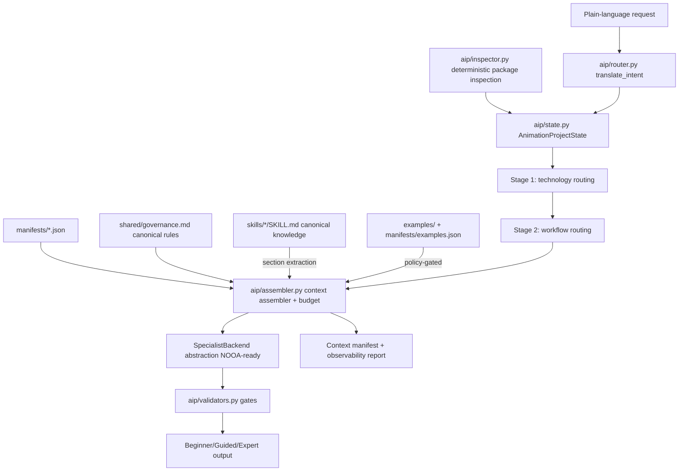

# Animation Intelligence Platform — Maintainer Guide

## System map



## Rule provenance — avoiding duplicated governance
- **One canonical copy** of each cross-skill rule lives in `shared/governance.md` under a stable `GOV-*` ID with a `Provenance:` line pointing to the monolithic sources.
- Technology manifests reference rule IDs in `required_shared_modules`; they never restate the rule text.
- Technology-specific **extensions** (e.g. "GSAP: remove pinning under reduction") stay in the manifest/skill, not in shared governance.
- When editing a monolithic skill's governance section, update `shared/governance.md` and its provenance date. The unit test `test_provenance_present` enforces provenance lines.

## Adding a technology
1. Keep/author the canonical `skills/<tech>/SKILL.md`.
2. Add `manifests/<tech>.json` (validated by `schemas/manifest.schema.json` and `tests/test_platform.py::TestManifests`).
3. Map packages in `aip/inspector.py::ANIMATION_PACKAGES`.
4. Add routing triggers in `aip/router.py` and a scenario in `tests/scenario_suite.py`.

## Feature flags (`aip/pipeline.py::FEATURE_FLAGS`)
| Flag | Default | Meaning |
|---|---|---|
| `legacy_full_skill` | off | Load whole SKILL.md files (rollback path) |
| `modular_context` | on | Manifest-driven selective assembly |
| `modular_context_with_compression` | off | Route through a configured `ContextCompressor` |
| `nooa_pilot` | off | Reserved — see ADR-003 |

## Running everything
```zsh
python3 aip/inventory.py            # repo inventory + token baseline (estimates)
python3 -m unittest discover tests  # 16 unit tests
python3 tests/scenario_suite.py     # 15-scenario legacy-vs-modular equivalence + release gate
```
Reports land in `docs/analysis/` (generated; do not hand-edit).

## Rollback
1. `flags={"legacy_full_skill": True, "modular_context": False}` — behavioural rollback, no file changes.
2. Full rollback: `git checkout legacy-monolithic-baseline` (tag created before any modification). Canonical skills were never modified, so knowledge is intact either way.

## Security & privacy
- The inspector is read-only; it never executes project scripts.
- Repository-loaded Markdown is reference material with recorded provenance — it never outranks system governance (prompt-injection defence).
- State projections (`MODEL_HIDDEN_FIELDS`) keep token accounting and internal manifests out of model-facing prompts; tested.
- No network calls anywhere in `aip/`. Compression/embedding providers require explicit configuration (ADR-004).
- Inventory flags possibly sensitive values but never prints them.
