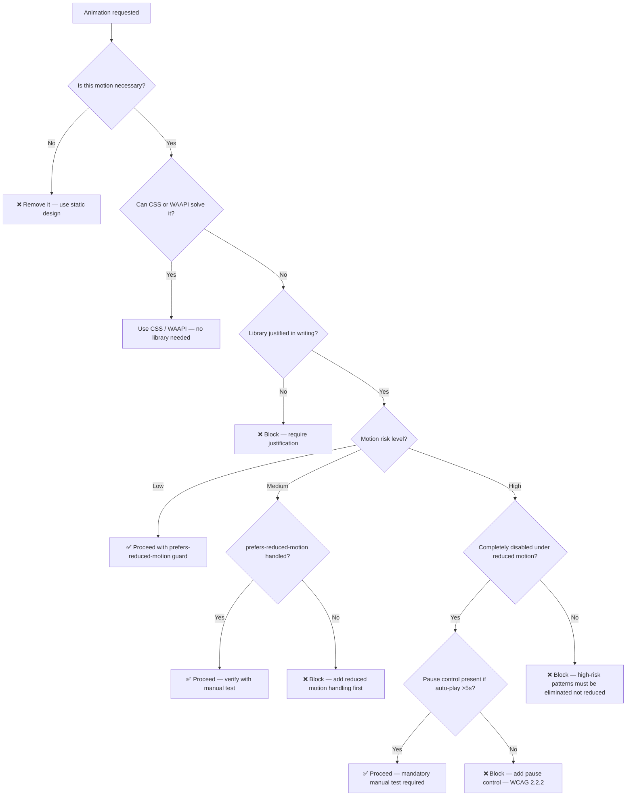

# Animation Accessibility Skill

## Goal

Ensure all frontend animations comply with WCAG 2.2 accessibility standards — with a primary focus on `prefers-reduced-motion`, vestibular disorder safety, cognitive accessibility, ARIA considerations, motion risk classification, and keyboard/focus management during animated transitions.

---

## Return Format

Accessibility audit report or accessible implementation with:
- `prefers-reduced-motion` compliance
- Motion risk score (0–10)
- ARIA attributes where needed
- Focus management during transitions
- Static fallback for all animated content
- Cognitive accessibility considerations

---

## Warnings

- ❌ Never ship animated content without `prefers-reduced-motion` handling
- ❌ Never convey information through animation alone (colour changes, flashing)
- ❌ Never use animations that flash more than 3 times per second (seizure risk — WCAG 2.3.1)
- ❌ Never animate focus indicators away
- ❌ Never auto-play animations lasting more than 5 seconds without pause/stop controls (WCAG 2.2.2)
- ❌ Never use parallax effects without a way to disable them
- ❌ Never recommend an animation library without first justifying why CSS or WAAPI cannot solve the requirement
- ❌ Never place continuous decorative animation adjacent to reading content or interactive forms
- ⚠️ Motion sensitivity affects a wide range of users — it is not a niche accessibility concern
- ⚠️ Vestibular disorders are triggered by: large-scale movement, parallax, zooming, spinning, background animations
- ⚠️ Cognitive load from animation affects users with ADHD, autism, and attention-related conditions

---

## Context Dump

### Accessibility Decision Framework

The AI must follow this order before recommending any animation approach:

```
1. No animation
2. CSS
3. Web Animations API (WAAPI)
4. Animation library
```

Before writing any animation code, the AI must ask:

> "Can this requirement be solved without introducing motion?"

If **yes** → prefer the simpler, static solution.

If **animation is genuinely required** → use the least complex solution that satisfies the requirement.

The AI must **never** automatically recommend GSAP, Motion for React, Three.js, Rive, Anime.js, or Lottie. The AI must justify in the recommendation why a library is needed over CSS or WAAPI.

**Example justification (required before any library recommendation):**
```
CSS cannot solve this because: pinned scroll sections require JavaScript-driven position control.
WAAPI cannot solve this because: ScrollTrigger's scrub behaviour requires RAF-level scroll integration.
Therefore: GSAP + ScrollTrigger is the minimum viable solution.
```

---

### WCAG 2.2 Animation-Relevant Success Criteria

| SC | Level | Rule |
|---|---|---|
| **1.4.3** | AA | Colour contrast maintained during animation |
| **2.1.1** | A | All animated content must be keyboard accessible |
| **2.2.2** | A | Auto-playing animation >5s must have pause/stop control |
| **2.3.1** | A | No content flashes >3 times/second (seizure risk) |
| **2.3.3** | AAA | Option to disable animation triggered by interaction |

---

### Motion Risk Classification

Classify every animation technique by accessibility risk before implementing. The AI must identify the risk level of every pattern during every audit.

#### 🟢 Low Risk
- Opacity fade-in / fade-out
- Colour transitions
- Small-scale, short-duration entrance fades
- Underline or border colour changes on interaction

#### 🟡 Medium Risk
- Sliding elements (translate X/Y)
- Moderate scale transforms
- Staggered list entrances
- Modal open/close transitions

#### 🔴 High Risk
- Parallax effects (background or foreground)
- Camera movement in Three.js or WebGL scenes
- Zoom in/out effects
- Scroll-linked motion (scrub animations)
- Continuous looping movement
- Spinning or rotating elements
- Auto-rotating 3D scenes
- Fly-through camera animations
- Full-screen background video with motion
- Scrolljacking (overriding native scroll behaviour)

**High-risk patterns must be disabled — not merely reduced — under `prefers-reduced-motion: reduce`.** Providing a slower version of a parallax or auto-rotation is not sufficient. The motion must be eliminated and replaced with a static representation.

---

### `prefers-reduced-motion` Media Query

This is the most important accessibility rule for animation.

Users set this in their OS settings (macOS, Windows, iOS, Android). The browser exposes it as a CSS media feature.

**CSS Pattern:**
```css
/* Default state: no animation (accessible by default) */
.element {
  opacity: 1;
  transform: none;
}

/* Animation only when user has not requested reduced motion */
@media (prefers-reduced-motion: no-preference) {
  .element {
    animation: slideIn 0.6s ease-out both;
    transition: opacity 0.3s ease;
  }
}
```

**Alternative pattern (if default state is hidden):**
```css
/* Start hidden */
.element {
  opacity: 0;
  transform: translateY(20px);
  transition: opacity 0.4s ease, transform 0.4s ease;
}

.element.visible {
  opacity: 1;
  transform: translateY(0);
}

/* Under reduced motion: instant, no transform */
@media (prefers-reduced-motion: reduce) {
  .element {
    transition: opacity 0.1s ease; /* fast but not instant */
    transform: none;
  }
}
```

**JavaScript detection:**
```typescript
const prefersReduced = window.matchMedia("(prefers-reduced-motion: reduce)").matches;

// Listen for changes — the user can change their OS setting while the page is open
const mediaQuery = window.matchMedia("(prefers-reduced-motion: reduce)");
mediaQuery.addEventListener("change", (event) => {
  if (event.matches) {
    // Disable or remove animations immediately
  } else {
    // Re-enable animations if appropriate for the context
  }
});
```

### Library-Specific Reduced Motion Patterns

#### GSAP
```typescript
const mm = gsap.matchMedia();

mm.add("(prefers-reduced-motion: no-preference)", () => {
  // Full animation
  gsap.from(".hero", { opacity: 0, y: 60, duration: 0.8 });
});

mm.add("(prefers-reduced-motion: reduce)", () => {
  // Ensure elements are immediately visible — no transform, no delay
  gsap.set(".hero", { opacity: 1, y: 0 });
});
```

#### Motion for React
```tsx
import { useReducedMotion, motion } from "motion/react";

function AccessibleAnimation() {
  const prefersReducedMotion = useReducedMotion();

  return (
    <motion.div
      initial={{ opacity: 0, y: prefersReducedMotion ? 0 : 20 }}
      animate={{ opacity: 1, y: 0 }}
      transition={{
        duration: prefersReducedMotion ? 0.01 : 0.5,
        ease: "easeOut",
      }}
    />
  );
}
```

#### Lottie
```typescript
const prefersReduced = window.matchMedia("(prefers-reduced-motion: reduce)").matches;

const animation = lottie.loadAnimation({
  container: el,
  path: "/animation.json", // trusted origin only
  autoplay: !prefersReduced,
  loop: !prefersReduced,
});

if (prefersReduced) {
  // Show first frame as a static representation
  animation.addEventListener("DOMLoaded", () => {
    animation.goToAndStop(0, true);
  });
}
```

#### Rive

Rive state machines require explicit, two-mode handling under reduced motion.

**Normal mode:**
```typescript
const rive = new Rive({
  src: "/animation.riv",
  canvas: canvasEl,
  autoplay: true,
  stateMachines: "State Machine 1", // interactive states enabled
  onLoad: () => rive.resizeDrawingSurfaceToCanvas(),
});
```

**Reduced motion mode:**
```typescript
const prefersReduced = window.matchMedia("(prefers-reduced-motion: reduce)").matches;

const rive = new Rive({
  src: "/animation.riv",
  canvas: canvasEl,
  // No autoplay — no motion begins without user intent
  autoplay: false,
  // Disable state machines — eliminates interactive motion triggers
  stateMachines: prefersReduced ? undefined : "State Machine 1",
  onLoad: () => {
    if (prefersReduced) {
      // Pause at the initial static artboard frame
      // A static artboard is the preferred fallback for Rive under reduced motion
      rive.pause();
    } else {
      rive.resizeDrawingSurfaceToCanvas();
      rive.play();
    }
  },
});
```

**Design guidance for Rive files:** Request that designers include a designated static artboard or a stable rest frame in every `.riv` file intended for production use. A static artboard is the preferred fallback — it provides a meaningful visual without any motion.

### WCAG 2.2.2 — Auto-Playing Animation Controls

Any animation that starts automatically, lasts more than 5 seconds, and moves or blinks **must** have a mechanism to pause, stop, or hide it.

```tsx
function AnimatedBanner() {
  const [isPaused, setIsPaused] = useState(false);

  return (
    <div>
      <div
        className={`banner-animation ${isPaused ? "paused" : ""}`}
        aria-live="off"
      >
        {/* Animated content */}
      </div>
      <button
        onClick={() => setIsPaused(p => !p)}
        aria-label={isPaused ? "Resume animation" : "Pause animation"}
      >
        {isPaused ? "▶ Resume" : "⏸ Pause"}
      </button>
    </div>
  );
}
```

```css
.banner-animation {
  animation: scroll 20s linear infinite;
}

.banner-animation.paused {
  animation-play-state: paused;
}
```

### WCAG 2.3.1 — No Content Flashes

Never create animations that flash more than 3 times per second. This can trigger photosensitive seizures.

```css
/* UNSAFE */
@keyframes flash {
  0%, 50%, 100% { opacity: 1; }
  25%, 75% { opacity: 0; }
}
.element { animation: flash 0.2s infinite; } /* 5 flashes/sec — NEVER DO THIS */

/* SAFE */
@keyframes pulse {
  0%, 100% { opacity: 1; }
  50% { opacity: 0.7; }
}
.element { animation: pulse 2s ease-in-out infinite; } /* slow, subtle */
```

### Three.js Accessibility Rules

WebGL and Three.js scenes carry the **highest motion risk** of any frontend animation technique. Camera movement, auto-rotation, parallax scenes, and fly-throughs are all high-risk patterns and must be completely disabled — not reduced — under `prefers-reduced-motion: reduce`.

**Requirements for every Three.js scene:**

1. Check `prefers-reduced-motion` before the render loop begins
2. Disable all camera fly-throughs under reduced motion
3. Disable all auto-rotation under reduced motion
4. Disable all parallax camera movement under reduced motion
5. Disable all automatic scene animation loops under reduced motion
6. Provide a static image, screenshot, or poster frame fallback where the 3D scene is not essential

```typescript
const prefersReduced = window.matchMedia("(prefers-reduced-motion: reduce)").matches;

const animate = () => {
  rafId = requestAnimationFrame(animate);

  if (!prefersReduced) {
    // Motion only when user has not requested reduced motion
    mesh.rotation.y += 0.01;
    camera.position.x = Math.sin(clock.getElapsedTime()) * 2;
  }
  // Scene renders at its initial static position —
  // elements remain visible, nothing moves

  renderer.render(scene, camera);
};
animate();
```

**When reduced motion is active in Three.js, the AI must:**
1. Stop all camera position and rotation updates
2. Stop all automatic mesh animation loops (rotation, oscillation, translation)
3. Stop all particle systems producing continuous movement
4. Disable any animation scrubbed with scroll position
5. Render the scene once at its static initial state and stop the RAF loop after the first frame if no user interaction is expected

---

### Cognitive Accessibility

Animation affects users beyond those with vestibular disorders. Cognitive accessibility must be considered in every animation decision.

**Affected groups include (but are not limited to):**
- Users with ADHD — distracted by continuous or peripheral movement
- Autistic users — may experience distress or sensory overload from unexpected motion
- Users under high cognitive load — motion near reading content competes for attention
- Users experiencing fatigue — micro-interactions accumulate as cognitive cost across a session

**Rules:**
- Avoid continuous or looping decorative animation adjacent to reading content
- Avoid looping motion near forms or input fields
- Avoid motion that competes visually with the primary page content
- Avoid automatic attention-seeking effects (pulsing CTAs, bobbing icons, flashing badges)
- Avoid excessive micro-interactions — each animated element contributes to cumulative cognitive cost
- Prefer calm, purposeful, one-shot motion over persistent decorative loops
- Default to `animation-iteration-count: 1` — animate once on load, then stop

**AI recommendation guidance:**

When a developer requests a looping animation near primary content, the AI must:
1. Flag the request as a cognitive accessibility concern
2. Suggest playing the animation once on load and stopping at the final frame
3. Suggest replaying only on explicit user interaction (hover or focus)
4. Offer a preference toggle if the animation is central to the design intent

---

### Focus Management During Animated Transitions

When animating route changes or modal openings, manage focus explicitly. Never allow an animated element to retain focus while it is invisible or mid-transition.

```tsx
import { useEffect, useRef } from "react";

function Modal({ isOpen, onClose }: { isOpen: boolean; onClose: () => void }) {
  const headingRef = useRef<HTMLHeadingElement>(null);

  useEffect(() => {
    if (isOpen) {
      // Move focus to modal heading after the animation begins
      requestAnimationFrame(() => {
        headingRef.current?.focus();
      });
    }
  }, [isOpen]);

  return (
    <dialog open={isOpen} aria-modal="true">
      <h2 ref={headingRef} tabIndex={-1}>Modal Title</h2>
      {/* content */}
    </dialog>
  );
}
```

### ARIA for Animated Content

```html
<!-- Live regions for dynamic animated content -->
<div aria-live="polite" aria-atomic="true">
  <!-- Content that updates dynamically -->
</div>

<!-- Decorative animations must be hidden from screen readers -->
<div class="decorative-animation" aria-hidden="true"></div>

<!-- Loading animations -->
<div role="status" aria-label="Loading content">
  <!-- Spinner animation -->
</div>
```

### Scroll-Driven Animation Accessibility

Parallax and scroll-driven animations are **high-risk** motion patterns (see Motion Risk Classification). They must be completely disabled under `prefers-reduced-motion: reduce`.

```css
/* Parallax — accessible version */
@media (prefers-reduced-motion: no-preference) {
  .parallax-bg {
    transform: translateY(calc(var(--scroll-pos) * 0.5));
  }
}

/* Under reduced motion: no parallax */
@media (prefers-reduced-motion: reduce) {
  .parallax-bg {
    transform: none;
  }
}
```

For GSAP ScrollTrigger parallax:
```typescript
mm.add("(prefers-reduced-motion: no-preference)", () => {
  gsap.to(".parallax-bg", {
    y: -100,
    ease: "none",
    scrollTrigger: {
      trigger: ".section",
      start: "top bottom",
      end: "bottom top",
      scrub: true,
    },
  });
});

// Under reduce: do nothing — no parallax registered
```

---

### Framework-Specific Accessibility Guidance

#### React
- Use `useReducedMotion()` from `motion/react` as the standard reduced-motion pattern
- Do not derive motion state from server-rendered HTML — this causes hydration mismatches that produce layout shift
- Memoize variant objects outside the component to prevent animation re-triggers on re-render
- Ensure all components remain fully visible and usable when `useReducedMotion()` returns `true`

#### Next.js
- Never hide critical content behind an animation entrance — content must be visible in the server-rendered HTML
- Use `dynamic(() => import(...), { ssr: false })` for Three.js, Lottie, and Rive — all require DOM APIs unavailable on the server
- Ensure the initial server-rendered state and the post-hydration client state are visually compatible to avoid CLS (Cumulative Layout Shift)
- Route transition animations must not obscure or delay access to page content during navigation

#### Vue
- Use Vue's `<Transition>` component with `:css="false"` to bypass default CSS transitions under reduced motion
- Check `window.matchMedia("(prefers-reduced-motion: reduce)").matches` in the `mounted()` lifecycle hook
- Disable non-essential `<TransitionGroup>` list animations under reduced motion

#### Svelte
- Svelte's built-in `fly`, `slide`, and `draw` transitions must be conditionally disabled under reduced motion:

```svelte
<script>
  import { fly } from "svelte/transition";
  const prefersReduced =
    typeof window !== "undefined" &&
    window.matchMedia("(prefers-reduced-motion: reduce)").matches;
</script>

{#if visible}
  <div transition:fly={{ y: prefersReduced ? 0 : 20, duration: prefersReduced ? 0 : 300 }}>
    Content
  </div>
{/if}
```

- Always define the static base state as the default — transitions are an enhancement layer only

#### Angular
- Check `prefers-reduced-motion` in `ngOnInit` and expose it through a shared accessibility service for reactive access across components
- Conditionally skip Angular animations:

```typescript
import { AnimationBuilder } from "@angular/animations";

ngOnInit(): void {
  const reduced = window.matchMedia("(prefers-reduced-motion: reduce)").matches;
  if (reduced) return; // skip all animation setup
  // proceed with AnimationBuilder
}
```

- Disable route transition animations when reduced motion is enabled — animated route transitions are a known disorientation source

---

### Accessibility Risk Scoring System

Assign an **Accessibility Risk Score (0–10)** to any animation system being reviewed. This score must be produced in every `/review-animation` and audit output that involves motion.

#### Score Bands

| Score | Status | Meaning |
|---|---|---|
| 0–2 | ✅ Accessible | Low-risk patterns, properly guarded |
| 3–5 | ⚠️ Needs Review | Some risk patterns present; mitigations partial or missing |
| 6–8 | 🔴 High Risk | Multiple risk patterns; significant mitigations absent |
| 9–10 | ❌ Accessibility Failure | Critical WCAG violations; do not ship |

#### Scoring Factors

Each factor adds to the risk score:

| Factor | Points |
|---|---|
| No `prefers-reduced-motion` handling | +4 |
| High-risk motion pattern present (parallax, camera movement, zoom, continuous loop) | +2 per pattern |
| Auto-play >5s without pause/stop control (WCAG 2.2.2 violation) | +2 |
| Flash >3 times/second (WCAG 2.3.1 violation) | +4 (immediate 9+) |
| Information conveyed only through motion (no static alternative) | +2 |
| Continuous animation adjacent to reading content (cognitive risk) | +1 |
| Decorative animation missing `aria-hidden="true"` | +1 |
| No static fallback for any animated content | +1 |

#### Example Scoring

**Scenario: Parallax hero + auto-rotating carousel + no reduced motion support**

| Factor | Points |
|---|---|
| No `prefers-reduced-motion` handling | +4 |
| Parallax (high-risk pattern) | +2 |
| Auto-rotating carousel (continuous loop, high-risk) | +2 |
| Auto-play carousel >5s without pause control | +2 |

**Accessibility Risk Score: 10/10**
**Status: ❌ FAIL**
**Reason:** Two high-risk vestibular motion patterns combined with complete absence of reduced-motion support and a missing pause control constituting a WCAG 2.2.2 violation.

---

### Loading Animation Accessibility

Loading spinners and progress indicators are among the most common animated UI patterns. They carry medium motion risk but require specific ARIA treatment.

**Requirements:**
- All loading indicators must use `role="status"` or `aria-live="polite"` to announce state to screen readers
- The spinner itself must be visually hidden from screen readers (`aria-hidden="true"`) — only the label should be announced
- Under `prefers-reduced-motion: reduce`, replace spinning animations with a static indicator (e.g., a static icon, pulsing opacity, or text label)
- Never use a spinner as the sole indicator of progress — pair with a visible text label

```tsx
function LoadingSpinner({ label = "Loading…" }: { label?: string }) {
  return (
    <div role="status" aria-label={label}>
      {/* Spinner: decorative — hidden from screen readers */}
      <svg
        aria-hidden="true"
        className="spinner"
        viewBox="0 0 24 24"
        focusable="false"
      >
        <circle cx="12" cy="12" r="10" />
      </svg>
      {/* Visible text label for sighted users and screen readers */}
      <span className="sr-only">{label}</span>
    </div>
  );
}
```

```css
.spinner {
  animation: spin 1s linear infinite;
}

/* Under reduced motion: stop the spin, use opacity pulse instead */
@media (prefers-reduced-motion: reduce) {
  .spinner {
    animation: pulse 1.5s ease-in-out infinite;
  }
}

@keyframes spin {
  to { transform: rotate(360deg); }
}

@keyframes pulse {
  0%, 100% { opacity: 1; }
  50% { opacity: 0.4; }
}
```

**For progress bars:**
```html
<div
  role="progressbar"
  aria-valuenow="40"
  aria-valuemin="0"
  aria-valuemax="100"
  aria-label="Uploading file"
>
  <div class="progress-fill" style="width: 40%"></div>
</div>
```

---

### Canvas and WebGL Accessibility

Canvas elements (`<canvas>`) and WebGL contexts are inaccessible to screen readers by default. The AI must apply the following rules to every canvas-based animation:

**Rules:**
1. **Decorative canvas**: Add `aria-hidden="true"` to remove it from the accessibility tree entirely
2. **Informational canvas**: Provide an accessible HTML alternative outside the canvas — never inside it
3. **Interactive canvas**: Use `role`, `tabindex`, and keyboard event handlers; interactive regions inside canvas are invisible to AT without explicit mapping
4. **Three.js / WebGL scenes that convey meaning**: Add a visually hidden description or caption adjacent to the canvas

```html
<!-- Decorative particle background — hidden from screen readers -->
<canvas class="particle-bg" aria-hidden="true"></canvas>

<!-- Informational chart rendered in canvas — HTML alternative required -->
<canvas id="sales-chart" aria-hidden="true"></canvas>
<div class="sr-only" aria-label="Sales chart data">
  <p>Q1: £120,000 | Q2: £145,000 | Q3: £132,000 | Q4: £178,000</p>
</div>

<!-- Three.js product viewer — provide static image fallback + description -->
<canvas id="product-viewer" aria-hidden="true"></canvas>

```

```typescript
// Three.js scene: always aria-hidden, always provide adjacent alt content
const canvas = document.getElementById("product-viewer") as HTMLCanvasElement;
canvas.setAttribute("aria-hidden", "true");

// Reveal static fallback image under reduced motion
const prefersReduced = window.matchMedia("(prefers-reduced-motion: reduce)").matches;
if (prefersReduced) {
  canvas.style.display = "none";
  document.querySelector(".product-fallback")?.removeAttribute("hidden");
}
```

---

### Browser Support Considerations

`prefers-reduced-motion` is supported in all modern browsers (Chrome 74+, Firefox 63+, Safari 10.1+, Edge 79+). There is no need to polyfill in supported targets.

**Safe detection pattern (with SSR guard):**
```typescript
function prefersReducedMotion(): boolean {
  // Guard for SSR environments (Next.js, Nuxt, SvelteKit)
  if (typeof window === "undefined") return false;
  return window.matchMedia("(prefers-reduced-motion: reduce)").matches;
}
```

**React hook with SSR safety and live change detection:**
```typescript
import { useState, useEffect } from "react";

export function usePrefersReducedMotion(): boolean {
  const [prefersReduced, setPrefersReduced] = useState<boolean>(() => {
    if (typeof window === "undefined") return false;
    return window.matchMedia("(prefers-reduced-motion: reduce)").matches;
  });

  useEffect(() => {
    const mq = window.matchMedia("(prefers-reduced-motion: reduce)");
    const handler = (e: MediaQueryListEvent) => setPrefersReduced(e.matches);
    mq.addEventListener("change", handler);
    return () => mq.removeEventListener("change", handler);
  }, []);

  return prefersReduced;
}
```

**Important:** Always listen for `change` events — users can toggle their OS reduced-motion setting while the page is open. Libraries such as `motion/react`'s `useReducedMotion()` handle this automatically; custom implementations must do so explicitly.

**Legacy fallback (IE11, if required):**
```typescript
// MediaQueryList.addEventListener not available in IE11 — use addListener
const mq = window.matchMedia("(prefers-reduced-motion: reduce)");
if (mq.addEventListener) {
  mq.addEventListener("change", handler);
} else {
  mq.addListener(handler); // deprecated but required for IE11
}
```

---

### Manual Accessibility Testing Procedures

Automated tools cannot detect all animation accessibility issues. Every animation implementation must pass the following manual tests before shipping.

#### Reduced Motion Test

1. **macOS:** System Settings → Accessibility → Display → Enable "Reduce motion"
2. **Windows:** Settings → Ease of Access → Display → Enable "Show animations in Windows" (off = reduce)
3. **iOS:** Settings → Accessibility → Motion → Enable "Reduce Motion"
4. **Android:** Settings → Accessibility → Remove animations (varies by device)
5. Reload the page and confirm:
   - All high-risk animations are completely absent (not slowed)
   - All elements are visible without animation
   - No layout shift or invisible content

#### Screen Reader Test

1. Enable VoiceOver (macOS/iOS) or NVDA (Windows)
2. Navigate to every animated element using keyboard only
3. Confirm:
   - Decorative animations are not announced (`aria-hidden="true"`)
   - Loading indicators announce their status (`role="status"`)
   - Live region updates are announced at the correct politeness level
   - Focus moves correctly after animated modal/drawer open
   - No focus is trapped inside an off-screen or invisible animated element

#### Keyboard Navigation Test

1. Disable mouse/trackpad
2. Tab through all interactive elements
3. Confirm:
   - Focus indicator is always visible (never animated away or hidden)
   - Animated transitions do not cause focus to jump to an unexpected location
   - Modal close returns focus to the triggering element
   - Animated route transitions do not orphan keyboard focus

#### Flicker / Flash Test

1. Use the Photosensitive Epilepsy Analysis Tool (PEAT) or the Harding Flash and Pattern Analyser on any video or rapid animation content
2. Confirm no content flashes more than 3 times per second

#### Pause Control Test

1. Identify all auto-playing animations lasting more than 5 seconds
2. Confirm a visible pause or stop button is present and functional
3. Confirm the pause state persists if the user navigates away and returns (where applicable)

---

### Expanded Focus Management Rules

Focus management during animation is a frequent source of keyboard accessibility failures. Apply all of the following rules.

**Rule 1 — Modal open:**
Move focus to the first focusable element (or a heading with `tabIndex={-1}`) inside the modal immediately after the opening animation begins. Do not wait for the animation to complete.

**Rule 2 — Modal close:**
Return focus to the element that triggered the modal open. Store a ref to the trigger before opening.

```tsx
function useModalFocus(isOpen: boolean) {
  const triggerRef = useRef<HTMLElement | null>(null);
  const modalHeadingRef = useRef<HTMLHeadingElement>(null);

  const open = (trigger: HTMLElement) => {
    triggerRef.current = trigger;
  };

  useEffect(() => {
    if (isOpen) {
      requestAnimationFrame(() => modalHeadingRef.current?.focus());
    } else if (triggerRef.current) {
      triggerRef.current.focus();
    }
  }, [isOpen]);

  return { modalHeadingRef, open };
}
```

**Rule 3 — Animated route transitions:**
After a route change animation, move focus to the new page's `<h1>` or a skip-link target. Do not leave focus on a mid-transition element.

```tsx
// Next.js App Router — move focus after route change
"use client";
import { usePathname } from "next/navigation";
import { useEffect, useRef } from "react";

export function FocusRestore() {
  const pathname = usePathname();
  const headingRef = useRef<HTMLHeadingElement>(null);

  useEffect(() => {
    requestAnimationFrame(() => headingRef.current?.focus());
  }, [pathname]);

  return <h1 ref={headingRef} tabIndex={-1} className="sr-only-focusable">Page loaded</h1>;
}
```

**Rule 4 — Off-screen animated elements:**
Any element that is off-screen (translated outside the viewport) must also be hidden from the accessibility tree. Use `visibility: hidden` or `aria-hidden="true"` while off-screen; remove when in view.

**Rule 5 — Animated disclosure (accordion, drawer):**
On expand: move focus to the first interactive element inside the expanded region, or to the region heading.
On collapse: return focus to the disclosure trigger.

**Rule 6 — Staggered list entrances:**
Do not animate focus. If a list item receives focus while its entrance animation is in progress, the focus indicator must still be fully visible.

---

### Common Accessibility Failures (Anti-Patterns)

These are the most frequently occurring animation accessibility failures. The AI must flag any of these patterns immediately upon detection.

#### ❌ Anti-Pattern 1: Reduced motion handled by slowing, not removing

```css
/* WRONG — slowing a high-risk pattern is not sufficient */
@media (prefers-reduced-motion: reduce) {
  .parallax { transition-duration: 2s; } /* still moves — still a vestibular trigger */
}

/* CORRECT — high-risk patterns must be eliminated */
@media (prefers-reduced-motion: reduce) {
  .parallax { transform: none; transition: none; }
}
```

#### ❌ Anti-Pattern 2: Hiding content behind animation entrance

```tsx
// WRONG — content starts invisible; if animation fails, content is never seen
<motion.div initial={{ opacity: 0 }} animate={{ opacity: 1 }}>
  <p>Terms and conditions apply.</p>
</motion.div>

// CORRECT — content is visible by default; animation is an enhancement
<motion.div
  initial={{ opacity: prefersReducedMotion ? 1 : 0 }}
  animate={{ opacity: 1 }}
>
  <p>Terms and conditions apply.</p>
</motion.div>
```

#### ❌ Anti-Pattern 3: Decorative animation not hidden from AT

```html
<!-- WRONG — screen reader will announce this canvas/div -->
<canvas class="confetti-animation"></canvas>

<!-- CORRECT -->
<canvas class="confetti-animation" aria-hidden="true"></canvas>
```

#### ❌ Anti-Pattern 4: Focus indicator animated away

```css
/* WRONG — focus ring is invisible during animation */
.button:focus {
  outline: none; /* removed during transition */
  box-shadow: 0 0 0 3px blue;
  transition: box-shadow 0.5s ease;
}

/* CORRECT — focus indicator is always immediately visible */
.button:focus-visible {
  outline: 3px solid blue;
  outline-offset: 2px;
  /* do not transition the focus indicator */
}
```

#### ❌ Anti-Pattern 5: ARIA live region inside animated container

```html
<!-- WRONG — live region is inside an animated element; announcements may be missed -->
<div class="slide-in-panel">
  <div aria-live="polite">Status updates here</div>
</div>

<!-- CORRECT — live region is always in the DOM, outside animations -->
<div aria-live="polite" class="sr-only">Status updates here</div>
<div class="slide-in-panel">Panel content</div>
```

#### ❌ Anti-Pattern 6: Using `visibility: hidden` without `aria-hidden`

```css
/* WRONG — element is visually hidden but still in accessibility tree */
.off-screen { visibility: hidden; transform: translateX(-100%); }

/* CORRECT — remove from both visual and accessibility trees when off-screen */
.off-screen { visibility: hidden; transform: translateX(-100%); }
```
```html
<!-- Add aria-hidden when not visible -->
<div class="off-screen" aria-hidden="true">Panel content</div>
```

#### ❌ Anti-Pattern 7: Auto-playing animation with no pause control

```html
<!-- WRONG — looping marquee with no stop mechanism -->
<div class="marquee">Breaking news: ...</div>

<!-- CORRECT — always provide a pause control for auto-play >5s -->
<div class="marquee" aria-label="News ticker">Breaking news: ...</div>
<button aria-label="Pause news ticker" onclick="pauseMarquee()">⏸ Pause</button>
```

---

### Reduced Motion Design Patterns

When motion must be removed under `prefers-reduced-motion: reduce`, these are the preferred static or minimal alternatives.

| Animation Pattern | Reduced Motion Alternative |
|---|---|
| Fade + slide entrance | Instant appearance (opacity: 1, no transform) |
| Parallax scroll | Static background, no transform |
| Auto-rotating carousel | Static first slide; manual navigation only |
| Spinning loader | Static icon + text label, or opacity pulse |
| Page transition (crossfade) | Instant page swap, no transition |
| Floating / bobbing icons | Static position |
| Staggered list entrance | All items visible immediately |
| Scroll-scrub animation | Static end-state of the animation |
| Three.js auto-rotation | Static scene at initial orientation |
| Lottie character animation | First frame held as static image |
| Rive state machine | Static artboard or rest frame |
| Confetti / particle burst | Static congratulations message or icon |
| Progress bar fill animation | Instant fill to current value |
| Animated chart entrance | Chart rendered immediately at full values |
| Hover micro-interactions | Instant state change, no transition |

**General principle:** Under `prefers-reduced-motion: reduce`, the end state of any animation must be immediately visible. The information or content conveyed by the animation must never be hidden or delayed.

---

### Motion Approval Decision Tree

Use this decision tree before approving any animation for production.



**Summary:**
- ❌ = Block the animation from shipping
- ✅ = Approved to proceed (with stated conditions)
- Every approved animation requires `prefers-reduced-motion` handling before it reaches production

---

### Security Considerations for Animation Assets

Animation libraries and external assets introduce security vectors that the AI must address in every recommendation.

#### Lottie / JSON animation files
- **Only load `.json` animation files from a trusted, approved, integrity-controlled source** — same-origin or CDN delivery alone is not a trust guarantee; never load untrusted third-party URLs
- Lottie JSON files can contain embedded image data URIs and external URLs — review files from external sources before use
- Do not accept user-supplied Lottie JSON files without sanitisation — malicious files can cause excessive resource consumption or reference external tracking URLs
- Use `lottie-web` subresource integrity (SRI) attributes when loading from a CDN

#### Rive `.riv` files
- Treat `.riv` files as binary assets from trusted origins only
- Rive state machines can trigger JavaScript callbacks — review `onStateChange` handlers for injection risks
- Do not expose Rive canvas to user-controlled input without input sanitisation

#### Three.js / WebGL
- Do not load `.glb`, `.gltf`, or texture assets from user-supplied URLs
- Validate and sandbox any user-provided 3D content
- Large or malformed GLTF files can cause browser crashes — enforce file size limits server-side

#### GSAP and animation libraries via CDN
- Always use versioned, SRI-hashed CDN references
- Prefer npm-installed, bundled versions over CDN script tags in production
- Audit `gsap.effects` and custom plugin registrations — they execute arbitrary functions

#### General animation security rules
- Never `eval()` animation configuration strings
- Never interpolate user input directly into animation parameters (position, scale, URL)
- Enforce Content Security Policy (CSP) headers that restrict `script-src` and `connect-src` to prevent animation library CDN substitution attacks

---

### Enterprise Approval Requirements

Every animation submitted for production in an enterprise or regulated environment must meet the following criteria. The AI must produce an approval status in every formal audit output.

#### Approval Tiers

| Status | Score Range | Meaning |
|---|---|---|
| ✅ PASS | 0–2 | Approved for production |
| ⚠️ NEEDS REVIEW | 3–5 | Approved with mandatory fixes before ship date |
| 🔴 HIGH RISK | 6–8 | Blocked — must remediate all flagged issues before re-review |
| ❌ FAIL | 9–10 | Rejected — do not ship; constitutes WCAG violation |

#### Mandatory Requirements for PASS Status

All of the following must be true for a PASS:

- [ ] `prefers-reduced-motion` handled for every animated element
- [ ] All high-risk patterns completely disabled (not slowed) under reduced motion
- [ ] All auto-playing animations >5s have a visible pause/stop control
- [ ] No content flashes >3 times/second
- [ ] All decorative animations have `aria-hidden="true"`
- [ ] All informational canvas/WebGL content has an accessible HTML alternative
- [ ] Focus is managed correctly for all animated transitions
- [ ] Colour contrast maintained in all animation states
- [ ] Manual reduced-motion test passed (OS setting enabled)
- [ ] Screen reader test passed (VoiceOver or NVDA)
- [ ] Accessibility Risk Score ≤ 2

#### Escalation

If an animation is FAIL or HIGH RISK, the AI must:
1. State the specific WCAG success criteria violated
2. Provide the exact code fix required
3. Re-score after the fix is applied
4. Mark the output as **Requires Re-Review** if the fix cannot be verified automatically

---

### Agent Behaviour Rules

These rules govern how the AI agent must behave in every interaction involving animation and accessibility.

1. **Always classify motion risk first.** Before writing any animation code or recommendation, classify every motion pattern as Low / Medium / High risk using the Motion Risk Classification table.

2. **Always apply `prefers-reduced-motion` without being asked.** This is not optional. Every animation implementation must include reduced-motion handling. If the developer has not asked for it, add it anyway and explain why.

3. **Always produce an Accessibility Risk Score.** Every audit, review, or implementation involving animation must include an Accessibility Risk Score (0–10) with a status band and written justification.

4. **Never recommend a library without justification.** Always evaluate CSS and WAAPI first. If a library is recommended, state explicitly why CSS or WAAPI cannot solve the requirement.

5. **Never hide content behind animation.** All meaningful content must be visible in the static/initial state before any animation runs.

6. **Always flag cognitive accessibility concerns.** Any looping or continuous animation adjacent to reading content, forms, or decision-making interfaces must be flagged as a cognitive risk, regardless of whether the developer asked about it.

7. **Always provide the exact fix, not just the problem.** When flagging an accessibility issue, include the corrected code. Do not describe the problem without providing a solution.

8. **Always produce a Standard Audit Output.** Every audit response must follow the structure in the Standard Accessibility Audit Output Template below.

9. **Never approve high-risk patterns without complete mitigation.** Do not mark an animation as acceptable if a high-risk pattern is present but only slowed rather than eliminated.

10. **Always test hypothetically for AT.** Before finalising any animated UI recommendation, mentally simulate the screen-reader experience: is every state announced correctly? Is every animated element either in the accessibility tree with correct semantics, or hidden from it?

---

### Standard Accessibility Audit Output Template

Every audit response from the AI must follow this structure exactly.

```
## Accessibility Audit Report

### CSS-First Evaluation
[Can the requirement be met without animation? If yes, state the static alternative.
If animation is required, state why CSS/WAAPI was evaluated and why a library is needed.]

### Motion Risk Classification
- [Pattern name]: [🟢 Low / 🟡 Medium / 🔴 High] Risk — [brief reason]
- [Pattern name]: [🟢 Low / 🟡 Medium / 🔴 High] Risk — [brief reason]

### Issues Found
[Severity: 🔴 CRITICAL / 🟡 MEDIUM / 🟢 LOW]
[WCAG SC reference where applicable]
[Description of the issue]

### Required Fixes
[Numbered list of fixes, each with corrected code]

### Accessibility Risk Score
Before fixes: [N]/10 — [Status band]
After fixes: [N]/10 — [Status band]

### Enterprise Approval Status
[✅ PASS / ⚠️ NEEDS REVIEW / 🔴 HIGH RISK / ❌ FAIL]
[Justification: state which WCAG criteria are met or violated]
```

---

### Animation Accessibility Audit Checklist

```
PLANNING
□ CSS-first evaluation completed — is animation actually required?
□ Library justification provided if a library was recommended over CSS/WAAPI
□ Motion risk classified (Low / Medium / High) for every animation pattern
□ Cognitive accessibility considered — no continuous motion near reading content or forms

REDUCED MOTION
□ prefers-reduced-motion handled for all animations
□ High-risk patterns completely disabled (not slowed) under reduced motion
□ Elements are fully visible without animation (static fallback confirmed)
□ usePrefersReducedMotion hook (or equivalent) listens for live OS setting changes
□ SSR guard present in any server-rendered framework (Next.js, Nuxt, SvelteKit)

WCAG COMPLIANCE
□ No content flashes >3 times/second (WCAG 2.3.1)
□ Auto-playing animations >5s have visible pause/stop controls (WCAG 2.2.2)
□ Colour contrast maintained throughout all animation states (WCAG 1.4.3)
□ No information conveyed by motion alone — static alternative present (WCAG 1.3.3)
□ All interactive animated content is keyboard accessible (WCAG 2.1.1)

ARIA AND SCREEN READER
□ Decorative animations have aria-hidden="true"
□ Loading indicators use role="status" or aria-live="polite"
□ Live region updates are announced correctly at the appropriate politeness level
□ Canvas / WebGL decorative elements have aria-hidden="true"
□ Informational canvas content has an accessible HTML alternative outside the canvas
□ ARIA live regions are outside animated containers

FOCUS MANAGEMENT
□ Focus moves to modal heading or first focusable element on open
□ Focus returns to trigger element on modal/drawer close
□ Animated route transitions restore focus to page heading or skip-link target
□ Off-screen animated elements are hidden from the accessibility tree (aria-hidden)
□ Focus indicator is never animated away or hidden during transitions
□ Animated disclosure (accordion/drawer) manages focus on expand and collapse

SCROLL AND PARALLAX
□ Scroll-driven parallax completely disabled under reduced motion
□ GSAP ScrollTrigger parallax only registered under no-preference
□ No scrolljacking (native scroll behaviour preserved)

THREE.JS AND WEBGL
□ Three.js canvas has aria-hidden="true"
□ All camera motion, auto-rotation, and mesh animation disabled under reduced motion
□ RAF loop stopped after first static frame under reduced motion (if no interaction needed)
□ Static image or poster frame fallback provided where 3D scene is non-essential

LOADING ANIMATIONS
□ Spinner uses role="status" with a visible or sr-only text label
□ Spinner animation replaced with static or opacity-pulse under reduced motion
□ Progress bar uses role="progressbar" with aria-valuenow / aria-valuemin / aria-valuemax

SECURITY
□ Lottie JSON loaded from a trusted, approved, integrity-controlled source only
□ Rive .riv files loaded from a trusted, approved, integrity-controlled source only
□ No user-supplied animation asset URLs without sanitisation
□ CDN-loaded animation libraries use versioned, SRI-hashed references
□ No user input interpolated into animation parameters

TESTING
□ Manual reduced-motion test passed (OS setting enabled on macOS, Windows, iOS, or Android)
□ Screen reader test passed (VoiceOver or NVDA) — all animated states announced correctly
□ Keyboard-only navigation test passed — focus always visible and correctly placed
□ Flash/flicker test passed (PEAT or equivalent tool) for video or rapid animation content
□ Pause control tested — paused state is persistent and functional

SCORING AND APPROVAL
□ Accessibility Risk Score assigned (0–10) with status band
□ Enterprise Approval Status declared (PASS / NEEDS REVIEW / HIGH RISK / FAIL)
□ Standard Audit Output format used
```

---

## RTCF

**Role:** Animation accessibility specialist with WCAG 2.2 expertise and knowledge of vestibular, cognitive, sensory, and framework-specific accessibility concerns.

**Task:** Audit animation code for accessibility compliance, classify every motion pattern by risk level, assign an Accessibility Risk Score (0–10), and implement or recommend accessible patterns that follow the CSS-first decision framework before any library is considered.

**Constraints:**
- CSS-first: justify any library recommendation over CSS or WAAPI
- `prefers-reduced-motion` in every implementation
- No flashing >3 times/second
- Pause controls for all auto-play >5s
- Decorative animations `aria-hidden="true"`
- Focus managed explicitly during animated transitions
- Cognitive accessibility evaluated for all looping or continuous motion
- Three.js scenes must stop all camera and mesh motion under reduced motion
- Accessibility Risk Score (0–10) must be produced in every review output

**Format:** Use the Standard Accessibility Audit Output Template exactly: CSS-first evaluation → motion risk classification per pattern → issues found with WCAG references → numbered fixes with code → Accessibility Risk Score (before and after) → Enterprise Approval Status.

---

## Few Shot Examples

### Example 1

**Input:**
> I have a hero animation that auto-plays a video background with a panning effect. Is this accessible?

**Output:**
```
## Accessibility Audit Report

### Motion Risk Classification
- Background video with auto-play: 🔴 High Risk (continuous motion, auto-play)
- Panning camera effect: 🔴 High Risk (camera movement — vestibular trigger)

### Issues Found

🔴 CRITICAL — WCAG 2.2.2: Auto-playing video with motion lasting >5s must have a pause control.
No visible pause or stop mechanism exists.

🔴 CRITICAL — No prefers-reduced-motion handling.
The panning animation and video auto-play must be disabled under reduced motion.
Slowing the pan is not sufficient — it must be removed entirely.

🟡 MEDIUM — Cognitive accessibility.
A continuously moving background behind hero text competes with reading attention.
Consider: play once on load, then hold the final frame.

### Required Fixes

1. Add a visible pause control (WCAG 2.2.2):
<button aria-label="Pause background video">⏸</button>

2. Disable panning under reduced motion:
@media (prefers-reduced-motion: reduce) {
  .hero-video-pan { animation: none; }
}

3. Pause video and show first frame under reduced motion:
const prefersReduced = window.matchMedia("(prefers-reduced-motion: reduce)").matches;
if (prefersReduced) {
  videoEl.pause();
  videoEl.currentTime = 0;
}

4. Stop the pan after the first loop regardless of reduced motion setting:
videoEl.addEventListener("ended", () => videoEl.pause(), { once: true });

### Accessibility Risk Score: 9/10
### Status: ❌ FAIL
### Reason: Two high-risk vestibular motion patterns with no reduced-motion support
and no pause control. Violates WCAG 2.2.2. High cognitive and vestibular risk.
```

---

### Example 2

**Input:**
> I want to add a looping particle animation to the background of our pricing page. Is this okay?

**Output:**
```
## Accessibility Audit Report

### CSS-First Evaluation
Can this requirement be solved without animation?
Yes — a static gradient, texture, or illustration achieves equivalent visual
depth with no motion cost and no accessibility risk.
Recommendation: Reconsider whether the animation is necessary.
If required for brand reasons, proceed with all constraints below applied.

### Motion Risk Classification
- Looping particle background: 🔴 High Risk (continuous movement, viewport-wide coverage)

### Issues Found

🔴 HIGH — Cognitive accessibility.
A looping background on a pricing page competes with the reading and
decision-making task. Pricing is a high-cognitive-load context.
Motion adjacent to pricing tables increases attention cost and can cause
decision fatigue for users with ADHD or high cognitive load.

� MEDIUM — No prefers-reduced-motion handling confirmed.

### Required Constraints if the Animation Proceeds

1. Disable entirely under reduced motion:
@media (prefers-reduced-motion: reduce) {
  .particle-canvas { display: none; }
}

2. Stop the loop after the first cycle (cognitive accessibility):
// Set maxCycles: 1 in your particle system,
// or cancelAnimationFrame after a defined duration.

3. Mark canvas as decorative:
<canvas class="particle-canvas" aria-hidden="true"></canvas>

4. Reduce particle speed and density significantly from any default settings.

### Accessibility Risk Score
Before fixes: 7/10 — 🔴 High Risk
After all fixes applied: 2/10 — ✅ Accessible
```

