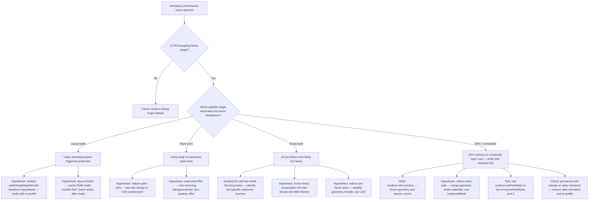

# Animation Debugging Skill

## Goal

Systematically diagnose and fix animation issues — covering visual bugs, timing problems, memory leaks, performance degradation, accessibility failures, library-specific lifecycle defects, browser compatibility regressions, architecture failures, and AI-generated code errors.

This skill operates as a senior debugging engineering system, not a bug catalogue. Every diagnosis must be evidence-based, confidence-classified, severity-rated, and production-risk-assessed independently.

---

## Return Format

Every response to an animation debugging request must use the **Standard Debug Output** structure defined in this skill. The sections must appear in this fixed order:

1. **Executive Summary** — what was investigated, the most significant finding, current production risk (1–3 sentences)
2. **Observed Behaviour** — what the animation actually does
3. **Expected Behaviour** — what the animation should do
4. **Category** — one of: Visual | Timing | Performance | Memory | Accessibility | Cleanup | Architecture | Browser-Specific | AI-Generated
5. **Environment** — Development | Production | Both | Unknown
6. **Evidence** — specific evidence collected, or "insufficient — see Follow-up Checks"
7. **Root Cause** — specific, evidence-backed statement
8. **Confidence** — Confirmed | Likely | Possible | Unknown, with reason
9. **Severity** — Critical | High | Medium | Low | Informational
10. **Production Risk** — Critical | High | Medium | Low
11. **Affected Systems** — browser(s), framework(s), library version(s), rendering path(s)
12. **Fix** — targeted, actionable resolution with corrected code where applicable
13. **Verification Steps** — specific steps to confirm the fix resolved the root cause
14. **Prevention Rule** — generalised rule with prevention category
15. **Follow-up Checks** — additional investigation steps if confidence is below Confirmed

**Deviations from this structure require explicit justification in the Executive Summary.**

---

## Warnings

- ❌ Never guess at the root cause — verify using the strongest available evidence (source inspection or automated tests may be sufficient; DevTools is not always required)
- ❌ Never fix symptoms without understanding the root cause
- ❌ Never add `!important` or `setTimeout` as a "fix" for animation timing issues
- ❌ Never disable React Strict Mode to hide a double-invoke bug — it reveals a real lifecycle defect
- ❌ Never claim a root cause without supporting evidence — state uncertainty explicitly
- ⚠️ Many animation bugs only appear in production due to minification, bundling, tree-shaking, or missing peer dependencies
- ⚠️ Severity and production risk are separate assessments — a Medium severity bug can carry Critical production risk
- ⚠️ Browser-specific bugs require cross-browser verification before closing

---

## Severity Classification

Every finding must be assigned one severity level based on confirmed evidence, not assumption.

| Severity | Criteria |
|---|---|
| **Critical** | Browser crash, browser freeze, GPU exhaustion, persistent post-teardown memory leak, confirmed accessibility blocker preventing a core user task, production outage, animation preventing core user flow |
| **High** | Broken or incorrect animation, incorrect state or sequencing, missing cleanup with evidence of resource retention, stuck or unresponsive animation, severe and sustained performance degradation |
| **Medium** | Intermittent jank, inconsistent cross-browser rendering, minor lifecycle issue without confirmed resource leak, browser-specific visual regression |
| **Low** | Cosmetic issue, minor timing inconsistency, non-blocking visual discrepancy |
| **Informational** | Hardening recommendation, optimisation opportunity, documentation gap |

**Rule:** Do not inflate severity. `Critical` and `High` require confirmed evidence of concrete production risk — not assumption.

---

## Root Cause Confidence Model

Every debug report must classify the confidence level of the root cause determination.

| Confidence | Meaning |
|---|---|
| **Confirmed** | Evidence directly and unambiguously demonstrates the cause (e.g. heap snapshot shows retained object; DevTools trace shows layout thrash; source code directly shows the defect) |
| **Likely** | Evidence strongly suggests the cause but a minimal reproduction or additional trace has not been produced |
| **Possible** | Multiple explanations remain viable; more evidence is needed to narrow further |
| **Unknown** | Evidence is insufficient to form a hypothesis — state what additional information is required |

**Required output format:**

```
Root Cause: [statement]
Confidence: Confirmed | Likely | Possible | Unknown
Reason: [what evidence supports this confidence level, or what is missing]
```

**Rule:** Never escalate severity beyond what the confidence level supports. A `Possible` root cause cannot justify a `Critical` severity finding.

---

## Evidence Standards

Root-cause claims must be supported by at least one of the following. If none is available, classify confidence as `Unknown` and list what is needed before proceeding with a fix.

| Evidence Type | How to Obtain |
|---|---|
| DevTools Performance trace | Chrome DevTools → Performance tab → Record |
| Heap snapshot (before/after) | Chrome DevTools → Memory tab → Take snapshot |
| Memory timeline recording | Chrome DevTools → Memory tab → Record allocation timeline |
| Console error or warning | Browser console during animation |
| Framework dev-mode warning | React, Vue, Angular development warnings in console |
| Computed styles inspection | DevTools → Elements → Computed |
| Network request trace | DevTools → Network tab |
| Minimal reproduction | Fewest lines of code that reproduce the issue in isolation |
| Source code inspection | Direct observation of the defect in the supplied code |
| Browser error event | `webglcontextlost`, unhandled promise rejection, JS exception |

### Evidence Strength Hierarchy

Not all evidence carries equal weight. Note the strength of the evidence when classifying confidence.

| Strength | Evidence |
|---|---|
| **Highest** — supports `Confirmed` | Source code inspection of the defect; heap snapshot with confirmed retained objects; DevTools Performance trace showing the exact bottleneck; passing minimal reproduction |
| **Medium** — supports `Likely` | Console or framework warnings; `renderer.info` counters; computed style inspection; allocation timeline showing growth trend |
| **Lower** — supports `Possible` or `Unknown` | Symptom observation alone; user report without reproduction steps; assumption based on common patterns without code inspection |

**Rule:** Symptom observation alone never justifies `Confirmed` or `Likely`. Collect at least one medium-strength evidence item before forming a hypothesis, and at least one highest-strength item before classifying as `Confirmed`. A single highest-strength evidence item confirms the specific defect it directly demonstrates — it does not automatically prove the complete runtime root cause when multiple contributing factors may be present. Where the full causal chain is not yet verified, classify confidence as `Likely` and list remaining unknowns.

---

## Production Risk Assessment

Severity and production risk are assessed independently. Both must appear in every debug report.

| Production Risk | Meaning |
|---|---|
| **Critical** | Crashes, freezes, data loss, or complete feature failure for real users in production |
| **High** | Likely to affect a meaningful percentage of users or degrade a core user flow |
| **Medium** | Affects a subset of users (specific browser, device class, OS preference) or a non-core flow |
| **Low** | Affects very few users; workaround exists; non-blocking |

**Example:**
```
Severity: Medium          ← impact of the defect in isolation
Production Risk: High     ← impact when deployed across the real user base
```

A `Medium` severity visual regression on iOS Safari may carry `High` production risk if the affected page is the primary conversion flow.

---

## Standard Debug Output

Every debug response must use this structure exactly.

```
# Animation Debug Report

## Executive Summary
[One to three sentences: what was investigated, the most significant finding, current production risk.]

## Observed Behaviour
[What the animation actually does.]

## Expected Behaviour
[What the animation should do.]

## Category
[Visual | Timing | Performance | Memory | Accessibility | Cleanup | Architecture | Browser-Specific | AI-Generated]

## Environment
[Development | Production | Both | Unknown]

## Evidence
[DevTools trace, heap snapshot, console output, source code observation, or "insufficient — see Follow-up Checks"]

## Root Cause
[Specific, evidence-backed statement of what is causing the issue]

## Confidence
[Confirmed | Likely | Possible | Unknown]
Reason: [what evidence supports this confidence level, or what is missing]

## Severity
[Critical | High | Medium | Low | Informational]

## Production Risk
[Critical | High | Medium | Low]

## Affected Systems
[Browser(s), framework(s), library version(s), rendering path(s)]

## Fix
[Specific, actionable resolution with corrected code where applicable]

## Verification Steps
[How to confirm the fix worked: specific DevTools steps, tests, commands]

## Prevention Rule
[Generalised rule that prevents this class of bug. Include prevention category.]

## Follow-up Checks
[Additional investigation steps if confidence is below Confirmed, or if related risks exist]
```

---

## Diagnostic Rules

The correct order of debugging is fixed. Do not reverse it.

```
1. Observe      → what is the symptom, exactly?
2. Gather       → collect evidence (DevTools, heap, console, source)
3. Hypothesise  → form a ranked list of possible causes based on evidence
4. Verify       → confirm or eliminate each hypothesis with additional evidence
5. Fix          → apply a targeted fix to the confirmed root cause only
6. Validate     → verify the fix resolved the root cause, not just the symptom
```

**Do not jump from Observe to Fix.** Senior debuggers treat every cause as a hypothesis until evidence confirms it. A symptom rarely maps to a single guaranteed cause — form the full candidate list before narrowing.

---

## Debug Workflow

```
1. Reproduce reliably
   → Can you make it happen every time?
   → Does it happen in isolation (no other code)?
   → Does it happen in development, production, or both?

2. Categorise the issue
   → Visual (wrong appearance)
   → Timing (wrong order, duration, delay)
   → Performance (jank, dropped frames)
   → Memory (growing memory, crash)
   → Accessibility (reduced motion not working, focus lost, ARIA missing)
   → Cleanup (animation continues after unmount)
   → Architecture (lifecycle ownership, shared state, race condition)
   → Browser-Specific (only in Safari, mobile, Firefox, etc.)
   → AI-Generated (invented API, wrong version, incorrect cleanup)

3. Isolate
   → Minimum reproduction: fewest lines to reproduce
   → Does it happen without the framework?
   → Does it happen in a fresh project?
   → Is it development-only or also present in a production build?

4. Collect evidence
   → Performance tab for dropped frames and layout
   → Layers panel for compositor layers
   → Elements panel for computed styles
   → Memory tab for heap snapshots and allocation timelines
   → Console for warnings, errors, and framework messages
   → Network tab for asset loading failures

5. Determine confidence level
   → Is the root cause Confirmed, Likely, Possible, or Unknown?
   → Do not proceed to a speculative fix with Unknown confidence — collect more evidence first. Exception: if a safe rollback or no-risk revert is available, it may be applied even at Unknown confidence, provided the output explicitly states the diagnosis remains unconfirmed

6. Fix and verify
   → Verify fix solves root cause (not just symptom)
   → Verify no new issues introduced
   → Test in Safari and Firefox (often reveal CSS and timing differences)
   → Test with reduced motion enabled
   → Test in a production build if the issue was production-only
```

---

## Environment-Specific Bugs

Determine early whether a bug is development-only, production-only, or present in both. This shapes the entire investigation strategy.

### Development-Only Bugs

These bugs are caused or amplified by the development environment and do not necessarily indicate production issues.

| Cause | Symptom | Investigation |
|---|---|---|
| React Strict Mode double-invoke | Animation plays twice on mount; duplicate instances created | Temporarily disable Strict Mode to confirm — then fix cleanup, not Strict Mode |
| HMR (Hot Module Replacement) | Animation state lost or duplicated on code change | Expected — verify the bug also occurs on a full page reload |
| Source maps overhead | Performance appears worse than production | Profile a production build separately before drawing conclusions |
| Dev server middleware latency | Network-loaded assets appear slow | Check Network tab; compare with a production deployment |
| Unminified bundle size | Bundle performance mismatch | Not a bug — expected development behaviour |

**Rule:** Never disable React Strict Mode to fix a double-invoke symptom. Strict Mode is a development-only diagnostic tool that exposes lifecycle defects that *may* affect production. Not every defect revealed by Strict Mode's double-invoke is guaranteed to manifest identically in production, but the underlying cleanup omission is a real bug that should be fixed regardless. Fix the cleanup, not the tool.

### Production-Only Bugs

These bugs are absent in development and only surface after build.

| Cause | Symptom | Investigation |
|---|---|---|
| Minification | Class name mangled; GSAP selector misses target | Inspect minified output; use `id` attributes or DOM refs instead of class strings |
| Tree shaking | Library feature removed at build time; silent failure | Check bundle analyser; import the feature explicitly |
| Code splitting / dynamic imports | Animation library loads too late; effect fires before library ready | Add a readiness guard; use `dynamic(() => import(...))` with appropriate loading state |
| Missing peer dependencies | Runtime error or silent no-op | Check `peerDependencies` in `package.json`; verify all are installed |
| Environment variables | `process.env` values undefined; conditional animation paths broken | Verify `.env.production` and build-time variable injection |
| CSP (Content Security Policy) | Inline styles or dynamic `<script>` blocked | Check browser console for CSP violations; adjust policy or move to class-based approach |
| CDN SRI failure | Dynamically loaded library blocked by browser | Verify SRI hash matches current CDN resource version |

### Both Environments

| Cause | Symptom |
|---|---|
| Missing `prefers-reduced-motion` handling | Persists in both environments |
| Missing cleanup | Persists in both; may be worse in production due to faster client-side navigation |
| Browser-specific rendering difference | Persists across environments in the affected browser |
| Accessibility failure | Persists in both; independent of build mode |

---

## DevTools Debugging Guides

### Diagnosing Jank (Dropped Frames)

```
Chrome DevTools → Performance tab
1. Record 3–5 seconds of the animation
2. Look for long frames above the frame timeline
   → >16.67ms per frame at 60 FPS target
   → >8.33ms per frame at 120 FPS target
3. Click a long frame to expand
4. Check the timing breakdown — label names and colour coding may vary across
   DevTools releases; use the labels shown in the version being used:
   - Layout work → animating layout-triggering properties (width, height, top, left)
   - Paint work → large paint area or expensive paint operations (filters, shadows)
   - Scripting → JS taking too long per frame
   - Rendering/Style → style recalculation cost
5. Fix the bottleneck shown — do not guess the cause from symptoms alone
```

### Diagnosing Memory Leaks

```
Chrome DevTools → Memory tab
1. Take a heap snapshot (baseline)
2. Mount and unmount the animation component 5–10 times
3. Click the Collect Garbage button (trash icon)
4. Take a second heap snapshot
5. Switch to Comparison view:
   - Filter for "Objects allocated between snapshots"
   - Sort by Retained Size — largest first
   - Look for retained Three.js objects (BufferGeometry, WebGLTexture, WebGLProgram)
   - Look for retained GSAP tweens or timelines
   - Look for retained Lottie or Rive instances
6. Check "Detached DOM nodes" — nodes removed from DOM but still referenced in JS
7. Use Allocation timeline for continuous growth — indicates a live leak, not one-time allocation
```

### Diagnosing Style Issues

```
Chrome DevTools → Elements panel → Computed styles
1. Inspect the animated element
2. Check computed transform values during animation
3. Look for conflicting CSS transitions overriding JS animations — both acting on same property
4. Check for CSS pointer-events: none that may block events during animation
5. Check specificity — an inline style applied by a JS library overrides a CSS rule
   (never use !important as the fix — find and remove the conflict)
6. Check stacking context — transform: translateZ(0) creates a new stacking context;
   this can clip or reorder elements in unexpected ways
```

### Diagnosing WebGL and Canvas Issues

```
Chrome DevTools → More tools → Rendering
1. Enable FPS meter — confirm frame rate during Three.js / WebGL animation
2. Enable Layer borders — identify compositor layers
3. Enable Paint flashing — identify unexpected repaints outside the canvas

Memory tab → Allocation instrumentation on timeline
1. Start recording
2. Trigger several mount/unmount cycles of the Three.js component
3. Stop recording
4. Look for continuous upward growth in retained JS-side objects —
   indicates WebGL wrapper objects or JS resources not being released

NOTE: Heap snapshots confirm retained JavaScript objects (WebGLRenderer wrappers,
BufferGeometry, etc.). They do not directly prove whether the underlying GPU
resources have been released by the driver. To verify GPU disposal:
  - Check renderer.info.memory (geometries, textures counters) before and after cleanup
  - Confirm counters return to baseline after unmount
  - Use browser GPU diagnostics (chrome://gpu) to inspect GPU feature status and driver information — note that this page reports driver-level capability, not per-application GPU memory usage; do not treat it as a reliable GPU memory measurement for a specific application
  - Confirm the absence of retained WebGL objects in the heap snapshot comparison

renderer.info.render.calls (at runtime in console)
→ Read draw call count; high values indicate geometry batching opportunities
```

---

## Performance Debug Methodology

### Performance Triage Decision Tree



### Performance Investigation Steps

1. **Establish the target** — 60 FPS for most UI; 120 FPS for high-refresh displays
2. **Profile before assuming** — open the Performance tab before touching any code; form hypotheses from the data, not the symptom
3. **Find the most expensive frame** — click the tallest long-frame bar; read the call tree; identify the specific function, not just the category
4. **Fix one variable at a time** — re-profile after each change to confirm the improvement; do not batch multiple fixes before measuring
5. **Test on real mobile hardware** — or use CPU throttling (4×–6×) to simulate low-end devices; throttling is a proxy, not a substitute
6. **Read draw call and resource counts at runtime** — `renderer.info.render.calls` and `renderer.info.memory` for Three.js scenes; note that `renderer.info.memory` tracks JS-side resource counts (geometries, textures) and does not report GPU driver memory
7. **Test in production build** — development mode includes extra checks that inflate script time; profile both before concluding

---

## Memory Leak Investigation Framework

### Memory Leak Triage

```mermaid
graph TD
    A[Memory appears to grow] --> B{Does memory recover after forced GC?}
    B -- Yes --> C[Large one-time allocation, not a sustained leak — investigate asset size and caching strategy]
    B -- No --> D{Are detached DOM nodes present in heap snapshot?}
    D -- Yes --> E[DOM nodes held by JS reference — check event listeners, animation refs, and closure captures]
    D -- No --> F{Retained JS-side animation library instances in heap comparison?}
    F -- Yes --> G[Library cleanup not called or cleanup ineffective — implement or verify the documented teardown for the installed version]
    F -- No --> H{Retained RAF callbacks or timer references?}
    H -- Yes --> I[RAF loop not cancelled — store ID as number | undefined; guard cancelAnimationFrame in cleanup]
    H -- No --> J{Retained JS-side WebGL wrapper objects — WebGLRenderer, BufferGeometry, etc.?}
    J -- Yes --> K[.dispose not called — call it on all application-owned resources; verify renderer.info.memory counters return to baseline]
    J -- No --> L{Retained WASM instances?}
    L -- Yes --> M[Rive or other WASM runtime not cleaned up — verify teardown against installed package version]
    L -- No --> N[Inspect retained closures and listener chains — use allocation timeline to trace the retainer path]
```

### Memory Investigation Steps

1. DevTools → Memory → take a baseline heap snapshot
2. Mount and unmount the animation component 5–10 times
3. Click **Collect Garbage**
4. Take a second heap snapshot
5. Switch to **Comparison** view — filter for objects with positive `+Delta`
6. Sort by **Retained Size** — inspect the retainer chain for each large object
7. Apply the fix indicated by the triage tree
8. Repeat from step 1 — confirm the JS-side retained objects are gone
9. Additionally, check `renderer.info.memory` before and after cleanup for Three.js scenes — confirm geometry and texture counters return to zero or baseline; heap snapshots confirm JS-side retention only and do not directly verify GPU driver resource release

---

## Browser-Specific Debugging

Always attempt cross-browser validation before closing a bug. Chrome's optimisations can mask issues that affect real users in Safari and Firefox.

### Chrome

- Baseline behaviour for most DevTools workflows
- Generally the most forgiving compositor
- Use for profiling, heap snapshots, and WebGL inspection

### Safari / WebKit

Browser-specific entries follow the form: **Symptom → Possible Causes → Verification → Potential Mitigations**. Mitigations should be tested and confirmed effective before being kept permanently — do not treat them as guaranteed fixes.

| Symptom | Possible Causes | Verification | Potential Mitigation (test before committing) |
|---|---|---|---|
| Transform animation flickers or disappears | WebKit compositor layer promotion edge case; stacking context conflict; paint order issue | Inspect Layers panel; confirm element has its own compositor layer | Test `transform: translateZ(0)` or `will-change: transform` to promote to its own layer — verify it resolves the issue; do not apply universally |
| `position: fixed` shifts during scroll | Safari dynamic toolbar changing viewport height; incorrect unit usage | Observe during active scroll; inspect computed height | Test `dvh` / `svh` units or `window.visualViewport` API; confirm layout stabilises |
| `overflow: hidden` not clipping animated child | WebKit stacking context requirement; missing `position` context | Inspect computed styles; confirm clipping is missing | Test adding `position: relative` + `z-index` to the clipping element |
| `backdrop-filter` animation stutters | Expensive composited filter; GPU pressure | Check FPS meter during animation | Test reducing blur radius; test `isolation: isolate` or `contain: layout` — verify improvement with profiler |
| CSS `@keyframes` timing difference | WebKit custom property interpolation differences | Test with and without custom properties | Prefer `transform` over custom property animation for cross-browser critical motion |
| `requestAnimationFrame` throttled in background tab | By design in Safari for backgrounded tabs | Check whether issue only occurs when tab is not focused | Handle `visibilitychange`; pause and resume animation on visibility change |

### Firefox

| Symptom | Possible Causes | Verification | Potential Mitigation |
|---|---|---|---|
| Layout animation differs from Chrome | Gecko layout engine timing; different stacking context handling | Reproduce in Firefox DevTools → Performance; compare traces | Test `will-change` on the animated element; re-profile to confirm improvement |
| Transform rendering differs from Chrome | Gecko compositor differences; paint order | Inspect Layers panel in Firefox DevTools | Test with a minimal reproduction; compare with and without compositing hint |
| CSS `clip-path` animation jagged | Gecko paint behaviour on complex paths | Observe with paint flashing enabled | Simplify path complexity; test `border-radius` as an alternative where applicable |

### Mobile Safari (iOS)

| Symptom | Possible Causes | Verification | Potential Mitigation |
|---|---|---|---|
| Viewport height changes during scroll | Dynamic browser toolbar changing `100vh`; unit selection | Observe during active scroll on device | Test `svh`, `dvh`, or `lvh` CSS units; avoid `100vh` in height-sensitive animated containers |
| Touch scroll conflicts with animation | Missing passive listener; default prevention conflict | Check DevTools console for passive listener warnings | Add `{ passive: true }` to touch and scroll listeners where `preventDefault` is confirmed not needed |
| WebGL context lost | GPU memory pressure on iOS; too many active textures | Handle `webglcontextlost` event; inspect console for context loss error | Reduce texture resolution and count; verify `webglcontextlost` handler restarts correctly |
| Animation stops when tab is backgrounded | iOS aggressively suspends background tabs | Test by switching away and returning | Pause on `visibilitychange`; resume on restore; design for this as expected behaviour |

### Android Chrome (Low-End Devices)

| Symptom | Possible Causes | Verification | Potential Mitigation |
|---|---|---|---|
| Consistent frame drops | GPU or CPU limitation; complex animation; memory pressure | Profile with CPU throttling at 6×; test on a real low-end device | Reduce animation complexity; reduce draw calls; defer non-critical animations |
| WebGL crash | GPU memory exhausted; too many large textures | Check console for context loss; observe memory in DevTools | Reduce texture size and count; limit active geometry; handle `webglcontextlost` |
| Large Lottie file freezes tab | Memory pressure; large JSON parse blocking main thread | Profile scripting cost; check animation file size | Use canvas renderer; defer load; simplify the animation asset server-side |

**Rule:** Test on real devices for animations involving Three.js, WebGL, or complex CSS. DevTools throttling is a proxy, not a substitute.

---

## Accessibility Bug Diagnosis

Accessibility failures must not be treated as visual bugs. They are functional failures for real users and must be severity-classified independently.

### Accessibility Debug Workflow

```
1. Reproduce with the OS preference enabled
   → macOS: System Settings → Accessibility → Display → Reduce Motion
   → Windows: Settings → Accessibility → Visual Effects → Animation effects
   → Reload the page — confirm animation is disabled, not merely slowed

2. Emulate in DevTools
   → Chrome DevTools → Rendering → Emulate CSS media feature:
     prefers-reduced-motion: reduce
   → Confirm all meaningful motion is eliminated under reduce
   → Confirm content is still visible and usable

3. Verify screen reader compatibility
   → Navigate the animated region with VoiceOver (macOS/iOS), NVDA, or JAWS
   → Confirm ARIA live regions announce state changes correctly
   → Confirm decorative animations carry aria-hidden="true"
   → Confirm loading indicators use role="status" or aria-live="polite"

4. Verify keyboard navigation
   → Tab through the page during and after animation
   → Confirm focus order is preserved; focus indicator is never hidden or animated away
   → Confirm modal open → focus moves inside modal
   → Confirm modal close → focus returns to the trigger element

5. Verify WCAG compliance
   → WCAG 2.3.1: No content flashes more than 3 times per second
   → WCAG 2.2.2: Applies when an animation (a) starts automatically, (b) lasts longer than 5 seconds, (c) runs alongside other content, and (d) is not essential to the information being conveyed — if all four conditions are met, a visible pause or stop control is required
   → WCAG 2.1.1: All interactive animated content is keyboard-accessible

6. Verify fallback path
   → Disable JavaScript — confirm content is still visible without animation
   → Confirm layout does not collapse when the animation library fails to load
```

### Accessibility Issue Catalogue

| Issue | Root Cause | Severity | Fix |
|---|---|---|---|
| `prefers-reduced-motion` not applied | Query absent in JS and CSS | High | Gate all meaningful animation behind the media query or `useReducedMotion()` |
| Animation slowed instead of disabled | `duration` reduced instead of motion eliminated | High | Eliminate high-risk motion under `reduce` — do not just slow it |
| Content hidden before animation loads | Initial state `opacity: 0` with no fallback | High | Default to visible; treat animation as progressive enhancement |
| Focus lost after modal close | No `.focus()` call on trigger element | High | Store trigger ref; call `.focus()` in close handler |
| Decorative animation not hidden from AT | Missing `aria-hidden="true"` | Medium | Add `aria-hidden="true"` to decorative animated containers and canvas elements |
| ARIA live region inside animated container | Announcements missed during transition | Medium | Move live regions to a stable, non-animated ancestor element |
| No keyboard access to animated carousel | Only mouse/touch supported | High | Implement `role="region"` with keyboard controls and ARIA labels |
| Auto-play animation >5s, no pause control | Potential WCAG 2.2.2 failure — evaluate against context | High to Critical — apply the Severity Classification; evaluate whether the animation starts automatically, exceeds five seconds, runs alongside other content, and is essential or decorative before assigning Critical | Add a visible, keyboard-accessible pause or stop control |

---

## Architecture-Level Diagnosis

Many animation bugs are not library bugs or CSS bugs — they are architecture bugs. Identify and name them as such.

### Architecture Bug Indicators

| Pattern | Risk | Investigation |
|---|---|---|
| Multiple components sharing a global timeline or instance | Race conditions, incorrect state, teardown conflicts | Identify who owns the timeline; confirm a single unambiguous owner |
| Animation logic mixed with business logic | Re-renders from unrelated state changes restart animation | Separate animation state from application state |
| Animation instance not scoped to the component that creates it | Wrong elements selected; teardown affects sibling components | Scope all instances to component refs |
| State-driven loop: state change → animation → state change | Infinite re-render or animation loop | Trace the state dependency graph; break the cycle |
| Race condition: async data fetch completes after animation starts | Animation plays on empty or partial content | Gate animation start on confirmed data readiness |
| Lifecycle boundary mismatch: animation created in parent, destroyed in child | Cleanup never runs; dangling reference | Animation must be created and destroyed by the same component |
| Premature abstraction: shared hook does not handle each consumer's cleanup | Teardown in hook does not match each consumer's lifecycle | Per-instance cleanup; do not share mutable animation state |
| Inline config objects causing effect invalidation | New object reference on every render restarts the effect | Move config objects outside the component or memoize them |

### Architecture Investigation Questions

1. Who creates this animation instance? Who destroys it? Are they the same component?
2. Is animation state separated from application state?
3. Is there a shared global animation object that multiple components mutate?
4. Does the animation lifecycle precisely match the component that owns it?
5. Is there a race condition between data loading and animation start?
6. Does a state change trigger an animation that triggers another state change?
7. Is the abstraction (hook, wrapper component) handling cleanup correctly for every consumer?

---

## Framework-Specific Debugging

### React

| Issue | Root Cause | Fix |
|---|---|---|
| Animation plays twice on mount | React 18 Strict Mode double-invoke; no cleanup returned | Implement cleanup in `useEffect` return; use `gsap.matchMedia()` with `mm.revert()` |
| Effect runs on every render | Missing `[]` dependency array | Add `[]` for one-time setup; add specific deps for reactive effects |
| Stale closure: animation reads old prop or state | Closure captures value at effect creation time | Use a ref to hold the current value; read `ref.current` inside the animation callback |
| Hydration mismatch: animation starts on server | Browser-only code not guarded | Move animation init to `useEffect`; never run in server render path |
| Animation instance created on every render | Created in render body instead of effect | Create in `useEffect`; store in `useRef` |
| `useRef.current` is null at animation start | Ref not yet assigned when effect runs | Confirm element is in the DOM; use `useLayoutEffect` if DOM timing is critical |
| Re-render loop | Animation sets state; state triggers re-render; re-render restarts animation | Track animation state in a ref rather than component state |

#### React Strict Mode Debugging Procedure

```
Symptom: Animation runs twice or produces duplicates on mount
Step 1: Temporarily disable Strict Mode — does the double-animation disappear?
  YES → lifecycle defect confirmed (do not ship with Strict Mode disabled)
  NO  → unrelated cause — investigate further
Step 2: Implement or fix the cleanup function in the useEffect return
Step 3: Re-enable Strict Mode — confirm single animation, clean unmount
```

### Next.js

| Issue | Root Cause | Fix |
|---|---|---|
| `window is not defined` on server | Browser API used outside `useEffect` | Wrap in `useEffect`; add `typeof window !== "undefined"` guard |
| Hydration mismatch warning | Animation initial state derived from server HTML | Initialise animation state client-side in `useEffect` only |
| Animation library error in Server Component | Library uses browser APIs | Add `"use client"` directive; move to a Client Component |
| Route transition leaves animation running | No cleanup on route change | Use `useEffect` with pathname dependency to trigger cleanup on route change |
| `dynamic()` import delays animation | Component loads after initial render | Accept the trade-off; show a placeholder; confirm `ssr: false` is intentional |

### Vue / Nuxt

| Issue | Root Cause | Fix |
|---|---|---|
| Animation continues after component destroy | Cleanup not placed in `onUnmounted` | Cancel animation and remove listeners in `onUnmounted` |
| Template ref is null on mount | Ref accessed before DOM is ready | Access `ref.value` inside `onMounted` only |
| Watcher triggers animation on every change | Watcher not stopped on destroy | Stop watcher in `onUnmounted`; `watchEffect` cleans up automatically |
| `<Transition>` JavaScript hook stalls | `done()` not called | Call `done()` at the end of custom `@enter` / `@leave` handlers |
| Nuxt SSR: `window` not defined | Client code executed on server | Use `onMounted` or `process.client` guard |

### Svelte / SvelteKit

| Issue | Root Cause | Fix |
|---|---|---|
| Animation not cleaned up on component destroy | `onMount` does not return a cleanup function | Return a cleanup function from `onMount` |
| `window` access crashes SSR | No SSR guard | Wrap in `typeof window !== "undefined"` or place inside `onMount` |
| Reactive statement re-triggers animation | `$:` depends on a value that changes during animation | Narrow the reactive dependency; use a dedicated flag |
| Built-in transitions not respecting reduced motion | No `prefers-reduced-motion` check | Check `window.matchMedia` in `onMount`; conditionally apply transitions |

### Angular

| Issue | Root Cause | Fix |
|---|---|---|
| Animation continues after component destroy | Missing `DestroyRef` or `ngOnDestroy` cleanup | Use `DestroyRef.onDestroy()` (Angular 16+) or `ngOnDestroy` to cancel |
| `AnimationPlayer` not destroyed | `player.destroy()` not called | Call in `ngOnDestroy` |
| Animation causes excessive change detection | Running inside NgZone | Use `NgZone.runOutsideAngular()` for performance-sensitive animation work |
| Reduced motion not applied consistently | Each component re-queries independently | Expose `prefers-reduced-motion` through a shared service; query once |

---

## Library-Specific Debugging

### GSAP

| Issue | Root Cause | Fix |
|---|---|---|
| Animation runs twice (React) | Strict Mode double-invoke with no cleanup | Use `gsap.matchMedia()` scoped to root ref; return `mm.revert()` in cleanup |
| `gsap.context()` not reverting | `ctx.revert()` not called in cleanup | Add `return () => ctx.revert()` to `useEffect` |
| `gsap.matchMedia()` listener not removed | `mm.revert()` not called | Add `return () => mm.revert()` to `useEffect` |
| ScrollTrigger at wrong position | Dynamic content not yet rendered at init | Call `ScrollTrigger.refresh()` after content or images load |
| ScrollTrigger runs during SSR | No environment guard | Place ScrollTrigger registration inside `useEffect` or client-only lifecycle |
| Animation on wrong element | Global selector string; no scope | Use third argument: `mm.add(query, callback, scopeRef)` or `gsap.context(fn, rootRef)` |
| Plugin not working | Not registered or registered inside render | Call `gsap.registerPlugin(...)` once at module level |
| Reduced motion not respected | No `gsap.matchMedia()` | Implement with `no-preference` and `reduce` conditions |
| Duplicate timelines on re-render | Timeline created inside render without dep guard | Create inside `useEffect` with `[]` dep array |

> **Version check:** Verify `gsap.matchMedia().add(query, callback, scope)` three-argument signature against the installed GSAP version in `package.json` before using it.

### Motion for React (v11+)

| Issue | Root Cause | Fix |
|---|---|---|
| Exit animation doesn't play | Missing `AnimatePresence` | Wrap conditional render in `AnimatePresence` |
| Exit animation still doesn't play | Child missing stable `key` | Add unique stable `key` to each `AnimatePresence` child |
| Layout animation flickers | Missing matching `layoutId` on shared elements | Add identical `layoutId` to source and target elements |
| Animation re-creates on every render | Variants object defined inline | Move variants outside component or wrap in `useMemo` |
| `useReducedMotion()` returns wrong value | Called at module level as a constant | Call inside the component — it is a hook |
| Import fails or types mismatch | `"framer-motion"` in a `motion` v11 project | Update import to `"motion/react"`; verify against `package.json` |
| `whileInView` fires repeatedly | `viewport.once` not set | Add `viewport={{ once: true }}` |
| Spring animation never settles | Insufficient damping | Increase `damping`; balance against `stiffness` and `mass` |

### Three.js

| Issue | Root Cause | Fix |
|---|---|---|
| GPU memory grows on every mount | Geometry, material, or texture not disposed | Call `.dispose()` on all application-owned resources in cleanup |
| RAF continues after unmount | RAF ID not stored; `cancelAnimationFrame` not called | `let rafId: number \| undefined`; `if (rafId !== undefined) cancelAnimationFrame(rafId)` |
| WebGL context lost | GPU memory exhaustion or tab backgrounded | Handle `webglcontextlost`; restart renderer on `webglcontextrestored` |
| Scene renders black | Camera not positioned; no lights | Set `camera.position.z`; add `AmbientLight` + `DirectionalLight` |
| Canvas blurry on HiDPI | Pixel ratio not set | `renderer.setPixelRatio(Math.min(window.devicePixelRatio, 2))` |
| Canvas not resizing | No resize handler | Add `ResizeObserver`; update `renderer.setSize` and `camera.aspect` |
| Excessive draw calls | Unbatched geometry; too many unique materials | Merge geometries; share materials; use `InstancedMesh` for repeated objects |
| Texture not released | `material.dispose()` called alone | Call `texture.dispose()` explicitly on each texture map |
| `scene.clear()` does not free GPU memory | `clear()` removes scene graph references only | Traverse and call `.dispose()` before `clear()` |

### Lottie (`lottie-web`)

| Issue | Root Cause | Fix |
|---|---|---|
| Memory leak | `animation.destroy()` not called in cleanup | Call `animation.destroy()` in `useEffect` cleanup |
| Wrong instance destroyed | `lottie.destroy()` called | Call `specificAnimation.destroy()` — `lottie.destroy()` destroys all instances |
| Animation distorted | Missing `preserveAspectRatio` | Add `preserveAspectRatio: "xMidYMid meet"` to `rendererSettings` |
| Animation not loading | Incorrect path or CORS | Verify path is relative to public root; check Network tab |
| Reduced motion not applied | No `prefers-reduced-motion` check | Under `reduce`: set `autoplay: false`, `loop: false`; call `animation.goToAndStop(0, true)` after `DOMLoaded` |
| Manual listener not removed | `addEventListener` without `removeEventListener` | Call `animation.removeEventListener(event, handler)` before `destroy()` |

### Rive

| Issue | Root Cause | Fix |
|---|---|---|
| State machine not found | Name is case-sensitive | Match exactly to the name in the Rive editor |
| Memory leak | Runtime not cleaned up | _(Version-sensitive: call the teardown method documented for the installed `@rive-app/canvas` or `@rive-app/webgl` version — do not assume a fixed method name)_ |
| Canvas blurry on HiDPI | Drawing surface not scaled | Call `resizeDrawingSurfaceToCanvas()` on load and on resize |
| Input not responding | Input name mismatch | Verify input name exactly matches the Rive editor |
| WASM not loading | Bundle configuration or CSP issue | Confirm WASM is served correctly; check for CSP restrictions on WASM execution |
| Animation not loading | Wrong `.riv` path or CORS | Check Network tab; confirm the file is served from a trusted, approved, integrity-controlled source |

> **Version-sensitivity:** Always verify Rive teardown API against the installed `@rive-app` package. The cleanup method name and required sequence vary by major version.

---

## AI-Generated Animation Bugs

When reviewing AI-generated animation code, apply heightened scrutiny to the following failure patterns.

### Common AI-Generated Failures

| Failure Pattern | Risk | Investigation |
|---|---|---|
| Invented API method | Runtime crash or silent no-op | Verify every method against `package.json` version, installed types, or official docs |
| Wrong import path | Module not found or wrong version loaded | Check `package.json`; confirm import matches the installed package name |
| Mixed-version documentation | GSAP v2 syntax in v3 project; `"framer-motion"` in `motion` v11 project | Inspect `package.json`; update to match the installed version |
| Non-existent plugin | `gsap.registerPlugin(AnimationPlugin)` — plugin does not exist | Verify every plugin name against GSAP's official plugin list |
| Hallucinated Rive method | Method absent from installed version | Check installed types and official changelog |
| Incorrect cleanup method | `ctx.clear()` instead of `ctx.revert()` for GSAP; `animation.stop()` instead of `animation.destroy()` for Lottie | Verify method name against installed package types |
| Missing cleanup entirely | AI omits `return () => ...` from `useEffect` | Every animation `useEffect` must return a cleanup function |
| Placeholder comment as implementation | `// handle cleanup here` with no code | Treat as missing cleanup — implement before shipping |
| Undefined variable | `rafId`, `ctx`, `mm`, `tl` referenced but never declared | Audit all variable references in the snippet |
| Impossible framework combination | React hooks inside Vue `setup()`; Angular decorators in Svelte | Identify the actual framework; discard incompatible code entirely |

### AI Code Validation Checklist

- [ ] Every method call verified against `package.json` installed version
- [ ] Every import path verified against installed package name
- [ ] Cleanup function present and calls the documented method for the installed version
- [ ] No placeholder comments standing in for implementation
- [ ] No variables used but not declared in scope
- [ ] No framework APIs mixed across incompatible frameworks
- [ ] All plugin names verified against official registry

**Version verification rule:** Before classifying an API as wrong, deprecated, or missing, verify through: (1) `package.json`; (2) lockfile; (3) installed type definitions; (4) official documentation for that exact major version. If the version cannot be confirmed, classify the finding as `Possible`, not `Confirmed`.

---

## Debugging Anti-Patterns

These are dangerous shortcuts that mask bugs rather than fix them. Never apply them.

| Anti-Pattern | Why It Is Dangerous | Correct Approach |
|---|---|---|
| `setTimeout(() => startAnimation(), 500)` | Hides a race condition; breaks at different network or CPU speeds | Await the actual readiness signal: data loaded, image decoded, font available |
| Adding `!important` to override animation | Masks a specificity conflict; breaks future override chains | Identify the conflicting rule; fix specificity or remove the conflict |
| Increasing animation duration hoping the bug disappears | The bug persists at all speeds; longer animations amplify visual issues | Profile and identify the root cause |
| Disabling React Strict Mode to fix double-invoke | Hides a real lifecycle defect that may affect production | Implement the cleanup function in `useEffect` |
| Adding a duplicate RAF loop to compensate for a missed frame | Creates CPU/battery drain; loop stacking compounds on re-mount | Fix the root cause; coordinate through a single RAF loop |
| Adding extra event listeners to compensate for a missing one | Listeners accumulate; each mount adds more; memory grows | Remove the extra listener in cleanup; verify with DevTools Event Listeners panel |
| `window.location.reload()` after animation crash | User loses context and state; the bug remains | Handle the error state explicitly; recover gracefully with error boundary |
| Commenting out cleanup to "fix" a double-animation bug | Removes lifecycle safety; causes real leaks in production | The double-animation is a cleanup bug — fix cleanup |
| Using `any` TypeScript type in animation code | Hides API mismatches and version incompatibilities at compile time | Fix the type — it often reveals a real API error |
| Copy-pasting AI-generated cleanup without verifying the method name | Wrong method is a silent no-op; resources are not released | Verify every cleanup method name against installed package types |

---

## Issue Catalogue

> **Reading this catalogue:** Each entry lists common causes — not a guaranteed single cause. Treat every entry as a starting hypothesis. Verify against evidence before applying a fix.

### CSS Issues

| Symptom | Common Causes | Verification | Fix |
|---|---|---|---|
| Animation plays once, elements invisible after completion | Missing `animation-fill-mode` (forwards or both); incorrect final keyframe state; JS library applying competing inline styles post-animation | Inspect computed styles immediately after animation completes; check for inline style overrides | Set `animation-fill-mode: forwards` (applies end state only) or `both` (applies start and end state — note `both` also applies the first keyframe before the animation starts, which may be unintended); confirm final keyframe state; remove competing inline styles |
| Animation jank | Layout-triggering properties (`top`, `left`, `width`, `height`); expensive paint; scripting overhead; GPU pressure | Profile with Performance tab; identify the specific expensive stage | Switch to `transform` equivalents; address the specific bottleneck shown |
| Animation flickers | `will-change` applied after animation starts; compositor layer conflict; stacking context issue | Check when `will-change` is applied; inspect Layers panel | Apply `will-change` before animation; verify with re-profile |
| `prefers-reduced-motion` not working | Animation not inside media query; JS animation not guarded; OS preference not active | Emulate in DevTools → Rendering; inspect query scope | Wrap CSS in `@media (prefers-reduced-motion: no-preference)`; add JS guard |
| Animation delays on mobile | Rendering pipeline overloaded; GPU memory pressure; large asset load time | Profile on device; check Network tab | Reduce complexity; use compositor properties; defer non-critical assets |
| FOUC | Initial state not set before animation; JS race setting start values after render | Observe first paint in Performance tab | Set initial state in CSS; use `gsap.set()` or equivalent before animation starts |

### GSAP Issues

| Symptom | Common Causes | Verification | Fix |
|---|---|---|---|
| Animation runs twice on mount | React Strict Mode double-invoke; missing cleanup; duplicate `useEffect` call | Temporarily disable Strict Mode — if animation plays once, it is a cleanup defect | Return cleanup from `useEffect`; use `gsap.matchMedia()` with `mm.revert()` |
| ScrollTrigger at wrong position | Dynamic content loaded after init; images not loaded; font swap shifting layout | Log `ScrollTrigger.getAll()` positions after content loads | Call `ScrollTrigger.refresh()` after all content and images load |
| Elements jump to end state | No initial state set; `gsap.from()` not called; CSS transition overriding | Inspect computed styles at animation start | Use `gsap.set()` or `gsap.from()` with initial values |
| Missing cleanup → retained work | `ctx.revert()` or `mm.revert()` not called; this is a lifecycle defect — confirm persistence before classifying as a leak | Mount/unmount 5× and check `gsap.globalTimeline.getChildren().length` | Add `return () => ctx.revert()` or `mm.revert()` to `useEffect` |
| Animation on wrong element | Global selector string; component used multiple times | Render two instances simultaneously — if both animate wrong, it is a scoping issue | Use `gsap.context(fn, rootRef)` or `mm.add(query, fn, rootRef)` |
| `gsap.to()` conflict with CSS transition | Both JS and CSS animating same property simultaneously | Inspect computed styles; check for `transition` declarations | Remove CSS `transition` for properties GSAP controls |
| Reduced motion not respected | No `gsap.matchMedia()` | Emulate `prefers-reduced-motion: reduce`; confirm animation still plays | Implement `gsap.matchMedia()` with `no-preference` and `reduce` conditions |

### Motion for React Issues

| Symptom | Common Causes | Verification | Fix |
|---|---|---|---|
| Exit animation doesn't play | Missing `AnimatePresence`; component removed from DOM before animation runs | Inspect component tree — `AnimatePresence` must be the parent | Wrap conditional render in `AnimatePresence` |
| Exit animation still doesn't play | Missing or unstable `key` on animated child | Confirm `key` is stable and unique across renders | Add a stable unique `key` to each `AnimatePresence` child |
| Layout animation flickers | Missing `layoutId`; shared element transition mismatch; re-render invalidation during the transition; layout recalculation timing conflict | Inspect React DevTools; test with a minimal reproduction; confirm `layoutId` is present on both source and target elements | Add matching `layoutId`; confirm no concurrent re-renders invalidate the transition; test each cause in isolation before applying a fix |
| Animation re-creates on every render | Variants object defined inline; object reference changes on every render | Add a console log inside the variant — if it logs on every render, the ref is unstable | Move variants outside component or memoize with `useMemo` |
| `useReducedMotion()` returns wrong value | Called at module level as a constant (not a hook); SSR server return value assumed | Check call site — is it inside the component function? | Call inside the component function; handle SSR return value per installed version docs |
| Spring animation never settles | Insufficient damping; stiffness/mass imbalance | Observe in browser — oscillation visible | Increase `damping`; balance against `stiffness` and `mass` |

### Three.js Issues

| Symptom | Common Causes | Verification | Fix |
|---|---|---|---|
| JS-side memory grows across mount/unmount | `BufferGeometry`, `Material`, or `Texture` wrappers not disposed; renderer not disposed | Heap snapshot comparison — check `+Delta` for WebGL wrapper objects; check `renderer.info.memory` | Call `.dispose()` on all application-owned resources; verify `renderer.info.memory` returns to baseline |
| Canvas renders after unmount | RAF ID not stored; `cancelAnimationFrame` not called | DevTools Performance tab — check for RAF callbacks after unmount | `let rafId: number \| undefined`; `if (rafId !== undefined) cancelAnimationFrame(rafId)` in cleanup |
| WebGL context lost | GPU memory exhausted; iOS background suspension; too many active contexts | Check console for `webglcontextlost` event; inspect GPU memory | Handle `webglcontextlost`; reduce texture count/size; restart on `webglcontextrestored` |
| Black screen | Camera not positioned; no lights in scene; failed asset load; render loop not running; renderer not attached to DOM; near/far clipping planes excluding geometry | Check console errors; inspect `renderer.info`; verify canvas is in DOM; log camera and scene state | Set `camera.position.z`; add lights; check asset loading; confirm render loop runs; verify clipping plane range |
| Scene blurry on HiDPI | Pixel ratio not set; canvas CSS size mismatches drawing buffer size | Inspect canvas `width`/`height` vs CSS size | `renderer.setPixelRatio(Math.min(window.devicePixelRatio, 2))` |
| Canvas not resizing | No resize handler; camera aspect not updated | Resize window — confirm canvas does not update | Add `ResizeObserver`; update `renderer.setSize` and `camera.aspect` |

### Lottie Issues

| Symptom | Common Causes | Verification | Fix |
|---|---|---|---|
| Instance not released after unmount | `animation.destroy()` not called — lifecycle defect; confirm persistence before labelling a leak | Mount/unmount 5×; inspect heap snapshot for retained Lottie objects | Call `animation.destroy()` in `useEffect` cleanup |
| Wrong instance destroyed | `lottie.destroy()` called instead of a specific instance | Check which destroy call is present; `lottie.destroy()` clears all | Call `specificAnimation.destroy()` — never `lottie.destroy()` in a multi-animation context |
| Animation distorted | Missing `preserveAspectRatio`; container size mismatch | Inspect rendered SVG dimensions | Add `preserveAspectRatio: "xMidYMid meet"` to `rendererSettings` |
| Animation not loading | Incorrect path; CORS restriction; network failure | Check Network tab for 404 or CORS error | Verify path relative to public root; confirm CORS headers |
| Animation not playing | `prefers-reduced-motion` check stopping playback; `autoplay: false` set; JS error during init | Check console; emulate reduced motion; inspect `autoplay` config | Confirm reduced motion logic is correct; check for JS errors before `play()` |

### Rive Issues

| Symptom | Common Causes | Verification | Fix |
|---|---|---|---|
| State machine not found | Name mismatch (case-sensitive); wrong artboard selected | Log available state machine names from the Rive runtime | Match exactly to the name in the Rive editor |
| Memory leak / runtime not released | Teardown method not called — _(version-sensitive: verify against the installed `@rive-app` package)_ | Heap snapshot comparison after mount/unmount cycles | Call the teardown method documented for the installed version |
| Canvas blurry on HiDPI | Drawing surface not scaled to device pixel ratio | Inspect canvas `width`/`height` vs CSS size | Call `resizeDrawingSurfaceToCanvas()` on load and on resize |
| Input not responding | Input name mismatch; wrong input type | Log available inputs from the state machine | Verify input name exactly matches the Rive editor |
| Animation not loading | Wrong `.riv` path; CORS restriction; CSP blocking WASM | Check Network tab and console for errors | Verify file path; confirm CORS; check CSP for WASM execution permissions |

---

## Prevention Framework

Every fix must include a prevention rule drawn from the following categories.

| Category | Prevention Principle |
|---|---|
| **Coding practice** | Use typed cleanup functions; never leave `useEffect` without a return; store all RAF IDs as `number \| undefined`; guard `cancelAnimationFrame` |
| **Architecture** | Each animation instance must be created and destroyed by the same component; never share mutable animation state globally |
| **Testing** | Write lifecycle tests (mount → unmount → confirm no retained instances); write reduced-motion tests; test in Strict Mode |
| **Accessibility** | Gate all meaningful motion behind `prefers-reduced-motion: no-preference` at the architecture level — never ad hoc per component |
| **Performance** | Profile before optimising; never animate layout-triggering properties without confirming `transform` cannot replace them |
| **Lifecycle management** | Implement and verify cleanup before testing animation behaviour; a broken lifecycle can mask visual bugs |
| **Version discipline** | Pin library versions; verify cleanup and API methods against the installed version on every upgrade |
| **Cross-browser** | Test in Safari and Firefox as part of the standard verification checklist; do not assume Chrome behaviour is universal |

---

## Few-Shot Examples

---

### Example 1 — React + GSAP: Strict Mode Duplication

**Observed behaviour:** Hero entrance animation plays twice rapidly on initial page load in development.

**Expected behaviour:** Animation plays once on mount; cleanup runs on unmount.

```markdown
# Animation Debug Report

## Executive Summary
`HeroAnimation` creates GSAP tween instances inside a `useEffect` with no cleanup
function. React 18 Strict Mode runs the effect twice in development (mount → cleanup →
mount), but because no cleanup is returned, the first set of tweens is never reverted
before the second set is created — producing a visible double-animation in development.
This is a confirmed lifecycle defect. On repeated mount/unmount in production (e.g.
repeated route navigation), active or retained tween count may grow and animation behaviour becomes
unpredictable; whether this constitutes a persistent memory leak depends on whether
tweens are retained after completion — the missing cleanup is sufficient to classify
this as a High lifecycle defect regardless.

## Observed Behaviour
Two rapid, identical entrance animations play on mount in development.
In production, each route visit creates new tweens that are never reverted.

## Expected Behaviour
One entrance animation on mount. Tweens fully reverted on unmount.

## Category
Cleanup / Lifecycle

## Environment
Development (double-invoke visible); Production (lifecycle defect on repeated mount)

## Evidence
Source code inspection: `useEffect` has no dependency array and returns no cleanup.
React Strict Mode behaviour is documented — effects run twice in development to
expose missing cleanup. This is highest-strength evidence.

## Root Cause
`useEffect` without a cleanup function. React Strict Mode's double-invoke exposes
the missing teardown in development; the same defect causes GSAP tween accumulation
on repeated navigation in production.

## Confidence
Confirmed
Reason: Directly observable in source code. Matches documented React Strict Mode
behaviour exactly. No heap snapshot is required to confirm the lifecycle defect —
source inspection is highest-strength evidence for this class of bug.

## Severity
High

## Production Risk
High — on repeated navigation, GSAP tweens accumulate and conflict; missing cleanup
is a lifecycle defect independent of whether persistence beyond completion is
measurable.

## Affected Systems
React 18+, GSAP 3, all browsers

## Fix

```tsx
import { useEffect, useRef } from "react";
import { gsap } from "gsap";

export function HeroAnimation() {
  const sectionRef = useRef<HTMLElement>(null);

  useEffect(() => {
    const mm = gsap.matchMedia();

    mm.add(
      "(prefers-reduced-motion: no-preference)",
      () => {
        gsap.from(".hero-title", { opacity: 0, y: 40, duration: 0.8 });
        gsap.from(".hero-subtitle", { opacity: 0, y: 20, duration: 0.6, delay: 0.2 });
      },
      sectionRef // scopes selectors to this element only
    );

    return () => mm.revert(); // kills tweens and removes media listener
  }, []);

  return (
    <section ref={sectionRef}>
      <h1 className="hero-title">Welcome</h1>
      <p className="hero-subtitle">Discover our product.</p>
    </section>
  );
}
```

> Version note: Verify `mm.add(query, fn, scope)` three-argument signature against
> the installed GSAP version in `package.json`.

## Verification Steps
1. Enable React Strict Mode — confirm animation plays only once
2. Mount then unmount the component
3. In console: `gsap.globalTimeline.getChildren().length` — confirm 0 after unmount
4. Navigate to the page 5 times — confirm no accumulating tweens

## Prevention Rule
Category: **Lifecycle management**
Every `useEffect` that creates a GSAP context or matchMedia object must return a
cleanup function. Use `gsap.matchMedia()` when reduced-motion handling is required —
it manages scoping, reduced-motion, and cleanup in one object.

## Follow-up Checks
- Confirm `prefers-reduced-motion: reduce` disables the animation entirely
- Confirm selectors are scoped to `sectionRef` via the third `mm.add` argument
```

---

### Example 2 — Three.js: Lifecycle Leak in SPA

**Observed behaviour:** Browser tab memory grows ~40 MB per product page visit. Tab crashes after 4–5 navigation cycles.

**Expected behaviour:** Memory returns to pre-visit baseline after navigating away. RAF stops. WebGL context released.

```markdown
# Animation Debug Report

## Executive Summary
`initProductViewer` returns `void` with no cleanup contract. The WebGL renderer is
never disposed, application-owned GPU resources are never released, and the RAF loop
is never cancelled. Each navigation to and from the product page accumulates retained
JS-side WebGL wrapper objects and an ongoing RAF callback, crashing the tab after
several cycles. The Critical classification is justified by three independent
measurements: heap snapshot retained delta, RAF presence after unmount, and observed
tab crash — not by source inspection alone.

## Observed Behaviour
DevTools Memory tab: heap grows ~40 MB per visit/exit cycle, even after forced GC.
RAF callback visible in Performance timeline after component unmount.
Tab crashes after 4–5 navigation cycles in testing.

## Expected Behaviour
Memory returns to baseline after navigating away. RAF stops. GPU resources released.

## Category
Memory / Cleanup

## Environment
Both (worse in production due to faster client-side navigation)

## Evidence
- **Heap snapshot comparison (highest strength):** `WebGLRenderer`, `BufferGeometry`, `WebGLTexture` wrapper objects with confirmed positive retained delta between baseline and post-unmount snapshots — establishes JS-side retention
- **`renderer.info.memory` counters (medium strength):** geometry and texture counts do not return to zero after unmount — corroborates disposal failure
- **DevTools Performance tab (highest strength):** RAF callback continues firing after component unmount — directly confirms loop is not cancelled
- **Source code inspection (highest strength):** function returns `void`; no `.dispose()` calls present
- Three independent highest-strength evidence items jointly justify Critical classification

## Root Cause
`initProductViewer` was written as a page-init function (fire and forget) but is
used inside a React component that mounts and unmounts on route change. The function
provides no cleanup contract.

## Confidence
Confirmed
Reason: Three independent highest-strength evidence items — heap snapshot, Performance
timeline, and source code — all converge on the same root cause. Critical severity is
justified by the measured tab crash, not inferred from missing cleanup alone.

## Severity
Critical — justified by measured tab crash on repeated navigation and confirmed
retained JS-side WebGL objects and ongoing RAF after teardown.

## Production Risk
Critical — tab crashes on repeated navigation.

## Affected Systems
All browsers with WebGL; all SPA frameworks

## Fix

```typescript
export function initProductViewer(
  canvas: HTMLCanvasElement,
  modelUrl: string
): () => void {
  const renderer = new THREE.WebGLRenderer({ canvas });
  const scene = new THREE.Scene();
  const camera = new THREE.PerspectiveCamera(60, canvas.width / canvas.height, 0.1, 100);
  camera.position.set(0, 1, 3);

  const prefersReduced = window.matchMedia("(prefers-reduced-motion: reduce)").matches;
  let rafId: number | undefined;

  const loader = new GLTFLoader();
  loader.load(modelUrl, (gltf) => {
    scene.add(gltf.scene);
    if (prefersReduced) renderer.render(scene, camera);
  });

  if (!prefersReduced) {
    const animate = () => {
      scene.rotation.y += 0.005;
      renderer.render(scene, camera);
      rafId = requestAnimationFrame(animate);
    };
    animate();
  } else {
    renderer.render(scene, camera);
  }

  return function cleanup() {
    if (rafId !== undefined) cancelAnimationFrame(rafId);

    scene.traverse((obj) => {
      const mesh = obj as THREE.Mesh;
      if (!mesh.isMesh) return;
      mesh.geometry.dispose();
      const mats = Array.isArray(mesh.material) ? mesh.material : [mesh.material];
      mats.forEach((m) => {
        const mat = m as THREE.MeshStandardMaterial;
        (["map", "normalMap", "roughnessMap", "metalnessMap", "emissiveMap"] as const)
          .forEach((key) => { if (mat[key]) mat[key]!.dispose(); });
        m.dispose();
      });
    });

    renderer.dispose();
  };
}
```

## Verification Steps
1. DevTools → Memory → heap snapshot (baseline)
2. Navigate to product page 5 times; force GC after each
3. Compare snapshots — confirm no retained `WebGLRenderer` or `BufferGeometry`
4. DevTools → Performance → navigate away — confirm no RAF callbacks after unmount

## Prevention Rule
Category: **Architecture**
Functions that initialise stateful resources (WebGL renderer, RAF loop, listeners)
must return a cleanup function. Never use `void`-returning init functions for
resources that must be released. In React: call the returned cleanup in `useEffect`'s
return.

## Follow-up Checks
- Confirm `prefers-reduced-motion: reduce` stops the RAF loop
- Add `webglcontextlost` handler for mobile GPU resilience
- Validate `modelUrl` origin against an allowlist if the URL is caller-supplied
```

---

### Example 3 — Motion for React: Exit Animation Failure

**Observed behaviour:** Modal closes instantly — no exit animation plays.

**Expected behaviour:** Modal fades out over 0.3s before being removed from the DOM.

```markdown
# Animation Debug Report

## Executive Summary
The modal is conditionally rendered without `AnimatePresence`. Motion for React
requires `AnimatePresence` to intercept the React unmount event and play the `exit`
animation before DOM removal. Without it, React removes the element synchronously
before any animation can run.

## Observed Behaviour
Modal disappears instantly on close. No fade-out animation.

## Expected Behaviour
Modal fades from `opacity: 1` to `opacity: 0` over 0.3s before DOM removal.

## Category
Timing / Correctness

## Environment
Both

## Evidence
Source code inspection: conditional render wraps `<motion.div>` directly without
`<AnimatePresence>`. This is a documented, unambiguous API requirement.

## Root Cause
`AnimatePresence` is absent. Motion for React cannot intercept the React unmount
lifecycle without it — the `exit` prop on `<motion.div>` has no effect.

## Confidence
Confirmed
Reason: Directly observable in source code. Documented API requirement.

## Severity
Medium

## Production Risk
Medium — functional but degraded UX; no crash or data loss.

## Affected Systems
Motion for React (all versions), all browsers

## Fix

```tsx
// Verify import path against package.json:
// motion v11+:   import { AnimatePresence, motion } from "motion/react"
// framer-motion: import { AnimatePresence, motion } from "framer-motion"

interface ModalProps {
  isOpen: boolean;
  onClose: () => void;
  children: React.ReactNode;
}

export function Modal({ isOpen, onClose, children }: ModalProps) {
  return (
    <AnimatePresence>
      {isOpen && (
        <motion.div
          key="modal"
          initial={{ opacity: 0 }}
          animate={{ opacity: 1 }}
          exit={{ opacity: 0 }}
          transition={{ duration: 0.3 }}
          role="dialog"
          aria-modal="true"
        >
          {children}
          <button onClick={onClose}>Close</button>
        </motion.div>
      )}
    </AnimatePresence>
  );
}
```

Focus management: store the trigger element ref before opening and call `.focus()`
on it in the `onClose` handler after the exit animation completes.

## Verification Steps
1. Open modal — confirm entrance animation plays
2. Close modal — confirm exit animation plays for 0.3s before DOM removal
3. Enable macOS Reduce Motion — confirm modal closes correctly without the animation
4. Navigate with keyboard only — confirm focus moves into modal on open and returns
   to the trigger element on close

## Prevention Rule
Category: **Coding practice**
Any conditional render of a `<motion.div>` with an `exit` prop must be wrapped in
`<AnimatePresence>`. The animated child must have a stable `key`. Treat this as a
required pair — `exit` prop and `AnimatePresence` wrapper — neither works without the
other.

## Follow-up Checks
- Verify import path matches installed package (`"motion/react"` vs `"framer-motion"`)
- Add `useReducedMotion()` hook to disable the animation under reduced-motion preference
- Confirm `aria-modal="true"` and a focus trap are implemented inside the modal
```

---

## RTCF

**Role:** Senior animation debugging engineer, performance specialist, accessibility investigator, browser-compatibility expert, and AI-generated code reviewer.

**Task:** Diagnose animation problems using evidence-based root-cause analysis, systematic debugging workflows, confidence classification, and independent production risk assessment. Every debug response must follow the Standard Debug Output.

**Constraints:**
- Never guess at root causes — always state evidence and confidence level
- Determine whether the bug is development-only, production-only, or both — this shapes the entire investigation
- Never use `setTimeout`, `!important`, or arbitrary delays as fixes
- Fixes must address the root cause, not the symptom
- Verify all library APIs against the installed version before citing them — check `package.json`, lockfile, and installed types
- Separate severity from production risk — both must appear in every report
- Never disable React Strict Mode to hide a lifecycle defect

**Format:** Use the Standard Debug Output for every response. Order sections as: Executive Summary → Observed Behaviour → Expected Behaviour → Category → Environment → Evidence → Root Cause → Confidence → Severity → Production Risk → Affected Systems → Fix → Verification Steps → Prevention Rule → Follow-up Checks.
