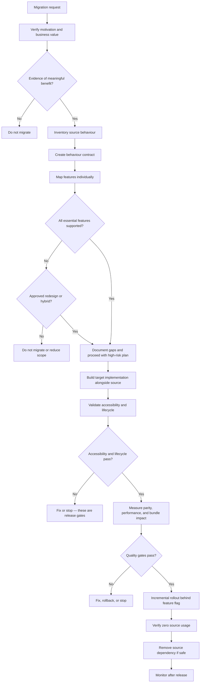

# Animation Migration Skill

## Goal

Decide whether an animation-library migration is justified, then plan and execute it safely if it is.

This skill covers:

- Migration justification — migration is **not** automatically the correct decision; the agent is explicitly authorised to conclude `Do not migrate`
- Source-implementation analysis — inventory behaviour before selecting target APIs
- Target-library suitability — evaluate fit for the framework, runtime, and feature requirements
- Feature-level mapping — map each source feature individually to a target equivalent or a gap
- Accessibility preservation — a non-negotiable release gate, never a nice-to-have
- Behaviour parity — preserve behaviour contracts, not source syntax
- Lifecycle correctness — mount, update, unmount, and cleanup must be verified for the target library
- Performance assessment — claims about improvement must be measured, not assumed
- Bundle assessment — dependency changes must be verified from build output, not assumed
- Testing — characterization tests before migration; validation tests after
- Staged rollout — incremental migration is preferred; big-bang migration requires justification
- Rollback planning — rollback must remain possible until release acceptance

When cost, risk, feature loss, or business value does not justify migration, the correct output is:

```
Final Recommendation: Do not migrate
```

---

## Return Format

Every migration response must use this **Standard Migration Output** in the order below.
Sections may be abbreviated when not applicable, but must be present with an explicit `N/A — [reason]` note.

```
# Animation Migration Report

## Executive Summary
[Source library, target library, why migration is being considered, feasibility summary,
highest risk, final recommendation — 3 to 5 sentences.]

## Source Environment
Framework: [React | Next.js | Vue | Nuxt | Svelte | SvelteKit | Angular | Vanilla JS | Unknown]
Runtime: [Client-only | SSR | Unknown]
Source library: [name and major version, or Unknown]
Target library: [name and major version, or Unknown]
Browser requirements: [list or Unknown]
SSR constraints: [yes / no / Unknown]
Existing accessibility behaviour: [summary or Unknown]
Evidence availability: [source code available | partial | unavailable]

## Migration Motivation
Business motivation: [or None stated]
Technical motivation: [or None stated]
Maintenance motivation: [or None stated]
Bundle motivation: [or None stated]
Licensing motivation: [or None stated]
Team-skill motivation: [or None stated]

## Source Implementation Inventory
[List all: animations, timelines, triggers, scroll behaviour, gesture behaviour, layout transitions,
state machines, assets, plugins, cleanup functions, reduced-motion handling,
keyboard and focus behaviour, tests, monitoring. Use Unknown when unavailable.]

## Source Stability Assessment
Is the current implementation stable: [Yes | No | Unknown]
Is it actively causing problems: [Yes | No | Unknown]
Are existing tests passing: [Yes | No | None | Unknown]
Is migration solving a confirmed problem: [Yes | No | Unknown]
Notes: [or None]

## Feasibility Assessment
[One of: Fully feasible | Feasible with adaptation | Partially feasible |
Requires redesign | Not recommended | Insufficient evidence]
Reason: [evidence and justification]

## Migration Confidence
[One of: Confirmed | Likely | Possible | Unknown]
Reason: [what evidence supports this level, or what is missing]

## Migration Risk
[One of: Low | Medium | High | Critical]
Reason: [evidence and justification]

## Migration Strategy
[One of: Full migration | Incremental migration | Hybrid migration | Redesign | No migration]
Reason: [why this strategy fits the inventory and risk]

## Feature Mapping
[One row per source feature — never one verdict for the entire migration]
| ID | Source Feature | Source Behaviour | Target Equivalent | Mapping Status | Adaptation Required | Evidence | Risk |

## Unsupported or Non-Equivalent Features
[Every feature with no direct equivalent, requiring custom implementation, design work,
behaviour compromise, or temporary retained source dependency.
Never omit unsupported functionality silently.]

## Behaviour Contract
[Document: initial visual state, final visual state, sequence, duration, delay, easing or
physical model, trigger, interruption, reverse, repeat, scrubbing, responsive, reduced-motion,
focus, keyboard, cleanup, loading fallback, error fallback]

## Accessibility Impact
[Assess: reduced motion, keyboard operation, focus management, pause/stop/hide controls,
ARIA semantics, canvas alternatives, static fallbacks, cognitive and vestibular risk.
Accessibility regression is a release blocker.]

## Performance Impact
[Before-and-after measurement requirements. Use Improved | Equivalent | Regressed | Not measured.
Never claim improvement without evidence.]

## Bundle and Dependency Impact
[Source package, target package, new peer dependencies, plugins, CSS imports, asset runtimes,
tree-shaking, lazy-loading, duplicate-library period, removal plan.]

## Migration Plan
[Staged steps — prefer incremental over big-bang]

## Governance Review
Accessibility approval: [Required | Not required | Unknown]
Design approval: [Required | Not required | Unknown]
Engineering approval: [Required | Not required | Unknown]
Product approval: [Required | Not required | Unknown]
Performance approval: [Required | Not required | Unknown]
Security review: [Required | Not required | Unknown — required when dependency changes occur]
Legal review: [Required | Not required | Unknown — required when licensing changes occur]
Notes: [or None]

## Security Impact
New dependencies: [None | Low | Medium | High | Unknown]
WASM runtimes: [None | Low | Medium | High | Unknown]
CDN or external assets: [None | Low | Medium | High | Unknown]
Dynamic imports: [None | Low | Medium | High | Unknown]
CSP impact: [None | Low | Medium | High | Unknown]
Package trust assessment: [None | Low | Medium | High | Unknown]
Overall security posture change: [None | Improved | Equivalent | Regressed | Unknown]
Notes: [or None]

## Dependency Lifecycle Review
Source library maintainer activity: [Active | Reduced | Inactive | Unknown]
Target library maintainer activity: [Active | Reduced | Inactive | Unknown]
Target library release frequency: [Regular | Irregular | Unknown]
Target library security posture: [Good | Issues present | Unknown]
Target library long-term viability: [Strong | Uncertain | Unknown]
Target library community adoption: [Wide | Niche | Declining | Unknown]
Bus factor risk: [Low | Medium | High | Unknown]
Overall dependency posture change: [Improved | Equivalent | Regressed | Unknown]

## Target Readiness
Team skill with target library: [Ready | Partially ready | Not ready | Unknown]
Documentation quality: [Good | Adequate | Poor | Unknown]
Ecosystem maturity: [Mature | Maturing | Early | Unknown]
Debugging and tooling support: [Good | Adequate | Poor | Unknown]
Monitoring support: [Good | Adequate | Poor | Unknown]
Overall target readiness: [Ready | Partially ready | Not ready | Unknown]

## Transition Debt
Temporary dual-library period: [Yes | No — list libraries if yes]
Custom compatibility wrappers introduced: [Yes | No — describe if yes]
Partial parity gaps deferred: [Yes | No — list if yes]
Deferred accessibility fixes: [Yes | No — list if yes]
Deferred cleanup work: [Yes | No — list if yes]
Debt retirement plan: [describe timeline and owner, or None]

## Success Criteria
[Define before execution — migration is successful only when all criteria are met]
- Parity target met: [target score per dimension]
- Accessibility maintained or improved: [Yes]
- Performance equal or improved: [measured threshold or Not defined]
- Bundle target met: [measured threshold or Not applicable]
- Source dependency removed: [Yes — after zero usage verified]
- No increase in runtime errors: [Yes — confirmed by post-release monitoring]
- Tests pass: [Yes]
- Rollback removed from requirement: [Yes — after release acceptance]

## Migrated Implementation
[Code when explicitly requested or when the task includes implementation.
Target code must be idiomatic — not mechanical syntax translation.]

## Parity Assessment
[Score each dimension 0–100% or Not measured. Critical regressions cannot be averaged away.]
- Visual parity:
- Timing parity:
- Interaction parity:
- State parity:
- Responsive parity:
- Accessibility parity:
- Lifecycle parity:
- Performance parity:
- Browser parity:
- Test parity:
- Maintainability impact:

## Validation Plan
[Automated and manual validation steps]

## Validation Evidence Quality
[Classify each major validation area as Verified | Partially Verified | Not Verified]
[Include the reason when Partially Verified or Not Verified]
- Visual comparison:
- Accessibility testing:
- Lifecycle testing:
- Performance measurement:
- Browser matrix:
- Build validation:

## Rollback Plan
Trigger conditions: [list]
Strategy: [feature flag | branch | dependency restore | other]
Owner: [role or Unknown]
Validation: [how to confirm rollback succeeded]

## Stop Conditions
[Migration must halt immediately if any of the following occur]
- Accessibility parity fails
- Critical feature has no supported equivalent and redesign is not approved
- Rollback is no longer available
- Risk assessment changes to Critical and was not originally scoped at Critical
- No measurable migration value confirmed by evidence
- Performance regresses beyond approved threshold
- Security review blocks the dependency change
- [Add project-specific conditions]

## Final Recommendation
[One of: Proceed | Proceed incrementally | Proceed with approved compromises |
Redesign before migration | Do not migrate | Insufficient evidence]

## Recommendation Confidence
[One of: Confirmed | Likely | Possible | Unknown]
Reason: [what evidence supports this level — specifically what is measured vs assumed]

## Assumptions and Unknowns
[All unverified information affecting the assessment]
```

---

## Warnings

- ❌ Never do a mechanical find-and-replace — understand and preserve the target library's idioms
- ❌ Never promise 100% visual parity — spring physics and cubic-bezier easing are not interchangeable without measurement and approval
- ❌ Never remove or degrade accessibility handling during migration — accessibility regression is a release blocker
- ❌ Never silently omit unsupported source features — list every gap explicitly
- ❌ Never invent target-library APIs, plugin names, import paths, cleanup methods, or version-specific behaviour
- ❌ Never assume package versions — verify from `package.json`, lockfile, and installed types
- ❌ Never remove a source dependency until zero remaining imports and runtime references are verified
- ❌ Never claim performance improvement without before-and-after measurement
- ❌ Never claim bundle reduction without before-and-after build evidence
- ❌ Never treat compilation success as proof that migration is correct
- ❌ Never recommend big-bang migration when incremental migration is safer
- ⚠️ Some GSAP plugins (SplitText, DrawSVG, MorphSVG, ScrollSmoother, Flip) have no direct equivalent in other libraries — evaluate each individually
- ⚠️ Lottie and Rive use different file formats and interaction models — migration requires designer work and interaction redesign, not code conversion
- ⚠️ Three.js scene rendering does not migrate to DOM animation libraries — only orchestration logic may be replaceable
- ⚠️ Migration is also an opportunity to add accessibility and performance improvements that were missing in the source
- ⚠️ Licence terms change — verify current licence from authoritative sources at the time of migration; do not rely on cached assumptions

---

## Context Dump

See [`.github/prompts/migrate-animation.prompt.md`](../../.github/prompts/migrate-animation.prompt.md) for supplementary migration context.

For accessibility requirements see the local `animation-accessibility` skill.
For performance profiling methodology see the local `animation-performance` skill.
For lifecycle debugging see the local `animation-debugging` skill.

---

## Migration Principles

The agent must follow these rules without exception:

1. **Understand source behaviour before selecting target APIs.** Source code must be inventoried. Do not select a target API based on the name of the source API alone.
2. **Preserve behaviour contracts, not source syntax.** The goal is identical user experience, not identical code.
3. **Prefer idiomatic target-library patterns.** A literal translation that compiles but violates the target library's lifecycle model is a defect, not a migration.
4. **Preserve accessibility as a release gate.** Reduced motion, focus management, keyboard operation, and ARIA semantics must be verified before release.
5. **Preserve lifecycle ownership and cleanup.** Mount, update, unmount, and cleanup must be explicitly mapped to target-library equivalents.
6. **Record unsupported features explicitly.** Every gap must be documented and approved before migration proceeds.
7. **Measure claims about performance and bundle size.** Use `Not measured` rather than assumed improvements.
8. **Migrate incrementally where possible.** One animation or one page at a time reduces risk and enables rollback.
9. **Keep rollback possible until validation passes.** Feature flags, branch isolation, and retained source code are all acceptable rollback strategies.
10. **Remove the source dependency only after verified zero usage.** `grep`, tree-shaking analysis, or a build that fails on import are acceptable verification methods.
11. **Distinguish required parity from approved redesign.** Document the difference and obtain stakeholder approval for any redesign.
12. **Recommend no migration when migration value is weak.** Cost, risk, feature loss, or low business value are each individually sufficient reasons to stop.

---

## Evidence and Confidence

Every significant migration claim must carry evidence, a confidence level, stated assumptions, and a verification method.

| Confidence | Meaning |
|---|---|
| **Confirmed** | Supported directly by source code, package manifest, lockfile, installed types, automated tests, official documentation for the installed major version, or measured build or runtime results |
| **Likely** | Strongly supported by available evidence; runtime validation or full testing is incomplete |
| **Possible** | A plausible mapping exists but significant evidence is missing |
| **Unknown** | Insufficient evidence to assess — state what is needed before proceeding |

**Rule:** The agent must not classify a feature mapping as `Confirmed` based only on general knowledge of a library. Version, framework, and runtime context must be verified.

---

## Migration Assessment Framework

Before recommending any migration, evaluate all five dimensions and conclude with one verdict.

### Business Value

- Why now? What triggered this request?
- What measurable problem does migration solve?
- Who benefits and how?
- What happens if nothing changes?
- Is the benefit bounded or speculative?

### Technical Value

- Does the target library support every required feature?
- Does it integrate with the existing framework and SSR setup?
- Does it meet browser-compatibility requirements?
- Does it have TypeScript support appropriate for the project?
- Does it handle lifecycle correctly in the target framework?

### Engineering Cost

- Number of animations to migrate; complexity of timelines, scroll behaviour, and state machines
- Custom plugins or assets requiring redesign or conversion
- Test authoring, documentation, team learning, and dual-library transition cost

### Operational Risk

- Is this animation on a production page or a core user flow?
- Is it accessibility-critical?
- Visual regression, performance, deployment, and rollback risk

### Strategic Fit

- Does the target library reduce or increase long-term maintenance burden?
- Is the target library actively maintained?
- Does it align with the team's existing skill set?
- What is the lock-in risk?

### Assessment Verdict

| Verdict | Meaning |
|---|---|
| **Strongly justified** | Clear measurable benefit, low risk, all features map, easy rollback |
| **Justified** | Benefit outweighs cost and risk; all material gaps documented and approved |
| **Marginal** | Benefit is real but modest; cost and risk are non-trivial; context-dependent |
| **Not justified** | Cost, risk, or feature loss outweighs the benefit |
| **Insufficient evidence** | Cannot assess — list what is needed |

---

## Migration Risk Classification

Risk must be determined by observed scope and evidence, not assumed from library names.

| Risk Level | Typical Characteristics |
|---|---|
| **Low** | Simple opacity or transform; no scroll pinning; no state machine; no custom plugin; strong target equivalent confirmed; existing tests; easy rollback |
| **Medium** | Multi-step sequencing; framework lifecycle integration; gesture handling; moderate timing sensitivity; partial test coverage; some custom adaptation required |
| **High** | Scroll pinning; complex timeline labels; shared-element transitions; 3D or canvas rendering; accessibility-sensitive interaction; no direct target equivalent; significant custom adaptation; limited rollback confidence |
| **Critical** | Touches a core user flow; essential feature has no target equivalent; redesign required; regulated or accessibility-critical content; no test baseline; no practical rollback; production outage risk |

---

## Feature Mapping Status

Every source feature must receive one mapping status. Never assign one status to an entire library migration.

| Status | Meaning |
|---|---|
| **Direct equivalent** | Target library provides the same behaviour through a documented API |
| **Equivalent with adaptation** | Behaviour is preserved but requires different code structure or lifecycle integration |
| **Behaviourally similar** | Target produces a visually similar result but with measurable differences (e.g. spring vs easing); requires stakeholder approval |
| **Custom implementation required** | Target library does not provide the feature natively; custom code is needed |
| **Design asset conversion required** | The feature is in a designer-authored asset that cannot be converted by code |
| **Unsupported** | No viable path to equivalent behaviour in the target library |
| **Keep source library temporarily** | Feature will be retained in the source library during the transition period |
| **Remove as unnecessary** | Feature is not required in the migrated implementation; removal is explicitly approved |
| **Unknown** | Insufficient information to assess — list what is needed |

**Note:** `Behaviourally similar` is not the same as exact parity. It requires stakeholder approval and documentation of the difference.

---

## Feature Mapping Table

Use this template for every migration. One row per source feature.

| ID | Source Feature | Source Behaviour | Target Equivalent | Mapping Status | Adaptation Required | Evidence | Risk |
|---|---|---|---|---|---|---|---|
| F01 | | | | | | | |

---

## Behaviour Contract

Before writing any migrated code, document the behaviour contract the migrated implementation must satisfy. This becomes the source of truth for validation.

| Property | Value |
|---|---|
| Initial visual state | |
| Final visual state | |
| Sequence | |
| Duration | |
| Delay | |
| Easing or physical motion model | |
| Trigger | |
| Interruption behaviour | |
| Reverse behaviour | |
| Repeat behaviour | |
| Scrubbing behaviour | |
| Responsive behaviour | |
| Reduced-motion behaviour | |
| Focus behaviour | |
| Keyboard behaviour | |
| Cleanup behaviour | |
| Loading fallback | |
| Error fallback | |

---

## Quick Reference Matrix

**How to read this table:** The feasibility rating is a starting point, not a final verdict. Every migration's actual feasibility depends on the specific features used, the framework, the installed versions, and the behaviour contract. Always complete the feature mapping table before concluding feasibility.

| From → To | Feasibility | Key Considerations |
|---|---|---|
| CSS → GSAP | Usually straightforward | Justified when orchestration, scroll, or lifecycle complexity exceeds CSS capability; simple CSS may not justify adding a dependency |
| GSAP → CSS | Feature-dependent | Feasible only for simple opacity and transform animations; ScrollTrigger, pinning, timeline labels, plugins, and runtime control have no CSS equivalent |
| CSS → WAAPI | Usually straightforward | Similar declarative model; verify browser support for required features |
| WAAPI → CSS | Usually straightforward | CSS covers most WAAPI use cases; verify any WAAPI-specific timing controls |
| CSS → Motion (vanilla) | Feature-dependent | API surface similarity is version-dependent; verify against installed major version |
| GSAP → Motion for React | Partial; feature-dependent | Declarative variants cover basic tweens; scroll, pinning, ScrollTrigger, complex timeline labels, and text-splitting plugins require per-feature evaluation |
| Motion for React → GSAP | Partial; feature-dependent | Imperative model requires explicit React integration; declarative state-to-animation relationships require orchestration; FLIP-style implementation for layout |
| Anime.js → GSAP | Usually feasible | API concepts are similar but not identical; verify against installed major versions of both libraries |
| GSAP → Anime.js | Feature-dependent | Basic tweens and timelines are feasible; no ScrollTrigger equivalent; no pinning; no advanced text plugins |
| Animation library → native CSS | Feature-dependent | Evaluate each feature individually; CSS has no scroll pinning, no runtime interruption, no physics spring |
| Animation library → WAAPI | Feature-dependent | WAAPI provides runtime control; verify browser support; no scroll pinning; lifecycle management differs |
| Lottie → Rive | Requires redesign | File formats differ; Rive Enterprise plan supports Lottie import as a starting point, but unsupported features must be rebuilt and interactive state machines still require designer work — verify current plan support before relying on this path |
| Rive → Lottie | Requires redesign | State-machine behaviour and runtime inputs have no Lottie equivalent unless the file is purely linear playback |
| Three.js scene → DOM library | Not applicable to rendering | Scene rendering stays in Three.js; orchestration layer only may be replaceable |

---

## Migration Execution Strategy

Prefer this order. Deviate only when repository scope makes it impractical, and document the justification.

```
1. Baseline current behaviour — document the behaviour contract; write characterization tests
2. Verify source and target versions — package.json, lockfile, installed types
3. Complete the feature mapping table — one row per source feature; identify every gap first
4. Obtain approval for gaps and compromises before writing any migrated code
5. Build the target implementation alongside the source — do not remove the source until validated
6. Validate accessibility and lifecycle — these are release gates; do not defer them
7. Measure performance and bundle impact — record before and after results
8. Release behind a feature flag where practical
9. Expand in small batches — one animation or route at a time
10. Verify zero source usage — grep, bundle analysis, or a failing build import
11. Remove source dependency — only after step 10 is confirmed
12. Monitor after release — see Post-Migration Monitoring
```

### Process Diagram



---

## Accessibility Preservation Contract

Every migration must preserve or improve each of the following. Regression in any item is a release blocker.

| Requirement | Verification Method |
|---|---|
| `prefers-reduced-motion` respected | Emulate in DevTools → Rendering; test with OS preference enabled |
| Static content fallback | Disable JS; confirm content is visible without animation |
| Pause, stop, or hide controls (where WCAG 2.2.2 applies) | Confirm control is present and keyboard-accessible |
| Keyboard operation | Tab through all animated interactions; confirm no mouse-only paths |
| Focus order preserved | Tab order must not change during or after animation |
| Focus restoration after modal or overlay close | Store trigger ref; call `.focus()` on close |
| Focus visibility | Focus indicator must never be hidden or animated away |
| ARIA semantics | Confirm `aria-hidden`, `role`, `aria-live`, and `aria-label` are preserved |
| Live-region behaviour | Animated content announcements must reach assistive technology |
| Canvas or WebGL accessible alternatives | Text alternatives for informational canvas content |
| Motion-independent communication | No information conveyed only through motion |
| Flashing limits | No content flashing more than 3 times per second (WCAG 2.3.1) |
| Cognitive accessibility | Decorative animations do not impede reading or task completion |

If the target library changes how animation behaviour is triggered or structured, the reduced-motion path must be deliberately redesigned — not assumed to carry over.

See the local `animation-accessibility` skill for complete WCAG reference, motion risk scoring, and implementation patterns.

---

## Lifecycle Preservation Contract

For every migration, verify each lifecycle concern in the target library. Never assume the target handles lifecycle automatically.

| Lifecycle Point | Verification |
|---|---|
| Instance ownership | One component creates and one component destroys — same component |
| Mount behaviour | Animation initialises exactly once on mount |
| Update behaviour | State changes do not create duplicate instances |
| Unmount behaviour | Animation stops and resources are released |
| Event listener cleanup | All listeners removed on unmount |
| Observer cleanup | IntersectionObserver, ResizeObserver, MutationObserver disconnected |
| RAF cleanup | `cancelAnimationFrame` called with stored ID |
| Timer cleanup | `clearTimeout`, `clearInterval` called |
| Plugin cleanup | ScrollTrigger instances, matchMedia instances, context reverts |
| DOM style restoration | Inline styles applied by the library are removed or reset |
| GPU resource disposal | `.dispose()` called on all application-owned WebGL resources |
| WASM runtime teardown | Rive or other WASM runtimes explicitly cleaned up |
| Async asset cancellation | Pending loads aborted or stale-callback protected on unmount |

---

## Performance and Runtime Assessment

Measure before and after where relevant. Use `Improved`, `Equivalent`, `Regressed`, or `Not measured`.
Never claim the target implementation is faster without evidence.

| Metric | Before | After | Status |
|---|---|---|---|
| Frame time (ms) | | | |
| Long frames (>16.67ms) | | | |
| Main-thread scripting per frame | | | |
| Layout work per frame | | | |
| Paint work per frame | | | |
| Draw calls (Three.js / WebGL) | | | |
| Texture and geometry counts | | | |
| JS heap after repeated mount/unmount | | | |
| LCP impact | | | |
| CLS impact | | | |
| Asset loading time | | | |
| Mobile performance (real device or 6× throttle) | | | |
| Reduced-motion path performance | | | |

---

## Bundle and Dependency Assessment

Document all dependency changes. Do not state package weights as facts unless measured from the project build or a current cited source.

| Item | Source | Target | Notes |
|---|---|---|---|
| Main package | | | |
| Version | | | |
| Peer dependencies | | | |
| Plugins or add-ons | | | |
| CSS imports | | | |
| Asset runtimes (WASM, workers) | | | |
| Tree-shaking behaviour | | | |
| Lazy-loading strategy | | | |
| Duplicate-library period | | | |
| Removal plan | | | |
| Lockfile impact | | | |
| Licence impact | | | |

For bundle-driven migrations, require before-and-after bundle analysis. Use `Not measured` until analysis is complete.

---

## Licence and Asset Review

Review the following before recommending a migration that involves changing dependencies or converting designer-authored assets.

- Source library licence
- Target library licence
- Plugin licences
- Asset licences (Lottie files, Rive files, SVGs, models)
- Attribution requirements, commercial-use restrictions, distribution restrictions

Do not provide legal certainty. Use wording such as:

> Licence review indicates...

Recommend formal legal review when material commercial or distribution risk exists.

Do not repeat outdated licence assumptions. Verify current licence terms from the library's official repository at the time the migration is performed.

---

## Migration Parity Scoring

Score each dimension 0–100%, or use `Not measured` when no comparison evidence exists.

Do not average away critical failures. A result cannot be approved when:
- Accessibility parity regresses
- Core interaction parity fails
- Cleanup is missing
- An essential feature is unsupported

| Score | Meaning |
|---|---|
| 95–100% | Equivalent for approved production requirements |
| 80–94% | Acceptable with documented differences and stakeholder approval |
| 60–79% | Partial parity — requires redesign or explicit compromise |
| Below 60% | Migration is not acceptable without major redesign |

| Dimension | Score | Notes |
|---|---|---|
| Visual parity | | |
| Timing parity | | |
| Interaction parity | | |
| State parity | | |
| Responsive parity | | |
| Accessibility parity | | |
| Lifecycle parity | | |
| Performance parity | | |
| Browser parity | | |
| Test parity | | |
| Maintainability impact | | |

---

## Migration Quality Gates

Migration cannot be marked complete until every gate passes.

- [ ] Source behaviour contract documented
- [ ] Source and target versions verified from `package.json` and lockfile
- [ ] All source features mapped individually
- [ ] Unsupported features explicitly listed and approved
- [ ] Reduced-motion behaviour preserved or improved
- [ ] Keyboard and focus behaviour tested
- [ ] Cleanup verified in the target lifecycle
- [ ] Visual comparison completed
- [ ] Browser matrix tested (project-defined matrix; always include Safari and Firefox)
- [ ] Performance measured where performance is a migration objective
- [ ] Bundle measured where bundle size is a migration objective
- [ ] Tests pass (characterization tests before; regression tests after)
- [ ] Rollback tested or demonstrably possible
- [ ] Zero source imports verified before source dependency removal
- [ ] Source dependency removed only if no longer required by anything in the project
- [ ] Documentation updated

---

## Characterization Tests

Before changing any implementation, capture current behaviour through:

- Unit tests for animation triggers, play, pause, and completion callbacks
- Integration tests for lifecycle (mount, update, unmount)
- Visual regression snapshots at key animation moments (where tooling exists)
- Interaction tests for gesture, keyboard, and focus behaviour
- Timing checkpoints where precise duration matters
- Accessibility tests: reduced motion, focus order, ARIA
- Performance baseline: frame time, heap

Characterization tests record what currently happens. They do not certify that current behaviour is correct. If current behaviour is itself a bug, document it separately and fix it after migration, not as part of it.

---

## Definition of Done

Migration is complete only when all of the following are true:

- Required parity accepted by stakeholders; unsupported features approved and documented
- Target code is idiomatic for the target library
- Accessibility quality gates pass
- Lifecycle cleanup passes
- Browser matrix passes
- Performance measured where relevant and results accepted
- Bundle impact measured where relevant and results accepted
- Production build succeeds without errors or warnings related to the migration
- Tests pass
- Rollback available and tested until release acceptance
- Source imports absent from the codebase
- Source runtime usage absent
- Source dependency removed if no longer required
- Documentation updated
- Post-release monitoring in place

---

## Source of Truth Hierarchy

When observed behaviour conflicts with documentation or assumptions, the following priority applies:

| Priority | Source |
|---|---|
| 1 — Highest | Source code (what the code actually does) |
| 2 | Characterization tests (what was recorded before migration) |
| 3 | Production behaviour (what users actually experience) |
| 4 | Official documentation for the installed major version |
| 5 — Lowest | Developer assumptions or general library knowledge |

**Rule:** Never overwrite observed behaviour with documentation assumptions. If the source code and the official docs disagree, trust what the code does and document the discrepancy.

---

## Migration Strategy Classification

Before writing a migration plan, classify the migration strategy. This drives the plan structure, risk profile, and rollback approach.

| Strategy | When to Use |
|---|---|
| **Full migration** | All source features map directly; clean cutover is safe; source library will be removed |
| **Incremental migration** | Multiple animations or pages; migrate one unit at a time; source stays active during transition |
| **Hybrid migration** | Some features migrate; some features stay in the source library permanently or temporarily; both libraries coexist by design |
| **Redesign** | Required features are not equivalent in any library; asset or interaction redesign is needed before code work begins |
| **No migration** | Cost, risk, or feature loss outweighs the benefit; current implementation is stable; migration does not solve a confirmed problem |

A Hybrid migration is a valid long-term outcome, not a failure state. Document which features stay in which library and why.

---

## Repository-Wide Migration Strategy

For migrations spanning many components, pages, or teams, apply this staged approach rather than a per-component plan.

```
1. Inventory
   → Catalogue every animation in the repository
   → Group by library, pattern, complexity, and criticality
   → Identify shared components that require cross-team coordination

2. Prioritise
   → Start with the simplest, most isolated animations
   → Defer scroll-pinning, state-machine, and shared-component migrations
   → Defer any animation on a business-critical conversion flow until patterns are proven

3. Pilot
   → Select one representative animation from each pattern group
   → Complete the full migration process including characterization tests and parity scoring
   → Validate and measure results before expanding

4. Validate
   → Confirm pilot parity scores, accessibility, and lifecycle results
   → Confirm the migration team understands target-library idioms
   → Confirm rollback is available

5. Expand
   → Apply proven patterns to the remaining inventory in small batches
   → Integrate migration validation into the CI pipeline where possible
   → Track transition debt and close it on a defined schedule

6. Retire source dependency
   → Verify zero imports and zero runtime references
   → Remove from package.json and lockfile
   → Monitor for post-removal errors
```

**Rule:** Do not begin step 5 until step 4 produces acceptable results. Pilot failures are information — use them to refine the approach before scaling.

---

## Cross-Team Dependencies

When a migration touches shared components, animation hooks, or platform-level code, identify and coordinate with all affected teams before writing code.

| Stakeholder | Review Required When |
|---|---|
| Design | Visual behaviour changes; motion model changes; animation assets affected |
| Frontend platform | Shared hooks, wrappers, or base components change |
| Accessibility | Reduced-motion, focus, ARIA, or WCAG-relevant behaviour changes |
| QA | Automated test suite changes; new test patterns introduced |
| Security | New dependencies added; WASM or CDN assets introduced |
| Legal | Licence changes in dependencies or assets |
| Product | Visible behaviour change on user-facing pages; business-critical flow affected |

**Rule:** Do not assume coordination happened. Confirm each required stakeholder has reviewed and approved before migration is marked complete.

---

## Stop Conditions

Migration must halt immediately when any of the following occur. These are non-negotiable exit criteria.

| Condition | Action |
|---|---|
| Accessibility parity fails | Stop; fix before continuing; accessibility is a release gate |
| Critical feature has no supported equivalent and redesign is not approved | Stop; escalate for redesign approval or conclude Do not migrate |
| Rollback is no longer available | Stop; restore rollback capability before proceeding |
| Risk assessment changes to Critical mid-migration | Stop; re-evaluate the full plan |
| No measurable migration value confirmed by evidence | Stop; do not proceed on assumption of future benefit |
| Performance regresses beyond approved threshold | Stop; fix or rollback |
| Security review blocks the dependency change | Stop; resolve before proceeding |
| Source dependency removal breaks an unrelated dependency | Stop; audit the full dependency tree |

---

## Library-Specific Migration Guidance


### CSS Animations and Transitions → GSAP

| CSS Concept | GSAP Equivalent |
|---|---|
| `@keyframes` with named animation | `gsap.to()` or `gsap.fromTo()` |
| `animation-delay` | `delay` option |
| `animation-iteration-count` | `repeat` option (`-1` for infinite) |
| `animation-duration` | `duration` option |
| `animation-timing-function` | `ease` option |
| `@media (prefers-reduced-motion)` | `gsap.matchMedia()` with `reduce` condition |
| CSS transition on state change | `gsap.to()` triggered on state change |
| Sequencing (multiple transitions) | `gsap.timeline()` |

Simple CSS animations may not justify adding GSAP as a dependency. Verify that orchestration complexity is warranted before proceeding.
Cleanup: GSAP tweens created in `useEffect` must be reverted in the cleanup return via `gsap.context()` or `gsap.matchMedia()` with `mm.revert()`. Verify the three-argument scope signature against the installed GSAP version.

---

### GSAP → CSS Animations

Feasible only for simple opacity and transform animations with no runtime interruption.

| GSAP Feature | CSS Status |
|---|---|
| ScrollTrigger | No CSS equivalent |
| Scroll pinning | No CSS equivalent |
| Timeline labels and seeks | No CSS equivalent |
| Runtime pause, resume, reverse | No CSS equivalent (WAAPI supports this) |
| Dynamic values | No CSS equivalent |
| SplitText, DrawSVG, MorphSVG, Flip plugins | No CSS equivalent |
| Per-element stagger from JS arrays | No direct CSS equivalent |

For anything with interactive control, scroll, or complex sequencing, evaluate GSAP → WAAPI instead of GSAP → CSS.

---

### GSAP → Motion for React

| GSAP Pattern | Motion for React Pattern |
|---|---|
| `gsap.from(ref, {...})` | `<motion.div initial={...} animate={...}>` |
| `gsap.timeline().from().from()` | `variants` with orchestration options |
| `stagger` | `staggerChildren` in transition |
| Conditional exit animation | `<AnimatePresence>` with `exit` prop |
| Layout transition | `layout` prop with `layoutId` |
| `gsap.matchMedia()` reduced motion | `useReducedMotion()` hook |
| `useEffect` cleanup with `ctx.revert()` | Declarative model handles unmount; verify cleanup for imperative `useAnimate` usage |

Feature gaps — evaluate individually:

| GSAP Feature | Status |
|---|---|
| ScrollTrigger scroll-linked animation | Motion has scroll utilities; evaluate current installed version against the specific scroll behaviour required |
| Scroll pinning | No direct declarative equivalent; custom implementation required |
| Timeline `.seek()` and label-based scrubbing | No direct equivalent; custom implementation required |
| SplitText | No built-in text-split animation |
| DrawSVG, MorphSVG, Flip plugin | No direct equivalents |
| Complex imperative runtime control | `useAnimate` provides imperative API; evaluate per use case |

---

### Motion for React → GSAP

| Motion for React Pattern | GSAP Pattern |
|---|---|
| `initial`, `animate` props | `gsap.fromTo()` or `gsap.from()` |
| `variants` with orchestration | `gsap.timeline()` with `stagger` and `delay` |
| `AnimatePresence` exit | `gsap.to()` in unmount lifecycle; requires React integration |
| `layout` and `layoutId` | Flip plugin — verify availability and licence |
| `useReducedMotion()` | `gsap.matchMedia()` with reduce condition |
| `drag` gesture | Draggable plugin — verify availability and licence |
| `whileHover`, `whileTap` | Event-listener-triggered tweens |

Considerations:
- Declarative state-to-animation relationships require explicit orchestration in GSAP
- Exit lifecycle must be handled with React refs and effect cleanup
- Spring physics will differ from Motion's spring model; measure and approve the difference

---

### Anime.js → GSAP

| Anime.js Concept | GSAP Equivalent |
|---|---|
| `anime({ targets, ... })` | `gsap.to(targets, {...})` |
| `keyframes` array | `gsap.to()` with keyframe array or timeline |
| `timeline()` | `gsap.timeline()` |
| `anime.stagger()` | `gsap.to()` with `stagger` option |
| Playback controls | Timeline `.play()`, `.pause()`, `.reverse()` |
| `complete` callback | `onComplete` callback |
| `autoplay: false` | `paused: true` on tween or timeline |

Verify against installed major versions of both libraries. Anime.js v3 and v4 have API differences. GSAP v2 and v3 have breaking changes.

---

### GSAP → Anime.js

Feasible for basic tweens, timelines, stagger, and playback controls. Not feasible for ScrollTrigger, pinning, SplitText, DrawSVG, MorphSVG, or Flip.

---

### Lottie → Rive

This migration requires asset and interaction work beyond code translation. The extent of designer effort depends on the Rive plan and the animation content.

**Rive Enterprise Lottie import:** As of current Rive Enterprise plan capabilities, Lottie files may be imported into the Rive editor as a starting point. Unsupported Lottie features will need manual rebuilding. Verify current Rive plan support at the time of migration — capability and plan requirements may change.

**Interactive state machines always require designer work regardless of import path.** A Lottie import produces a linear animation asset, not a state machine. State-machine inputs, transitions, and interactivity must be designed from scratch in the Rive editor.

Required work:
1. Verify current Rive plan support for Lottie import
2. Attempt import; audit unsupported features that require rebuilding
3. If import is unavailable or insufficient, designer re-creates the artboard from scratch
4. Define state-machine inputs and transitions — this is always new design work
5. Implement Rive runtime in code — verify `@rive-app/canvas` or `@rive-app/webgl` version
6. Review asset licence and Rive runtime licence
7. Verify WASM runtime loads correctly (CSP, CDN, MIME type)
8. Implement accessibility: `aria-hidden` for decorative; text alternatives for informational
9. Implement reduced-motion: pause or static frame on reduce
10. Test on target browser matrix including iOS Safari

If the required interactivity cannot be imported and designer resources are unavailable, the migration cannot proceed.

---

### Rive → Lottie

Treat as redesign unless the Rive file is purely linear, non-interactive playback.

Feature losses:
- State-machine inputs become unavailable
- Runtime-triggered transitions cannot be represented in Lottie
- Multiple artboards may need to become multiple Lottie files

Requires designer to re-author as linear animation, with explicit approval of the interaction behaviour loss.

---

### Three.js Scene Animations

Three.js scene rendering does not migrate to DOM animation libraries.

| Three.js Responsibility | Migration Scope |
|---|---|
| Scene rendering, WebGL | Stays in Three.js |
| Object transforms (position, rotation, scale) | GSAP or WAAPI may drive values; Three.js renders them |
| Camera movement | Same as above |
| Material and shader changes | GSAP can tween uniform values |
| Asset loaders, RAF loop | Lifecycle ownership stays in the component |
| Timeline orchestration | GSAP timeline may orchestrate Three.js object property changes |

---

## Framework-Specific Migration Guidance

### React

- Verify `useEffect` cleanup returns the target library's teardown (e.g. `mm.revert()`, `ctx.revert()`, `animation.destroy()`)
- Confirm React Strict Mode double-invoke does not cause duplicate instances — fix cleanup before testing
- Use refs for DOM targeting; never use class string selectors in multi-instance components
- For reduced motion: use `gsap.matchMedia()` or `useReducedMotion()` hook; verify against installed version
- For exit animations with Motion for React: `AnimatePresence` must wrap the conditional render
- For Next.js: wrap animation init in `useEffect`; add `"use client"` directive for Client Components; confirm no SSR execution

### Vue and Nuxt

- Confirm cleanup is in `onUnmounted`
- Verify template refs are accessed inside `onMounted`
- For Nuxt SSR: use `onMounted` or `process.client` guard

### Svelte and SvelteKit

- Verify `onMount` returns a cleanup function
- Confirm `typeof window !== "undefined"` guards all browser APIs
- Do not silently lose built-in Svelte transitions during migration

### Angular

- Verify `DestroyRef.onDestroy()` (Angular 16+) or `ngOnDestroy` cancels all animation instances
- Use `NgZone.runOutsideAngular()` for performance-sensitive animation loops
- Expose `prefers-reduced-motion` through a shared service; do not query per component

### Vanilla JavaScript

- Confirm DOM ownership: one module creates, one module destroys
- Confirm all event listeners, observers, and RAF callbacks are explicitly removed
- Confirm idempotent setup; document teardown contract as part of the public API

---

## Migration Failure Modes

| Failure Mode | Why It Happens | Risk | Detection | Prevention |
|---|---|---|---|---|
| Mechanical syntax translation | Nearest-API-name substitution without understanding behaviour | Broken lifecycle, lost accessibility | Visual regression; lifecycle tests | Require behaviour contract before writing code |
| Unsupported feature silently omitted | Assumed it will be handled | Feature loss in production | Feature mapping table; stakeholder review | Require feature-by-feature mapping |
| Source timing copied into incompatible motion model | Duration pasted into a spring | Wrong visual behaviour | Side-by-side comparison | Approve motion model difference explicitly |
| Spring replaced with cubic-bezier without approval | Simplification assumed acceptable | Unapproved behaviour change | Parity scoring | Require stakeholder approval |
| Cleanup lost | Target library lifecycle not understood | Memory leak; event accumulation | Heap snapshot; lifecycle test | Require lifecycle contract before writing code |
| Reduced motion lost | Not mapped to target library equivalent | Accessibility regression; release blocker | DevTools emulation; OS preference test | Accessibility preservation contract is a gate |
| Focus behaviour lost | Not mapped during migration | Accessibility regression | Keyboard navigation test | Accessibility preservation contract |
| Exit behaviour lost | `AnimatePresence` or equivalent not added | No exit animation | Manual test; visual regression | Feature mapping must include exit lifecycle |
| Scroll pinning approximated incorrectly | Assumed equivalent where none exists | Wrong UX | Side-by-side scroll comparison | Flag as unsupported; obtain approval |
| State machine flattened into timeline | Interactivity removed | Feature loss | Interaction test | Require feature mapping for every state |
| Designer asset treated as code-convertible | Lottie or Rive file cannot be converted by code | Migration cannot complete | Asset format analysis | Require designer involvement |
| Both libraries shipped indefinitely | Dual-library period never closed | Bundle bloat | Bundle analysis; import audit | Define removal plan with deadline |
| Source removed before zero-usage verification | Assumed no remaining uses | Runtime crash | Build fails on import; grep | Require verification before removal |
| Import path from wrong major version | AI uses wrong-version documentation | Runtime error | Type errors; runtime test | Verify import against `package.json` |
| Target feature invented by AI | Hallucinated API | Runtime crash or silent no-op | Type check; installed-types inspection | Verify all APIs against installed types |
| Performance improvement claimed without measurement | Assumption | False claim or undetected regression | Before-and-after profiling | Require measurement for all performance claims |
| Bundle reduction claimed without build analysis | Assumption | False business justification | Before-and-after bundle report | Require measurement for all bundle claims |

---

## AI-Generated Migration Safeguards

### High-Risk AI Patterns

| Pattern | Risk | Detection |
|---|---|---|
| Invented target API | Runtime crash or silent no-op | Verify every method against installed types |
| Wrong import path | Module not found or wrong version | Verify against `package.json` package name |
| Mixed major versions | Runtime errors; wrong behaviour | Inspect `package.json` before writing any code |
| Hallucinated plugins | `registerPlugin` fails at runtime | Verify every plugin against official published list |
| Missing cleanup | Memory leak; event accumulation | Every animation `useEffect` must return cleanup |
| Removed accessibility | Accessibility regression | Verify reduced-motion, focus, keyboard after generation |
| Lost event handlers or state transitions | Interaction failure; feature loss | Audit source handlers and states; confirm each has a target equivalent |
| Placeholder comments | Silent feature gap | Treat `// handle cleanup here` as missing implementation |
| Visual parity claimed without comparison | False confidence | Require side-by-side test before marking parity |

### Verification Process

Before classifying any target API as valid:

1. Inspect `package.json` for the installed major version
2. Inspect the lockfile for the exact version
3. Inspect installed type definitions for the method signature
4. Use official documentation for that exact major version
5. Mark confidence as `Unknown` when verification is unavailable

---

## Maintainability Impact

Evaluate each dimension as `Improved`, `Equivalent`, `Regressed`, or `Unknown`.

| Dimension | Assessment | Notes |
|---|---|---|
| Lines of animation code | | |
| Number of abstractions | | |
| Framework fit | | |
| Debuggability | | |
| Testability | | |
| Type safety | | |
| Ownership clarity | | |
| Documentation burden | | |
| Team familiarity | | |
| Upgrade risk | | |
| Target-library lock-in | | |

Do not assume fewer dependencies automatically means better maintainability.

---

## Post-Migration Monitoring

Recommend only signals relevant to the project.

| Signal | Relevance |
|---|---|
| Runtime errors related to animation initialisation | All migrations |
| WebGL context loss events | Three.js or canvas migrations |
| Long tasks related to animation | Performance-sensitive migrations |
| Route-transition errors | SPA migrations with animated routes |
| Memory growth across repeated navigation | Any migration involving cleanup |
| Accessibility regressions | All migrations |
| Asset-load failures (Rive, Lottie files) | Asset-runtime migrations |
| Conversion-flow impact | Migrations affecting business-critical pages |
| Animation initialisation failure (silent no-op) | Migrations with complex lifecycle |

---

## Migration Validation Matrix

### Functional
- [ ] Trigger, play, pause, resume, reverse, repeat, interruption, exit, error fallback

### Visual
- [ ] Initial state, final state, key intermediate moments, responsive layouts, theme variations

### Accessibility
- [ ] `prefers-reduced-motion` emulated and OS preference tested
- [ ] Keyboard navigation, focus order, focus restoration, ARIA semantics, pause controls, static fallback

### Lifecycle
- [ ] Mount (once), update (no duplicates), unmount (resources released), repeated navigation, Strict Mode (React)

### Performance
- [ ] Frame time, long tasks, layout/paint, memory, mobile device or 6× throttle

### Browser
- [ ] Project browser matrix; Safari; Firefox; Chromium; Mobile Safari; Mobile Chrome

### Build
- [ ] Production build, TypeScript, tests, bundle analysis, tree-shaking, dependency audit

---

## Few-Shot Examples

---

### Example 1 — GSAP → Motion for React: Entrance Animation

**Request:** Migrate this React GSAP entrance animation to Motion for React to remove GSAP from this page.

```markdown
# Animation Migration Report

## Executive Summary
A React component uses a GSAP useEffect timeline to animate hero elements on mount
with stagger. Migration to Motion for React is fully feasible for the inventoried
features. GSAP cannot be removed from the project until zero remaining GSAP usage
across the entire codebase is verified — this report covers one component only.

## Source Environment
Framework: React 18 | Runtime: Client-only
Source library: GSAP 3 (from package.json) | Target library: Motion for React 11+
SSR constraints: No | Accessibility: gsap.matchMedia() reduce condition present

## Source Implementation Inventory
- F01: hero-title entrance: opacity 0→1, y 40→0, 0.8s
- F02: hero-subtitle entrance: opacity 0→1, y 20→0, 0.6s, delay 0.2s
- F03: gsap.matchMedia() — no animation under prefers-reduced-motion: reduce
- F04: mm.revert() cleanup in useEffect return
- No scroll, no plugins, no assets, no gestures

## Feasibility Assessment
Fully feasible for the inventoried features.

## Migration Confidence
Likely
Reason: Source code provided and all features map to documented Motion v11 APIs.
Package versions (GSAP, Motion) not yet verified from package.json or lockfile.
Easing parity not yet measured.

## Migration Risk
Low — simple entrance animation; no scroll; full equivalents confirmed; easy rollback.

## Migration Strategy
Incremental migration
Reason: Single component; source library (GSAP) remains active project-wide; migrate
this component and verify before expanding.

## Feature Mapping
| ID  | Source Feature | Behaviour | Target Equivalent | Mapping Status | Adaptation | Evidence | Risk |
|-----|----------------|-----------|-------------------|----------------|------------|----------|------|
| F01 | hero-title tween | opacity, y, 0.8s | motion.div initial/animate | Direct equivalent | Declarative props | Motion documentation for installed version | Low |
| F02 | hero-subtitle tween | opacity, y, delay 0.2s | motion.div with transition delay | Direct equivalent | Declarative props | Motion documentation for installed version | Low |
| F03 | gsap.matchMedia() reduce | No animation | useReducedMotion() hook | Direct equivalent | Hook inside component | Motion documentation for installed version | Low |
| F04 | mm.revert() cleanup | Kills tweens and listener | Declarative unmount | Direct equivalent | Declarative model | Motion documentation for installed version | Low |

## Unsupported or Non-Equivalent Features
None. All source features have direct equivalents.

## Behaviour Contract
Initial: hero-title opacity 0 y 40px; hero-subtitle opacity 0 y 20px
Final: both opacity 1 y 0
Reduced-motion: elements appear at final state immediately — no animation
Trigger: mount | Cleanup: declarative

## Accessibility Impact
Expected preserved. useReducedMotion() produces immediate final state.
Not yet verified — requires DevTools emulation and OS preference test.

## Performance Impact
Not measured. Both implementations use compositor properties only.
Do not assume equivalent — verify with profiler if performance is a migration objective.

## Bundle and Dependency Impact
New: motion (^11.x) — verify in package.json.
GSAP: cannot remove until zero usage across codebase verified.
Duplicate period: both present until removal confirmed.

## Migrated Implementation

\`\`\`tsx
// Verify: "motion/react" for Motion v11+; "framer-motion" for older versions
import { motion, useReducedMotion } from "motion/react";

export function HeroAnimation() {
  const prefersReduced = useReducedMotion();
  return (
    <section>
      <motion.h1
        className="hero-title"
        initial={prefersReduced ? false : { opacity: 0, y: 40 }}
        animate={{ opacity: 1, y: 0 }}
        transition={{ duration: 0.8 }}
      >
        Welcome
      </motion.h1>
      <motion.p
        className="hero-subtitle"
        initial={prefersReduced ? false : { opacity: 0, y: 20 }}
        animate={{ opacity: 1, y: 0 }}
        transition={{ duration: 0.6, delay: 0.2 }}
      >
        Discover our product.
      </motion.p>
    </section>
  );
}
\`\`\`

## Parity Assessment
| Dimension | Score | Notes |
|---|---|---|
| Visual parity | Not measured | Side-by-side required; easing curve may differ slightly |
| Timing parity | ~95% | Duration and delay identical; easing may differ — requires visual approval |
| Accessibility parity | Not measured — Expected equivalent | Reduced-motion path preserved in code; requires DevTools and OS-preference verification |
| Lifecycle parity | Not measured — Expected equivalent | Declarative model expected to handle cleanup correctly; verify with mount/unmount heap test |
| Performance parity | Not measured | Both use compositor properties; profile if needed |

## Validation Plan
1. Side-by-side visual comparison in Chrome, Safari, Firefox
2. Emulate prefers-reduced-motion: reduce — confirm final state appears immediately
3. Test with OS reduce-motion preference enabled
4. Mount/unmount 5× — confirm no retained heap objects
5. Run existing test suite

## Validation Evidence Quality
- Visual comparison: Not Verified — side-by-side not yet performed
- Accessibility testing: Not Verified — DevTools emulation and OS preference not yet tested
- Lifecycle testing: Not Verified — heap test not yet performed
- Performance measurement: Not Verified — profiler not yet run
- Browser matrix: Not Verified — Safari and Firefox not yet tested
- Build validation: Not Verified — production build not yet run

## Rollback Plan
Trigger: accessibility regression; visual regression beyond approved threshold; test failure
Strategy: Feature flag toggle returns to GSAP component
Owner: Unknown
Validation: Re-enable source component; confirm original behaviour restores

## Stop Conditions
- Accessibility parity fails after testing
- Easing difference is rejected by stakeholders
- Motion package version cannot be verified in package.json

## Final Recommendation
Proceed incrementally — migrate this component; verify GSAP usage elsewhere before removing dependency.

## Recommendation Confidence
Likely
Reason: Target equivalents confirmed in source code; bundle and easing parity not yet measured.

## Assumptions and Unknowns
- Easing curve difference not measured — requires visual approval
- Accessibility and lifecycle parity expected but not yet verified
- GSAP usage in other components not inventoried in this report
- "motion" not yet verified in package.json
```

---

### Example 2 — GSAP ScrollTrigger → Motion for React: Scroll Sequence

**Request:** Convert this ScrollTrigger page to Motion for React and keep everything exactly identical.

```markdown
# Animation Migration Report

## Executive Summary
The source uses GSAP ScrollTrigger with scroll pinning, scrubbing, timeline labels,
and responsive breakpoints. Exact parity cannot be promised before inventory. After
inventory, scroll pinning and label-based scrubbing have no direct Motion for React
equivalent. Full exact parity is not achievable without significant custom code.
A hybrid or retained-GSAP approach is the safer recommendation.

## Source Implementation Inventory
- F01: Scroll-pinned section
- F02: Scrubbed timeline (progress = scroll position)
- F03: Timeline labels for seek targets
- F04: Responsive breakpoints via gsap.matchMedia()
- F05: Scroll-enter entrance animations
- F06: Scroll-leave exit animations
- F07: No animation under prefers-reduced-motion: reduce
- F08: mm.revert() cleanup

## Feasibility Assessment
Partially feasible.
F05 and F06 (scroll-enter/leave animations): feasible.
F01 (pinning), F02 (scrubbing), F03 (labels): no direct equivalent.

## Migration Confidence
Possible
Reason: Source code was partially provided; ScrollTrigger configuration details were
not fully inspected; Motion scroll capabilities for the installed version were not
verified against the exact required behaviour.

## Migration Risk
High — pinning and scrubbing are core; no direct target equivalent; custom
implementation is significant; visual regression risk is high.

## Migration Strategy
Hybrid migration
Reason: F05 and F06 migrate to Motion; F01, F02, F03 remain in GSAP ScrollTrigger
until a viable custom implementation is proven or the requirement changes.

## Feature Mapping
| ID  | Source Feature | Behaviour | Target Equivalent | Mapping Status | Evidence | Risk |
|-----|----------------|-----------|-------------------|----------------|----------|------|
| F01 | Scroll pinning | Fixed during scroll | No direct equivalent | Custom implementation required | Motion documentation for installed version | High |
| F02 | Scrubbing | Progress = scroll % | useScroll + useTransform (partial) | Custom implementation required | Motion documentation for installed version | High |
| F03 | Timeline labels | .seek("label") | No equivalent | Custom implementation required | N/A | Medium |
| F04 | Responsive matchMedia | Per-breakpoint animation | Manual breakpoints + useReducedMotion | Equivalent with adaptation | Motion documentation for installed version | Medium |
| F05 | Scroll-enter animation | Animate in on enter | whileInView | Direct equivalent | Motion documentation for installed version | Low |
| F06 | Scroll-leave animation | Animate out on leave | useInView with exit | Behaviourally similar | Motion documentation for installed version | Medium |
| F07 | Reduced motion | No animation | useReducedMotion() | Direct equivalent | Motion documentation for installed version | Low |
| F08 | Cleanup | mm.revert() | Manual cleanup in useEffect | Equivalent with adaptation | Motion documentation for installed version | Low |

## Unsupported or Non-Equivalent Features
- F01 Scroll pinning: no direct declarative equivalent; requires custom CSS sticky + JS scroll tracking or retained GSAP
- F02 Scrubbing: Motion's useScroll provides scroll values but is not a scrubbed GSAP timeline; custom implementation required; parity unverified
- F03 Timeline labels: no equivalent; requires custom state machine or imperative controls

## Stop Conditions
- Pinning custom implementation does not achieve parity and stakeholders do not approve the difference
- Motion installed version lacks the scroll utilities assumed in this plan
- Accessibility parity fails for F06 scroll-leave on Safari

## Final Recommendation
Do not fully migrate. Recommended options:
1. Hybrid: migrate scroll-enter/leave to Motion; retain GSAP ScrollTrigger for pinning and scrubbing
2. Custom: implement pinning and scrubbing independently; use Motion for animation values
3. Keep GSAP: if scroll behaviour is core and migration value does not justify custom cost

Exact parity with Motion only is not achievable without significant custom code that
reimplements ScrollTrigger functionality.

## Recommendation Confidence
Possible
Reason: ScrollTrigger configuration not fully inspected; Motion scroll version not
verified; stakeholder approval for hybrid approach not obtained.

## Assumptions and Unknowns
- Motion's current scroll capabilities not fully profiled against this specific behaviour — verify installed version before closing
- GSAP ScrollTrigger configuration details partially provided — full inventory required
- Stakeholder approval required for hybrid strategy and any behaviour difference before proceeding
```

---

### Example 3 — Lottie → Rive: Asset-Driven Migration

**Request:** Convert this Lottie file into a Rive state machine.

```markdown
# Animation Migration Report

## Executive Summary
This is an asset and interaction redesign, not a code translation. Lottie and Rive
use incompatible file formats and incompatible runtime interaction models. Code alone
cannot complete this migration. Designer involvement is required. Feasibility depends
on available designer resources and the scope of the desired state-machine behaviour.

## Source Implementation Inventory
- F01: Linear playback Lottie animation (autoplay, loop)
- F02: animation.destroy() cleanup in useEffect
- F03: prefers-reduced-motion: autoplay false, loop false, goToAndStop on DOMLoaded
- F04: aria-hidden="true" on container (decorative)

## Feasibility Assessment
Requires redesign.
The Lottie JSON format cannot be imported into Rive. The animation must be re-authored
in the Rive editor by a designer.

## Migration Confidence
Unknown
Reason: Designer availability is unknown; desired state-machine interactions are not
defined; @rive-app installed version is not confirmed; WASM CSP policy is unknown.
Confidence cannot be raised until these blockers are resolved.

## Migration Risk
High — designer resources required; WASM loading must be confirmed; accessibility
must be re-verified for the new runtime.

## Migration Strategy
Redesign
Reason: File format incompatibility and undefined state-machine requirements mean
no code-only migration path exists. Designer involvement is a prerequisite.

## Feature Mapping
| ID  | Source Feature | Behaviour | Target Equivalent | Mapping Status | Evidence | Risk |
|-----|----------------|-----------|-------------------|----------------|----------|------|
| F01 | Linear Lottie playback | JSON-driven frames | Rive artboard — requires redesign | Design asset conversion required | Different format | High |
| F02 | animation.destroy() | Releases lottie-web instance | @rive-app teardown — version-sensitive | Equivalent with adaptation | Installed types | Medium |
| F03 | Reduced motion | No autoplay | Pause or static frame — verify in @rive-app installed version | Equivalent with adaptation | Rive documentation for installed version | Low |
| F04 | aria-hidden | Hidden from AT | aria-hidden on canvas element | Direct equivalent | HTML spec | Low |

## Unsupported or Non-Equivalent Features
- File format: Lottie JSON is not importable into Rive — animation must be re-created from source
- State-machine behaviour: requires explicit design work; not a conversion of existing content
- If the original After Effects source file is unavailable, designer effort increases significantly

## Accessibility Impact
The canvas element must carry aria-hidden="true" for decorative use.
If the new Rive animation communicates information, a text alternative is required.
Reduced-motion must be explicitly reimplemented for the Rive runtime — it does not
carry over from the lottie-web implementation automatically.

## Bundle and Dependency Impact
Removing: lottie-web (only after zero usage verified)
Adding: @rive-app/canvas or @rive-app/webgl (version to be selected — verify in package.json)
Adding: .riv asset (replaces .json asset)
WASM: confirm CSP allows WASM execution; confirm hosting and MIME type strategy

## Migration Plan
1. Confirm designer availability and timeline — migration cannot begin without this
2. Define state-machine behaviour: states, inputs, transitions
3. Designer creates Rive artboard in Rive editor
4. Export .riv; implement @rive-app runtime — verify package name and version
5. Implement reduced-motion and cleanup per the installed version docs
6. Verify WASM loads correctly (CSP, MIME type, CDN or local hosting)
7. Test on iOS Safari (WebGL context pressure; WASM loading)
8. Verify accessibility: aria-hidden, text alternatives, reduced-motion
9. Remove lottie-web after zero usage verified

## Governance Review
Accessibility approval: Required — reduced-motion reimplementation must be reviewed
Design approval: Required — designer is a primary participant
Engineering approval: Required — WASM and CSP changes require platform review
Security review: Required — new WASM runtime and CDN/hosting changes
Legal review: Required — verify Rive runtime licence; verify asset licence

## Stop Conditions
- Designer is unavailable and no timeline can be committed
- Desired state-machine interactions cannot be defined
- WASM execution is blocked by CSP and policy cannot be changed
- Accessibility review rejects the new implementation

## Final Recommendation
Redesign before migration — then proceed if designer resources are available.
If designer resources are unavailable, the migration cannot proceed.

## Recommendation Confidence
Unknown
Reason: Designer availability, state-machine scope, and runtime readiness are all
unknown. Confidence will be reclassified to Possible after designer engagement and
to Likely after pilot artboard review.

## Assumptions and Unknowns
- Original After Effects source file availability: Unknown
- Designer availability: Unknown
- Desired state-machine interactions: To be defined
- @rive-app installed version: Unknown — verify before writing any code
- @rive-app teardown method: verify against installed version — do not assume method name
- WASM CSP policy for deployment environment: Unknown
```

---

## RTCF

**Role:** Senior animation migration architect, frontend platform engineer, accessibility reviewer, performance engineer, dependency specialist, and evidence-driven technical reviewer.

**Task:** Decide whether an animation-library migration is justified, then plan and execute it safely. Apply source-behaviour inventory, feature-level mapping, feasibility and risk classification, behaviour contract, accessibility and lifecycle preservation, parity scoring, quality gates, validation, and rollback planning to every migration request. Use the Standard Migration Output for every response.

**Constraints:**
- Never recommend migration when cost, risk, or feature loss outweighs the benefit — `Do not migrate` is a valid and correct output
- Never silently omit unsupported source features
- Never invent target-library APIs, plugins, import paths, cleanup methods, or version-specific behaviour
- Always verify package versions from `package.json`, lockfile, and installed types before citing APIs
- Preserve accessibility as a non-negotiable release gate
- Preserve lifecycle correctness — verify cleanup in the target library explicitly
- Never claim performance or bundle improvement without measurement evidence
- Prefer incremental migration; require justification for big-bang approaches
- Never remove a source dependency until zero usage is verified
- Distinguish required parity from approved redesign; document every difference
- Classify confidence and state assumptions for every significant claim

**Format:** Standard Migration Output for every response. Order: Executive Summary → Source Environment → Migration Motivation → Source Implementation Inventory → Source Stability Assessment → Feasibility Assessment → Migration Confidence → Migration Risk → Migration Strategy → Feature Mapping → Unsupported Features → Behaviour Contract → Accessibility Impact → Performance Impact → Bundle and Dependency Impact → Migration Plan → Governance Review → Security Impact → Dependency Lifecycle Review → Target Readiness → Transition Debt → Success Criteria → Migrated Implementation → Parity Assessment → Validation Plan → Validation Evidence Quality → Rollback Plan → Stop Conditions → Final Recommendation → Recommendation Confidence → Assumptions and Unknowns.
