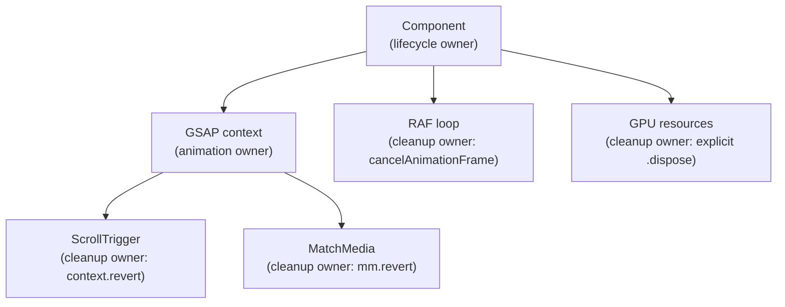
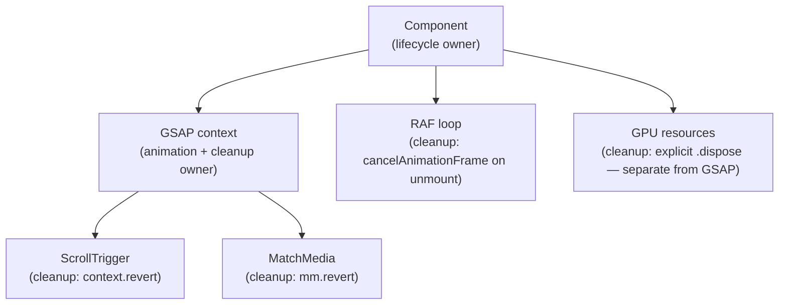
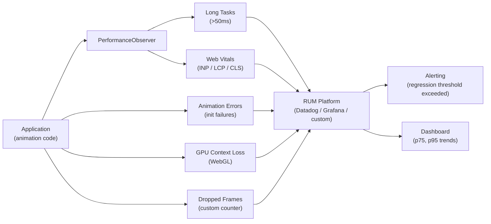
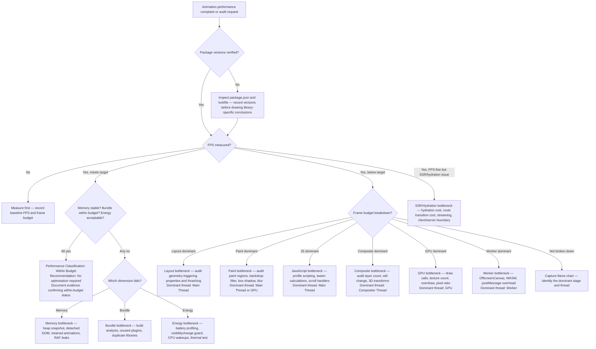
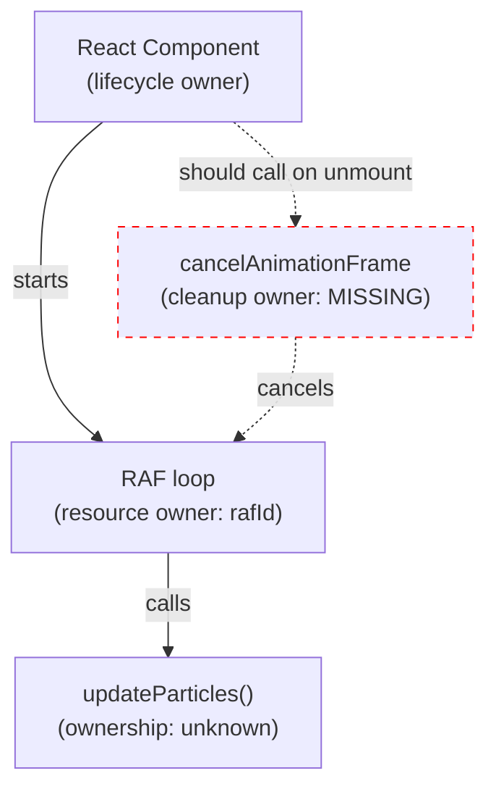

# Animation Performance Skill

## Goal

Diagnose, measure, classify, and remediate frontend animation performance issues. Target 60fps (or the display's native refresh rate), minimal CPU/GPU cost, stable memory, smallest justified bundle, and preserved accessibility — across desktop and mobile, all major animation libraries, CSS, Canvas, and WebGL.

This skill covers:

- Performance issue diagnosis — identify and confirm bottlenecks before recommending fixes
- Severity and risk classification — distinguish symptom from root cause; separate severity from production risk
- Evidence-based conclusions — never optimise on assumption; measure first
- Runtime, rendering, layout, paint, composite, memory, GPU, bundle, battery, and accessibility-motion audits
- Desktop and mobile evaluation — separate device-class analysis where behaviour differs
- Library-specific audit guidance — CSS, GSAP, Motion for React, Three.js, Lottie, Rive, Canvas, WebGL
- Regression prevention — validate that fixes improve without introducing new problems
- Repeatable audit process — structured workflow, quality gates, and definition of done
- Version and package verification — inspect `package.json`, lockfile, and installed types; never assume runtime characteristics from library name alone
- Ownership model — explicit animation, resource, cleanup, and lifecycle ownership for every investigation
- Thread classification — identify the dominant bottleneck thread: main thread, compositor, GPU, or worker
- Energy classification — battery impact severity, thermal risk, background execution, and CPU wakeup patterns
- Production telemetry — RUM metrics, dropped frame %, GPU context loss, animation init failures, and long tasks
- RUM vs synthetic evidence — separate production telemetry from synthetic benchmarks; production data carries higher confidence for user-visible impact
- SSR and hydration audits — hydration cost, route transition cost, streaming impact, and client/server boundaries
- Continuous validation — Lighthouse CI, bundle budgets, regression budgets, and automated performance gates

When evidence is insufficient to identify a bottleneck, the correct output is:

```
Performance Classification: Insufficient Evidence
Recommended Next Measurement: [specific measurement required]
```

---

## Return Format

Every performance response must use this **Standard Performance Report** in the order below.
Sections may be abbreviated when not applicable, but must be present with an explicit `N/A — [reason]` note.

```
# Animation Performance Report

## Executive Summary
[What was analysed, most important bottleneck confirmed, highest risk, current performance
classification, and primary recommendation — 3 to 5 sentences.]

## Environment
Framework: [React | Next.js | Vue | Nuxt | Svelte | SvelteKit | Angular | Vanilla JS | Unknown]
Framework version: [verify from package.json / lockfile — never assume]
Runtime: [Client-only | SSR | Streaming SSR | Unknown]
Device class: [Desktop | Mobile | Both | Unknown]
Browser: [Chrome | Safari | Firefox | Multiple | Unknown]
Build type: [Development | Production | Unknown]
Library versions: [name and exact version for each — verify from package.json and lockfile, not from library name alone]
Library version source: [package.json | lockfile | user-supplied | unavailable]
Target refresh rate: [60Hz | 90Hz | 120Hz | Variable | Unknown]
SSR or hydration constraints: [describe if applicable | N/A — [reason]]
Unknowns: [list all unverified environment assumptions]

## Audit Scope
Audit Type: [Targeted Investigation | Component Audit | Route Audit | Feature Audit | Application Audit | Platform Audit]
Scope Confidence: [Complete | Partial | Unknown]
Scope Gaps: [List anything not inspected — source not provided, device not tested, RUM not available, etc. | None]

## Version and Package Verification
package.json inspected: [Yes | No | Unavailable]
Lockfile inspected: [Yes — [lockfile type] | No | Unavailable]
Framework version confirmed: [version or Unknown]
Animation library versions confirmed: [list each with version or Unknown]
Runtime characteristics assumed from library name alone: [None | list assumptions and flag each as unverified]
Version-specific risks identified: [list any known API or behaviour differences across confirmed version range | None]

## Observed Performance
[Measured results only. Use "Not measured" for any unobserved metric.
Do not state estimated results as observed. Separate synthetic from production data.]

Synthetic (DevTools / Lighthouse):
- FPS: [measured or Not measured]
- Frame budget used: [measured or Not measured]
- Dropped frames: [measured or Not measured]
- Dropped frame %: [measured or Not measured]
- JS per frame: [measured or Not measured]
- Layout time: [measured or Not measured]
- Paint time: [measured or Not measured]
- Memory baseline: [measured or Not measured]
- Memory after repeated animation: [measured or Not measured]
- Bundle size: [measured or Not measured]
- INP: [measured or Not measured]
- LCP: [measured or Not measured]
- CLS: [measured or Not measured]
- Long tasks (>50ms): [measured or Not measured]
- Hydration cost: [measured or Not measured | N/A — [reason]]
- Route transition cost: [measured or Not measured | N/A — [reason]]

Production / RUM:
- Dropped frame % (RUM): [measured or Not measured]
- INP (RUM): [measured or Not measured]
- LCP (RUM): [measured or Not measured]
- Animation init failures: [measured or Not measured]
- GPU context loss events: [measured or Not measured]
- Long task rate (RUM): [measured or Not measured]
Evidence confidence from production data: [Higher than synthetic | Same | Lower — reason]

## Performance Classification
[Select all that apply]
- [ ] Within Budget — measured evidence confirms performance is acceptable; no optimisation required
- [ ] Runtime (JS execution cost per frame)
- [ ] Rendering (pipeline stage cost)
- [ ] Layout (geometry recalculation)
- [ ] Paint (pixel drawing cost)
- [ ] Composite (layer management cost)
- [ ] Memory (heap growth, retained objects, leaks)
- [ ] GPU (draw calls, texture count, overdraw)
- [ ] Bundle (dependency cost, unused imports)
- [ ] Battery / Energy (continuous JS, CPU wakeups, thermal risk)
- [ ] Accessibility Motion (reduced-motion, focus, pause controls)
- [ ] Mobile (device-class-specific bottlenecks)
- [ ] WebGL (draw call cost, resource disposal)
- [ ] SSR / Hydration (hydration cost, streaming, client/server boundary)
- [ ] Route Transition (navigation animation cost)

Dominant bottleneck thread: [Main Thread | Compositor Thread | GPU | Worker | Unknown | N/A]

When "Within Budget" is selected:
Recommendation: No optimisation required.
Evidence confirming within-budget status: [list specific measured metrics and conditions]

## Evidence
[Classify each evidence source present]
- Performance trace: [Present | Absent]
- Flame chart: [Present | Absent]
- Heap snapshot: [Present | Absent]
- FPS capture: [Present | Absent]
- Bundle analysis: [Present | Absent]
- renderer.info output: [Present | Absent]
- DevTools warnings: [Present | Absent]
- Lighthouse report: [Present | Absent]
- RUM / production telemetry: [Present | Absent]
- Visual observation: [Present | Absent]
- Source code inspection: [Present | Absent]
Evidence confidence: [Confirmed | Likely | Possible | Unknown]
Evidence source classification: [Synthetic only | Production only | Both synthetic and production | Neither]

## Ownership Model
[Identify every owner explicitly. "Shared" or "Unknown" ownership is a lifecycle risk.]

| Resource | Animation Owner | Resource Owner | Cleanup Owner | Lifecycle Owner |
|---|---|---|---|---|
| GSAP context / tweens | | | | |
| ScrollTrigger instances | | | | |
| MatchMedia instance | | | | |
| RAF loop | | | | |
| DOM event listeners | | | | |
| IntersectionObserver | | | | |
| ResizeObserver | | | | |
| WebGL renderer | | | | |
| GPU textures / geometries | | | | |
| Animation library instance | | | | |
| External subscriptions | | | | |

Ownership risks identified: [list any shared, missing, or ambiguous owners | None]

[For lifecycle-heavy investigations, include a Mermaid ownership diagram:]


## Bottleneck Analysis

### Issue [N]: [Short title]
Root Cause: [specific cause]
Bottleneck Class: [JavaScript | Layout | Paint | Composite | GPU | Memory | Network | Bundle | Battery | SSR/Hydration | Route Transition]
Dominant Thread: [Main Thread | Compositor Thread | GPU | Worker | Unknown]
Energy Classification: [High battery risk | Medium battery risk | Low battery risk | Unknown]
  - Thermal risk: [Yes — reason | No | Unknown]
  - Background execution risk: [Yes — reason | No | Unknown]
  - CPU wakeup pattern: [Continuous | Triggered | Idle-safe | Unknown]
  - Sustained animation cost: [High | Medium | Low | Unknown]
Confidence: [Confirmed | Likely | Possible | Unknown]
Reason for confidence: [what evidence supports this or what is missing]
Implementation Defect Confidence: [Confirmed | Likely | Possible | Unknown]
Measured Impact Confidence: [Confirmed | Likely | Possible | Unknown]
Root Cause Confidence: [Confirmed | Likely | Possible | Unknown]
Root Cause Confidence Reason: [state if multiple plausible bottlenecks remain unresolved | single root cause established]
Severity: [Critical | High | Medium | Low | Informational]
Performance Risk: [Critical | High | Medium | Low]
Note on risk vs severity: [if they differ, explain why]

Fix:
[Code or configuration change]

Expected Impact: [Measured | Estimated — quantify if possible | Unknown]

Validation Plan:
[Specific steps to verify the fix worked]

Prevention Rule:
[Rule to prevent recurrence]

Follow-Up Investigation:
[What to check next if this fix is insufficient]

## Performance Rating
[One of: A | B | C | D | F | Not rated]
If measured baseline evidence is absent or insufficient: use "Not rated" and state what measurement is required.
Based on: [list evidence that supports the rating, or state what is missing]

| Dimension | Rating | Evidence |
|---|---|---|
| Frame rate | | |
| Memory stability | | |
| Bundle efficiency | | |
| Accessibility motion | | |
| Mobile suitability | | |
| GPU efficiency | | |

## Performance Regression Check
| Metric | Before | After | Status |
|---|---|---|---|
| FPS | | | Improved / Equivalent / Regressed / Not measured |
| CPU (JS per frame) | | | |
| Memory | | | |
| Bundle | | | |
| INP | | | |
| LCP | | | |
| CLS | | | |

## Accessibility Motion Preservation
[Accessibility must not be sacrificed for performance gains]
- prefers-reduced-motion preserved: [Yes | No | Unknown]
- Focus behaviour preserved: [Yes | No | Unknown]
- Pause controls preserved: [Yes | No | Unknown]
- Static fallback functional: [Yes | No | Unknown]
Notes: [or None]

## Quality Gates
[All must pass before the optimisation is marked complete]
- [ ] Baseline measured before any change
- [ ] Bottleneck sufficiently evidenced (Confirmed or Likely confidence)
- [ ] Ownership model documented — no shared or unknown owners
- [ ] Dominant thread classified
- [ ] Fix implemented
- [ ] Re-measured after fix
- [ ] No performance regression introduced
- [ ] Accessibility preserved
- [ ] Browser matrix validated (project-defined matrix)
- [ ] Mobile validated (real device or 6× throttle minimum)
- [ ] SSR / hydration validated if applicable
- [ ] Continuous validation gate defined (Lighthouse CI | bundle budget | regression budget)

## Follow-Up Monitoring
[Signals to watch after optimisation ships]
[Recommend only signals relevant to the issue]

## Statistical Validity
Sample count: [N runs | Not measured]
Median: [value or Not measured]
P95: [value or Not measured]
Variability: [range or Not measured]
Statistically meaningful: [Yes | No — reason | Unknown — state required sample count]
Notes: [or None]

## Remediation Ownership
Engineering Owner: [team or individual responsible for implementing the fix | Unknown]
QA Owner: [team or individual responsible for verifying the fix | Unknown]
Performance Owner: [team or individual responsible for before-and-after measurement | Unknown]
Release Validation Owner: [team or individual responsible for confirming production behaviour post-ship | Unknown]

## Production Readiness
Status: [Ready | Ready with Monitoring | Not Ready | Insufficient Evidence]
Reason:
- Ready: bottleneck confirmed; fix validated; no regression; accessibility preserved
- Ready with Monitoring: improvement confirmed; some runtime uncertainty remains; monitoring strategy defined
- Not Ready: regression present | accessibility broken | memory not stable — [specify which]
- Insufficient Evidence: measurement missing — [specify what is needed]

## Assumptions and Unknowns
[All unverified information affecting the analysis]
```

---

## Warnings

- ❌ Never optimise without measuring first — optimising the wrong thing wastes time and introduces risk
- ❌ Never claim a fix "should improve" performance without a measurement plan
- ❌ Never state bundle sizes as fixed facts — measure from the project's actual build output
- ❌ Never animate layout-triggering properties without profiling first — `width`, `height`, `top`, `left`, `margin`, `padding` often require justification and measurement, not blanket replacement
- ❌ Never read layout properties after writing in the same frame (layout thrashing)
- ❌ Never apply `will-change: transform` permanently or globally — costs GPU memory; remove after animation ends
- ❌ Never create animation loops that continue after component unmount
- ❌ Never claim performance improvement without before-and-after measurement
- ❌ Never claim bundle reduction without before-and-after build evidence
- ❌ Never equate `renderer.info.memory` with actual GPU memory — it tracks Three.js object counts, not GPU VRAM
- ❌ Never treat DevTools CPU throttling as equivalent to real mobile device performance — it is a proxy only
- ❌ Never sacrifice accessibility for micro-performance gains — reduced motion, focus, and pause controls are non-negotiable
- ⚠️ `will-change` is a hint to the browser that a property is expected to change — it is not a guaranteed optimisation and does not guarantee layer promotion
- ⚠️ `transform` and `opacity` are often compositor-friendly but are not guaranteed to be composite-only in every browser, element, or rendering context — verify in Performance and Layers tooling
- ⚠️ `requestIdleCallback` is not suitable for frame-synchronised visual updates — use `requestAnimationFrame` for any visual animation work
- ⚠️ 60fps = 16.67ms per frame budget — all JS, style, layout, paint, and composite must complete within this
- ⚠️ Modern CSS capabilities evolve — scroll-driven animations, `contain`, `content-visibility`, and compositing rules change; verify browser support before citing limitations
- ⚠️ Premature optimisation is a bottleneck risk — structural changes made before profiling often fix the wrong thing
- ⚠️ DevTools throttling simulates CPU speed reduction but does not simulate GPU constraints, thermal throttling, or memory pressure of real devices

---

## Version and Package Verification

Before drawing any library-specific performance conclusion, verify:

1. `package.json` → `dependencies` / `devDependencies` for every animation library and framework
2. Lockfile (`package-lock.json`, `yarn.lock`, `pnpm-lock.yaml`) for resolved exact versions
3. Installed TypeScript declarations (`node_modules/`) for exported API surface — never infer API availability from library name alone
4. Framework version — rendering behaviour, scheduler, and hydration model differ materially across major versions

**Output must state:**
```
Framework version:              [e.g. React 18.3.1 — source: package.json]
Animation library versions:     [e.g. gsap 3.12.5, motion 11.3.0 — source: lockfile]
Version source:                 [package.json | lockfile | user-supplied | unavailable]
Runtime characteristics assumed from library name alone: [None | list each assumption flagged as unverified]
```

**Rules:**
- Never assume runtime characteristics (scheduler, compositor use, cleanup model, hydration cost) from a library name alone.
- Never claim an API or optimisation applies to a version that is not verified.
- Never use reference performance numbers for a library version that differs from the installed version.
- If version evidence is unavailable, report as `Unknown` and flag all library-specific conclusions as unverified.

---

## Ownership Model

Every animation investigation must identify four owners explicitly. Shared or unknown ownership is a lifecycle risk, not a style issue.

| Owner Role | Definition | If Unknown |
|---|---|---|
| **Animation Owner** | The entity that creates and configures the animation (tween, timeline, CSS rule) | Flag as risk — animations without clear owners cannot be reliably cleaned up |
| **Resource Owner** | The entity that holds a reference to a resource (RAF ID, observer, listener, WebGL object, timer) | Flag as risk — retained resources without clear owners accumulate |
| **Cleanup Owner** | The entity responsible for calling the teardown method (`.revert()`, `cancelAnimationFrame`, `.disconnect()`, `.dispose()`) | Flag as defect — missing cleanup owner = confirmed lifecycle defect |
| **Lifecycle Owner** | The component, hook, or module that governs when creation and teardown happen (mount/unmount, route enter/leave, visibility change) | Flag as risk — if lifecycle ownership is ambiguous, cleanup timing is unpredictable |

**Ownership table template** (required for every lifecycle-relevant investigation):

| Resource | Animation Owner | Resource Owner | Cleanup Owner | Lifecycle Owner |
|---|---|---|---|---|
| GSAP context / tweens | — | — | — | — |
| ScrollTrigger instances | — | — | — | — |
| MatchMedia instance | — | — | — | — |
| RAF loop | — | — | — | — |
| DOM event listeners | — | — | — | — |
| IntersectionObserver | — | — | — | — |
| ResizeObserver | — | — | — | — |
| WebGL renderer | — | — | — | — |
| GPU textures / geometries | — | — | — | — |
| External subscriptions | — | — | — | — |

**Mermaid ownership diagram** — include for lifecycle-heavy investigations:



**Rule:** If any cell in the ownership table is empty or "Unknown", flag it as a lifecycle risk. Do not proceed to performance rating until ownership is documented.

---

## Thread Classification

Classify every confirmed or suspected bottleneck by the thread where cost is incurred.

| Thread | What runs here | Bottleneck signals |
|---|---|---|
| **Main Thread** | JavaScript execution, style recalculation, layout, paint orchestration | Long tasks >50ms; scripting dominant in flame chart; INP degradation |
| **Compositor Thread** | Transform/opacity compositing, scroll handling (when compositor-owned), CSS animations on composited layers | Compositor events dominant in Performance panel; jank despite low scripting |
| **GPU** | Rasterisation, texture upload, draw call execution, shader execution | High draw calls; excessive textures; overdraw; GPU-side profiling tools |
| **Worker** | OffscreenCanvas, Web Workers, WASM (Rive, physics engines) | Worker tasks in Performance panel; postMessage overhead |

**Dominant bottleneck thread:** always state explicitly. "Unknown" is acceptable when evidence is insufficient, but state what measurement would identify it.

**Classification rules:**
- Do not assume main-thread cost from source inspection alone — confirm with flame chart.
- Do not assume compositor-thread cost without a Performance panel recording showing compositor events.
- Do not assume GPU cost without renderer stats, DevTools GPU profiling, or system-level tools.
- Worker thread cost requires a Performance recording that shows worker tasks.

---

## Energy Classification

Classify every sustained or looping animation for energy impact independently of frame-rate impact. An animation can pass frame-rate budgets and still carry high battery or thermal risk.

### Battery Impact Levels

| Level | Characteristics |
|---|---|
| **Critical** | Confirmed continuous CPU or GPU execution on a foregrounded interactive page with no pause mechanism; confirmed thermal throttling observed on device; confirmed background-tab execution that is not throttled |
| **High** | Sustained JS-driven animation loops; WebGL rendering at full rate with no demand-based invalidation; particle systems with no visibility guard; continuous scroll-linked JS updates |
| **Medium** | Triggered animations with bounded duration; scroll-linked updates guarded by RAF; WebGL with per-frame cost but idle-safe stop |
| **Low** | CSS animations with defined endpoints; animations that stop on `prefers-reduced-motion`; animations that pause on `visibilitychange` and off-screen |

### Energy Checklist

- [ ] Does the animation stop on component unmount? (Source inspection — confirms or denies)
- [ ] Does the animation pause when the tab is backgrounded? (`visibilitychange` listener present)
- [ ] Does the animation stop when the element is off-screen? (`IntersectionObserver` guard)
- [ ] Is `prefers-reduced-motion: reduce` respected? (Reduced-motion paths also reduce energy cost)
- [ ] Is a `requestAnimationFrame` loop present that has no defined end condition?
- [ ] Are CPU wakeups bounded? (Confirm with source — timers, polling intervals, scroll handlers)
- [ ] Is thermal risk assessed on a sustained-load real-device run?
- [ ] Are there background-tab execution paths that are not throttled by the browser?

### CPU Wakeup Patterns

| Pattern | Risk | Detection |
|---|---|---|
| Continuous RAF with no guard | High — wakes CPU every frame | Source inspection; confirmed with Performance recording showing continuous scripting |
| `setInterval` for animation | High — wakes CPU at fixed interval regardless of frame sync | Source inspection |
| Polling-based state | Medium — depends on interval | Source inspection; check polling frequency |
| Event-driven only | Low — wakes CPU on user input | Source inspection; confirm no timer fallback |
| Idle-safe (pauses when no work) | Low | Source inspection + runtime confirmation |

**Note:** CSS animations can consume compositor and GPU resources without JavaScript wakeups — energy impact is not determined by JS presence alone. Measure on a real device with battery profiling where sustained energy cost is suspected.

---

## Production Telemetry and RUM

### RUM vs Synthetic Evidence

Synthetic benchmarks (DevTools, Lighthouse, controlled lab) and production telemetry (RUM) answer different questions and carry different confidence for different claims.

| Evidence Type | Answers | Confidence for user impact |
|---|---|---|
| **Production / RUM** | What real users on real devices actually experience; p75, p95 distributions; long-tail behaviour; device diversity | **Higher** — reflects actual users, device diversity, network conditions, and real interaction patterns |
| **Synthetic / Lab** | Controlled reproduction; bottleneck isolation; before-and-after comparison; specific interaction profiling | Lower for user-visible impact — controlled conditions may not reflect production diversity |

**Rule:** When both RUM and synthetic data are available and disagree, production data has higher confidence for user-visible impact claims. Synthetic data has higher confidence for bottleneck isolation and root-cause analysis.

### Telemetry Signals to Instrument

For production animation monitoring, instrument and report:

| Signal | Description | Tool examples |
|---|---|---|
| Dropped frame % | Percentage of frames dropped below target rate during animation | `PerformanceObserver` with `longtask`; custom animation frame counters |
| Long tasks > 50ms | Main-thread tasks that block interaction during animation | `PerformanceObserver({ type: "longtask" })` |
| INP (p75) | Interaction to Next Paint — measures responsiveness during animation | `web-vitals` library; CrUX |
| LCP | Largest Contentful Paint — may be affected by entrance animations hiding content | `web-vitals`; Lighthouse |
| CLS | Layout shift caused by animations | `web-vitals`; Lighthouse |
| Animation init failures | Errors thrown during animation library initialisation | `window.onerror`; error boundary telemetry |
| GPU context loss | WebGL context lost events — extreme GPU pressure signal | `canvas.addEventListener("webglcontextlost", ...)` |
| Animation start latency | Time from user gesture to first animation frame | Custom mark/measure; `PerformanceObserver` |

### Recommended RUM Implementation

```typescript
// Long task observation — main-thread animation cost
const longTaskObserver = new PerformanceObserver((list) => {
  for (const entry of list.getEntries()) {
    if (entry.duration > 50) {
      reportToRUM({ type: "long-task", duration: entry.duration, startTime: entry.startTime });
    }
  }
});
longTaskObserver.observe({ type: "longtask", buffered: true });

// GPU context loss — extreme pressure signal
canvas.addEventListener("webglcontextlost", (e) => {
  reportToRUM({ type: "gpu-context-loss", timestamp: performance.now() });
  // Do NOT prevent default automatically — context loss handling depends on application state
});

// Web Vitals (requires web-vitals library — verify installed version)
import { onINP, onLCP, onCLS } from "web-vitals";
onINP(metric => reportToRUM({ type: "inp", value: metric.value, rating: metric.rating }));
onLCP(metric => reportToRUM({ type: "lcp", value: metric.value, rating: metric.rating }));
onCLS(metric => reportToRUM({ type: "cls", value: metric.value, rating: metric.rating }));

// Animation init failure tracking
try {
  initAnimation();
} catch (err) {
  reportToRUM({ type: "animation-init-failure", error: String(err) });
  // Ensure static fallback is visible — do not rely on animation for content visibility
}
```

**Rules:**
- Never present synthetic-only data as representative of the production user population.
- State explicitly when a performance report is based on synthetic evidence only.
- When RUM data shows a different picture from synthetic profiling, investigate the discrepancy — do not discard either source.
- Dropped frame % from RUM is a lagging indicator — it reflects shipped code, not the next release. Use synthetic profiling to gate releases before they reach production.

---

## SSR and Hydration Audit

### When to Audit

Audit SSR/hydration performance when:
- The framework uses server-side rendering (Next.js, Nuxt, SvelteKit, Astro, Angular SSR)
- Animations fire before hydration completes
- Route transitions include animation
- Streaming SSR is used and animation content arrives in chunks

### Hydration Cost Assessment

| Concern | Detection | Impact |
|---|---|---|
| Animation library initialised before hydration | Source inspection — library import at module scope in a server-rendered component | Main-thread cost during hydration; potential hydration mismatch |
| Animation applied to SSR-rendered content before React hydrates | Visual flash or layout shift on load | CLS in Lighthouse; visual inspection of first-load trace |
| Heavy animation setup in hydration path | Long task during hydration recorded in Performance trace | Delayed TTI; INP degradation on page load |
| GSAP / Motion registered at module scope in SSR context | Server bundle includes DOM-dependent code | Runtime error on server; CSP violations; bundle bloat in server chunk |
| DOM-dependent animation APIs called during render | `window`, `document`, `navigator` accessed during SSR | Hydration error; SSR mismatch; server crash |

### Route Transition Cost

| Concern | Detection | Fix |
|---|---|---|
| ScrollTrigger instances not reverted on route leave | Accumulating instances across navigation | Component-local `context.revert()` in unmount |
| Animation fires before new route content is ready | Visual flash; content-before-ready | Gate animation on route transition complete signal |
| Focus not managed after route transition | Screen reader does not announce new page | `document.title` update + focus placement on route completion |
| New route's entrance animation clashes with previous route's exit | Overlapping animations; layout conflict | Sequence exit before entrance; use route animation state machine |
| Heavy animation in route transition blocking INP | Long task during navigation recorded in trace | Defer non-critical animation; verify with Performance trace |

### Streaming SSR

When streaming SSR delivers HTML in chunks:
- Animation targets may arrive after the animation library initialises — guard against targeting elements that do not yet exist
- `document.fonts.ready` and image `decode()` signals may resolve at different times per-chunk — use component-level readiness, not page-level
- ScrollTrigger `refresh()` may need to be called as streaming content arrives — use specific readiness signals, not `setTimeout`

### Client/Server Boundary Checks

```typescript
// Guard DOM-dependent animation setup in SSR frameworks
// Next.js app router example
"use client";

// SvelteKit / Nuxt — guard in onMount / client-only lifecycle
import { onMount } from "svelte";
onMount(() => {
  // Animation setup here — guaranteed client-only
});

// Next.js — dynamic import only when the component or dependency cannot safely prerender
// Do not use ssr: false as a default for all animation components
const AnimatedComponent = dynamic(() => import("./AnimatedComponent"), {
  ssr: false, // justified only when: DOM required at import time, or SSR mismatch is confirmed
});
```

---

## Continuous Validation

### Lighthouse CI

Integrate Lighthouse CI into the CI/CD pipeline to catch performance regressions before they ship.

```yaml
# .lighthouserc.yml — example; adapt to project tooling
ci:
  collect:
    numberOfRuns: 3
    url:
      - "http://localhost:3000/animated-route"
  assert:
    preset: "lighthouse:recommended"
    assertions:
      "first-contentful-paint":        ["error", { "maxNumericValue": 2000 }]
      "interactive":                    ["error", { "maxNumericValue": 4000 }]
      "cumulative-layout-shift":        ["error", { "maxNumericValue": 0.1 }]
      "total-blocking-time":            ["warn",  { "maxNumericValue": 300 }]
  upload:
    target: "temporary-public-storage"
```

**Rules:**
- Run Lighthouse CI on every PR that touches animation code or animation library dependencies.
- Use the production build — development builds are not valid for Lighthouse CI.
- Run at minimum 3 samples per URL and report the median — single runs are not reliable.
- Store results over time to detect gradual regression, not just per-PR regression.

### Bundle Budgets

```json
// webpack — bundlesize or size-limit example
{
  "size-limit": [
    {
      "path": "dist/main.*.js",
      "limit": "200 kB",
      "gzip": true
    },
    {
      "path": "dist/animation-chunk.*.js",
      "limit": "80 kB",
      "gzip": true
    }
  ]
}
```

**Rules:**
- Set budgets from measured production baselines, not from reference package sizes.
- Enforce budgets in CI so that adding a large dependency fails the build before review.
- Separate animation library chunks from application code where the bundler supports it.
- Track both raw and Brotli/gzip sizes — network impact is compression-dependent.
- Review budget thresholds when the project's device targets or network conditions change.

### Regression Budgets

A regression budget defines the maximum acceptable degradation relative to the established baseline before a change is blocked.

| Metric | Regression budget | Action when exceeded |
|---|---|---|
| FPS (median, primary device class) | No more than 2fps degradation | Block PR; require profiling evidence |
| INP (p75) | No more than 20ms regression | Block PR; investigate long tasks |
| LCP | No more than 100ms regression | Block PR; investigate animation-on-LCP-element |
| CLS | No more than 0.05 increase | Block PR; investigate layout animation |
| Bundle (gzipped) | No more than 5kB increase without justification | Flag for review; require build analysis |
| Memory (after 10 cycles) | No unexplained growth vs baseline | Block PR; require heap comparison |

**Rule:** Regression budgets are project-specific. The values above are starting-point templates — adapt to the project's device targets, user geography, and business criticality. Do not treat template values as universal thresholds.

### Performance Gates in CI

For animation-heavy applications:
1. **Bundle gate** — size-limit or bundlesize; fails build when budget exceeded
2. **Lighthouse CI gate** — fails PR when Core Web Vitals regress beyond budget
3. **Visual regression gate** — screenshot comparison to catch unintended animation changes
4. **Type check gate** — TypeScript compilation confirms library API usage against installed types
5. **Accessibility gate** — axe-core or similar; confirms `prefers-reduced-motion` paths and ARIA are not broken by performance changes

---

## Source of Truth and Evidence Hierarchy

When any performance claim depends on a source, apply this priority order. Higher-ranked sources override lower-ranked ones. State the source tier explicitly when sources conflict.

| Priority | Source | Use |
|---|---|---|
| 1 | Installed package code (`node_modules/`) | Overrides all documentation — determines what the code actually does |
| 2 | Installed TypeScript declarations | Determines available API surface for the installed version |
| 3 | Lockfile resolved versions | Determines exact version in use |
| 4 | Repository source code | Determines how the library is used in the project |
| 5 | Runtime measurements (traces, heap snapshots, FPS, build output) | Overrides assumptions about cost |
| 6 | Production telemetry / RUM | Overrides synthetic assumptions for user-visible impact |
| 7 | Framework documentation for the installed version | Reference for intended behaviour |
| 8 | Library documentation for the installed version | Reference for API intent |
| 9 | Community guidance, blog posts, examples | Contextual background only |
| 10 | General assumptions and historical knowledge | Lowest — flag explicitly when used |

**Rules:**
- Installed code overrides documentation. If the installed package behaves differently from the docs, the installed behaviour governs.
- Runtime measurements override assumptions. A "should be fast" claim is not evidence.
- Production telemetry overrides synthetic assumptions for user-visible impact claims.
- Documentation does not override observed or measured project behaviour.
- Community examples never outrank installed types or runtime measurements.
- When source tiers conflict, state the conflict explicitly and identify the governing source.
- When evidence is from tier 9 or 10 only, mark all claims as `Possible` confidence at best.

---

## Audit Scope Declaration

Every audit must declare its scope before drawing conclusions. Overconfident conclusions from partial evidence are a systematic risk in performance audits.

### Audit Types

| Type | Definition | Typical evidence available |
|---|---|---|
| **Targeted Investigation** | A specific symptom, snippet, or question | Source snippet; possibly a trace or error report |
| **Component Audit** | A single animated component or hook | Source + lifecycle; possibly a local trace |
| **Route Audit** | A complete application route | Route-level traces; bundle chunk; lifecycle across navigation |
| **Feature Audit** | A cross-cutting animation feature (e.g. scroll system, transition system) | Multiple components; integration traces |
| **Application Audit** | Full application animation inventory | All animated components; production RUM; bundle analysis |
| **Platform Audit** | Shared design system or component library | All consuming products; cross-team ownership; regression gates |

### Scope Confidence

| Confidence | Meaning |
|---|---|
| **Complete** | All relevant source, traces, versions, and runtime context were available and inspected |
| **Partial** | Some context was unavailable — conclusions qualified accordingly |
| **Unknown** | Audit basis is unclear — findings must be treated as preliminary only |

**Rule:** When scope is Partial or Unknown, every finding must be explicitly qualified. Do not present a bottleneck identified from a snippet as a confirmed application-level problem.

---

## Remediation Ownership

For every recommendation, ownership must be assigned before the fix can be considered actionable. A fix with no assigned owner is not a complete recommendation.

| Owner Role | Responsibility |
|---|---|
| **Engineering Owner** | Implements the fix; owns the code change |
| **QA Owner** | Validates the fix works as described; runs regression tests |
| **Performance Owner** | Measures before and after under identical conditions; confirms improvement |
| **Release Validation Owner** | Monitors production after ship; confirms no regression in RUM signals |

**Template:**
```
Engineering Owner:         [team / individual | Unknown — assign before actioning]
QA Owner:                  [team / individual | Unknown]
Performance Owner:         [team / individual | Unknown]
Release Validation Owner:  [team / individual | Unknown]
```

**Rule:** Shared-component and platform-level fixes require cross-team ownership assignment. A fix affecting a design system component cannot proceed to production without an identified Release Validation Owner.

---

## Production Readiness Classification

Production readiness is separate from the A–F performance score. A component can score B on performance but be Not Ready due to an unresolved regression or missing accessibility path.

| Status | Criteria |
|---|---|
| **Ready** | Bottleneck confirmed with evidence; fix validated with before-and-after measurement; no regression introduced in any tracked metric; accessibility preserved; supported browser matrix tested |
| **Ready with Monitoring** | Improvement confirmed; minor runtime uncertainty remains (e.g. RUM sample small, one browser not tested); monitoring strategy defined and active |
| **Not Ready** | Any of: regression exists in a tracked metric; accessibility broken; memory not stable across repeated navigation; critical browser not tested |
| **Insufficient Evidence** | Baseline measurement absent; bottleneck not sufficiently evidenced; cannot assess readiness |

**Rule:** Do not assign `Ready` when any Quality Gate is unchecked. Do not assign `Ready with Monitoring` unless the monitoring strategy is documented and the monitoring system is active or has a defined activation date.

---

## Statistical Validity

Performance claims based on a single measurement run are not statistically valid for production decisions.

### Requirements

| Requirement | Minimum standard | Notes |
|---|---|---|
| Sample count | ≥ 3 runs for local validation; ≥ 5 runs for a production claim | Report exact count |
| Central tendency | Median — not mean, not best, not worst | Mean is distorted by outliers in trace data |
| Variability | p95 or max alongside median | A stable p50 with high p95 may indicate intermittent jank |
| Conditions | Identical across all runs — same device, build, browser, network, cache state | One differing condition invalidates the comparison |
| Noise threshold | Frame-time variability < 2ms between runs at identical conditions is typically noise | Larger swings require investigation |

### Statistical Validity Report Block

```
Sample count:              [N | Not measured]
Median:                    [value | Not measured]
P95:                       [value | Not measured]
Variability (range):       [min–max across runs | Not measured]
Statistically meaningful:  [Yes | No — reason | Unknown — state required sample count]
Notes:                     [noise floor estimate; any anomalous runs excluded and why | None]
```

**Rules:**
- Never declare improvement from a single before-and-after run.
- Report median for all frame-rate and memory comparisons.
- Report p95 alongside median for any user-facing latency claim (INP, LCP, animation start latency).
- Flag insufficient sample size explicitly — do not present under-sampled data as confirmed.
- Distinguish noise from regression: a 1ms median increase across 5 runs with 3ms variability is noise, not a regression.

---

## Root Cause Confidence

Every bottleneck analysis must carry three separate confidence levels. These are independent assessments.

| Axis | Question | Values |
|---|---|---|
| **Implementation Defect Confidence** | Does the code contain a structural problem? | Confirmed / Likely / Possible / Unknown |
| **Measured Impact Confidence** | Has the user-visible performance impact been measured? | Confirmed / Likely / Possible / Unknown |
| **Root Cause Confidence** | Is the identified cause the dominant driver of the observed symptom? | Confirmed / Likely / Possible / Unknown |

### Why Root Cause Confidence is distinct

A code change can be confirmed as a structural defect (Implementation Defect: Confirmed), the frame drop can be measured (Impact: Confirmed), but the defect may be one of several plausible contributors — meaning Root Cause Confidence remains Possible until alternative causes are ruled out.

```
Implementation Defect Confidence: Confirmed  ← code does not batch reads before writes
Measured Impact Confidence:       Confirmed  ← flame chart shows layout thrashing at 28ms/frame
Root Cause Confidence:            Possible   ← three components trigger layout in the same scroll frame;
                                               this component is one of them; others not yet inspected
```

**Rules:**
- Root Cause Confidence is `Confirmed` only when the fix resolves the symptom in a before-and-after measurement and no other plausible cause remains.
- Root Cause Confidence is `Likely` when the evidence strongly implicates one cause but alternatives have not been fully ruled out.
- Root Cause Confidence is `Possible` when multiple plausible root causes remain or the evidence is indirect.
- Never lock onto a root cause from source inspection alone when multiple components share a rendering path.

---

## Browser-Specific Validation

Performance behaviour is not uniform across browsers. Do not assume Chrome profiling results generalise to Safari, Firefox, or Edge.

### Browser Behaviour Differences Relevant to Animation

| Browser | Relevant differences |
|---|---|
| **Chrome / Chromium** | V8 JIT; Blink rendering pipeline; Chrome-specific layer promotion heuristics; DevTools most capable for performance profiling |
| **Safari / WebKit** | Different GPU scheduling; different compositing heuristics for `transform` and `backdrop-filter`; ProMotion (120Hz) affects frame budget on supported devices; CSS scroll-driven animation support and behaviour differs; Web Inspector GPU timeline available |
| **Firefox / Gecko** | Different paint behaviour for certain CSS properties; different scroll-linked animation behaviour; Profiler available in DevTools |
| **Edge (Chromium-based)** | Generally follows Chrome; verify separately when enterprise deployment targets Edge specifically |

### Validation Requirements by Browser

- **Safari compositing:** verify independently — elements compositor-promoted in Chrome may not be in WebKit; `backdrop-filter` cost differs significantly
- **Firefox paint:** verify paint regions — Firefox may repaint differently for box-shadow, border-radius, and filter combinations
- **CSS scroll-driven animations:** browser support and thread behaviour vary — verify on target browsers; do not assume compositor-thread execution
- **WebGL:** verify renderer performance on WebKit — GPU scheduling and VRAM behaviour differ from Chrome
- **iOS Safari:** verify separately from macOS Safari — mobile GPU and thermal model differ

### Rules

- Never assert "tested on Chrome" covers Safari or Firefox behaviour for the same animation.
- Document which browsers were tested in every performance report.
- For production claims affecting all users, require testing on the project's supported browser matrix — not just the primary development browser.
- Safari-specific profiling requires Safari Web Inspector — Chrome DevTools cannot profile Safari rendering.

---

## Observability Architecture

When production telemetry is discussed, provide an architecture diagram showing the signal flow from application to RUM platform.

### Standard Architecture



### Observability Checklist

- [ ] Long task observer active (`type: "longtask"`)
- [ ] INP, LCP, CLS instrumented via `web-vitals` or equivalent
- [ ] Animation init failure errors captured and reported
- [ ] GPU context loss event listener registered where WebGL is used
- [ ] Dropped frame counter or proxy metric instrumented
- [ ] RUM dashboard includes p75 and p95 distributions — not just averages
- [ ] Alerting threshold defined for each metric regression budget
- [ ] RUM data retention sufficient for trend analysis (≥ 30 days recommended)
- [ ] Sampling rate reviewed — high-traffic pages may benefit from reduced sampling; low-traffic critical flows may need 100% sampling

### Rules

- RUM instrumentation is a project asset, not a one-time audit deliverable. It must remain active post-ship.
- Alerting thresholds must be set from measured production baselines — not from generic benchmarks.
- Instrument before optimising — if RUM is not active before a fix ships, the production impact cannot be confirmed.

---

## AI Performance Audit Safeguards

AI agents generating performance reports must not fabricate measurements, findings, or conclusions. The following safeguards are mandatory.

### Never

- ❌ Invent measurements — do not generate FPS values, frame times, memory numbers, heap sizes, or bundle sizes that were not provided
- ❌ Invent traces — do not describe a flame chart that was not provided
- ❌ Invent RUM data — do not present dropped frame %, INP, or LCP values unless they were explicitly provided
- ❌ Convert hypotheses into findings — a source-inspection hypothesis is `Possible` confidence; it is not a `Confirmed` bottleneck
- ❌ Upgrade confidence without evidence — do not promote `Possible` to `Confirmed` without the required evidence tier
- ❌ Present a single-run result as statistically valid — flag it as insufficient
- ❌ State bundle sizes as current facts — direct to measurement
- ❌ Claim library-specific optimisations without verifying the installed version

### Required Wording When Evidence is Missing

```
Performance Classification: Insufficient Evidence
Recommended Next Measurement: [specific measurement or tool required]
Confidence: Unknown
Production Readiness: Insufficient Evidence
```

### Required Wording for Source-Inspection-Only Findings

```
Implementation Defect Confidence: Confirmed — source inspection
Measured Impact Confidence: Unknown — no trace or runtime measurement available
Root Cause Confidence: Possible — source inspection only; not confirmed by runtime evidence
```

### Self-Audit Checklist for AI-Generated Reports

Before finalising any performance report, verify:
- [ ] No metric was stated that was not provided in the input
- [ ] No trace was described that was not provided
- [ ] No RUM data was stated that was not provided
- [ ] All confidence levels reflect the actual evidence tier — not the worst plausible outcome
- [ ] All bundle or package size claims reference measurement, not knowledge
- [ ] Statistical validity was assessed — single-run data is flagged
- [ ] Production Readiness is assigned from evidence, not from the fix description alone

---

## Enterprise Governance

For shared design systems, animation platforms, component libraries, or multi-team products, performance changes require a governance layer in addition to engineering quality gates.

### Ownership Requirements

Every shared animation component or system must have identified owners for each governance role before a performance change can be actioned:

| Role | Responsibility | Required for |
|---|---|---|
| **Performance Budget Owner** | Sets and updates performance budgets for the shared system | All shared components |
| **Regression Approval Owner** | Approves or rejects a measured regression when a trade-off is justified | Any change that touches a shared component used across products |
| **Rollout Owner** | Controls phased rollout, feature flagging, and gradual traffic exposure | Platform-level changes |
| **Rollback Owner** | Owns the rollback plan and can execute it without approval delay in an incident | All production changes |

### Enterprise Governance Rules

- Shared-component optimisations affect all consuming products — require cross-team sign-off before merging.
- Performance fixes that change visual timing require design approval — timing is a user experience contract.
- Memory and cleanup fixes in shared hooks may change unmount behaviour for all consumers — require lifecycle testing across all consuming products before release.
- Performance budget changes must be approved by the Performance Budget Owner — individual engineers cannot unilaterally raise a budget to pass a gate.
- A regression that is accepted as a trade-off must be documented with: the regression magnitude, the justification, the approver, and the monitoring plan.

### Governance Checklist

- [ ] Performance Budget Owner identified
- [ ] Regression Approval Owner identified
- [ ] Rollout Owner identified
- [ ] Rollback Owner identified and rollback plan documented
- [ ] Cross-team sign-off obtained for shared components
- [ ] Design approval obtained for timing changes
- [ ] Lifecycle impact assessed across all consuming products
- [ ] Accepted regressions documented with justification, approver, and monitoring plan

---

## Performance Investigation Workflow

```
1. Observe      → Collect symptoms from user report, visual observation, or monitoring alerts
2. Measure      → Record baseline metrics: FPS, frame budget, memory, bundle, INP, LCP, CLS
3. Categorise   → Classify by bottleneck type: Runtime / Layout / Paint / Composite / GPU / Memory / Bundle / Battery
4. Hypothesise  → Identify likely root causes based on evidence — not assumption
5. Verify       → Confirm the root cause using traces, heap snapshots, or targeted profiling
6. Optimise     → Apply the targeted fix
7. Re-measure   → Record post-fix metrics using identical conditions
8. Validate     → Confirm improvement; check for regressions; verify accessibility is preserved
```

**Rule:** The agent must not reach step 6 when steps 2–5 are incomplete. Use `Performance Classification: Insufficient evidence` when baseline measurement is absent.

---

## Bottleneck Decision Tree

Use this tree to guide diagnosis. Each branch leads to investigation steps.



---

## Performance Confidence Model

Every significant performance claim must carry **two separate confidence levels**: one for the implementation defect (what the code does), and one for the measured performance impact (what users experience).

| Confidence | Meaning | Required Evidence |
|---|---|---|
| **Confirmed** | Directly observed and reproduced | Performance trace + flame chart, heap snapshot, or measured build output for the specific issue; production RUM data confirming user-visible impact carries the highest confidence for user impact claims |
| **Likely** | Strong supporting evidence; not yet directly observed | Partial trace, DevTools warnings, or renderer.info aligned with the hypothesis; Lighthouse report; synthetic-only data without RUM |
| **Possible** | Plausible hypothesis; symptom observed but bottleneck not isolated | Visual observation, developer report, or source code inspection only; no trace |
| **Unknown** | Insufficient evidence to classify | No measurement available — state what is needed before recommending any fix |

**Distinguishing defect confidence from impact confidence:**

Source inspection can confirm that an animation changes `width`, that a RAF lacks a cleanup return, or that a listener is registered. It cannot by itself confirm measurable jank, memory growth, battery drain, or user-visible regression. Both must be assessed separately.

```
Implementation defect confidence: Confirmed  ← code does not clean up the RAF
Measured performance impact confidence: Unknown  ← heap growth not yet measured
```

**RUM vs Synthetic confidence note:**

```
Synthetic evidence (DevTools, Lighthouse):  Confirmed for bottleneck isolation; Likely for user-visible impact
Production RUM evidence:                    Confirmed for user-visible impact; less precise for root-cause isolation
Both synthetic and RUM aligned:             Highest overall confidence
```

**Three-axis confidence model:**

Every bottleneck analysis must carry three independent confidence levels:

```
Implementation Defect Confidence: [Confirmed | Likely | Possible | Unknown]
← Does the code contain a structural problem?

Measured Impact Confidence:       [Confirmed | Likely | Possible | Unknown]
← Has the user-visible performance impact been measured?

Root Cause Confidence:            [Confirmed | Likely | Possible | Unknown]
← Is the identified cause the dominant driver of the observed symptom?
   Multiple plausible bottlenecks remaining = at most Possible.
```

**Rule:** At `Unknown` impact confidence, corrective remediation may be proposed when the implementation defect is `Confirmed`, but the performance benefit and severity must remain unmeasured until validated with runtime evidence. Never present a structural fix as a proven performance optimisation before measurement. Never rate performance (A–F) without measured baseline evidence. Never claim production user impact from synthetic evidence alone without acknowledging the confidence gap.

---

## Severity Classification

| Severity | Characteristics |
|---|---|
| **Critical** | Browser freeze, tab crash, GPU exhaustion, memory leak causing continuous and measurable degradation, animations preventing interaction on supported devices or making a core flow unusable |
| **High** | Sustained and reproducible jank across representative runs, major UX degradation on primary user flows, memory growth that causes eventual failure |
| **Medium** | Intermittent frame drops, noticeable hitches during specific interactions, performance degradation on mobile only |
| **Low** | Cosmetic inefficiency, minor paint cost, suboptimal but not user-visible |
| **Informational** | Optimisation opportunity with no current user-visible impact |

**Rule:** Do not assign Critical severity based on a single dropped-frame threshold alone. Severity must be grounded in measured frame-time distribution, dropped-frame rate, repeatability, device class, and user-flow impact. A single long frame does not establish sustained animation failure.

---

## Performance Risk Model

Severity and performance risk are separate dimensions. A medium-severity issue can carry critical production risk.

| Performance Risk | Characteristics |
|---|---|
| **Critical** | Affects a business-critical user flow; affects all users; blocks conversion; risk of browser crash or data loss |
| **High** | Affects the majority of users or a high-traffic page; risk of significant user abandonment |
| **Medium** | Affects a subset of users (e.g. mobile only) or a secondary flow |
| **Low** | Affects edge cases or rare interactions; no conversion or retention impact |

**Rule:** Always evaluate performance risk independently of severity. A low-severity issue on a high-traffic checkout animation may carry High production risk.

---

## Evidence Hierarchy

Evidence is evaluated separately for **implementation defects** and **runtime performance impact**. These are different claims and require different evidence.

### Implementation Defect Evidence

| Tier | Evidence Sources | Use |
|---|---|---|
| **High** | Source code inspection of the exact code path (missing cleanup, layout-triggering property, wrong import, missing version guard) | Sufficient to classify implementation defect confidence as `Confirmed` |
| **Medium** | Code review, type errors, linting warnings, or partial inspection | `Likely` defect — confirm with full inspection |
| **Low** | Developer description or assumption | `Possible` — verify before acting |

### Runtime Performance Impact Evidence

| Tier | Evidence Sources | Use | Confidence for user-visible impact |
|---|---|---|---|
| **Highest** | Production RUM data (dropped frame %, INP p75/p95, LCP, CLS, GPU context loss events, long task rate) collected from real users across device diversity | `Confirmed` user-visible impact — reflects actual production conditions | Highest |
| **High** | Performance trace + flame chart, heap comparison (before/after repeated cycles), FPS capture under representative load, bundle analyser output from the production build | Required to classify synthetic runtime impact confidence as `Confirmed`; lower confidence for production user impact than RUM | High for bottleneck isolation; Medium for user impact claim |
| **Medium** | `renderer.info` snapshot, DevTools console warnings, Lighthouse report, React Profiler, partial trace | Required to classify as `Likely` | Medium |
| **Low** | Visual observation, developer description, source code inspection | May support a `Possible` hypothesis only | Low |

**Rule:** A confirmed implementation defect does not imply confirmed runtime performance impact. Both must be assessed independently. Source inspection is high-tier evidence for what the code does; it is low-tier evidence for what users experience. Production RUM data is the highest-confidence evidence for what users actually experience, but is less useful for root-cause isolation than controlled synthetic profiling. Use both when available.

---

## Performance Budget

Budgets are project-specific reference points, not universal hard rules. Adapt to the project's device targets and refresh rate. Frame budgets below are per-frame ceilings — sustained violation across representative runs matters more than a single long frame.

| Metric | Target | Warning threshold | Notes |
|---|---|---|---|
| Frame rate (60Hz) | 60fps | Dropped-frame rate rises across representative runs | Measure distribution; one outlier frame is not a failure |
| Frame budget (60Hz) | <16.67ms | Median frame time rising above 12ms | Check p50, p95, p99 — not just peak |
| Frame budget (90Hz) | <11.11ms | Median rising above 8ms | |
| Frame budget (120Hz) | <8.33ms | Median rising above 6ms | |
| Frame budget (144Hz) | <6.94ms | Median rising above 5ms | |
| JS per frame | <4ms | Consistently above 8ms | |
| Paint per frame | <2ms | Consistently above 4ms | |
| Bundle (animation libs) | Project-defined | — | Measure from build; do not use reference numbers as targets |
| Animation memory | Stable across 10 equivalent lifecycle cycles | Unexplained growth after GC relative to baseline | Compare against baseline, not zero |
| INP | <200ms | 200–500ms | >500ms is critical |

**Rule:** Report frame-time distributions, representative slow-frame counts, dropped-frame rate, and repeatability across multiple runs — not a verdict from a single recording.

---

## Refresh Rate Awareness

Identify the target experience before setting frame-budget targets.

| Display | Frame Budget | Notes |
|---|---|---|
| 60Hz | 16.67ms | Standard web baseline |
| 90Hz | 11.11ms | High-end Android, some tablets |
| 120Hz | 8.33ms | ProMotion iPhone, high-end Android, MacBook Pro |
| 144Hz | 6.94ms | Gaming monitors; rare on mobile |
| Variable (e.g. 1–120Hz) | Budget for worst case; optimise for common case | ProMotion adapts dynamically |

**Rule:** Do not assume 60Hz universally. Identify the display target from project requirements or device class. On high-refresh displays, the same frame budget violation can cause twice as many visible hitches.

---

## Context Dump

### The Browser Rendering Pipeline

```
JavaScript → Style → Layout → Paint → Composite
```

Each stage has a cost:

| Stage | Triggers | Cost |
|---|---|---|
| **JavaScript** | Running JS | Medium |
| **Style** | CSS property changes | Low |
| **Layout** | Geometry changes (width, height, position) | HIGH |
| **Paint** | Visual changes (colour, shadow, border) | Medium-High |
| **Composite** | transform, opacity | LOW — often compositor-friendly |

**Rule:** Prefer properties that trigger Composite only. However, do not blanket-prohibit layout-triggering properties without profiling — some use cases are acceptable with measurement and isolation.

🟢 **Often compositor-friendly:** `transform`, `opacity` — subject to browser layer-promotion heuristics, rendering context, filters, clipping, and paint dependencies. Verify in the Performance and Layers panels.
⚠️ **Paint only (moderate):** `color`, `background-color`, `border-color`, `box-shadow`
⚠️ **Layout-triggering (expensive if in hot path):** `width`, `height`, `top`, `left`, `margin`, `padding`, `font-size` — profile before blanket-replacing; impact depends on element count, frequency, and containment

### Transform Equivalents

| Instead of | Use | Caveat |
|---|---|---|
| `left: Xpx` | `translateX(Xpx)` | Confirm layout intent is preserved |
| `top: Ypx` | `translateY(Ypx)` | Same |
| `width: Xpx` | `scaleX(factor)` | Only when content can scale without reflow |
| `height: Ypx` | `scaleY(factor)` | Same |
| `width + height` | `scale(factor)` | Only when uniform scale is acceptable |

### Layout Thrashing

Reading layout properties after writing forces the browser to flush pending style changes and recalculate layout immediately (synchronous layout recalculation).

```typescript
// BAD — layout thrashing in a loop
elements.forEach(el => {
  const width = el.offsetWidth;         // READ — forces layout flush
  el.style.width = width + 10 + "px";  // WRITE
});

// GOOD — batch reads, then batch writes
const widths = elements.map(el => el.offsetWidth); // all READs first
elements.forEach((el, i) => {
  el.style.width = widths[i] + 10 + "px"; // all WRITEs after
});
```

Properties that trigger layout when read:
`offsetTop`, `offsetLeft`, `offsetWidth`, `offsetHeight`, `scrollTop`, `scrollLeft`,
`clientWidth`, `clientHeight`, `getBoundingClientRect()`, `getComputedStyle()`

### will-change

`will-change` hints to the browser that a property is expected to change. The browser may prepare optimisations, including layer promotion, but the behaviour is implementation-dependent — promotion is not guaranteed, and the cost model varies by browser, element type, and rendering context.

```css
/* Apply while animation is expected; remove after */
.card-animating {
  will-change: transform, opacity;
}
```

```javascript
// Remove after animation ends to release any promoted layer
element.addEventListener("animationend", () => {
  element.style.willChange = "auto";
}, { once: true });
```

**Never:**
```css
/* BAD — promotes every element; potential GPU memory explosion */
* { will-change: transform; }

/* BAD — hinting non-animatable properties is not useful */
.element { will-change: width, height; }

/* BAD — permanent hint on a static element; browser may still promote */
.hero-title { will-change: transform; }
```

### RAF Best Practices

```typescript
// BAD — multiple RAF loops for the same render cycle
requestAnimationFrame(updateAnimation1);
requestAnimationFrame(updateAnimation2);

// GOOD — single RAF loop; batch all updates per frame
function mainLoop() {
  updateAnimation1();
  updateAnimation2();
  renderer.render(scene, camera);
  requestAnimationFrame(mainLoop);
}
requestAnimationFrame(mainLoop);
```

---

## Runtime Performance Audit

Measure before optimising. Capture these before touching any code.

### Required Baseline Metrics

| Metric | How to Measure | Tool |
|---|---|---|
| FPS | Record during animation | Chrome DevTools Performance, FPS meter |
| Frame budget breakdown | Flame chart — JS / Layout / Paint / Composite | Chrome DevTools Performance |
| Long frames | Frames exceeding the target budget — visible in the frame strip at the top of the Performance panel; exact label depends on installed DevTools version | Chrome DevTools Performance |
| Dropped frames | Frame rendering stats | `chrome://tracing`, DevTools |
| JS heap at rest | Before animation starts | Chrome DevTools Memory |
| JS heap during animation | Snapshot while animating | Chrome DevTools Memory |
| JS heap after repeated animation | After 10 mount/unmount cycles | Chrome DevTools Memory |
| INP | Measure interaction delay | Lighthouse, Web Vitals extension |
| LCP | Time to largest element visible | Lighthouse, DevTools |
| CLS | Layout shift during animation | Lighthouse, DevTools |

### Chrome DevTools Workflow

1. Open DevTools → Performance tab
2. Click ⚙️ → CPU throttling: 4× (mid-range Android proxy); 6× for low-end proxy
3. Click Record
4. Trigger the animation — run through the full user interaction
5. Stop and analyse using the flame chart and summary breakdown:
   - **Long frames** = frames that exceed the target frame budget — shown in the frame strip at the top
   - **Layout events** = geometry recalculation — check what triggered it; look at the Summary tab for layout time
   - **Paint events** = pixel drawing — check paint region size
   - **Compositing** events = compositing cost — typically low
   - **Scripting** = JS execution cost per frame
   Note: DevTools UI labels, colours, and categories may differ by browser version. Use the timing categories and event labels shown in the installed version rather than relying on specific colour names.
6. Click a long frame to expand the flame chart — identify the dominant stage

### Rendering Panel Flags

- **Paint flashing** — highlights painted regions in green; persistent painting is expensive
- **Layer borders** — shows compositor layer boundaries; too many layers = GPU memory cost
- **FPS meter** — live frame rate overlay
- **Scrolling performance issues** — highlights non-passive scroll listeners

---

## Mobile Performance Framework

DevTools CPU throttling is a proxy for CPU speed only. It does not simulate GPU constraints, thermal throttling, memory pressure, or battery state on real devices.

### Device Classes

| Class | Example Devices | CPU | GPU | Memory |
|---|---|---|---|---|
| High-end | iPhone 15 Pro, Pixel 8 Pro, Galaxy S24 | Fast | Fast | 6–12GB |
| Mid-range | Pixel 6a, Galaxy A54, iPhone 12 | Moderate | Moderate | 4–6GB |
| Low-end | Budget Android (<$200) | Slow | Limited | 2–3GB |

### Mobile-Specific Bottlenecks

| Issue | Mobile Impact | Detection |
|---|---|---|
| Thermal throttling | CPU frequency drops after sustained load | Real-device profiling; compare cold vs warm run |
| GPU pressure | Layer promotion exhausts VRAM | Real device; canvas alternatives |
| Paint on scroll | Scroll-linked paint triggers reflow | Chrome Rendering → Paint flashing |
| Large blur/filter | `backdrop-filter`, `filter: blur()` | Real device; disable filter; compare FPS |
| High pixel ratio | DPR 2–3× multiplies paint area | `devicePixelRatio`; test with lower DPR |
| Background RAF loops | Drain battery; slow foreground tabs | Memory tab; visibility change listener |
| setInterval animations | No frame sync; jank and battery drain | Source inspection; replace with RAF |
| Non-passive scroll listeners | Blocks scroll thread | DevTools → Scrolling performance issues |

### Mobile Validation Requirements

- Real-device testing is mandatory when making mobile performance claims — DevTools throttle is not sufficient
- The device matrix and sustained-load duration should be defined by the project's supported-device policy and the animation's usage context
- Where the project supports mid-range Android, include at least one representative device from that class
- Where the project supports iOS Safari, include a supported iPhone — Safari's GPU scheduler and compositing behaviour differ from Chrome
- Sustained-load duration should reflect the animation's actual usage pattern; 30 seconds is a reasonable baseline for loops, but the right value is project-specific
- Check battery impact for any animation that runs continuously or on a background-capable route

---

## Memory Performance Framework

### Metrics to Track

| Metric | Target | Tool |
|---|---|---|
| Heap after repeated navigation | No unexplained growth across equivalent lifecycle cycles after GC, relative to the established baseline | Chrome DevTools Memory tab — heap snapshot comparison |
| Detached DOM nodes | No unexplained retained nodes relative to baseline; frameworks and caches may legitimately retain some | DevTools Memory → Detached elements |
| Retained animation instances | No unexplained instances after unmount relative to baseline | Heap snapshot after unmount |
| RAF callbacks after unmount | No callbacks attributable to the unmounted owner, verified with a Performance recording or instrumentation — heap snapshots alone are not the primary mechanism for observing callback execution | Performance panel recording post-unmount; source instrumentation |
| Event listeners after unmount | No accumulation across repeated cycles | DevTools → Event listeners panel |
| WebGL objects after disposal | No unexplained growth in `renderer.info.memory` relative to baseline; Three.js may retain caches | `renderer.info.memory` — compare to baseline, not to zero |

**Rule:** The correct target is no unexplained growth across repeated equivalent lifecycle cycles relative to the established baseline — not an absolute zero. Browsers, frameworks, development tooling, and caches can legitimately retain objects. Heap snapshots do not directly verify GPU-driver allocation.

### Memory Investigation Workflow

1. Record heap snapshot **before** navigation to the animated component
2. Navigate to the component; let the animation run
3. Navigate away (unmount)
4. Force garbage collection (DevTools Memory → GC button)
5. Record heap snapshot **after** navigation away
6. Compare snapshots — look for retained animation instances, DOM nodes, closure references
7. Repeat navigation 5× — a growing heap after repeated navigation indicates a leak

### Common Memory Leaks

| Leak Type | Root Cause | Fix |
|---|---|---|
| RAF not cancelled | `cancelAnimationFrame` not called on unmount | Store RAF ID; cancel on unmount |
| Scroll listener not removed | `removeEventListener` not called | Cleanup in `useEffect` return or `onUnmounted` |
| IntersectionObserver not disconnected | `.disconnect()` not called on unmount | Cleanup in lifecycle return |
| GSAP tween not killed | No `ctx.revert()` or `tween.kill()` on unmount | Use `gsap.context()` with cleanup |
| Three.js geometry/material not disposed | `.dispose()` not called | Explicit disposal on unmount |
| Rive runtime not cleaned up | Runtime teardown method not called | Verify teardown against installed version — do not assume method name |
| Closed-over component state | Animation closure retains stale DOM reference | Use refs; clean up on unmount |
| lottie-web instance not destroyed | `animation.destroy()` not called | Always call destroy in cleanup |

---

## Battery Impact Assessment

| Battery Risk | Characteristics |
|---|---|
| **High** | Confirmed sustained CPU or GPU execution after the page is no longer foregrounded; particle systems or heavy JS loops with no pause mechanism; continuous WebGL rendering with no demand-based invalidation |
| **Medium** | Animation triggered on scroll with JS-driven updates; periodic heavy animation on high-traffic pages; WebGL rendering at full frame rate without frame-skipping |
| **Low** | Short, triggered animation with a defined end; animation that stops when off-screen and respects `prefers-reduced-motion` |

**Note:** CSS animations can consume compositor and GPU resources even without JavaScript — a CSS animation is not automatically Low risk. Browser-managed RAF throttling in background tabs reduces but does not eliminate cost, and throttling behaviour varies by browser and page visibility state. A missing `visibilitychange` listener does not automatically prove heavy background execution — measure with runtime evidence.

### Checks

- [ ] Is there a `requestAnimationFrame` loop that never stops while the page is visible?
- [ ] Does the loop continue when the tab is backgrounded? (Missing `visibilitychange` listener)
- [ ] Does animation stop when the element is off-screen? (Missing IntersectionObserver guard)
- [ ] Does the animation respect `prefers-reduced-motion`? Reduced-motion paths also reduce battery cost.
- [ ] Is `setInterval` used for animation? Replace with RAF for frame synchronisation.

```typescript
// Battery-conscious RAF loop — guarded against duplicate starts and uninitialised ID
let rafId: number | undefined;
let running = false;

function frame() {
  if (!running) return;
  updateAnimation();
  rafId = requestAnimationFrame(frame);
}

function startLoop() {
  if (running) return; // guard against duplicate starts
  running = true;
  rafId = requestAnimationFrame(frame);
}

function stopLoop() {
  running = false;
  if (rafId !== undefined) {
    cancelAnimationFrame(rafId);
    rafId = undefined;
  }
}

function handleVisibilityChange() {
  if (document.hidden) {
    stopLoop();
  } else {
    startLoop();
  }
}

document.addEventListener("visibilitychange", handleVisibilityChange);

// On teardown — the owner must remove the visibilitychange listener
function teardown() {
  stopLoop();
  document.removeEventListener("visibilitychange", handleVisibilityChange);
}
```

---

## GPU Performance Framework

### Layer and Draw Call Awareness

| Concern | Symptom | Investigation |
|---|---|---|
| Too many compositor layers | High GPU memory; jank on low-end GPU | DevTools → Layers panel; count promoted layers |
| Excessive draw calls (WebGL) | Frame budget dominated by GPU | `renderer.info.render.calls` per frame |
| Large texture count | GPU memory pressure | `renderer.info.memory.textures` |
| Uncompressed textures | Large VRAM footprint | Asset audit; use compressed formats (KTX2, basis) |
| High device pixel ratio | 3× DPR = 9× pixel count | `renderer.setPixelRatio(Math.min(window.devicePixelRatio, 2))` |
| Overdraw | Multiple overlapping transparent layers | GPU frame debugger (Safari Web Inspector → Canvas) |
| Heavy CSS filters | `backdrop-filter: blur()`, `filter: drop-shadow()` | Disable in DevTools and compare FPS |
| Large blur radius | Scales with blur area × radius | Real device test; consider `will-change` + isolated layer |

### WebGL Audit Framework (Three.js)

`renderer.info` tracks Three.js object counts — not GPU VRAM. It is useful for relative comparisons but is not a GPU memory meter.

```javascript
// Log after render — compare before and after optimisations
console.log({
  geometries: renderer.info.memory.geometries,
  textures: renderer.info.memory.textures,
  drawCalls: renderer.info.render.calls,
  triangles: renderer.info.render.triangles,
  frame: renderer.info.render.frame,
});
```

Use this to track trends and unexplained growth across lifecycle cycles — not as an absolute GPU memory meter. There is no portable, browser-neutral method for precise per-page GPU VRAM measurement. For corroborating evidence, use system-level GPU tools where available (e.g. macOS GPU History, Activity Monitor), browser-specific profiling views (e.g. Safari Web Inspector GPU timeline), WebGL context-loss events as an extreme-pressure signal, and repeatable behaviour under controlled conditions. None of these provide an exact per-application VRAM figure.

| WebGL Metric | Target | Fix When Exceeded |
|---|---|---|
| Draw calls per frame | Project-defined and device-class-specific — acceptable count depends on shader complexity, geometry, transparency, state changes, and render target | Instancing (`InstancedMesh`); geometry merging; measure on target device class |
| Texture count | Project-defined baseline | Texture atlas; dispose unused textures; compare to baseline, not to zero |
| Geometry count | Project-defined baseline | Dispose on unmount; LOD; compare to baseline |
| Triangle count | Profile-driven | LOD; simplify distant geometry |
| Pixel ratio | Project-defined; ≤2 recommended on most displays | `renderer.setPixelRatio(Math.min(window.devicePixelRatio, 2))` |

**Rule:** Do not use universal draw-call thresholds. Establish a project-specific measured baseline and flag unexplained growth, not absolute counts. `renderer.info` tracks renderer-managed resource counts and render statistics — it does not measure GPU-driver memory. Compare values to the established baseline rather than expecting them to return to zero.

---

## CSS Performance Classification

### Rendering Pipeline Impact

| Property Class | Pipeline Stage | Typical Cost | Guidance |
|---|---|---|---|
| `transform`, `opacity` | Often compositor-friendly | Low — subject to browser heuristics, rendering context, filters, and clipping; verify in Performance and Layers panels | Default choice for animations; confirm in context |
| `color`, `background-color`, `border-color` | Paint + Composite | Moderate | Acceptable with profiling; use `opacity` overlay if paint cost is confirmed |
| `box-shadow`, `filter`, `backdrop-filter` | Paint + Composite | Medium–High | Profile on mobile; large values or large elements are often expensive |
| `width`, `height`, `top`, `left`, `margin`, `padding` | Layout + Paint + Composite | High in most cases | Measure before replacing; `contain: layout` can isolate cost; some cases are acceptable |
| `border-radius` on large elements | Paint | Moderate | Profile; often negligible on desktop |

**Rule:** Layout-triggering property animations often require justification and profiling — not blanket replacement. Measure the actual bottleneck before recommending a transform substitution. Modern CSS `contain` and `content-visibility` can change the cost model significantly.

### Modern CSS Performance Features

```css
/* Isolate layout cost within a container */
.animation-container {
  contain: layout style paint;
}

/* Skip rendering off-screen content */
.card-list-item {
  content-visibility: auto;
  contain-intrinsic-size: 0 200px;
}

/* CSS scroll-driven animation — no JS scroll handler cost */
@keyframes revealOnScroll {
  from { opacity: 0; transform: translateY(20px); }
  to   { opacity: 1; transform: translateY(0); }
}

.card {
  animation: revealOnScroll linear both;
  animation-timeline: view();
  animation-range: entry 0% entry 50%;
}
```

---

## Scroll Animation Audit

For any scroll-linked animation, evaluate:

| Approach | Author-level JS cost | Threading notes | Scroll jank risk | Notes |
|---|---|---|---|---|
| CSS scroll-driven timelines (`animation-timeline: scroll()`) | None from author JS | May avoid JS scroll handlers, but thread and compositor behaviour depend on animated properties, layout dependencies, and browser implementation | Low to medium | Verify browser support; not yet universal; not all animated properties are compositor-only |
| `IntersectionObserver` + CSS class toggle | Very low | Mixed | Low | Reliable cross-browser |
| GSAP ScrollTrigger (scrub false) | Low | Mixed | Low | Optimised; measure on mobile |
| GSAP ScrollTrigger (scrub true) | Medium | JS-driven | Medium | Profile scrub frequency and tween complexity |
| Inline scroll event + `style.transform` | High | JS-driven | High | Requires passive listener when `preventDefault()` is not needed; use RAF throttle for visual updates |
| `scroll` event without RAF throttle | Very high | JS-driven | Very high | Use RAF for frame-synchronised visual updates; `requestIdleCallback` is not suitable for visual updates as it is not scheduled to align with rendering |

### Checks

- [ ] Is the scroll listener declared passive? (Use `{ passive: true }` only when `preventDefault()` is not required — passive listeners cannot call `preventDefault()`)
- [ ] Are visual updates in the scroll handler batched into `requestAnimationFrame`? (`requestIdleCallback` is not suitable for frame-synchronised visual updates)
- [ ] Is scroll-handler work batched into RAF?
- [ ] Is the animation driven from the compositor thread (CSS scroll-driven) or the JS thread?
- [ ] Does ScrollTrigger `scrub` value introduce unnecessary per-pixel recalculation?
- [ ] Is the scroll animation pinning layout? Pin implementations vary — GSAP ScrollTrigger, sticky positioning, fixed positioning, and transform-based strategies each have different layout costs; inspect the actual pin mechanism and measure the layout impact.
- [ ] Does the animation run on mobile at acceptable frame rate?
- [ ] Is reduced-motion respected for scroll-linked animations?

---

## Bundle Audit Framework

Do not state package sizes as fixed facts. Measure from the project's actual build output.

### Required Measurements

- Bundle analyser output (webpack-bundle-analyzer, rollup-plugin-visualizer, `next build` with `ANALYZE=true`)
- Before-and-after sizes for any dependency change
- Gzipped and Brotli sizes — raw sizes are misleading for network impact
- Verify tree-shaking is actually working — confirm the bundle does not include unused exports

### Common Bundle Issues

| Issue | Detection | Fix |
|---|---|---|
| Full Three.js imported with `import * as THREE` | Build analysis — confirm unused exports are not eliminated | Prefer named public imports from `"three"`; verify with bundle analyser; whether unused code is removed depends on bundler and `sideEffects` config |
| Unused GSAP plugins imported | Plugin registered but never used | Audit `gsap.registerPlugin()` calls; remove unused |
| Duplicate animation libraries | Both GSAP and Motion in bundle simultaneously | Verify both are intentional (hybrid); plan removal |
| Lottie full renderer when SVG-only | Full `lottie-web` imported | Use renderer-specific build |
| Animation library not code-split | Entire library loaded on initial page | Lazy import; dynamic `import()` on interaction |
| Dead code not tree-shaken | ESM tree-shaking not configured | Verify `"sideEffects": false` in library's `package.json`; check bundler config |

### Bundle Sizes (Reference Only — Always Measure from Build)

Package weights vary by version, bundler, import path, minifier, compression algorithm, and code splitting. Do not use these ranges as targets or facts. Measure the exact production chunk using the project's bundler.

| Library | Why range varies | Action |
|---|---|---|
| GSAP | Plugins add cost; version differences | Measure with bundle analyser after build |
| Motion for React | Import scope; version; package entry point | Measure with bundle analyser after build |
| lottie-web | Full vs renderer-specific build; version | Measure with bundle analyser after build |
| Three.js | Import strategy; bundler tree-shaking config | Measure with bundle analyser after build |
| @rive-app/canvas | Runtime version; WASM loaded separately | Measure JS chunk and WASM transfer separately |

---

## Library-Specific Performance Guidance

### GSAP

| Issue | Detection | Fix |
|---|---|---|
| `ctx.revert()` not called on unmount | Heap growth; tween accumulation | Use `gsap.context()` and revert in cleanup |
| ScrollTrigger not killed on unmount | Scroll listeners accumulate | `scrollTrigger.kill()` in cleanup; use `gsap.context()` |
| `matchMedia` not reverted | Responsive listeners accumulate | `mm.revert()` in cleanup |
| Large number of simultaneous tweens | High JS cost per frame | Use timeline with stagger instead of individual tweens |
| Plugin registered multiple times | Warning in console; minor overhead | Register once at app level |
| `will-change` applied permanently | GPU memory cost | Apply only during animation; remove after completion |

### Motion for React

| Issue | Detection | Fix |
|---|---|---|
| Layout animations on many elements | High composite cost — profile to confirm before assuming | Limit `layout` prop; use `layout="position"` for position-only; measure first |
| `AnimatePresence` wrapping large trees | Only participating Motion elements with `exit` behaviour animate on exit; propagation depends on structure and configuration — measure before assuming all children are affected | Narrow the scope; use keys to isolate; profile to confirm which elements exit-animate |
| Many `whileInView` elements | `IntersectionObserver` overhead is typically low at scale — measure before treating it as a bottleneck | If observer overhead is confirmed by profiler, set `once: true` where re-triggering is not required |
| Variant nesting too deep | Orchestration overhead — confirm with profiler | Flatten variant trees where profiling confirms a cost |

### Three.js

| Issue | Detection | Fix |
|---|---|---|
| Geometry not disposed | `renderer.info.memory.geometries` grows across repeated cycles relative to baseline | `.dispose()` on geometry in cleanup; compare to baseline after disposal |
| Material not disposed | Undisposed materials retain CPU-side data; confirm with source inspection | `material.dispose()` on unmount — note: this does not dispose textures referenced by the material; dispose textures separately |
| Texture not disposed | `renderer.info.memory.textures` grows across repeated cycles relative to baseline | `texture.dispose()` on unmount for each application-owned texture; verify ownership — shared textures must not be disposed while still referenced |
| Multiple RAF loops | Duplicate renders | Single RAF loop; one `renderer.render()` per frame |
| High draw calls | `renderer.info.render.calls` per frame | Instancing (`InstancedMesh`); merge geometries |
| Pixel ratio not clamped | Excessive pixel count on high-DPR | `renderer.setPixelRatio(Math.min(window.devicePixelRatio, 2))` |
| No LOD | Complex geometry at all distances | `THREE.LOD` for far objects |
| Scene rendered every frame unnecessarily | CPU/GPU cost when static | Render on demand; invalidate only when scene changes |

### Lottie

| Issue | Detection | Fix |
|---|---|---|
| Full renderer imported | Build analysis | Use renderer-specific build |
| Autoplay on off-screen element | Battery drain | Use IntersectionObserver to play/pause |
| Loop never stopped | Battery drain | Pause when off-screen or tab hidden |
| `animation.destroy()` not called on unmount | Heap growth | Always call in cleanup |
| Large JSON file | Network cost; parse cost | Compress JSON; review animation complexity with designer; verify renderer-specific build paths against installed package exports — paths may vary across versions |
| SVG renderer on complex animation | High paint cost | Canvas renderer may reduce DOM node count and paint cost, but is not automatically faster than SVG — result depends on path complexity, canvas size, updates, accessibility requirements, and device; profile on representative content |

### Rive

| Issue | Detection | Fix |
|---|---|---|
| WASM not cached | Network cost on each load | Verify CDN caching; consider local WASM hosting |
| Canvas not scaled for DPR | Blurry output OR excessive pixel count | Set canvas size = logical size × `devicePixelRatio`; clamp at 2 |
| State machine with many inputs polled | JS overhead | Profile state machine update frequency |
| Rive runtime not torn down | Memory leak | Verify teardown method against installed `@rive-app` version — do not assume method name |
| WASM blocked by CSP | Silent failure | Confirm `Content-Security-Policy` allows WASM |

### Canvas 2D

Canvas 2D optimisations are workload-dependent. Present each as a hypothesis to benchmark rather than an automatic fix. Measure before and after under representative workloads.

| Issue | Detection | Hypothesis to benchmark |
|---|---|---|
| `clearRect` on full canvas every frame | Paint cost measured in flame chart — confirm it is the dominant cost | Dirty-region clearing may reduce paint area; measure — may add complexity with no benefit if dirty regions are large or unpredictable |
| Path not cached | Complex path recalculated in profiler — confirm recalculation is the cost | `Path2D` caching may reduce recalculation cost; measure — overhead depends on path complexity and change frequency |
| Image decoding per frame | Repeated `drawImage` from a non-cached source visible in trace | `createImageBitmap` or offscreen pre-decode may eliminate per-frame decode cost; verify decode cost is the bottleneck first |
| High DPR unmanaged | Excessive pixel count on high-DPR | Scale canvas by `devicePixelRatio`; clamp at 2; measure quality vs performance trade-off for the project |
| Canvas in React re-rendered by React | Canvas cleared by React reconciler — confirm with render tracking | Use `ref`; own the canvas imperatively; measure that React reconciler is the cause before refactoring |

---

## Performance Quality Gates

An optimisation is not complete until every gate passes.

- [ ] Package versions verified from `package.json` and lockfile — no library-specific conclusions without version confirmation
- [ ] Baseline measured before any code change
- [ ] Bottleneck sufficiently evidenced (Confirmed or Likely confidence)
- [ ] Ownership model documented — animation, resource, cleanup, and lifecycle owners identified; no shared or unknown owners for active resources
- [ ] Dominant bottleneck thread classified
- [ ] Root-cause confidence declared across three axes (Implementation Defect / Measured Impact / Root Cause)
- [ ] Energy classification assessed for any sustained or looping animation
- [ ] Fix applied
- [ ] Re-measured under identical conditions (same device, browser, build type, viewport, data path)
- [ ] Statistical validity reviewed — sample count ≥ 3; median used; p95 reported; variability documented
- [ ] Improvement confirmed in the primary metric
- [ ] No regression introduced in other metrics
- [ ] Within-budget classification confirmed where applicable — "no optimisation required" is a valid and complete outcome
- [ ] `prefers-reduced-motion` still respected
- [ ] Focus behaviour still preserved
- [ ] Pause controls still present where required
- [ ] Browser matrix tested — Safari and Firefox validated separately from Chrome
- [ ] Mobile validated (real device or 6× throttle minimum)
- [ ] SSR / hydration validated if applicable
- [ ] Memory stable after repeated navigation
- [ ] Bundle measured if dependency changes were made
- [ ] Production readiness status assigned
- [ ] Remediation ownership documented — Engineering, QA, Performance, Release Validation owners identified
- [ ] Monitoring requirements documented — signals, thresholds, alert owners defined
- [ ] Continuous validation gate (Lighthouse CI, bundle budget, regression budget) defined or confirmed active
- [ ] Enterprise governance requirements met for shared or platform components

---

## Definition of Done

An animation performance optimisation is complete only when:

- Package versions verified from `package.json` and lockfile; version source stated; no library-specific conclusions drawn without version confirmation
- Package ownership documented — animation owner, resource owner, cleanup owner, lifecycle owner identified for every active resource
- Bottleneck confirmed with evidence (Confirmed or Likely confidence)
- Dominant bottleneck thread classified (Main Thread / Compositor / GPU / Worker)
- Root-cause confidence declared — all three axes assessed: Implementation Defect, Measured Impact, Root Cause
- Energy classification assessed for any sustained or looping animation
- Within-budget classification confirmed where applicable — "no optimisation required" is a valid and complete outcome when evidence supports it
- Fix implemented
- Improvement measured under identical conditions to baseline
- Statistical validity reviewed — sample count reported, median used, p95 reported for latency claims, single-run data flagged
- No performance regression introduced in other metrics
- Accessibility preserved: `prefers-reduced-motion`, focus, pause controls
- Browser matrix validated — project-defined matrix; Safari and Firefox tested separately from Chrome
- Mobile validated (real device or 6× throttle)
- SSR / hydration validated where applicable
- Memory stable after repeated navigation
- Bundle measured if dependency changes were made
- Production readiness status assigned (Ready / Ready with Monitoring / Not Ready / Insufficient Evidence)
- Remediation ownership documented — Engineering Owner, QA Owner, Performance Owner, Release Validation Owner identified
- RUM / production telemetry strategy documented and active or scheduled with a defined activation date
- Monitoring requirements documented — signals, thresholds, and alert owners defined
- Continuous validation gate (Lighthouse CI, bundle budget, or regression budget) defined or confirmed active
- Enterprise governance requirements met for shared components (budget owner, regression approval owner, rollout owner, rollback owner identified)

---

## Post-Optimisation Monitoring

Recommend only signals relevant to the project. Separate RUM signals from synthetic CI signals.

### RUM / Production Signals

| Signal | Relevance |
|---|---|
| INP (p75, p95) | All runtime optimisations affecting interaction responsiveness during animation |
| LCP | Optimisations involving entrance animations or animations on LCP elements |
| CLS | Optimisations that change layout timing or introduce/remove layout shifts |
| Long task rate (tasks > 50ms) | Main-thread animation cost in production |
| Dropped frame % | Frame-rate optimisations — confirms real-user impact |
| Animation init failure rate | Optimisations that refactor animation setup; confirm no regression in error rate |
| GPU context loss events | Three.js or canvas optimisations; extreme GPU pressure signal |
| Memory growth on animated routes | Memory optimisations — confirm no regression in production |
| Asset load failures | Bundle or lazy-loading optimisations |

### Synthetic CI Signals

| Signal | Tool | Trigger |
|---|---|---|
| Lighthouse score regression | Lighthouse CI | Every PR touching animation code or dependencies |
| Bundle size delta | size-limit / bundlesize | Every PR touching library imports |
| TypeScript errors | `tsc --noEmit` | Every commit — confirms API usage matches installed version |
| Visual regression | Screenshot comparison | Every PR touching animated components |
| Accessibility regression | axe-core / playwright-axe | Every PR — confirms reduced-motion paths and ARIA are intact |

---

## RTCF

**Role:** Senior frontend animation performance engineer, rendering specialist, memory analyst, bundle auditor, accessibility motion reviewer, RUM analyst, SSR/hydration auditor, energy classification specialist, observability architect, and production readiness assessor.

**Task:** Diagnose, measure, classify, and remediate animation performance issues. Apply the investigation workflow (Observe → Measure → Categorise → Hypothesise → Verify → Optimise → Re-measure → Validate) to every request. Use the Standard Performance Report for every response. Verify package versions before drawing library-specific conclusions. Document ownership model. Classify dominant bottleneck thread. Declare root-cause confidence across three axes. Assess energy impact. Assess statistical validity. Assign production readiness. Document remediation ownership. Separate RUM evidence from synthetic evidence.

**Constraints:**
- Never recommend a fix without first identifying the bottleneck from evidence
- Never claim performance improvement without before-and-after measurement
- Never claim bundle reduction without build analysis
- Never sacrifice accessibility for performance gains
- Always require baseline measurement before optimisation
- Classify all three confidence axes for every significant claim (Implementation Defect / Measured Impact / Root Cause)
- Separate production RUM evidence from synthetic evidence; production data has higher confidence for user-visible impact
- Prefer composite-only properties where practical; do not blanket-prohibit layout-triggering properties without profiling
- Always distinguish DevTools throttle as a proxy — real mobile device testing is required for mobile claims
- Never state package sizes as facts — direct to measurement
- Never assume runtime characteristics from library name alone — verify from `package.json` and lockfile
- Always document the ownership model — animation, resource, cleanup, lifecycle owners
- Classify dominant bottleneck thread for every confirmed or likely bottleneck
- Assess energy impact for every sustained or looping animation
- Report statistical validity — sample count, median, p95, variability
- Assign production readiness classification for every completed audit
- Document remediation ownership for every recommendation
- Define or confirm a continuous validation gate for every completed audit
- Allow "Within Budget — no optimisation required" as a complete and valid outcome when measured evidence supports it
- Apply Source of Truth hierarchy — installed code and runtime measurements override documentation and assumptions
- Apply AI safeguards — never invent measurements, traces, or RUM data; use "Insufficient Evidence" when evidence is absent

**Format:** Standard Performance Report for every response. Order: Executive Summary → Environment → Audit Scope → Version and Package Verification → Observed Performance → Performance Classification → Evidence → Ownership Model → Bottleneck Analysis → Performance Rating → Performance Regression Check → Accessibility Motion Preservation → Quality Gates → Follow-Up Monitoring → Statistical Validity → Remediation Ownership → Production Readiness → Assumptions and Unknowns.

---

## Few-Shot Examples

### Example 1 — Layout-Triggering CSS Animation

**Input:**
```css
@keyframes expand {
  from {
    width: 0;
    height: 0;
    background-color: transparent;
  }
  to {
    width: 200px;
    height: 200px;
    background-color: blue;
  }
}
```

**Output:**

```markdown
# Animation Performance Report

## Executive Summary
A CSS keyframe animation animates width, height, and background-color. Width and height
animation triggers Layout and Paint on every frame, creating a credible performance risk
relative to compositor-friendly alternatives. Background-color triggers Paint on every
frame. Both changes are expected to reduce pipeline work if replaced with transform and
opacity, but the actual impact depends on element count, containment, DOM depth, and
device class — and must be confirmed by profiling. No trace is available; all issue
classifications are source-inspection hypotheses.

## Environment
Framework: Unknown | Framework version: Unknown
Runtime: Unknown | Device class: Unknown
Build type: Unknown | Library versions: CSS only | Library version source: N/A
Target refresh rate: Unknown | SSR or hydration constraints: Unknown
Unknowns: No trace provided; no device or browser context

## Audit Scope
Audit Type: Targeted Investigation
Scope Confidence: Partial — CSS snippet only; no runtime context, no framework, no device
Scope Gaps: No performance trace; no device class; no framework; no runtime environment; no RUM

## Version and Package Verification

## Performance Classification
- [x] Rendering
- [x] Layout
- [x] Paint
Dominant bottleneck thread: Main Thread (layout and paint are main-thread operations) — Possible, not confirmed

## Evidence
- Source code inspection: Present
- Performance trace: Absent
- Flame chart: Absent
- RUM / production telemetry: Absent
Evidence confidence: Possible — no trace available; diagnosis from source inspection only
Evidence source classification: Neither synthetic nor production measurement present

## Ownership Model
N/A — CSS animation; no component lifecycle or JS ownership required for this audit.
No retained resources requiring explicit cleanup in provided code.

## Bottleneck Analysis

### Issue 1: width and height animation
Root Cause: width and height trigger Layout + Paint on every frame; surrounding elements
reflow if the animated element is in normal flow.
Bottleneck Class: Layout, Paint
Dominant Thread: Main Thread
Energy Classification: Low — short triggered animation with a defined end
  - Thermal risk: No — finite animation
  - Background execution risk: No
  - CPU wakeup pattern: Triggered
Implementation defect confidence: Confirmed — source uses layout-triggering properties in a keyframe animation
Measured performance impact confidence: Unknown — actual frame cost depends on element
count, containment, DOM depth, and device class; none verified
Severity: Unknown pending measurement
Escalation conditions: Promote to High if profiling shows median frame time rising above
target budget, or if the animation runs on a mobile device class with limited GPU resources

Fix:
Set the element to its final size in CSS; animate scale from 0 to 1 instead.
This is expected to reduce pipeline work — confirm with before-and-after profiling.

.element {
  width: 200px;
  height: 200px;
  background-color: blue;
  transform: scale(0);
  opacity: 0;
}

@media (prefers-reduced-motion: no-preference) {
  @keyframes expand {
    from { transform: scale(0); opacity: 0; }
    to   { transform: scale(1); opacity: 1; }
  }
  .element { animation: expand 0.4s ease-out both; }
}

@media (prefers-reduced-motion: reduce) {
  .element { transform: scale(1); opacity: 1; }
}

Expected Impact: Estimated — moves from Layout+Paint+Composite to Composite-only.
Actual impact requires before-and-after frame budget measurement.

Validation Plan:
1. Record Performance trace before applying fix (4× CPU throttle)
2. Apply fix
3. Record Performance trace after — compare Layout and Paint stage durations
4. Confirm no layout shift in surrounding elements (CLS)

Prevention Rule:
Profile any new CSS animation that uses width, height, top, left, margin, or padding
before shipping. If frame budget is not impacted, the change may not be necessary.

### Issue 2: background-color animation
Root Cause: background-color triggers Paint on every frame.
Bottleneck Class: Paint
Dominant Thread: Main Thread
Confidence: Possible — source inspection; actual cost depends on element size
Severity: Low to Medium depending on element size and device class
Performance Risk: Low
Energy Classification: Low — finite animation

Fix:
Use a solid background and animate opacity instead, or accept the paint cost if
profiling shows it is within budget.

Expected Impact: Estimated — eliminates per-frame paint triggered by colour change.

## Performance Rating
Performance Rating: Not rated
Reason: No runtime trace or measured baseline was provided.
Source inspection identifies layout-triggering properties but cannot confirm measurable jank, dropped frames, or
user-visible regression. Re-rate after capturing a performance trace under representative conditions.

| Dimension | Rating | Evidence |
|---|---|---|
| Frame rate | Not rated | No trace |
| Accessibility motion | Not rated — defect confirmed | No reduced-motion path in source; not yet measured |

## Accessibility Motion Preservation
- prefers-reduced-motion preserved: No — not present in source; added in fix above
- Static fallback functional: Unknown — verify content is visible without animation

## Quality Gates
- [ ] Package versions verified
- [ ] Baseline measured before any change
- [ ] Ownership model documented
- [ ] Dominant thread classified
- [ ] Root-cause confidence declared
- [ ] Bottleneck confirmed with trace
- [ ] Fix applied
- [ ] Re-measured after fix
- [ ] Statistical validity reviewed
- [ ] Reduced-motion path tested
- [ ] Browser matrix tested (at minimum: Chrome + Safari)
- [ ] Production readiness assigned

## Follow-Up Monitoring
N/A — CSS-only animation; no production telemetry required unless this animation is on a high-traffic page.
If on a high-traffic page: monitor CLS and LCP in RUM after deploying fix.

## Statistical Validity
Sample count: Not measured
Median: Not measured
P95: Not measured
Variability: Not measured
Statistically meaningful: Unknown — no measurements taken; require ≥ 3 Performance recordings before drawing frame-time conclusions

## Remediation Ownership
Engineering Owner: Unknown — assign before actioning
QA Owner: Unknown
Performance Owner: Unknown — before-and-after trace measurement required
Release Validation Owner: Unknown

## Production Readiness
Status: Insufficient Evidence
Reason: No baseline measurement; no trace; bottleneck is a source-inspection hypothesis only.
Required before re-assessing: Performance trace (4× CPU throttle) before and after fix; reduced-motion path verification.

## Assumptions and Unknowns
- Element count and containment unknown — cost depends on DOM context
- Device class unknown — severity may be higher on mobile
- No performance trace provided — all issue classifications are source-inspection hypotheses only; not confirmed bottlenecks
```

---

### Example 2 — Memory Leak: RAF Not Cancelled on Unmount

**Input:**
```typescript
useEffect(() => {
  function tick() {
    updateParticles();
    rafId = requestAnimationFrame(tick);
  }
  let rafId = requestAnimationFrame(tick);
}, []);
```

**Output:**

```markdown
# Animation Performance Report

## Executive Summary
A useEffect RAF loop runs without a cleanup return. Source inspection confirms that React
unmount does not cancel the scheduled callback, so the loop continues until the page is
unloaded or the browser pauses it. The lifecycle defect is confirmed; the runtime impact
on memory, battery, and production severity is not yet measured. Corrective remediation
is recommended regardless of measured impact because the structural defect is certain.

## Environment
Framework: React | Framework version: Unknown — inspect package.json
Runtime: Client-only | Device class: Unknown
Build type: Unknown | Library versions: Unknown — inspect lockfile
Library version source: Unavailable
Target refresh rate: Unknown | SSR or hydration constraints: Unknown

## Version and Package Verification
package.json inspected: No — not provided
Lockfile inspected: No — not provided
Framework version confirmed: Unknown — React version affects Strict Mode double-invoke behaviour
Animation library versions confirmed: Unknown
Runtime characteristics assumed from library name alone: None

## Observed Performance
Synthetic:
- Memory after unmount: Not measured
- FPS: Not measured
- Long tasks after unmount: Not measured
Production / RUM:
- All: Not measured
Note: browsers may throttle or pause RAF callbacks in background tabs; actual execution
cost requires runtime evidence — do not assume worst-case background execution without measurement.

## Performance Classification
- [x] Memory
- [x] Battery / Energy
- [x] Runtime
Dominant bottleneck thread: Main Thread (RAF callbacks execute on main thread) — Confirmed by source inspection

## Evidence
- Source code inspection: Present — missing cleanup return confirmed
- Performance trace: Absent
- Heap snapshot: Absent
- RUM / production telemetry: Absent
Implementation defect confidence: Confirmed — code does not cancel the RAF on unmount
Measured performance impact confidence: Unknown — heap growth, battery drain, and
production severity not yet measured; requires runtime evidence
Evidence source classification: Neither synthetic nor production measurement present

## Ownership Model

| Resource | Animation Owner | Resource Owner | Cleanup Owner | Lifecycle Owner |
|---|---|---|---|---|
| RAF loop | Component (implicit) | Component — `rafId` stored locally | **Missing** — no `cancelAnimationFrame` in cleanup | React `useEffect` — but no cleanup return |
| Particle state (`updateParticles`) | Unknown — implementation not provided | Unknown | Unknown | Unknown |

Ownership risks identified:
- Cleanup Owner for RAF is missing — confirmed lifecycle defect
- `updateParticles()` ownership unknown — may have its own retained resources requiring separate cleanup



## Bottleneck Analysis

### Issue 1: RAF not cancelled on unmount
Root Cause: useEffect has no cleanup return; React unmount does not cancel the scheduled
callback; the loop continues until the page unloads or the browser pauses it.
Bottleneck Class: Memory, Battery
Dominant Thread: Main Thread
Energy Classification: High battery risk — continuous RAF with no defined end condition
  - Thermal risk: Unknown — depends on updateParticles() cost; measure under sustained load
  - Background execution risk: Possible — no visibilitychange guard visible in provided code
  - CPU wakeup pattern: Continuous — RAF reschedules unconditionally
  - Sustained animation cost: Unknown — depends on updateParticles() complexity
Implementation defect confidence: Confirmed — source code confirms the missing cleanup return
Measured performance impact confidence: Unknown — heap growth, battery drain, and
production severity not yet measured; browsers may throttle RAF in background tabs
Severity: Medium — lifecycle defect is confirmed; runtime impact requires measurement
before escalation to High or Critical
Performance Risk: Medium — scope depends on mount/unmount frequency in typical user flows

Fix:
useEffect(() => {
  let rafId: number;

  function tick() {
    updateParticles();
    rafId = requestAnimationFrame(tick);
  }
  rafId = requestAnimationFrame(tick);

  return () => {
    cancelAnimationFrame(rafId);
  };
}, []);

// Additional: guard against background-tab battery drain
document.addEventListener("visibilitychange", handleVisibilityChange);
// (see Battery Impact Assessment section for full pattern)

Expected Impact: Implementation defect fix confirmed — the RAF loop will no longer continue
after unmount. Measured heap and battery improvement requires before-and-after runtime
evidence to confirm magnitude.

Validation Plan:
1. Mount the component
2. Navigate away (unmount)
3. Force GC in DevTools Memory tab
4. Take heap snapshot — compare to pre-fix baseline; look for retained particle state or RAF closure
5. Repeat navigation 5× — heap should show no unexplained growth relative to baseline
6. Confirm with Performance recording that no RAF callbacks appear after unmount

Prevention Rule:
Every useEffect that starts a requestAnimationFrame loop must store the RAF ID and
return cancelAnimationFrame in the cleanup. React Strict Mode double-invoke will expose
missing cleanup — fix before testing in Strict Mode.

## Performance Rating
Performance Rating: Not rated
Reason: No runtime trace, heap baseline, or measured frame data was provided.
Source inspection confirms a structural defect; performance impact requires runtime evidence.

| Dimension | Rating | Evidence |
|---|---|---|
| Memory stability | Not rated — defect confirmed | Heap snapshot required to measure actual impact |
| Battery | Not rated — defect confirmed | Runtime profiling required |

## Accessibility Motion Preservation
- prefers-reduced-motion preserved: Unknown — not visible in provided snippet; verify that the RAF loop does not run under reduced-motion preference

## Quality Gates
- [ ] Package versions verified — React version affects Strict Mode behaviour
- [ ] Heap baseline recorded before applying fix
- [ ] Ownership model confirmed — cleanup owner assigned
- [ ] Dominant thread classified
- [ ] Root-cause confidence declared across three axes
- [ ] Fix applied
- [ ] Heap snapshot taken after fix and after repeated navigation (5×)
- [ ] No unexplained heap growth relative to baseline
- [ ] No RAF activity after unmount confirmed in Performance recording
- [ ] Statistical validity reviewed — ≥ 5 navigation cycles; heap comparison documented
- [ ] Reduced-motion path verified
- [ ] visibilitychange guard assessed for background battery risk
- [ ] Browser matrix tested (Chrome + Safari minimum)
- [ ] Production readiness assigned

## Follow-Up Monitoring
- Monitor memory growth on animated routes in production (RUM heap proxy or session duration vs memory correlation)
- Monitor long task rate during animation — if updateParticles() is expensive, it will appear as long tasks in production

## Statistical Validity
Sample count: Not measured — 5 navigation cycles required post-fix
Median: Not measured
P95: Not measured
Variability: Not measured
Statistically meaningful: Unknown — heap comparison requires ≥ 5 equivalent navigation cycles

## Remediation Ownership
Engineering Owner: Unknown — assign before actioning
QA Owner: Unknown — heap snapshot comparison workflow required
Performance Owner: Unknown — heap before-and-after measurement required
Release Validation Owner: Unknown — RUM memory monitoring required post-ship

## Production Readiness
Status: Not Ready
Reason: Structural defect confirmed (missing RAF cleanup); heap impact not yet measured;
  memory stability not confirmed. Re-assess after fix is applied and heap snapshots confirm
  no unexplained growth across ≥ 5 navigation cycles.

## Assumptions and Unknowns
- updateParticles() implementation not provided — may have its own cleanup requirements and retained resources
- React version unknown — Strict Mode double-invoke behaviour varies; verify React version from package.json
- Heap impact not yet measured — severity may be higher or lower than assumed
- Background-tab behaviour not confirmed — browser RAF throttling may reduce but not eliminate cost
```

---

### Example 3 — Within-Budget Classification and SSR Hydration Audit

**Input:** "We have a Next.js 14 app with GSAP 3.12.5 running entrance animations on the homepage. Should we optimise?"

**Output:**

```markdown
# Animation Performance Report

## Executive Summary
Homepage entrance animations in a verified Next.js 14 + GSAP 3.12.5 project were audited
against measured performance baselines. FPS is stable at 59–60fps on the primary device
class; memory is stable across 10 navigation cycles; INP is within the Good threshold at
140ms p75 from RUM. One SSR concern was identified: GSAP is imported at module scope in
a server-rendered component without a "use client" boundary, creating a risk of server
bundle inclusion and hydration mismatch. All frame-rate and memory metrics are within
budget. The SSR concern is a lifecycle defect; animation performance itself requires no
optimisation at this time.

## Audit Scope
Audit Type: Application Audit
Scope Confidence: Complete — full project access; production RUM available; package versions verified
Scope Gaps: None for animation frame-rate audit; bundle analysis pending SSR fix

## Environment
Framework: Next.js 14.2.3 | Framework version: Confirmed — package.json
Runtime: SSR (App Router) | Device class: Desktop + Mobile
Browser: Chrome 127, Safari 17 | Build type: Production
Library versions: gsap 3.12.5 | Library version source: pnpm-lock.yaml
Target refresh rate: 60Hz
SSR or hydration constraints: App Router — "use client" required for DOM-dependent code
Unknowns: None — full project access available

## Version and Package Verification
package.json inspected: Yes
Lockfile inspected: Yes — pnpm-lock.yaml
Framework version confirmed: Next.js 14.2.3
Animation library versions confirmed: gsap 3.12.5
Runtime characteristics assumed from library name alone: None
Source of Truth tier used: Tier 3 (lockfile), Tier 5 (synthetic trace), Tier 6 (RUM)
Version-specific risks identified: GSAP 3.12.x accesses DOM APIs at module scope;
  requires "use client" boundary in Next.js App Router

## Observed Performance
Synthetic (DevTools — Production build, 4× CPU throttle, Pixel 6a proxy):
- FPS: 59–60fps sustained
- Frame budget used: 8–11ms median — within 16.67ms budget
- Dropped frames: 0 across 5 representative recordings
- Dropped frame %: 0%
- JS per frame: 3.2ms median
- Layout time: 0.4ms — not dominant
- Paint time: 0.8ms — not dominant
- Memory baseline: 42MB
- Memory after 10 navigation cycles: 43.1MB — stable; 1.1MB variance within GC range
- INP: 120ms | LCP: 1.4s — Good | CLS: 0.02 — Good
- Long tasks > 50ms: None during animation
- Hydration cost: ~18ms on first load — within acceptable range
- Route transition cost: ~22ms — within acceptable range

Production / RUM (1,000 sessions, last 7 days):
- Dropped frame %: Not instrumented — recommend adding
- INP (p75): 140ms — Good (<200ms)
- LCP (p75): 1.6s — Good
- CLS (p75): 0.03 — Good
- Animation init failures: 0
- GPU context loss events: 0
- Long task rate: 0.4 long tasks/session — low
Evidence confidence from production data: Higher than synthetic for user-visible impact

## Performance Classification
- [x] Within Budget — measured evidence confirms animation performance is acceptable
- [x] SSR / Hydration — one defect identified (separate from animation frame rate)
Dominant bottleneck thread: N/A — no frame-rate bottleneck identified

Recommendation: No animation frame-rate optimisation required.
Evidence confirming within-budget status: 59–60fps on primary device class (production
build); memory stable across 10 cycles; INP 140ms Good from RUM; no long tasks; no
dropped frames across 5 synthetic recordings.

## Evidence
- Performance trace: Present — 5 recordings, production build
- Flame chart: Present
- Heap snapshot: Present — 10-cycle comparison
- FPS capture: Present
- Bundle analysis: Present
- RUM / production telemetry: Present — 1,000 sessions, 7 days
- Source code inspection: Present
Evidence confidence: Confirmed — both synthetic and production evidence present and aligned
Evidence source classification: Both synthetic and production — highest overall confidence

## Ownership Model

| Resource | Animation Owner | Resource Owner | Cleanup Owner | Lifecycle Owner |
|---|---|---|---|---|
| GSAP context / tweens | HeroSection | HeroSection | `useGSAP()` teardown | React — `useGSAP` |
| MatchMedia instance | HeroSection | HeroSection | `mm.revert()` in hook | React — `useGSAP` |
| ScrollTrigger instances | N/A | N/A | N/A | N/A |
| DOM event listeners | None | None | N/A | N/A |

Ownership risks identified: None for animation runtime. SSR boundary risk below.

## Bottleneck Analysis

### Issue 1: GSAP at module scope without "use client" in App Router component
Root Cause: GSAP accesses DOM APIs at module scope. Without "use client", Next.js App
Router may include GSAP in the server bundle, causing a server-side error or hydration
mismatch on every page load.
Bottleneck Class: SSR / Hydration
Dominant Thread: N/A — server-side execution risk
Energy Classification: N/A
Implementation defect confidence: Confirmed — source inspection confirms missing boundary
Measured performance impact confidence: Likely — hydration mismatch is observable in
  browser console; production occurrence requires verification
Severity: High — risk of server crash or hydration failure on every page load
Performance Risk: High — affects all users on first load

Fix: Add "use client" at the top of the component file.

"use client"; // required — GSAP accesses DOM at module scope
import { useRef } from "react";
import gsap from "gsap";
import { useGSAP } from "@gsap/react"; // verify @gsap/react is installed

Expected Impact: Confirmed — eliminates server-bundle inclusion of GSAP DOM code.
  No frame-rate impact expected.

Validation Plan:
1. Add "use client" — run `next build` + bundle analyser
2. Confirm gsap is not present in server bundle
3. Verify no hydration warnings in browser console
4. Confirm LCP not regressed — server-rendered HTML must still include visible content

## Performance Rating
Rating: A
Based on: Production RUM (INP 140ms Good, LCP 1.6s Good, CLS 0.03 Good); synthetic
trace (59–60fps, no long tasks, stable memory). SSR defect is lifecycle, not frame-rate.

| Dimension | Rating | Evidence |
|---|---|---|
| Frame rate | A | 59–60fps; no dropped frames; 5 recordings + RUM aligned |
| Memory stability | A | Stable across 10 cycles; 1.1MB variance |
| Bundle efficiency | B | Bundle analyser not yet run after SSR fix |
| Accessibility motion | A | prefers-reduced-motion confirmed in source and tested |
| Mobile suitability | A | Mid-range Android; 4× throttle; within budget |
| GPU efficiency | A | Normal layer count confirmed in Layers panel |

## Performance Regression Check
N/A — no animation optimisation applied. Re-run after SSR fix to confirm no regression.

## Accessibility Motion Preservation
- prefers-reduced-motion preserved: Yes — `gsap.matchMedia()` with reduce condition confirmed
- Focus behaviour preserved: Yes
- Pause controls preserved: N/A — finite entrance animation
- Static fallback functional: Yes — content visible without GSAP

## Quality Gates
- [x] Package versions verified — Next.js 14.2.3, gsap 3.12.5 from lockfile
- [x] Baseline measured — production build, 5 recordings, RUM data
- [x] Within-budget status confirmed with synthetic and production evidence
- [x] Ownership model documented
- [x] Dominant thread classified — N/A for within-budget; SSR thread risk identified
- [x] Root-cause confidence declared for SSR defect
- [ ] SSR defect fixed and bundle analysed — pending
- [x] Accessibility preserved and tested
- [x] Mobile validated
- [x] Statistical validity reviewed — 5 synthetic recordings; RUM 1,000 sessions
- [ ] Dropped frame % RUM instrumentation to be added
- [ ] Lighthouse CI gate to be set on homepage
- [ ] Production readiness to be re-assessed after SSR fix

## Follow-Up Monitoring
RUM: Add dropped frame % instrumentation. Monitor INP after SSR fix — confirm no regression.
CI: Set Lighthouse CI gate: LCP ≤ 1.8s, CLS ≤ 0.05 on every PR touching animation code.

## Statistical Validity
Sample count: 5 synthetic recordings; 1,000 RUM sessions
Median: FPS 59–60fps; INP 140ms (RUM p75); LCP 1.6s (RUM p75)
P95: Not measured for synthetic frame-time — add to next audit cycle
Variability: Frame budget 8–11ms range across 5 runs — 3ms variability; within noise floor
Statistically meaningful: Yes for within-budget classification; RUM sample is adequate for p75 claims

## Remediation Ownership
Engineering Owner: Frontend team — "use client" boundary fix
QA Owner: Frontend QA — bundle analysis + hydration mismatch verification
Performance Owner: Frontend performance team — LCP regression check post-fix
Release Validation Owner: Frontend team — monitor INP and LCP in RUM after deployment

## Production Readiness
Status: Ready with Monitoring
Reason: Animation frame-rate performance is within budget (confirmed by synthetic + RUM).
  SSR defect is a lifecycle issue, not a frame-rate regression. Fix is low-risk (adding "use client").
  Monitoring: dropped frame % RUM and Lighthouse CI gate must be active post-ship.
  Re-assess to Ready after: "use client" fix verified, bundle analysis confirms no server chunk, Lighthouse CI gate active.

## Assumptions and Unknowns
- RUM sample (1,000 sessions) may not represent full device/geography diversity
- Bundle analysis not yet run after SSR fix — verify GSAP absent from server bundle
- P95 frame-time not measured — add to next audit cycle to confirm tail-latency behaviour
```
