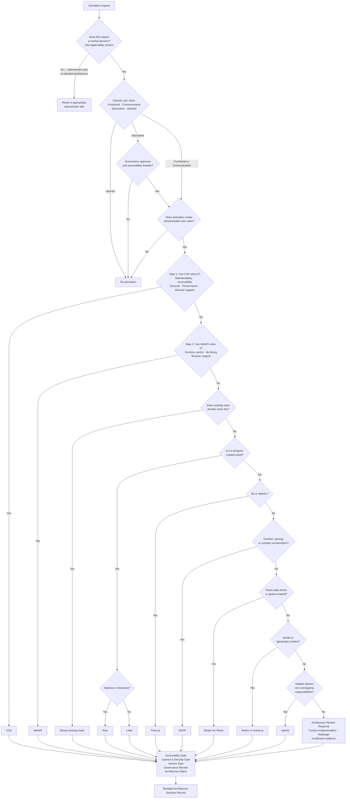

# Animation Router Skill

## Goal

Make animation architecture decisions before any code is written. This skill is the highest-level authority in the animation skill system and the **mandatory entry point for new animation decisions and material architectural changes**.

The Router governs:
- Whether animation should exist at all
- Whether CSS or WAAPI is sufficient
- Whether an existing library should be reused
- Whether a new dependency is justified
- Whether migration is preferable to new adoption
- Whether a hybrid architecture is required
- Whether accessibility blocks the proposal
- Whether governance blocks the proposal

Every downstream skill — debugging, migration, performance, accessibility — inherits the architectural decision produced here. A bad routing decision cannot be repaired cheaply downstream.

When evidence is insufficient to produce a reliable recommendation, the correct output is:

```
Recommendation: Insufficient evidence
Reason: [state what information is required before a decision can be made]
```

---

## When This Skill Applies

The Router is an **architecture decision point**, not a process gate for all animation work.

**Apply this skill when:**
- A new animation feature is being introduced
- An existing animation approach is being materially changed (different library, different rendering strategy, different accessibility model)
- A library is being added, replaced, or removed
- An architectural constraint changes (new SSR requirement, CSP change, new browser support target, governance update)
- A downstream skill requests routing because no prior decision exists

**Do not apply this skill when:**
- Fixing a bug within an already-decided animation architecture
- Optimising performance within the decided stack (use Animation Performance Skill)
- Remediating an accessibility issue within the decided approach (use Animation Accessibility Skill)
- Debugging behaviour within an existing implementation (use Animation Debugging Skill)
- Making a visual change (timing, easing, distance) that does not alter the architectural approach

**A routing decision remains valid until:**
- The animation requirement changes materially
- A major version change in the recommended library alters the capability claim that justified the recommendation
- The project's governance, approved stack, or accessibility policy changes
- A downstream skill identifies a technical blocker that invalidates the original decision

When a routing decision is re-triggered by a material change, document the prior decision in `Assumptions and Unknowns` and state what specifically changed.

---

## Primary Design Principle

**The Router exists to prevent unnecessary animation.**

Before evaluating any library, answer:

> Does this animation create demonstrable user value?

Value examples: user comprehension, visual hierarchy, interaction feedback, navigation clarity, attention guidance, state communication, error recovery signalling.

Not value: trendy motion, decoration without purpose, novelty, gratuitous animation, stakeholder preference.

### User Value Evidence Tiers

| Tier | Meaning | Router Action |
|---|---|---|
| **Measured** | Quantitative evidence that animation improves the target outcome | Proceed |
| **Evidence-supported** | Qualitative or UX research supports the value claim | Proceed |
| **Plausible but unvalidated** | Value is a reasonable inference with no current evidence | May proceed as a bounded, reversible pilot when accessibility, performance, and governance risks are low; flag as unvalidated |
| **None identified** | No user value case has been made | Recommend No animation |

If no demonstrable value exists:

```
Recommendation: No animation
Reason: Animation does not provide demonstrable user value for this requirement.
```

No animation is a first-class, correct outcome — not a failure state.

---

## User Value Classification

Every animation request must be classified before evaluation proceeds.

| Class | Definition | Router Action |
|---|---|---|
| **Functional** | Directly enables a user action — drag, reorder, transition between application states | Evaluate and route |
| **Communicative** | Conveys information — loading state, success/error feedback, visual hierarchy, attention guidance, state change | Evaluate and route |
| **Decorative** | Purely visual; no comprehension, feedback, or navigation benefit; content is equally accessible without it | Challenge the requirement; confirm no demonstrable value before proceeding |
| **Harmful** | Increases cognitive load, causes vestibular risk, distracts from primary content, or degrades accessibility | Recommend no animation; document reason |

**Decorative animation** may still proceed if all of the following are met: governance approves; accessibility impact is acceptable (no distraction, motion risk, or undue cognitive load); performance impact is acceptable; and user distraction risk is acceptable. The Router must flag it explicitly rather than treating it as Functional or Communicative.

**Harmful animation** — including autoplay content without pause controls, continuous looping motion with no off state, flicker above 3 Hz, or parallax applied to critical content — must be recommended against regardless of stakeholder preference.

---

## Return Format

Every routing response must use this **Standard Architecture Decision Record** in the order below.
Sections may be abbreviated when not applicable, but must be present with an explicit `N/A — [reason]` note.

```
# Animation Architecture Decision

## Recommendation
[CSS | WAAPI | GSAP | Motion for React | Motion | Three.js | Rive | Lottie | Anime.js | Hybrid | Custom implementation | Redesign | No animation | Insufficient evidence]

## Recommendation Confidence
[Confirmed | Likely | Possible | Unknown]
Reason: [what evidence supports this level, or what is missing]

## Reason
[Concise architectural justification — one to three sentences]

## Applicability
[New decision | Material change — describe what changed | Re-routing — describe the prior decision and what triggered re-routing]

## User Value Classification
[Functional | Communicative | Decorative | Harmful]
Basis: [what specific value is created, or why it is classified as Decorative or Harmful]

## Evidence Available
- [ ] Requirements described
- [ ] package.json or stack information provided
- [ ] Existing implementation inspected
- [ ] Measured behaviour available
- [ ] Accessibility constraints stated
- [ ] Governance constraints stated

## Architecture Review

### Business Value
[Does animation create demonstrable user value? What is it? Which value tier applies: Measured | Evidence-supported | Plausible but unvalidated | None identified. Or: No demonstrable value identified.]

### Technical Fit
[Does the recommended approach integrate with the framework, runtime, SSR constraints, and lifecycle model?]

### Accessibility
[prefers-reduced-motion, focus, keyboard, ARIA, pause controls, static fallback — what is required? Blocker or Concern?]

### Performance Risk
[Rendering pipeline impact, bundle cost, runtime cost, mobile risk — known or Unknown]

### Maintainability
[Improved | Neutral | Reduced | Unknown — framework fit, team familiarity, debuggability, upgrade burden]

### Governance Fit
[Approved | Requires Review | Blocked | Unknown — design system, platform policy, shared components]

### Dependency Impact
[New dependency | Existing dependency reused | No dependency — lifecycle, community, viability]

## Version and Package Gate
[State whether the recommendation depends on a specific library version. If the installed version is unknown, state what must be confirmed and why it matters for the implementation approach or API.]

## Accessibility Gate
[Pass | Concern | Blocker]
Pass: animation can be made fully accessible with deliberate implementation.
Concern: requires significant accessibility work; document what is required.
Blocker: animation cannot be made compliant without fundamental redesign; explain why.

## Licence and Security Gate
[Pass | Requires Review | Blocked]
[State licence type, WASM/CDN/CSP concerns, and any legal review requirements.]

## Architecture Blockers
Confirmed blockers: [None | list each confirmed blocker]
Unresolved gating risks: [None | list each unresolved risk that may become a blocker]
A confirmed blocker must be resolved before implementation proceeds. An unresolved gating risk must be evaluated before implementation proceeds.
Blocker types: Accessibility | Governance | Security | Browser support | Licensing | Runtime | Undefined responsibility

## Implementation Readiness
[Ready | Ready after required reviews | Not Ready | Insufficient Evidence]
Reason: [what is confirmed vs what remains unresolved]
Note: Recommendation confidence and implementation readiness are independent.
A recommendation may be Confirmed while readiness is Not Ready — e.g., the correct
library is clear but CSP, governance, or accessibility strategy is unresolved.

## Architecture Decision Matrix

| Dimension | Assessment | Evidence | Confidence | Open Issues |
|---|---|---|---|---|
| Capability fit | [Strong Fit | Fit | Partial Fit | Poor Fit] | | [High | Medium | Low | Unknown] | |
| Accessibility | [Strong Fit | Fit | Partial Fit | Poor Fit] | | [High | Medium | Low | Unknown] | |
| Performance | [Strong Fit | Fit | Partial Fit | Poor Fit] | | [High | Medium | Low | Unknown] | |
| Bundle impact | [Strong Fit | Fit | Partial Fit | Poor Fit] | | [High | Medium | Low | Unknown] | |
| Maintainability | [Strong Fit | Fit | Partial Fit | Poor Fit] | | [High | Medium | Low | Unknown] | |
| Governance | [Strong Fit | Fit | Partial Fit | Poor Fit] | | [High | Medium | Low | Unknown] | |
| Migration cost | [Strong Fit | Fit | Partial Fit | Poor Fit] | | [High | Medium | Low | Unknown] | |

## Rejected Options
[Each option considered and the specific reason it was rejected]

## Alternatives
[Viable alternatives with brief trade-off statement]

## Existing Stack Considerations
[Relevant dependencies already present — from package.json or stated context]

## Bundle Considerations
[Measured if available; otherwise Unknown. Bundle impact must be determined from the project's actual build — never estimated from static numbers.]

## Migration Impact
[None | Low | Medium | High]
Reason: [what triggers this classification]

## Governance Considerations
[Design system compatibility, accessibility requirements, approved animation stack, shared component impact, platform policies — Approved | Requires Review | Blocked | Unknown]

## Dependency Lifecycle
Maintainer activity: [Active | Reduced | Inactive | Unknown]
Evidence URL: [URL or Unknown]
Verification date: [date or Unknown]
Release frequency: [Regular | Irregular | Unknown]
Evidence URL: [URL or Unknown]
Verification date: [date or Unknown]
Community adoption: [Wide | Niche | Declining | Unknown]
Evidence URL: [URL or Unknown]
Verification date: [date or Unknown]
Long-term viability: [Strong | Acceptable | Questionable | Unknown]
Confidence: [High | Medium | Low | Unknown]
Note: Unknown is required when no current evidence URL and verification date can be provided. Do not state Active, Regular, Wide, or Strong without them.

## Hybrid Responsibility Scope
[If Hybrid recommended: state each library's explicit, non-overlapping responsibility and confirm the overlap check.
If not Hybrid: N/A]

## Assumptions and Unknowns
[All missing information affecting the confidence level or recommendation]

## Decision Validity
[Date of this decision and the conditions under which it remains valid — e.g., no major version change in the recommended library, no governance policy change, no new accessibility standard, no material requirement change.]

## Re-evaluation Triggers
[List the specific events that must trigger re-routing through this skill:]
- Major version upgrade of the recommended library that changes a capability claim
- Browser support policy change affecting a relied-upon native platform feature
- Accessibility policy change (organisational or standards-based)
- Security or CSP policy change
- Governance change (approved stack, design system, platform policy)
- New device-class or performance-budget requirement
- New or materially changed business requirement
- Dependency removed, deprecated, or found to have a known security issue
- Downstream skill identifies a technical blocker not present at decision time

## Definition of Done
The routing decision is complete only when:
- [ ] Animation value established (or No animation confirmed)
- [ ] User value classified
- [ ] Recommendation selected
- [ ] Confidence assigned with evidence basis
- [ ] Implementation readiness assigned
- [ ] Architecture blockers identified or confirmed None
- [ ] Rejected options documented
- [ ] Accessibility gate evaluated
- [ ] Licence and security gate evaluated
- [ ] Version and package gate evaluated
- [ ] Existing stack reviewed
- [ ] Governance reviewed
- [ ] Maintainability reviewed
- [ ] Migration impact reviewed
- [ ] Assumptions and unknowns documented
- [ ] Decision validity stated
- [ ] Re-evaluation triggers documented
```

---

## Warnings

- ❌ Never recommend a library when CSS or WAAPI can solve it adequately
- ❌ Never recommend GSAP by default — evaluate the requirement first
- ❌ Never recommend multiple libraries for the same responsibility
- ❌ Never skip the `prefers-reduced-motion` consideration
- ❌ Never recommend a library not already in the project's stack without evaluating bundle budget, governance, and maintainability
- ❌ Never recommend animation when no demonstrable user value exists
- ❌ Never state bundle sizes as fixed facts — direct to measurement from the project's actual build
- ❌ Never let developer preference override capability fit, accessibility, or governance
- ❌ Never trigger the Router for bug fixes, performance work, or accessibility remediation within an already-decided stack
- ❌ Never classify Decorative animation as Functional or Communicative to avoid scrutiny
- ❌ Never recommend animation classified as Harmful regardless of stakeholder preference
- ❌ Never assume a library API from general knowledge without confirming the installed version
- ❌ Never rely on historical Club GSAP assumptions. Verify the installed GSAP version, plugin availability, current official licence, and intended use. For GSAP 3.13+ the official package includes plugins that were historically Club-only; confirm from the installed version documentation, not from historical package knowledge.
- ⚠️ Existing dependencies influence the recommendation but do not override capability fit, accessibility, maintainability, performance, or business requirements — avoid lock-in
- ⚠️ A technically superior solution that significantly harms maintainability or governance is not a good recommendation
- ⚠️ Hybrid architectures are permitted when responsibilities are distinct and non-overlapping; they are not permitted when a single library already covers all requirements
- ⚠️ Version unknowns must be surfaced explicitly — API differences between major versions can invalidate implementation guidance

---

## Source of Truth Hierarchy

Source of truth is **claim-specific**. Different claims have different authoritative sources. No single hierarchy governs all decisions.

### Decision Priority

Requirements, preferences, and constraints are not a simple ranked stack. Apply this model:

**Business requirements define the desired outcome.**
What the feature must achieve for users and the business. This is the starting point for evaluation.

**Accessibility, security, legal, and mandatory governance requirements are non-negotiable release constraints.**
They are not weighted against business value. A proposal that violates any of them cannot proceed — regardless of business priority, stakeholder preference, or existing implementation. These are gates, not ranked trade-offs.

- Accessibility: WCAG, platform policy, and legal obligations
- Security: CSP, WASM policy, CDN policy, eval restrictions
- Legal: licence obligations, distribution requirements
- Mandatory governance: organisational policy that is enforced, not advisory

**Technical constraints define the feasible solution space.**
Performance budget, bundle limit, SSR model, browser support matrix. Solutions must operate within these constraints.

**Existing implementation and developer preference influence implementation choices only within the compliant, feasible solution space.**

| Layer | Role |
|---|---|
| Business requirements | Define the desired outcome |
| Accessibility, security, legal, mandatory governance | Non-negotiable release gates — not trade-offs |
| Technical constraints | Define the feasible solution space |
| Existing implementation | Evidence of what exists; not authority over what should |
| Developer preference | May inform implementation choices within the compliant space; must not determine them |

**Existing implementation is evidence, not authority.** It shows what currently exists. It does not override accessibility requirements, governance policy, security constraints, or business requirements. An existing implementation that violates accessibility or governance must be corrected, not preserved.

**Security constraints are release blockers.** A runtime, CDN dependency, or eval pattern that violates the deployment's security policy cannot proceed regardless of architectural preference or existing implementation.

### Claim-Specific Evidence Sources

The authoritative source depends on the type of claim being made.

| Claim Type | Authoritative Source |
|---|---|
| Capability ("CSS can/cannot do this") | Current CSS specification and browser support data for the project's browser support matrix — not general knowledge |
| Bundle impact | Project's actual build output from the affected route — not published package sizes or estimates |
| Accessibility | WCAG 2.2, the project's stated accessibility policy, and tested behaviour — not assumed requirements |
| Governance | Project's documented approved stack and platform policy — not team convention |
| Licence | Current official licence terms for the installed package version — not historical assumptions |
| Maintainer activity | Current repository activity, release history, and security posture — not reputation |

---

## Recommendation Confidence Model

Every recommendation must carry a confidence level.

| Confidence | Meaning | Required Evidence |
|---|---|---|
| **Confirmed** | Requirements, stack, environment, accessibility, and governance are all known; the recommendation is grounded in full context | All six evidence categories present and consistent |
| **Likely** | Most information is known; one or two unknowns are unlikely to change the recommendation | Requirements + stack + at least one of: implementation, accessibility, governance |
| **Possible** | Recommendation is based primarily on stated requirements; significant context is missing | Requirements only, or requirements + partial stack |
| **Unknown** | Insufficient information to produce a reliable recommendation | Missing requirements, unknown stack, or critical constraint unresolved |

**Rule:** The Router must not classify a recommendation as `Confirmed` unless requirements, stack, environment, accessibility, and governance are all known. When confidence is `Unknown`, output `Insufficient evidence` and state what is needed.

---

## Evidence Model

Recommendation confidence depends on the quality of available evidence.

| Evidence Type | What It Provides |
|---|---|
| Requirements described | What the animation must do and why |
| package.json or stack stated | What is already installed; what is approved |
| Existing implementation inspected | What patterns are already in use; what cleanup is needed |
| Measured behaviour available | Performance baselines, accessibility test results |
| Accessibility constraints stated | Reduced-motion policy, keyboard requirements, ARIA expectations |
| Governance constraints stated | Design system rules, platform policies, approved library list |

The Router must not recommend with more certainty than the evidence allows.

### Claim-Specific Evidence Requirements

The evidence required to support a recommendation depends on the claim being made.

| Claim | Minimum Evidence Required |
|---|---|
| CSS is sufficient | Requirements + CSS capability verification for the project's browser support matrix |
| WAAPI is sufficient | Requirements + browser support confirmation for the project's support matrix |
| Library X is required | Requirements + evidence that CSS/WAAPI cannot adequately cover the requirement |
| Library X is preferred over Library Y | Requirements + stack (to confirm what is installed) + capability comparison |
| Hybrid is required | Requirements + evidence that no single library covers all non-overlapping responsibilities |
| Migration is preferred | Existing implementation + capability assessment of current library + evidence of limitation |
| No animation | Requirements + user value assessment showing no measurable benefit |

---

## Native Platform Evaluation

Before evaluating any library, apply this evaluation in order. Libraries are only evaluated when the native platform cannot adequately serve the requirement.

### Step 1 — CSS

Can CSS solve this adequately while preserving maintainability, accessibility, lifecycle correctness, performance, and developer productivity?

**CSS can handle:**
- Entrance animations (fade, slide, scale) — `@keyframes` + `animation`
- Hover and focus transitions — `transition`
- Looping decorative animations — `animation: infinite`
- Scroll-driven reveals — `animation-timeline: view()` (verify browser support for the project's matrix before use)
- Intersection-based class toggle reveals — `IntersectionObserver` + CSS class
- State-driven visual changes — class toggling on state

**CSS may be insufficient when the requirement needs:**
- Scroll-pinned sections with complex multi-step orchestration (sticky positioning achieves pin-like behaviour; verify whether it satisfies the behaviour contract)
- Multi-element choreographed timelines with runtime control (pause, seek, reverse, dynamic reordering)
- 3D or WebGL rendering
- Physics-based spring animations
- Designer-created animated assets (Rive, Lottie)
- Complex gesture interactions (drag, swipe with momentum)
- Sequenced exit animations tied to component unmount (verify whether `@starting-style` or View Transitions satisfy the requirement before concluding CSS is insufficient)

The answer depends on the behaviour contract, lifecycle needs, orchestration complexity, and the project's supported browser matrix. Do not conclude CSS is insufficient without checking the relevant features against the project's browser support data.

**Modern CSS capabilities — verify browser support against the project's matrix before citing a limitation as absolute:**
- `animation-timeline: scroll()` and `animation-timeline: view()` — scroll-driven animations without JS scroll handlers
- `@starting-style` — entry animations for newly inserted elements
- `transition-behavior: allow-discrete` — animated `display` property changes
- View Transitions API — shared-element and page transitions (CSS-adjacent; not pure CSS)

### Step 2 — WAAPI (Web Animations API)

If CSS alone cannot serve the requirement but the requirement does not justify a library dependency, evaluate WAAPI:

- `element.animate()` — runtime-controlled keyframe animations with play, pause, cancel, and finish
- `document.timeline` / `ScrollTimeline` / `ViewTimeline` — programmatic timeline control
- Full `prefers-reduced-motion` support via `window.matchMedia()`
- Zero bundle cost — no dependency
- Browser support: `element.animate()` is broadly supported. `ScrollTimeline` and `ViewTimeline` have narrower support — verify against the project's browser support matrix before use.

**WAAPI can handle:**
- Programmatic play/pause/cancel on CSS-expressible animations
- Dynamically generated animations with runtime parameters
- Scroll-linked animations without library overhead (with `ScrollTimeline` where supported)
- Cleanup on component unmount without library teardown methods

**WAAPI cannot adequately handle:**
- Complex multi-step orchestrated timelines across many elements
- Scroll pinning
- Physics/spring animation
- Designer-created assets
- Gesture interactions with momentum

If WAAPI is sufficient → `Recommendation: WAAPI`

### Step 3 — Library

Only if CSS and WAAPI cannot adequately cover the requirement, proceed to library evaluation.

---

## Version and Package Gates

Many library recommendations depend on specific APIs, features, or behaviours introduced in particular versions. When the installed version is unknown or a recommendation depends on version-specific behaviour, this must be surfaced explicitly.

**Rule:** Never write implementation guidance that assumes a specific library version without stating the version dependency and flagging it if the installed version is unknown.

### Common Version Dependencies

| Library | Version-Sensitive Areas |
|---|---|
| GSAP | ScrollTrigger plugin availability; context cleanup API; reduced-motion media matching API; plugin tier availability (plugin access changed significantly with GSAP 3.13; do not rely on historical Club GSAP assumptions — verify available plugins and licence terms from the installed version documentation) |
| Motion for React | Package name changed from `framer-motion` to `motion/react` import in v11+; `useAnimate` availability; `layoutId` behaviour differs between major versions |
| Motion (vanilla) | `animate()` and `scroll()` API stability differs between v10 and v11; tree-shaking surface changed in v11 |
| Rive | Package variant matters: `@rive-app/canvas`, `@rive-app/react-canvas`, `@rive-app/webgl`; teardown method name (`cleanup()` vs `destroy()`) varies by version |
| Lottie | `lottie-web`, `@lottiefiles/dotlottie-web`, and `lottie-react` have different renderer APIs and import paths; do not assume one from another |
| Three.js | Public import paths, tree-shaking surface, and renderer availability vary by revision and bundler configuration; `WebGPURenderer` availability varies; minor releases can include breaking changes |

**Gate output format:**

```
## Version and Package Gate
Depends on: [library] — [specific feature or API]
Installed version: [from package.json, or Unknown]
Minimum required version: [state if known, or Unknown]
Risk if unknown: [what breaks or behaves incorrectly on a wrong version]
Action required: Confirm installed version from package.json before writing integration code.
```

---

## Accessibility Gate

Every recommendation must pass the Accessibility Gate before finalisation.

| Status | Meaning | Action |
|---|---|---|
| **Pass** | Animation can be made fully accessible with deliberate implementation | Document required accessibility measures in Architecture Review |
| **Concern** | Accessibility is achievable but requires significant work or design coordination | Document what is required; flag as a dependency for implementation |
| **Blocker** | Animation cannot be made compliant without fundamental redesign | Recommend No animation or request redesign; do not proceed with the proposal |

### Accessibility Blocker Triggers

The Accessibility Gate must be set to **Blocker** when:
- Autoplay content with essential information cannot provide a pause control (WCAG 2.2.2)
- Animation flickers above 3 Hz and cannot be reduced (WCAG 2.3.1)
- Critical interactive content is only operable through a gesture-driven animation with no keyboard path
- Animation is applied to text or controls that become unreadable during animation with no static fallback
- Looping motion cannot be disabled and causes vestibular risk with no feasible off state

### Accessibility Concern Triggers

The Accessibility Gate must be set to **Concern** when:
- `prefers-reduced-motion` implementation requires significant restructuring of the component architecture
- ARIA live regions require careful coordination with animation timing to prevent announcement races
- Focus management during animated transitions requires explicit design decisions
- Pause controls for decorative looping content require additional UI design

---

## Licence and Security Gate

Every recommendation introducing a new dependency must pass the Licence and Security Gate.

### Licence Classification

| Licence Type | Classification | Action |
|---|---|---|
| MIT, Apache 2.0, BSD | Open — standard permissive | Approved for most projects; confirm project policy |
| GSAP | Proprietary | Licence terms have changed across versions; verify current terms from the official GSAP licence at decision time against the installed version and intended use. Do not use historical licensing assumptions. |
| Rive Runtime | Open source runtime; editor subscription is separate | Confirm current runtime licence terms against project's commercial use |
| GPL / LGPL | Copyleft — may impose distribution obligations | Flag for legal review before adoption |
| Unknown | Unknown | Do not adopt without licence confirmation |

### Security Gate

| Concern | Trigger | Action |
|---|---|---|
| WASM execution | Rive runtime; any WASM-based library | Verify CSP compatibility for the chosen runtime variant and deployment model; confirm WASM hosting and caching policy |
| CDN dependency | Library loaded from a CDN at runtime | Confirm CDN policy; assess SRI hash requirement; assess availability risk |
| `eval()` or `new Function()` | Library using runtime code generation | Flag — blocked by strict CSP in most enterprise environments |
| WASM MIME type | WASM files in the project | Server must return `application/wasm`; confirm server configuration |

**Gate output format:**

```
## Licence and Security Gate
Licence: [type and classification]
Licence status: [Approved | Requires Review | Blocked | Unknown]
Security concerns: [list WASM, CDN, eval, SRI, MIME issues or None]
Security status: [Pass | Requires Review | Blocked]
Action required: [what must be confirmed before proceeding]
```

---

## Architecture Review Framework

Before selecting any library, evaluate all seven dimensions.

### 1. Business Value

- Does this animation create demonstrable user value?
- What specifically does it improve: comprehension, feedback, hierarchy, navigation, state communication?
- What is the cost of not animating?
- Is the value measured, evidence-supported, or plausible but unvalidated? (see User Value Evidence Tiers)

If no demonstrable value is identified → `Recommendation: No animation`

### 2. Technical Fit

- Does the approach integrate with the existing framework, runtime, and SSR constraints?
- Does it handle lifecycle correctly (mount, update, unmount, cleanup)?
- Does it support the required interaction model (declarative vs imperative)?
- Does it support TypeScript at the level the project requires?

### 3. Accessibility

Every recommendation must address:
- `prefers-reduced-motion` — required path for all motion
- Keyboard operation — animated interactions must not be mouse-only
- Focus management — animation must not hide, trap, or disrupt focus
- ARIA semantics — animated content must remain announced correctly
- Pause, stop, hide controls — required for looping or auto-playing content (WCAG 2.2.2)
- Static fallback — content must be accessible without animation

Classify the outcome using the Accessibility Gate: Pass, Concern, or Blocker.

### 4. Performance Risk

- What is the rendering pipeline cost (layout, paint, composite)?
- What is the bundle impact (new dependency vs existing)?
- What is the runtime cost on the target device class?
- Is mobile performance a known or unknown risk?

### 5. Maintainability

Evaluate as `Improved | Neutral | Reduced | Unknown`:

| Dimension | Assessment |
|---|---|
| Framework fit | Does it follow the framework's patterns naturally? |
| Team familiarity | Does the team know this library? |
| Debuggability | Are errors obvious? Is tooling good? |
| Upgrade burden | How frequently does the API break between versions? |
| Dependency lifecycle | Is the library actively maintained? |

A recommendation that reduces maintainability significantly requires explicit justification.

### 6. Governance Fit

Evaluate as `Approved | Requires Review | Blocked | Unknown`:

- Is the library on the project's approved animation stack?
- Does it comply with design system motion standards?
- Does it affect shared components or platform-level code?
- Are there platform policies (CSP, WASM, CDN, licensing) that constrain the choice?
- Does it require legal review (licence change)?

### 7. Dependency Impact

- Is this a new dependency or a reuse of an existing one?
- What is the maintainer activity level?
- What is the community adoption trajectory?
- What is the long-term viability?
- Does it introduce a WASM runtime, CDN dependency, or CSP constraint?

---

## Library Selection Criteria

### CSS Only — Choose When
- Any single-element transition or entrance can be expressed in keyframes or transitions
- No runtime control (pause, seek, reverse) is required
- No scroll pinning is required
- No exit lifecycle animation is required
- Reduced motion is handled via `@media (prefers-reduced-motion)`

**Bundle impact:** No new JavaScript dependency. CSS bytes, style calculation, and composite rendering cost still apply.

### WAAPI — Choose When
- CSS-expressible animation that requires programmatic play/pause/cancel control
- Dynamically parameterised animations without a full library dependency
- Project has no animation library installed and the requirement does not justify one
- Scroll-linked animation without ScrollTrigger-level orchestration

**Bundle impact:** No new JavaScript dependency — native browser API. Application code and runtime rendering cost still apply.

### GSAP — Choose When
- Complex multi-step timelines with sequencing and labels
- Scroll-triggered animations with ScrollTrigger
- Scroll-pinned sections
- Precise per-element orchestration across many elements
- SplitText, DrawSVG, MorphSVG, or Flip plugin requirements
- Already in the project's approved stack

**Version gate:** Confirm GSAP version from package.json. The context cleanup API, reduced-motion media matching API, and plugin availability are version-sensitive. Do not rely on historical Club GSAP assumptions — plugin access changed significantly with GSAP 3.13; verify available plugins, licence terms, and API requirements from the installed version documentation before writing any integration guidance.
**Bundle impact:** Verify from the project's actual build — core plus any plugins; varies by version and import scope

### Motion for React — Choose When
- React project with animations tied to state changes
- Drag and gesture interactions
- Exit animations on component unmount (`AnimatePresence`)
- Shared layout transitions between routes (`layoutId`)
- Spring physics animations
- Already in the project's approved stack

**Version gate:** Confirm whether the project uses `framer-motion` (pre-v11) or `motion` (v11+). The package and import path changed in v11; do not assume one from the other.
**Bundle impact:** Verify from the project's actual build — varies by import scope and version

### Motion (vanilla) — Choose When
- Non-React framework or vanilla JS context
- Scroll-linked animations with `scroll()`
- Simple `animate()` calls on DOM elements
- Intersection-based reveals with `inView()`
- Consistency with an existing Motion for React installation

**Version gate:** Confirm the installed `motion` version — API surface and tree-shaking behaviour differ between v10 and v11.
**Bundle impact:** Verify from the project's actual build — modular; import only what is used

### Three.js — Choose When
- 3D scenes requiring WebGL rendering
- Custom shaders or particle systems
- 3D model loading (GLTF/GLB)
- Canvas-based rendering that cannot be achieved with DOM or SVG

**Version gate:** Verify the installed Three.js revision, available public export paths, and bundler output before recommending an import strategy. Do not assume a fixed revision threshold for tree-shaking or renderer availability.
**Bundle impact:** Verify from the project's actual build — prefer named public imports from `"three"`; confirm tree-shaking with bundle analyser

### Rive — Choose When
- Designer-created file from the Rive editor (`.riv`)
- Interactive or stateful animation requiring a state machine
- Game-quality interactive graphics with branching states

**Version gate:** Confirm `@rive-app` package variant (`/canvas`, `/react-canvas`, `/webgl`) and version. Teardown method names vary by version; do not assume the method name.
**Licence and security gate:** Requires CSP compatibility verification for the chosen Rive runtime variant and deployment model; confirm WASM hosting and MIME type configuration.
**Bundle impact:** Verify from the project's actual build — includes WASM runtime; measure JS chunk and WASM separately

### Lottie — Choose When
- Designer-created file from After Effects (`.json`)
- Linear looping animation with no interactivity or state machine required
- Icon animations or splash screens

**Version gate:** Confirm whether the project uses `lottie-web`, `@lottiefiles/dotlottie-web`, or `lottie-react` — renderer APIs and import paths differ significantly between these packages.
**Bundle impact:** Verify from the project's actual build — renderer-specific builds reduce cost; verify import path against installed version

### Anime.js — Choose When
- Lightweight vanilla JS animation context
- Simple DOM animations without a framework
- SVG path animation
- MIT licence is a requirement and GSAP licence is a constraint
- Bundle minimisation is a priority and GSAP or Motion are not justified

**Bundle impact:** Verify from the project's actual build

### Hybrid — Choose When
- Multiple distinct, non-overlapping responsibilities are required
- No single library can adequately cover all responsibilities
- Each library's scope is explicit and does not overlap with the other
- Document scope boundaries in the `Hybrid Responsibility Scope` section

**Rule:** Never add a second library to handle something the first library already solves. Hybrid requires explicit scope boundaries for each library — see Hybrid Responsibility Model.

Valid hybrid examples:
- Three.js (rendering) + GSAP (choreography of Three.js object properties)
- Rive (asset runtime) + CSS (micro-interactions surrounding the canvas)
- GSAP (scroll orchestration) + Motion for React (component-level state transitions)

### No Animation — Choose When
- No demonstrable user value is identified
- The animation is classified as Decorative with no governance approval
- The animation is classified as Harmful
- The Accessibility Gate is Blocker and no compliant redesign is feasible
- The governance review blocks the proposal

### Custom Implementation — Choose When
- The requirement is well-defined but no existing library covers it adequately
- The capability gap is specific enough that a scoped, project-owned solution is more sustainable than adopting a library
- A library would be adopted solely to use a fraction of its surface area
- Bundle, licence, or governance constraints rule out all available libraries

### Redesign — Choose When
- The animation requirement cannot be met accessibly, securely, or within the approved governance model
- A blocker has no viable resolution within the current proposal
- The user value does not justify the technical, accessibility, or governance cost of the implementation
- The asset format or architecture is fundamentally incompatible with the project's constraints

### Insufficient Evidence — Choose When
- Requirements are unclear or contradictory
- Stack is unknown and the recommendation depends on it
- A critical accessibility or governance constraint is unresolved
- Confidence cannot exceed `Unknown`

---

## Hybrid Responsibility Model

When a hybrid architecture is recommended, each library must have an explicit, non-overlapping responsibility scope.

### Required for Every Hybrid Recommendation

```
## Hybrid Responsibility Scope
Library A: [name] — Responsible for: [explicit scope]
Library B: [name] — Responsible for: [explicit scope]
Overlap check: [confirm these responsibilities do not overlap]
Justification: [why no single library covers both responsibilities]
```

### Hybrid Validity Rules

- Each library in the hybrid must serve a responsibility that the other **cannot** cover with reasonable effort
- "Cannot cover" means: missing capability — not "less convenient" or "less preferred"
- If Library A can cover Library B's responsibility with minor adaptation, the hybrid is not justified
- A hybrid recommendation must document the specific capability gap that requires the second library

### Invalid Hybrid Patterns

| Pattern | Why Invalid |
|---|---|
| GSAP + Motion for React where GSAP already covers all scroll and state needs | If GSAP covers all requirements, Motion is not justified solely for syntax preference |
| CSS + GSAP where GSAP only handles a simple entrance animation | CSS can handle entrance animations; GSAP is not justified solely for this |
| Lottie + a second library to animate DOM elements the Lottie canvas does not own | Valid only if the DOM elements are genuinely outside the Lottie canvas and the second library's scope is explicit |

---

## Decision Tree



---

## Architecture Decision Matrix

Score each dimension before finalising the recommendation. Every row requires Assessment, Evidence, Confidence, and Open Issues. Without evidence, a matrix row is subjective. A `Poor Fit` in Accessibility, Governance, Security, or a critical Capability dimension is a blocker unless a redesign is explicitly approved.

| Dimension | Assessment Criteria | Strong Fit | Fit | Partial Fit | Poor Fit |
|---|---|---|---|---|---|
| **Capability fit** | | Covers all requirements natively | Covers requirements with minor adaptation | Covers most requirements; gaps manageable with documented compromise | Missing a critical requirement |
| **Accessibility** | | Full support natively | Achievable with deliberate implementation | Achievable with significant effort or redesign | Not achievable without fundamental change |
| **Performance** | | Compositor-friendly; no new bundle risk | Minor pipeline cost; acceptable bundle impact | Measurable cost; requires profiling to confirm acceptability | High pipeline cost; mobile risk; unjustified bundle growth |
| **Bundle impact** | | No new dependency | Existing dependency reused | New dependency; clearly justified by requirement | Significant new dependency; value does not justify cost |
| **Maintainability** | | Strong framework fit; team familiar; easy to debug | Acceptable fit; minor learning curve | Weak fit; significant learning curve or upgrade risk | Poor fit; long-term maintenance burden |
| **Governance** | | On approved stack; no review required | Compatible; minor confirmation required | Requires platform or design review | Blocked by policy |
| **Migration cost** | | No migration required | Minor adaptation of existing code | Partial migration of existing animation code | Full migration of existing animation code required |

**Rules:**
- Strong Fit requires direct project-context evidence.
- General library knowledge can support Fit confidence, not Strong Fit.
- Unknown is mandatory when package, browser, accessibility, performance, or governance evidence is missing.
- Do not average away a Poor Fit in a blocking dimension.

---

## Stack Awareness Rules

Existing dependencies influence the recommendation but do not override capability fit, accessibility, maintainability, performance, or business requirements.

1. If `motion` or `framer-motion` is already installed → prefer Motion for React or Motion, but only if they adequately cover the requirement
2. If `gsap` is already installed → prefer GSAP, but only if it adequately covers the requirement
3. If neither is installed → use CSS or WAAPI first; evaluate bundle cost, governance, and maintainability before adding any library
4. Never install a competing library when an installed one already solves the requirement
5. Never recommend staying with an existing library if it demonstrably cannot meet the requirement
6. When the installed version of a library is unknown, flag it in the Version and Package Gate before writing any implementation-specific guidance

---

## Migration Awareness

Before recommending a new library, evaluate whether migration from an existing one is preferable to adding a new dependency.

| Scenario | Preferred Action |
|---|---|
| GSAP is installed and covers the requirement | Reuse GSAP; do not add Motion |
| Motion is installed and covers the requirement | Reuse Motion; do not add GSAP |
| Existing library is partially capable | Evaluate whether the gap justifies migration, hybrid, or scoped addition |
| Existing library is unmaintained or causes a known problem | Migration may be justified; apply the Animation Migration Skill |
| No animation library is installed | CSS or WAAPI first; add a library only when clearly justified |

Migration impact classification:

| Level | Characteristics |
|---|---|
| **None** | No existing animation code is affected |
| **Low** | Isolated components affected; straightforward adaptation |
| **Medium** | Multiple components or a shared hook affected; cross-team coordination required |
| **High** | Platform-level animation code affected; full migration process required; use Animation Migration Skill |

---

## Governance Review

Governance must be evaluated before finalising any recommendation that introduces a new dependency or changes existing animation patterns.

| Gate | Outcome |
|---|---|
| Library is on the project's approved animation stack | Approved |
| Library requires design system motion token alignment | Requires Review |
| Library introduces a WASM runtime | Requires Review — confirm CSP and hosting policy |
| Library introduces a CDN dependency | Requires Review — confirm CDN policy |
| Library changes a licence | Requires Review — legal must confirm |
| Library is not on the approved stack | Requires Review — platform engineering must approve |
| Library is explicitly blocked by policy | Blocked |
| Policy is unknown | Unknown — state what must be confirmed before proceeding |

---

## Router Anti-Patterns

| Anti-Pattern | Why It Is Harmful |
|---|---|
| Adding GSAP for a hover animation | CSS handles it with no new JavaScript dependency and no library overhead |
| Skipping WAAPI evaluation between CSS and library | WAAPI provides runtime control with no new dependency; skipping it adds unjustified library cost |
| Adding Motion for React for a single fade-in | CSS or WAAPI is sufficient; library adds unjustified cost |
| Adding Rive for a simple SVG loop CSS can handle | Introduces WASM, CSP constraints, designer dependency, and bundle cost for no gain |
| Adding a second library when the first already covers the requirement | Dual-library cost, competing lifecycle models, maintenance burden |
| Recommending the same library regardless of requirement | Treats the Router as a library advocate; failure to evaluate |
| Recommending based on developer preference | Preference is lowest priority; must not override capability, accessibility, or governance |
| Introducing WebGL where CSS is sufficient | Massive bundle, GPU cost, and complexity for no user value |
| Adding animation with no identified demonstrable value | Harms accessibility, performance, and cognitive load |
| Recommending with Confirmed confidence when stack is unknown | Overconfidence; confidence must match evidence |
| Skipping the No animation evaluation | Normalises motion-by-default; harms accessibility and performance |
| Triggering the Router for bug fixes, optimisations, or accessibility remediation on a decided stack | Creates bureaucratic overhead; the Router is for new architecture decisions and material changes |
| Classifying Decorative animation as Communicative to avoid scrutiny | Misrepresents value; allows unjustified animation to proceed |
| Relying on historical Club GSAP plugin assumptions | Plugin access changed with GSAP 3.13; historical assumptions produce incorrect licence and dependency guidance — verify installed version |
| Assuming library API from general knowledge without confirming the installed version | API differs significantly between major versions; leads to incorrect implementation guidance |

---

## Router Quality Gates

The recommendation cannot be classified as `Confirmed` unless all of the following are satisfied:

- [ ] Animation value established (or No animation confirmed)
- [ ] User value classified (Functional / Communicative / Decorative / Harmful)
- [ ] Requirements are fully described
- [ ] Stack and existing dependencies are known
- [ ] Environment (framework, runtime, SSR) is known
- [ ] Accessibility gate evaluated (Pass / Concern / Blocker)
- [ ] Architecture blockers identified or confirmed None
- [ ] Implementation readiness assigned
- [ ] Licence and security gate evaluated
- [ ] Version and package gate evaluated
- [ ] Governance constraints have been reviewed
- [ ] Architecture Decision Matrix scored with evidence and confidence
- [ ] Rejected options documented
- [ ] Assumptions and unknowns listed
- [ ] Decision validity stated
- [ ] Re-evaluation triggers documented

If any gate is unresolved, reduce confidence to `Likely` or `Possible`, or output `Insufficient evidence`.

---

## Relationship to Downstream Skills

The Router decision is the input to all downstream skills. Each skill inherits the architectural decision produced here.

| Downstream Skill | What It Inherits from the Router |
|---|---|
| Animation Debugging | Library, lifecycle model, framework, expected behaviour |
| Animation Migration | Source library, target library, migration impact classification |
| Animation Performance | Library, device class, bundle strategy, rendering approach |
| Animation Accessibility | Reduced-motion policy, ARIA requirements, static fallback strategy |
| Animation Implementation | Library, approach, accessibility contract, lifecycle model |
| Custom Implementation | Explicit ownership contract, test strategy, lifecycle model, and maintenance responsibility must be defined before implementation begins |
| Redesign | Product, Design, and Accessibility review required before any implementation routing; the blocker that triggered the redesign recommendation must be documented and resolved |

**Routing protocol:**
- If a downstream skill receives a request **without** a prior Router decision, route through this skill before proceeding — unless the task is a bug fix, performance optimisation, or accessibility remediation on an established architecture.
- If a downstream skill identifies a technical blocker that the original Router decision did not account for (e.g., CSP blocks the recommended library, version mismatch invalidates the approach), re-route through this skill with the blocker documented.

---

## RTCF

**Role:** Senior animation architect, frontend platform engineer, accessibility reviewer, governance reviewer, and dependency specialist.

**Task:** Produce an Animation Architecture Decision for new animation work and material architectural changes. Apply the User Value Classification, Native Platform Evaluation (CSS → WAAPI → library), Architecture Review Framework, Version and Package Gate, Accessibility Gate, Licence and Security Gate, Decision Tree, and Architecture Decision Matrix before selecting any recommendation. Output the Standard Architecture Decision Record for every response.

**Constraints:**
- No animation is a valid and correct first-class outcome
- CSS is evaluated first; WAAPI is evaluated second; libraries are evaluated only when the native platform is inadequate
- Never recommend with more certainty than the evidence allows
- Never state bundle sizes as fixed facts — always direct to measurement from the build
- Never let developer preference override capability fit, accessibility, or governance
- Hybrid architectures are permitted when responsibilities are distinct and non-overlapping; they are not permitted when a single library covers all requirements
- Existing dependencies influence but do not determine the recommendation
- Accessibility, licence, and security gates must be evaluated for every recommendation
- Version dependencies must be surfaced explicitly and flagged when the installed version is unknown
- The Router is an architecture decision point, not a process gate for bug fixes, optimisations, or accessibility remediation within a decided stack

**Format:** Standard Architecture Decision Record for every response. Order: Recommendation → Recommendation Confidence → Reason → Applicability → User Value Classification → Evidence Available → Architecture Review → Version and Package Gate → Accessibility Gate → Licence and Security Gate → Architecture Blockers → Implementation Readiness → Architecture Decision Matrix → Rejected Options → Alternatives → Existing Stack Considerations → Bundle Considerations → Migration Impact → Governance Considerations → Dependency Lifecycle → Hybrid Responsibility Scope → Assumptions and Unknowns → Decision Validity → Re-evaluation Triggers → Definition of Done.

---

## Few-Shot Examples

---

### Example 1 — Simple Hover Animation

**Input:**
> I need to animate a button that bounces slightly when hovered.

**Output:**

```markdown
# Animation Architecture Decision

## Recommendation
CSS

## Recommendation Confidence
Likely
Reason: Requirements are clear and bounded. Stack is unknown; governance and
accessibility are straightforward for a single hover interaction. Providing
package.json would confirm whether an existing library should be reused for
project-wide consistency.

## Reason
A hover bounce is a single-element, trigger-based interaction. CSS keyframes
solve this natively with no new JavaScript dependency and full reduced-motion
support via @media.

## Applicability
New decision — no prior routing decision described for this component.

## User Value Classification
Communicative
Basis: Tactile feedback on an interactive element confirms interactivity and
improves perceived responsiveness. Bounded, demonstrable value.

## Evidence Available
- [x] Requirements described
- [ ] package.json or stack information provided
- [ ] Existing implementation inspected
- [ ] Measured behaviour available
- [ ] Accessibility constraints stated
- [ ] Governance constraints stated

## Architecture Review

### Business Value
Tactile feedback on an interactive element improves perceived responsiveness and
confirms interactivity. Value is bounded and demonstrable.

### Technical Fit
CSS keyframes are the native platform mechanism for this interaction. No lifecycle
complexity, no framework coupling, no cleanup required.

### Accessibility
Wrap the bounce keyframe in @media (prefers-reduced-motion: no-preference).
Button must be visually distinct and functional without the animation. No ARIA
changes required for a purely visual hover effect.

### Performance Risk
Expected risk: Low. Transform is generally compositor-friendly, but actual
compositing and paint behaviour depends on the element, browser, clipping,
filters, and layer state. No runtime measurement was provided.

### Maintainability
Neutral to Improved — CSS is maintainable by any frontend developer; no library
knowledge required; no upgrade burden.

### Governance Fit
Unknown — stack not provided. CSS additions are universally low-governance-risk.
Confirm whether design system motion tokens apply to hover timing.

### Dependency Impact
None — no new dependency.

## Version and Package Gate
N/A — CSS recommendation; no library version dependency.

## Accessibility Gate
Pass — prefers-reduced-motion is natively supported in CSS. Wrap bounce keyframe
in @media (prefers-reduced-motion: no-preference). No ARIA changes required for
a purely visual hover effect.

## Licence and Security Gate
N/A — no new dependency.

## Architecture Blockers
Confirmed blockers: None.
Unresolved gating risks: None identified for a CSS hover animation.

## Implementation Readiness
Ready after required reviews.
Confirmed: CSS approach, prefers-reduced-motion strategy, no dependency required.
Pending: design system motion tokens (if they exist); approved stack confirmation.

## Architecture Decision Matrix

| Dimension | Assessment | Evidence | Confidence | Open Issues |
|---|---|---|---|---|
| Capability fit | Strong Fit | CSS keyframes cover single-element hover bounce natively | High | None |
| Accessibility | Strong Fit | prefers-reduced-motion via @media natively supported | High | None |
| Performance | Strong Fit | transform generally compositor-friendly; verify with project profiler | Medium | Verify no layout trigger in project context |
| Bundle impact | Strong Fit | No dependency | High | None |
| Maintainability | Strong Fit | No library required; universally readable | High | None |
| Governance | Fit | CSS universally acceptable; design system tokens unknown | Medium | Confirm motion token policy |
| Migration cost | Strong Fit | No existing animation code described | High | None |

## Rejected Options
- WAAPI: Unnecessary for a hover state that does not require programmatic
  play/pause/cancel control.
- Motion for React: Overkill for a single hover state; adds bundle cost and
  framework coupling with no capability gain over CSS for this use case.
- GSAP: No orchestration, scroll, or sequencing requirement; unjustified dependency.

## Alternatives
- WAAPI (element.animate()): Zero-dependency runtime control if programmatic
  pause or cancel is later required — evaluate before adding any library.
- Motion for React whileHover: Only if the project already uses Motion for React
  and CSS is not preferred for cross-project consistency.

## Existing Stack Considerations
Unknown — provide package.json to confirm the installed stack. An existing animation
library is relevant context but does not change this recommendation. CSS is the
correct solution for a single hover bounce regardless of what is installed; using
a library solely for consistency would add unjustified cost and coupling for this
interaction.

## Bundle Considerations
No new JavaScript dependency. CSS bytes, parsing, style calculation, and composite
cost still apply but are minimal for a single keyframe rule.

## Migration Impact
None — no existing animation code affected.

## Governance Considerations
Unknown — CSS is universally low risk. Confirm approved stack and whether design
system motion tokens define hover timing values.

## Dependency Lifecycle
N/A — no new dependency.

## Hybrid Responsibility Scope
N/A — single-library recommendation.

## Assumptions and Unknowns
- Stack unknown — provide package.json to confirm the installed stack. The CSS
  recommendation stands regardless of what animation libraries are installed;
  a library is not justified for a single hover bounce.
- Framework unknown — implementation pattern differs across React, Vue, Svelte.
- Design system motion tokens unknown — bounce timing should align with approved
  motion values if they exist.

## Decision Validity
This decision is valid while the interaction requirement remains a single-element
hover animation with no programmatic runtime control, and while the CSS approach
satisfies the project's browser support matrix.

## Re-evaluation Triggers
- Interaction requirement changes (e.g., programmatic play/pause/cancel is needed)
- Design system motion token policy changes
- Governance introduces a constraint affecting the CSS approach
- Browser support policy changes in a way that affects the CSS features used

## Definition of Done
- [x] Animation value established
- [x] User value classified
- [x] Recommendation selected
- [x] Confidence assigned
- [x] Implementation readiness assigned
- [x] Architecture blockers identified (None)
- [x] Rejected options documented
- [x] Accessibility gate evaluated
- [x] Licence and security gate evaluated
- [x] Version and package gate evaluated
- [ ] Existing stack reviewed — requires package.json
- [ ] Governance reviewed — requires approved stack and design system confirmation
- [x] Maintainability reviewed
- [x] Migration impact reviewed
- [x] Assumptions and unknowns documented
- [x] Decision validity stated
- [x] Re-evaluation triggers documented
```

---

### Example 2 — Scroll Orchestration

**Input:**
> I'm building a React landing page. When the user scrolls into a features section, 6 feature cards should animate in with a stagger. The section should also pin while the cards animate in. There's also a parallax background.

**Output:**

```markdown
# Animation Architecture Decision

## Recommendation
GSAP (with ScrollTrigger)

## Recommendation Confidence
Likely
Reason: Requirements are detailed and the capability case is clear. Stack is
unknown; if Motion for React is already installed, the scroll pinning requirement
still points to GSAP or significant custom work. Governance unknown.

## Reason
Scroll-pinned sections, multi-element stagger sequences, and parallax together
require a scroll orchestration layer. GSAP ScrollTrigger is purpose-built for
this combination. The documented requirements exceed what CSS sticky positioning,
scroll-driven animations, and View Transitions can satisfy without substantial
custom orchestration. Motion for React has no pin equivalent.

## Applicability
New decision — no prior routing decision described for this page or section.

## User Value Classification
Communicative
Basis: Staggered card reveals create visual hierarchy and guide attention through
the features section. Pinning controls the pacing of information delivery.
Bounded, demonstrable value for a marketing landing page.

## Evidence Available
- [x] Requirements described
- [ ] package.json or stack information provided
- [ ] Existing implementation inspected
- [ ] Measured behaviour available
- [ ] Accessibility constraints stated
- [ ] Governance constraints stated

## Architecture Review

### Business Value
Staggered card reveals guide attention through the features section. Pinning
controls the pacing of information delivery. Bounded, demonstrable value.

### Technical Fit
GSAP ScrollTrigger is purpose-built for pinning, scrubbing, and multi-element
choreography. The appropriate React integration pattern (lifecycle hooks, context
cleanup, SSR guard) depends on the framework version and installed GSAP version —
confirm these before implementation. SSR requirements depend on the actual
framework in use.

### Accessibility
- The reduced-motion strategy must disable pinning, parallax, and staggered
  animation entirely. All cards must be visible and readable without animation.
- Pinned sections can disorient users with vestibular disorders; the pin must
  be disabled under reduced motion.
- Parallax background must be decorative only; no information conveyed through
  motion.
- The implementation pattern for reduced-motion detection depends on the installed
  GSAP version — verify before implementation.

### Performance Risk
Medium — ScrollTrigger adds JS-driven scroll execution; per-frame cost depends
on scrub frequency and tween complexity. Parallax adds per-frame transform
updates. Pin activation adds a layout step. Measure on a mid-range mobile device
before shipping.

### Maintainability
Neutral — GSAP is well-documented; ScrollTrigger pin and scrub lifecycle requires
understanding. Context cleanup lifecycle must be implemented; confirm the correct
pattern for the installed version from current GSAP documentation before writing
integration guidance.

### Governance Fit
Requires Review — GSAP licence terms must be verified from the official GSAP
licence at decision time for the installed version and intended use. Do not use
historical licensing assumptions. Confirm GSAP is on the approved stack.

### Dependency Impact
New dependency if GSAP is not installed. ScrollTrigger is included in the GSAP package; no separate install.
Maintainer activity and adoption: Unknown until verified using the required Dependency Lifecycle evidence fields.

## Version and Package Gate
Depends on: GSAP — context cleanup API, reduced-motion media matching API, plugin tier availability
Installed version: Unknown (package.json not provided)
Minimum required version: Unknown — verify from the current GSAP documentation for the installed version
Risk if unknown: Context cleanup and reduced-motion matching APIs are version-sensitive; incorrect version
assumptions produce runtime errors or missing behaviour.
Action required: Confirm installed GSAP version from package.json; verify minimum API requirements from
current GSAP documentation before writing integration guidance.

## Accessibility Gate
Concern — achievable but requires deliberate implementation.
The reduced-motion strategy must disable pinning, parallax, and staggered animation
entirely under prefers-reduced-motion: reduce. All cards must be visible and
readable without animation. Pinned scroll sections must not restrict content
access for users with vestibular disorders. The specific implementation pattern
depends on the installed GSAP version — confirm before implementation.

## Licence and Security Gate
Licence: GSAP — Proprietary. Licence terms must be verified from the official
GSAP licence at decision time for the installed version and intended use. Do not
use historical licensing assumptions.
Licence status: Requires Review — confirm current terms against this project's
commercial use.
Security concerns: None — no WASM, CDN, or eval dependency.
Security status: Pass (pending licence confirmation).
Action required: Verify current GSAP licence terms before proceeding.

## Architecture Blockers
Confirmed blockers: None.
Unresolved gating risks:
- Licence compatibility — GSAP licence terms not yet verified for this project's commercial use.
- Governance approval — GSAP not confirmed on the approved animation stack.
- Installed-version compatibility — GSAP version below the minimum required for the needed lifecycle and reduced-motion APIs; verify from current GSAP documentation before implementation.

## Implementation Readiness
Not Ready — several prerequisites unresolved.
Required before implementation:
- GSAP version confirmed from package.json
- GSAP licence verified
- Stack confirmed (is GSAP already installed?)
- Governance approval
- Reduced-motion accessibility strategy validated

## Architecture Decision Matrix

| Dimension | Assessment | Evidence | Confidence | Open Issues |
|---|---|---|---|---|
| Capability fit | Strong Fit | Pin, stagger, parallax are native ScrollTrigger capabilities | High | None |
| Accessibility | Fit | Achievable with deliberate reduced-motion implementation; confirm the correct pattern for the installed GSAP version | Medium | Reduced-motion strategy must be validated |
| Performance | Fit | JS-driven scroll; acceptable with profiling | Medium | Mobile performance unvalidated — measure on representative device |
| Bundle impact | Fit | New dependency; justified by scroll orchestration requirement | Medium | Bundle size unknown — measure from actual build |
| Maintainability | Fit | GSAP well-documented; lifecycle cleanup required | Medium | GSAP version must be confirmed |
| Governance | Requires Review | Licence terms and approved stack unknown | Low | Licence verification and stack approval required |
| Migration cost | Unknown | Existing code context not provided | Unknown | Confirm existing animation code before classifying |

## Rejected Options
- CSS scroll-driven timelines: The documented requirements — scroll pinning,
  multi-element stagger with runtime orchestration, and parallax — exceed what
  CSS sticky positioning, scroll-driven animations, and View Transitions can
  satisfy without substantial custom orchestration. Verify against the project's
  browser matrix and consider whether a simplified version of the requirements
  changes this assessment.
- Motion for React whileInView: No pin support; stagger is limited; parallax
  requires custom scroll binding that replicates ScrollTrigger behaviour.
- WAAPI: No pin support; ScrollTimeline lacks the orchestration needed for
  multi-element stagger and pinning at this complexity.
- Hybrid (Motion for React + custom pin): Replicating pin behaviour is
  significant custom engineering; not justified when GSAP covers it natively.

## Alternatives
- CSS + IntersectionObserver (stagger only, no pin): Viable if the pin requirement
  is removed; lower complexity and no new dependency cost.

## Existing Stack Considerations
Unknown — provide package.json. If GSAP is already installed, this is a reuse
decision. If Motion for React is installed without GSAP, the pin requirement
still requires GSAP or a custom solution.

## Bundle Considerations
Unknown — measure GSAP core + ScrollTrigger from the project's actual production
build. Do not estimate from static figures; cost varies by version, bundler, and
import configuration.

## Migration Impact
Unknown — depends on whether existing scroll or animation code must be adapted.

## Governance Considerations
Requires Review:
- GSAP licence — verify current terms at decision time; do not use historical
  licensing assumptions.
- Confirm GSAP is on the approved animation stack.

## Dependency Lifecycle
GSAP: Maintainer activity — Unknown without current evidence; verify from repository.
Release frequency — Unknown; verify from release history.
Community adoption — Unknown; verify from current sources. Do not restate past observations.
Long-term viability — Unknown without current evidence.
Confidence: Unknown — verify all lifecycle claims before stating. Do not fabricate.

## Hybrid Responsibility Scope
N/A — single-library recommendation.

## Assumptions and Unknowns
- Stack unknown — confirm whether GSAP is already installed.
- GSAP version unknown — confirm from package.json; verify API availability
  against current documentation before writing integration guidance.
- GSAP licence unknown — verify current terms at decision time.
- SSR context unknown — integration pattern depends on the actual framework and version.
- Mobile performance not validated — must be tested on a representative device.
- Governance approval unknown.

## Decision Validity
This decision is valid while the documented requirements — scroll pinning, staggered
reveal, and parallax — remain unchanged, and while GSAP ScrollTrigger covers them
adequately under the installed version and approved licence terms.

## Re-evaluation Triggers
- GSAP major version upgrade that changes the scroll orchestration or lifecycle API
- Pin requirement removed from the feature spec (CSS may then suffice)
- Governance policy change (stack approval, licence change)
- New accessibility standard that changes the reduced-motion obligation
- Security or CSP policy change affecting the deployment
- New scroll or interaction requirement that GSAP cannot cover

## Definition of Done
- [x] Animation value established
- [x] User value classified
- [x] Recommendation selected
- [x] Confidence assigned
- [x] Implementation readiness assigned
- [x] Architecture blockers identified
- [x] Rejected options documented
- [x] Accessibility gate evaluated
- [x] Licence and security gate evaluated
- [x] Version and package gate evaluated
- [ ] Existing stack reviewed — requires package.json
- [ ] Governance reviewed — requires licence verification and stack approval
- [x] Maintainability reviewed
- [ ] Migration impact reviewed — requires existing code context
- [x] Assumptions and unknowns documented
- [x] Decision validity stated
- [x] Re-evaluation triggers documented
```

---

### Example 3 — Designer Asset with State Machine

**Input:**
> We have a .riv file from our designer with a loading spinner that has idle, loading, and success states.

**Output:**

```markdown
# Animation Architecture Decision

## Recommendation
Rive

## Recommendation Confidence
Likely
Reason: File format and state machine requirement are confirmed by the asset type.
Stack, CSP policy, and governance are unknown. These are unlikely to change the
recommendation — only Rive can run .riv files — but must be verified before
implementation begins.

## Reason
A .riv file with multiple states requires the Rive runtime to play. No other
library can run .riv files or drive their state machines. This is a format-determined
requirement: Rive is required to run the supplied .riv asset. The user experience
could be rebuilt using other tools, but only at the cost of replacing the asset
entirely — that is a redesign, not an alternative approach to the same asset.

## Applicability
New decision — no prior routing decision described for this component.

## User Value Classification
Communicative
Basis: A state machine spinner communicates loading and success states with
smooth, designer-controlled transitions. Bounded value: replaces a static
indicator with a richer, brand-aligned interactive asset.

## Evidence Available
- [x] Requirements described
- [ ] package.json or stack information provided
- [ ] Existing implementation inspected
- [ ] Measured behaviour available
- [ ] Accessibility constraints stated
- [ ] Governance constraints stated

## Architecture Review

### Business Value
A state machine spinner communicates loading and success states with smooth,
designer-controlled transitions. Bounded value: replaces a simpler CSS spinner
with a richer, brand-aligned interactive asset.

### Technical Fit
@rive-app/react-canvas (React) or @rive-app/canvas (vanilla) loads the .riv
file and drives the state machine via inputs. Package variant and version must
be confirmed from package.json before writing any integration code.

### Accessibility
- Canvas accessibility semantics depend on the asset's role in the interface.
  Classify the asset before selecting a strategy:
  - Decorative: no accessible semantics required; hide from assistive technology.
  - Status-indicating (loading/success): a stable, visually-hidden DOM element
    conveying the current state is more robust than annotating the canvas element.
  - Informational: an accessible text alternative is required.
  - Interactive: full keyboard and ARIA interaction model required.
- Under prefers-reduced-motion: reduce, pause the animation and ensure the
  content's status or information is conveyed without motion.
- Rive runtime instance must be cleaned up on component unmount — teardown method
  name varies by @rive-app version; do not assume the method name.
- The appropriate accessibility strategy must be defined during accessibility review,
  not prescribed by the Router.

### Performance Risk
Medium — WASM runtime adds network and parse cost; CSP must allow WASM execution.
Canvas must be scaled for devicePixelRatio. Measure on the target device class
before shipping.

### Maintainability
Neutral — Rive runtime is actively maintained; state machine changes require
designer involvement; WASM teardown lifecycle requires explicit handling verified
against the installed version.

### Governance Fit
Requires Review — WASM execution requires CSP policy confirmation; Rive runtime
licence must be confirmed; WASM hosting policy must be confirmed.

### Dependency Impact
New dependency if @rive-app is not installed. WASM runtime is a separate loading concern from the JS bundle.
Maintainer activity and adoption: Unknown until verified using the required Dependency Lifecycle evidence fields.

## Version and Package Gate
Depends on: @rive-app — package variant and teardown method
Installed version: Unknown (package.json not provided)
Variant required: @rive-app/react-canvas for React; @rive-app/canvas for vanilla
Teardown method: Varies by @rive-app version — confirm from installed version
documentation; do not assume method name.
Risk if unknown: Wrong variant causes import errors; wrong teardown method causes
memory leaks.
Action required: Confirm @rive-app package variant and version from package.json
before writing integration code.

## Accessibility Gate
Concern — achievable, but requires an explicit accessibility strategy:
- Canvas accessibility semantics must be defined based on the asset's role:
  this spinner is status-indicating (loading/success). A stable, visually-hidden
  DOM status element is recommended over annotating the canvas directly.
  Do not prescribe role="img" or aria-live without validating the strategy against
  the accessible implementation and assistive technology behaviour.
- prefers-reduced-motion: pause animation or replace with a static status indicator.
Coordination with the design and accessibility teams required before implementation.

## Licence and Security Gate
Licence: Rive Runtime — open source (MIT); Rive editor subscription is separate
from runtime licensing and does not affect runtime use.
Licence status: Requires Review — confirm runtime licence terms against the
project's commercial use requirements.
Security concerns:
- WASM execution: Rive runtime uses WASM; verify CSP compatibility for the
  chosen runtime variant and deployment model.
- WASM hosting: confirm local vs CDN hosting policy.
- MIME type: server must return application/wasm for .wasm files.
Security status: Requires Review — CSP compatibility and WASM hosting must be confirmed.
Action required: Verify CSP compatibility for the chosen Rive runtime and deployment
model; confirm WASM hosting and MIME type configuration with the platform team.

## Architecture Blockers
Confirmed blockers: None.
Unresolved gating risks:
- Security — CSP may be incompatible with the Rive runtime for this deployment model; if confirmed and no policy exception is granted, the CSS fallback becomes required.
- Governance — WASM hosting policy or licence terms may block adoption.
- Runtime — if @rive-app cannot be installed (dependency conflict, policy), the asset cannot be run; a CSS redesign is required.

## Implementation Readiness
Not Ready — several prerequisites unresolved.
Required before implementation:
- CSP compatibility confirmed for the chosen Rive runtime and deployment model
- @rive-app package variant and version confirmed from package.json
- WASM hosting and MIME type confirmed with platform team
- Accessibility strategy defined with accessibility and design teams
- Rive runtime licence confirmed against project's commercial use

## Architecture Decision Matrix

| Dimension | Assessment | Evidence | Confidence | Open Issues |
|---|---|---|---|---|
| Capability fit | Strong Fit | Rive is required to run the supplied .riv asset | High | None — asset format determines this |
| Accessibility | Fit | Achievable with defined strategy; semantics depend on asset role | Medium | Accessibility strategy must be defined with accessibility team |
| Performance | Fit | WASM cost is measurable; CSP and caching must be confirmed | Medium | WASM network cost unknown; CSP unknown |
| Bundle impact | Fit | New dependency; format-determined; no alternative to running this asset | Medium | Bundle size unknown — measure from actual build |
| Maintainability | Fit | Designer dependency for asset changes; teardown must be version-verified | Medium | @rive-app version unknown |
| Governance | Requires Review | WASM, CSP, and licence unknown | Low | CSP, WASM hosting, and licence must be confirmed |
| Migration cost | Strong Fit | No existing animation described for this component | High | None |

## Rejected Options
- Lottie: Cannot play .riv files or drive Rive state machines.
- CSS: Cannot play .riv files; the state machine behaviour requires the Rive runtime
  or a full redesign of the asset.
- GSAP: Cannot play .riv files.

## Alternatives
- CSS spinner + JS state toggling: Only if the .riv asset is unavailable or if
  Rive is blocked by governance or CSP. Requires a full design replacement.
- Lottie with After Effects export: Only if the designer re-exports the asset as
  a .json file and a branching state machine is not required.

## Existing Stack Considerations
Unknown — if @rive-app is already installed, verify the variant and version
before writing integration code. If Lottie is installed, it cannot be reused
for a .riv file.

## Bundle Considerations
Unknown — measure @rive-app JS chunk and WASM file separately from the project's
actual build. WASM is loaded at runtime and may be cached independently; confirm
hosting and caching strategy with the platform team.

## Migration Impact
None — no existing animation described for this component.

## Governance Considerations
Requires Review:
- WASM execution: verify CSP compatibility for the chosen Rive runtime variant
  and deployment model.
- Rive runtime licence: confirm against the project's commercial use terms.
- WASM hosting: confirm CDN vs local hosting policy.
- MIME type: confirm server returns application/wasm for .wasm files.

## Dependency Lifecycle
@rive-app: Maintainer activity — Unknown without current evidence; verify from repository.
Release frequency — Unknown; verify from release history.
Community adoption — Unknown; verify from current sources. Do not restate past observations.
Long-term viability — Unknown without current evidence.
Confidence: Unknown — verify all lifecycle claims before stating. Do not fabricate lifecycle claims.

## Hybrid Responsibility Scope
N/A — single-library recommendation.

## Assumptions and Unknowns
- @rive-app installed version and variant unknown — verify before writing
  integration code; teardown method name varies by version.
- CSP policy unknown — WASM execution may be blocked.
- State machine input names unknown — required for integration code.
- Framework unknown — React uses @rive-app/react-canvas; vanilla uses
  @rive-app/canvas.
- Reduced-motion fallback design unknown — confirm static frame or CSS fallback
  with the design team.

## Decision Validity
This decision is valid while the .riv asset remains the design team's intended
deliverable and while CSP, governance, and licence constraints permit the Rive runtime.

## Re-evaluation Triggers
- CSP policy confirmed incompatible with the Rive runtime and no exception granted (CSS redesign becomes required)
- @rive-app major version change that alters the teardown or state machine API
- .riv asset replaced with a different format (Lottie, SVG, CSS)
- Governance or licence policy change blocking the runtime
- Security policy change affecting WASM deployment
- Accessibility policy change that alters the canvas interaction model requirement

## Definition of Done
- [x] Animation value established
- [x] User value classified
- [x] Recommendation selected
- [x] Confidence assigned
- [x] Implementation readiness assigned
- [x] Architecture blockers identified
- [x] Rejected options documented
- [x] Accessibility gate evaluated
- [x] Licence and security gate evaluated
- [x] Version and package gate evaluated
- [ ] Existing stack reviewed — requires package.json
- [ ] Governance reviewed — requires CSP and licence confirmation
- [x] Maintainability reviewed
- [x] Migration impact reviewed
- [x] Assumptions and unknowns documented
- [x] Decision validity stated
- [x] Re-evaluation triggers documented
```
