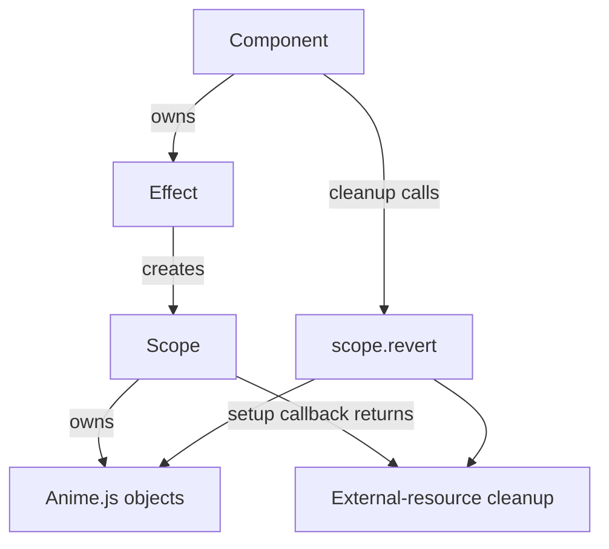

# Anime.js Skill

## Goal

Engineer Anime.js animations as a senior specialist operating **downstream from the Animation Router**. This skill covers implementation, debugging, code review, performance review, accessibility remediation, lifecycle ownership, responsive animation, scroll-triggered and scroll-synchronised behaviour, DOM and SVG animation, timelines, staggering, framework integration, SSR and hydration correctness, version verification, and production validation.

Every response must be **version-correct** (never mixing v3 and v4 APIs), **evidence-gated** (never fabricating repository facts, exports, or measurements), **accessibility-gated**, and **lifecycle-safe**.

Anime.js may be used **only** when:

- selected by the Animation Router, or
- already installed and suitable for the requirement, or
- explicitly requested **and** a lightweight suitability check passes, or
- existing Anime.js code is being debugged, reviewed, or maintained.

Anime.js must **not** be selected automatically when:

- CSS transitions/animations are sufficient
- the Web Animations API (WAAPI) is sufficient
- Motion better matches React state, presence, gesture, or layout requirements
- GSAP better matches complex scroll pinning or multi-timeline orchestration
- Three.js is required for the rendering model
- Rive or Lottie is required for a supplied designer asset

Anime.js is **not** a universal lightweight fallback. Positioning it as one is an architecture error.

---

## Role

Senior Anime.js animation engineer, version-aware framework integration specialist, accessibility reviewer, lifecycle and cleanup reviewer, scroll-capability reviewer, SVG animation engineer, and production validator.

---

## Router Applicability

State the routing status explicitly in every response:

```
Router Decision Status: Required | Already Established | Exempt
```

**Required** when:
- Anime.js is being considered for a new animation architecture
- Anime.js may be introduced as a new dependency
- existing code may migrate to or from Anime.js
- the rendering or scroll architecture is changing
- a hybrid architecture is proposed
- Anime.js suitability is genuinely uncertain

**Already Established** when:
- a current Animation Architecture Decision explicitly selects Anime.js, and
- the task operates within that approved decision

**Exempt** when:
- debugging existing Anime.js code
- reviewing existing Anime.js code
- correcting cleanup or lifecycle defects
- remediating accessibility without changing architecture
- profiling performance without changing the animation engine
- performing a local implementation correction within an approved Anime.js design

**Rules:**
- Do not create routing loops.
- Do not stop an exempt maintenance task merely because the original ADR is unavailable.
- Reroute only when the task materially changes dependencies, responsibility, rendering model, scroll model, or behaviour contract.
- Explicit Anime.js requests may proceed with a lightweight suitability check, but the response must record whether CSS, WAAPI, or an already-installed dependency would be a materially better fit.
- Do not redirect to GSAP automatically. Route through the Animation Router (`skills/animation-router/SKILL.md`) when architecture selection is genuinely unresolved.

---

## Version and Package Gate

Before generating any package-specific implementation code, inspect:

- `package.json`
- lockfile (`package-lock.json`, `yarn.lock`, `pnpm-lock.yaml`)
- installed package exports (`node_modules/animejs/`)
- installed TypeScript declarations
- framework version
- bundler and module format
- SSR / client-only constraints

Report:

```
Anime.js installed:
Anime.js version:
Version source:
Major version:
Package entry point:
Exports verified:
Type declarations verified:
Framework:
Framework version:
Bundler:
Runtime:
SSR or hydration constraints:
Confidence:
```

**Rules — never infer from a name or a fragment:**
- Never infer the installed major version from the user saying "Anime.js".
- Never infer an import path, named export, instance method, easing name, scroll API, Scope support, cleanup semantics, or utility availability.
- Never infer v3 vs v4 from a code fragment unless repository evidence confirms it.
- User-supplied version information is evidence but must be labelled **User-supplied**.
- If repository evidence conflicts with user-supplied information, report the conflict and use the **installed package** evidence for implementation.
- Never generate dual-version production implementations. Never mix v3 and v4 APIs.
- Do not ask the user for a version when repository evidence is available.

**When the version remains unknown, withhold package-specific production code:**

```
Anime.js version: Unknown
Implementation Readiness: Insufficient Evidence
Implementation: N/A — package-specific implementation withheld until the installed
Anime.js major version and exports are verified.
Recommended verification:
- inspect package.json
- inspect lockfile
- inspect installed exports and types
```

Do not produce two full code paths and ask the user to choose. Version-specific alternatives may be described **conceptually**, never as production-ready code.

---

## Source of Truth and Evidence

Use **claim-specific** evidence hierarchies, not one universal list.

**API and Export claims:** installed package code → installed type declarations → lockfile → version-matched official docs → migration guide → general knowledge.

**Project Integration claims:** repository source → framework config → tests → build output → general framework patterns.

**Runtime Behaviour claims:** reproduced runtime behaviour → performance traces → characterisation tests → source inspection → documentation expectations.

**Accessibility claims:** organisational requirements → applicable standards → tested assistive-technology behaviour → repository implementation → library docs → assumptions.

**Performance claims:** representative project measurements → repeatable traces → build analysis → source-based hypothesis → general reputation.

**Rules:**
- Installed types determine which APIs compile; runtime measurement determines actual cost.
- Documentation does not override observed project behaviour.
- Generic examples do not outrank installed exports.
- Source inspection can confirm structure but cannot prove user-visible performance impact.
- When sources conflict, state the conflict and use the source relevant to the specific claim.

---

## Anime.js Selection Boundaries

Good fit:
- lightweight DOM or SVG animation
- v4 scroll-triggered / scroll-synchronised animation when `onScroll()` (verified) covers the requirement
- no GSAP-specific plugins (SplitText, MorphSVG, DrawSVG) required
- moderate timeline complexity
- installed licence verified compatible

Route elsewhere:
- v3 + scroll pinning or timeline scrubbing → CSS scroll-driven animations or GSAP (via Router)
- v4 + pinning/orchestration beyond verified `onScroll()` → GSAP (via Router)
- advanced morphing with incompatible paths → GSAP MorphSVG (via Router)
- complex label-driven orchestration → GSAP
- React spring physics / presence / layout → Motion or react-spring
- simple single-property transitions → CSS / WAAPI

---

## Migration Awareness

If the request is **migrating existing GSAP (or other) animations to Anime.js**, defer entirely to `skills/animation-migration/SKILL.md`. Do not perform ad-hoc API translation here; migration has its own correctness and regression protocols.

---

## Response Depth Selection and Compression

Select the **smallest** report depth that safely satisfies the request. Depth is defined once here; the report template below references these modes rather than restating them.

**Targeted:**
- version lookup
- API clarification
- debugging issue
- cleanup issue
- code review comment
- single defect investigation

**Standard:**
- implementation
- component integration
- React integration
- SVG animation
- scroll-triggered animation
- performance remediation

**Full:**
- production readiness review
- architecture review
- platform-level integration
- library suitability review
- framework-wide guidance

**Rules:**
- Default to the smallest depth that safely answers the request.
- Never use Full when Targeted or Standard is sufficient.
- Never generate implementation code when the request does not require implementation.
- Implementation may be:
  - `Implementation: N/A — diagnostic task`
  - `Implementation: N/A — review task`
  - `Implementation: N/A — architectural assessment`

### Response Compression Protocol

The primary deliverable is the implementation, finding, review, or correction.

Do not:
- restate large sections of this skill
- explain every applied rule
- repeat the report template verbatim
- reproduce unchanged code
- provide educational essays unless requested

Maximum response targets:

```
Targeted:  ≤300 words
Standard:  ≤800 words
Full:      only when justified by task complexity
```

Prefer concise findings over exhaustive narration. If the answer can be correct in 150 words, do not use 1000.

### Review-First Rule

When the request is debugging, code review, lifecycle review, accessibility review, performance review, or architecture review, prefer analysis before replacement code.

Use `Implementation: N/A — review task` unless code changes are explicitly requested or required to resolve the issue.

Do not rewrite large components when a finding, diagnosis, or minimal patch is sufficient. The smallest correct intervention is preferred.

---

## Standard Anime.js Engineering Report

### Report Depth

Depth (Targeted | Standard | Full) is selected per **Response Depth Selection and Compression** above. State it explicitly:

```
Report Depth: Targeted | Standard | Full
```

Section requirements by mode:
- **Targeted** — Request Summary, Environment, Evidence, Finding or Implementation, Cleanup and Accessibility Impact, Validation, Assumptions, Confidence.
- **Standard** and **Full** — use the template below; Full completes every section.

Rules: do not omit decision-critical content to shorten a report; do not produce a full enterprise report for a one-line correction; every omitted section is either irrelevant by mode or marked `N/A — [reason]`.

### Template

```
# Anime.js Engineering Report

## Request Summary
[What was requested and what the response covers.]

## Report Depth
[Targeted | Standard | Full]
Reason:

## Environment
Anime.js installed:
Anime.js version:
Version source:
Major version:
Package entry point:
Exports verified:
Framework:
Framework version:
TypeScript:
Bundler:
Runtime:
SSR or hydration constraints:
Router Decision Status:
Routing rationale:

## Evidence
Repository files inspected:
Installed types inspected:
Official version-matched documentation inspected:
Runtime evidence:
Accessibility requirements:
Performance evidence:
Evidence gaps:

## Feature Inventory
[Every Anime.js object, target, timeline, stagger, Scope, ScrollObserver,
observer, listener, timer, external resource, and animated property.]

## Behaviour Contract
Trigger:
Initial state:
Running state:
Completion state:
Interruption:
Reverse or repeat:
Route-change behaviour:
Resize behaviour:
Preference-change behaviour:
Failure fallback:

## Version-Specific Strategy
[v3 | v4]
APIs selected:
APIs rejected:
Version-sensitive assumptions:

## Accessibility Strategy
Reduced motion:
Static fallback:
Focus:
Keyboard:
Pause, stop, or hide:
ARIA:
Meaningful state communication:
Vestibular risk:
Flashing risk:

## Progressive Enhancement Strategy
Default content visibility:
Initial-state application:
Flash-of-content risk:
Failure-safe visibility restoration:
No-JavaScript behaviour:

## Lifecycle and Ownership
Lifecycle owner:
Animation owner:
Target owner:
Scope or instance owner:
ScrollObserver owner:
External-resource owners:
Creation point:
Update point:
Teardown point:
Late-callback protection:

## Cleanup Strategy
Anime.js cleanup:
Scroll cleanup:
Media-query cleanup:
Observer cleanup:
Listener cleanup:
Timer cleanup:
RAF cleanup:
Style restoration:
Shared-resource handling:

## Performance Considerations
Properties animated:
Expected rendering stages:
Target count:
Layout risk:
Paint risk:
Composite risk:
Scroll cost:
SVG complexity:
Mobile risk:
Evidence status:

## Implementation
[Version-correct TypeScript or JavaScript, or N/A when evidence is insufficient.]

## Validation Plan
[Specific automated and manual validation.]

## Production Readiness
[Ready | Ready after Required Reviews | Not Ready | Insufficient Evidence]
Reason:

## Assumptions and Unknowns
[List all material assumptions.]

## Confidence
[High | Medium | Low | Unknown]
Reason:
```

Do not label an implementation production-ready when: the major version is unknown; required exports are unverified; lifecycle ownership is unclear; reduced motion is unhandled; a critical accessibility blocker remains; scroll capabilities are assumed rather than verified; or framework/SSR context is materially unknown.

---

## Warnings

- Never mix Anime.js v3 and v4 APIs in one file or response.
- Never generate package-specific production code without a verified major version.
- Never animate during React render.
- Never use unscoped global selectors in reusable components.
- Never assume Anime.js cleanup discovers external resources (observers, listeners, timers, RAF, subscriptions).
- Never describe `anime.remove()` as automatic style restoration.
- Never double-own linked ScrollObserver cleanup.
- Never assume `onScroll()` replaces every advanced ScrollTrigger capability.
- Never hide critical content before successful initialisation without a failure-safe restoration path.
- Never use a one-time reduced-motion `.matches` check for a long-lived mounted component.
- Never add `aria-live` merely because an animation completed.
- Never promise compositor-only execution.
- Never state a static bundle size — use `Not measured`.
- Never claim performance improvement without measurement.
- Never use arbitrary timers to guess layout readiness.
- Never invent exports, imports, methods, easing names, or version boundaries.
- Never disable React Strict Mode to hide a lifecycle defect.
- Always verify the installed licence, document ownership, and assign implementation readiness and confidence.

---

## Core Capability Model

Anime.js provides tween animation of DOM and SVG properties, timelines with relative positioning, staggering, SVG stroke drawing, and (version-dependent) scroll integration, scopes, and a WAAPI-backed mode. The available surface is **version-specific and must be verified against installed exports** before use. Treat this section as a map of concepts, not a guarantee of any specific API.

---

## Version-Specific Architecture

Do not maintain a large permanent API dump as source of truth. Verify installed entry point and types before generating code.

### v3

Typical v3 patterns (verify the installed entry point and types first):

```typescript
import anime from "animejs"; // verify installed entry point

anime({ targets: ".el", translateX: 250, duration: 800, easing: "easeOutCubic" });

const tl = anime.timeline({ easing: "easeOutExpo", duration: 750 });
tl.add({ targets: ".a", opacity: [0, 1], translateY: [30, 0] })
  .add({ targets: ".b", opacity: [0, 1], translateY: [20, 0] }, "-=400");

anime({ targets: ".card", opacity: [0, 1], delay: anime.stagger(100) });

anime.remove(".el");
```

v3 has no v4 Scope, no v4 `onScroll()`. Viewport entry uses external `IntersectionObserver`; media-query ownership and framework cleanup are manual.

```
anime.remove(targets):
Stops Anime.js from actively animating matching targets.

Style restoration:
Must be handled explicitly when required by the behaviour contract.
```

Removing a target does **not** automatically remove external listeners, observers, timers, inline styles, or closures.

### v4

Verify exact installed exports before using any of: `animate`, `createTimeline`, `stagger`, `createScope`, `utils`, `onScroll`, `createDraggable`, `waapi`, `splitText`, adapters, and instance `revert()` methods.

- Scope objects are created with `createScope()`.
- Anime.js objects declared inside the Scope can be reverted in batch by `scope.revert()`.
- A cleanup function returned by the **Scope setup callback** (do not call it a "Scope constructor function" unless installed docs use that term) is invoked when the Scope is reverted.
- External resources are cleaned only when their teardown is **explicitly registered** through that returned cleanup function, or handled separately.
- Animation and Timeline `revert()` are valid instance-level ownership tools when verified.
- A linked `onScroll()` observer may be reverted by the owning animation/timeline `revert()` **when documented for the installed version**. A separately owned ScrollObserver must be explicitly reverted.
- Do not double-revert shared ownership without documenting idempotence and ownership.

v4 changed import paths, instance methods, easing names (e.g. `easeOutCubic` becomes `outCubic`), timeline API, cleanup model, and scroll API. Never assume compatibility. Confirm every detail against the installed patch and the version-matched changelog.

### Anime.js v4 WAAPI Mode

v4 may expose a WAAPI-backed animation API when verified. Distinguish three things: the Anime.js **JavaScript animation engine**, Anime.js **WAAPI-backed animation**, and native `Element.animate()`.

Before selecting WAAPI mode, verify: installed export, supported properties, timeline compatibility, easing conversion, stagger behaviour, playback controls, browser support, cleanup semantics, instance methods, and feature limitations. Do not state static package-weight figures. Do not choose WAAPI mode solely because it is described as smaller — use project bundle analysis and behaviour requirements.

---

## Framework Integration

**React** — lifecycle effects, refs, scoped selectors, Strict Mode, effect dependencies, event-created animation, SSR boundaries, cleanup. (See dedicated section below.)

**Next.js** — client component boundary, browser-dependent execution, hydration, critical-content visibility, route changes, code splitting, production bundle inspection, focus after navigation. Do not recommend `"use client"` merely because Anime.js appears in a package list — require browser-dependent execution or effect usage in that boundary. Do not automatically recommend `dynamic(..., { ssr: false })`.

**Vue / Nuxt** — `onMounted` / `onUnmounted`, template refs, watcher-triggered recreation (revert before rebuilding), Scope or explicit instance ownership, SSR guards.

**Svelte / SvelteKit** — `onMount` with returned cleanup, action ownership, reactive re-execution, SSR guards.

**Angular** — component lifecycle, `DestroyRef` or verified equivalent, `ElementRef` ownership, zone implications only when profiling justifies them, cleanup.

**Vanilla JavaScript** — idempotent initialisation, explicit teardown function, target scoping, and cleanup of listeners, observers, media-query listeners, animations, and scroll ownership.

---

## React Integration

```
Never create browser-dependent Anime.js work during React render.

Create Anime.js work inside:
- useEffect()
- useLayoutEffect() when pre-paint measurement or initialisation is genuinely required
- event handlers whose lifecycle ownership is explicit
- verified Scope methods registered from a lifecycle-owned Scope
```

**Rules:**
- `useLayoutEffect()` is not prohibited — use it only when layout measurement or pre-paint initialisation is required, with SSR-safe handling established.
- Every effect must have complete cleanup.
- React Strict Mode exposes non-idempotent setup and missing cleanup in development. Do not disable Strict Mode to hide duplicate animation.
- Do not use unscoped global selector text inside reusable components. Prefer element references for singular targets; selector text is acceptable when scoped by the component-owned root or Scope.
- Event handlers creating Anime.js work after initial setup must use a registered Scope method or explicit instance ownership.
- Protect against stale callbacks after unmount.
- Dependencies must be deliberate; rebuilding on dependency change must first revert or remove the previous owned work.

**Ownership diagram:**



---

## Accessibility Contract

Every implementation must assess: reduced motion, static fallback, content visibility without JavaScript, focus order, focus restoration, keyboard operation, pause/stop/hide controls, meaningful state communication, screen-reader semantics, vestibular risk, flashing risk, route-transition focus, and motion-independent status communication.

**Rules:**
- Reduced motion is mandatory for meaningful motion. High-risk motion must be **removed or fundamentally redesigned** under reduction, not merely slowed.
- Decorative animation must not be announced; completion must not automatically trigger `aria-live`. Application state — not visual tween completion — drives announcements.
- Critical content must remain available without Anime.js; do not hide it in initial JSX/HTML.
- Infinite / long-running motion requires a pause or disable assessment.
- Interactive animation must have a keyboard-equivalent interaction.
- Scroll-synchronised motion must have a reduced-motion alternative.
- Reduced motion may use instant state, direct state transition, opacity-only treatment, or no animation, depending on risk.
- Do not prescribe ARIA roles without first classifying the content as decorative, informational, status-indicating, or interactive.

Defer to `skills/animation-accessibility/SKILL.md` for full audits.

**v3 reduced motion:** application-owned media-query listener, project hook, or CSS strategy. Distinguish reduction active at mount, reduction activated while running, and reduction lifted later; the product decision on whether animation restarts must be documented. The change listener must be cleaned up.

**v4 reduced motion:** when the installed version verifies Scope media queries, they may conditionally rebuild Scope content. Do not assume branching once inside the Scope callback is enough without understanding refresh/rebuild behaviour — verify installed Scope behaviour. Every media-query transition must leave content in a valid visible state. Scope cleanup must remain the single owner of its media-query lifecycle.

Do not generate both v3 and v4 reduced-motion implementations in one response.

---

## Progressive Enhancement Contract

- Critical content is visible by default.
- Starting styles may be applied **after** successful initialisation, which may produce initial-content flash.
- Flash prevention must not create permanently hidden content when JavaScript fails.
- When a pre-animation enhancement class is used: scope it to the component, apply it only when client initialisation succeeds, remove/reverse it on failure, and restore visibility during cleanup where required.
- Reduced-motion users must not briefly receive high-risk starting states.
- Hydration must not depend on Anime.js mutating server-rendered DOM before the framework owns it.
- Do not claim `useEffect()` always prevents visual flash. Do not prescribe opacity-zero starting states for every entrance.

State the chosen trade-off explicitly:

```
Content availability prioritised
or
Flash prevention prioritised with verified failure-safe restoration
```

---

## Cleanup and Lifecycle Contract

Separate structural cleanup from proven leaks:

```
Missing lifecycle cleanup = implementation defect.

Confirmed memory leak = retained work or resources demonstrated after teardown.
```

Do not label every missing cleanup call a memory leak.

**v3 cleanup** — use `anime.remove(targets)` when active/repeating animation may outlive its owner, a route/component can unmount before completion, remounting could duplicate active work, or the behaviour contract requires cancellation. `anime.remove()` removes matching targets from active animations; it does **not** restore arbitrary styles and does **not** clean observers, listeners, timers, RAF loops, subscriptions, or framework resources. If style restoration is required, capture and restore it explicitly or use an application-owned state reset. A completed finite animation does not automatically prove a leak when removal is omitted.

**v4 Scope cleanup** — use Scope when multiple objects share component ownership, scoped selectors help, responsive media-query behaviour is required, custom resources need coordinated cleanup, or reusable teardown is required. One ownership model:

```
Component owns Scope.
Scope owns Anime.js objects declared within Scope.
Scope callback returns cleanup for external resources created by that callback.
Component cleanup calls scope.revert().
```

**v4 instance cleanup** — use instance `revert()` when a simple animation/timeline is imperatively owned outside a Scope, a ScrollObserver is separately owned, and the exact installed instance method is verified. Do not force Scope for every trivial v4 animation; do not manually duplicate Scope behaviour when Scope is the owner.

**External resources** — Anime.js does not automatically discover DOM listeners, IntersectionObserver, ResizeObserver, MutationObserver, timers, arbitrary RAF loops, network requests, framework subscriptions, external matchMedia listeners, or shared WebGL resources. Each must document:

```
Creator:
Owner:
Cleanup method:
Teardown trigger:
```

---

## Responsive Animation

Recompute geometry-dependent values on resize using an owned `ResizeObserver` or debounced resize handler with cleanup. Use explicit readiness (font load, image load, layout events) rather than arbitrary timers. v4 Scope media queries may drive responsive rebuilds when verified. Restore valid visible state across every breakpoint transition.

---

## Scroll Engineering

### v3

- v3 has no first-party v4 ScrollObserver API.
- `IntersectionObserver` can trigger viewport entrances.
- CSS scroll-driven animations may cover supported browser targets.
- Custom scroll listeners require RAF batching, passive-listener analysis, ownership, and cleanup.
- Complex pinning, nested scrollers, multi-timeline scrubbing, or advanced orchestration require a Router decision.

Do not categorically prohibit all v3 scroll-progress behaviour — custom implementations are possible with evidence and ownership. The Router determines whether the custom cost is justified.

### v4

Verify installed support for: `onScroll`, settings, thresholds, synchronisation modes, callbacks, link, refresh, revert, and instance-linked observer behaviour.

**Linked observer owned by animation/timeline** — when `onScroll()` is supplied as the animation/timeline autoplay controller and installed docs confirm instance `revert()` also reverts the linked observer:

```
Animation or timeline owns the linked ScrollObserver.
Component or Scope owns the animation or timeline.
Owning revert tears down both.
```

**Independently owned ScrollObserver** — when `onScroll()` is called separately:

```
Component or Scope owns the ScrollObserver.
Cleanup calls scrollObserver.revert().
```

Do not write "Always call `scrollObserver.revert()`" when the observer is not separately retained and the owning teardown already covers it. Do not write "`animation.revert()` is always sufficient" without verifying linked ownership.

Evaluate: scroll container, target, threshold expressions, sync mode, repeat behaviour, resize, route transitions, dynamic content, font/image loading, nested scrollers, reduced motion, mobile behaviour, and cleanup. Use explicit readiness events for geometry changes — never arbitrary `setTimeout()` delays.

Complex pinning is not automatically a GSAP requirement. Route through the Animation Router when native sticky positioning, CSS scroll timelines, Anime.js v4 scroll behaviour, or a custom scoped solution may satisfy the actual behaviour contract.

---

## SVG Engineering

Cover: stroke animation, dash array/offset, transform origins, viewBox responsiveness, path morphing, masks, clipping, filters, text splitting, target ownership, reduced motion, accessibility, and cleanup.

```typescript
// v3 stroke draw (verify installed API)
anime({ targets: "path", strokeDashoffset: [anime.setDashoffset, 0],
  easing: "easeInOutSine", duration: 1500 });
```

For path morphing, verify: path command compatibility, segment count, winding, topology, start-point alignment, open vs closed paths, coordinate normalisation, visual correspondence, runtime interpolation, and fallback. Equal segment count is **not** sufficient on its own. Do not name a normalisation tool as guaranteed to produce compatible output — treat tools (SVGO, Inkscape interpolation, etc.) as options to evaluate. Do not recommend GSAP MorphSVG automatically; route architecture changes through the Router.

---

## Performance Guidance

```
Prefer properties commonly handled efficiently, such as transform and opacity.

Do not promise compositor-only execution.

Layout-triggering or paint-heavy properties are permitted when:
- the behaviour requires them
- the affected area is bounded
- target count is bounded
- representative profiling confirms acceptable cost
```

- `transform`/`opacity` are often compositor-friendly, not guaranteed.
- `will-change` is a browser hint, not guaranteed layer promotion; permanent `will-change` can increase resource usage.
- Inline SVG, filters, masks, clipping, and large paint areas may remain expensive.
- Anime.js JS-engine animation and WAAPI-backed animation may have different capability and cost profiles — do not claim one is faster without project measurement.
- Library marketing numbers are not project evidence.
- Target count alone does not establish cost; a timeline does not automatically outperform independent animations; staggering does not automatically reduce CPU cost.
- Bundle impact must come from the affected production route.
- Performance findings require before-and-after evidence.

```
Expected performance risk:
Measured performance impact:
Evidence:
```

Do not label source-inspection issues as confirmed runtime bottlenecks. Defer deep audits to `skills/animation-performance/SKILL.md`.

---

## SSR and Hydration Guidance

Assess: browser-only execution, server-rendered markup, hydration, module side effects, critical-content visibility, route transitions, streaming content, dynamic targets, font/image loading, reduced-motion preference availability, and code splitting.

**Rules:**
- Do not execute DOM-dependent Anime.js work during server render.
- Do not infer that importing Anime.js alone always breaks SSR — inspect the actual package entry point and code path.
- Animation should begin only after lifecycle ownership exists.
- Streamed/async targets require component-level readiness; do not target DOM the framework has not yet rendered.
- Preserve meaningful server content; avoid hydration mismatch caused by animation-only markup differences.
- Do not default to client-only dynamic imports without evidence.

---

## Debugging Guidance

Every debugging response must distinguish:

```
Observed behaviour:
Expected behaviour:
Evidence:
Implementation defect:
Runtime impact:
Root-cause confidence:
Fix:
Verification:
```

Common investigations: mixed v3/v4 imports, wrong package entry point, easing mismatch, missing target, selector scope, animation created during render, Strict Mode duplicates, repeated Scope creation, stale closure, missing cleanup, inline-style residue, wrongly assumed `revert()` ownership, ScrollObserver retained after teardown, media-query rebuild behaviour, content remaining hidden, animation not restarting after preference change, dynamic layout geometry becoming stale, SVG path incompatibility, invalid timeline position syntax, and event-created animation outside lifecycle ownership.

Do not classify every missing cleanup call as a confirmed memory leak. Do not route local debugging through the Router when the Anime.js architecture already exists. Defer deep debugging reports to `skills/animation-debugging/SKILL.md` when present and applicable.

---

## Testing and Validation

Select applicable checks:

- **Version & Build:** exact package version, import path, export availability, TypeScript, production build, tree shaking, route bundle, SSR, hydration.
- **Functional:** initial state, target resolution, timeline order, stagger order, repeat, alternate, reverse, interruption, completion, event-triggered behaviour, resize, route transition.
- **Lifecycle:** mount, update, unmount, remount, Strict Mode, dependency changes, media-query changes, event-created animations, observer/listener/timer teardown, no post-unmount work.
- **Scroll:** enter, leave, forward, backward, repeat, sync, nested scroller, resize, image/font load, route transition, reduced motion, mobile.
- **Accessibility:** reduced motion active at mount / activated while running / lifted later, keyboard, focus, pause controls, static fallback, no-JavaScript content, screen reader, flashing, announcement behaviour.
- **SVG:** path compatibility, responsive viewBox, transform origin, stroke visibility, reduced motion, cleanup.
- **Performance:** production build, representative trace, frame-time distribution, layout, paint, target device, memory stability, no retained active resources, before-and-after comparison.

Use the project-supported browser matrix. Do not universally require browsers the project does not support.

---

## Production Readiness

- **Ready** — version verified, required exports verified, implementation validated, lifecycle ownership complete, cleanup complete, reduced motion tested, static fallback works, no unresolved blocker, production build passes.
- **Ready after Required Reviews** — implementation validated, no known release blocker, but one or more governance/browser/performance/accessibility reviews remain, with explicit owners and validation actions.
- **Not Ready** — mixed APIs, incorrect version, missing cleanup, hidden critical content, reduced motion unhandled, unresolved accessibility blocker, build failure, SSR/hydration failure, or scroll ownership unresolved.
- **Insufficient Evidence** — version unknown, installed exports unavailable, critical framework context unknown, or behaviour contract incomplete.

Monitoring is not a substitute for fixing a blocker.

---

## AI-Generated Anime.js Safeguards

Detect and reject: mixed v3/v4 syntax; invented exports, import paths, easing names, timeline/Scope/ScrollObserver methods; v4 APIs used in v3; v3 default API used as if verified v4; `anime.remove()` described as automatic style restoration; `scope.revert()` described as discovering arbitrary external resources; duplicate ownership of ScrollObserver cleanup; `onScroll()` treated as equivalent to every ScrollTrigger feature; unscoped selectors in reusable components; animation during React render; permanent hidden initial content; one-time reduced-motion checks; arbitrary timers for layout readiness; static bundle-size claims; fabricated performance measurements; universal element-count thresholds; universal compositor claims; automatic `aria-live`; automatic framework client-only boundaries; unverified licence claims; architecture redirection without Router evaluation.

Required wording when evidence is insufficient:

```
Implementation Readiness: Insufficient Evidence
Anime.js version: Unknown
Implementation: N/A — version-specific production code withheld.
Required verification:
[list]
```

Before accepting any Anime.js API: inspect installed version, exports, and type declarations; inspect version-matched official docs; confirm framework lifecycle ownership, accessibility strategy, and cleanup ownership.

---

## Licence Verification

- Inspect the installed package licence when available and record the licence source.
- Record the verification date when licensing materially affects adoption.
- Anime.js is generally distributed under the MIT licence, but the installed package remains the governing evidence.
- Do not provide legal certainty or force legal review for ordinary permissive-licence use unless project policy requires it.
- Do not describe "free" as public domain.
- Verify licences separately for unrelated plugins, adapters, assets, or copied code.

Use phrasing such as: `Licence review indicates...`.

---

## Confidence Model

- **High** — version verified, exports verified, framework known, targets known, behaviour contract complete, lifecycle ownership explicit, accessibility strategy defined, APIs verified, validation completed or fully specified.
- **Medium** — version and exports verified, implementation mostly known, non-critical DOM/lifecycle/runtime assumptions remain.
- **Low** — version known but required exports or integration details unverified; significant assumptions remain; limited repository or runtime evidence.
- **Unknown** — version unknown, behaviour contract unavailable, target ownership unclear, or critical runtime context unavailable.

A Low or Unknown response must list assumptions, avoid production-ready claims, state required verification, and withhold package-specific code when the installed major or required exports are unknown. Do not require the user to confirm assumptions before any useful response can be given — provide the best safe guidance supported by current evidence.

---

## Definition of Done

An Anime.js implementation is complete only when: Router status established; suitability documented; installed version verified; required exports verified; no mixed-version APIs; behaviour contract documented; target/lifecycle/cleanup/media-query ownership documented; ScrollObserver ownership documented where applicable; external resources cleaned; reduced-motion behaviour tested; preference changes tested where relevant; meaningful content visible without JavaScript; progressive-enhancement trade-off documented; keyboard and focus impact assessed; ARIA behaviour assessed; SSR and hydration assessed where applicable; TypeScript passes; production build passes; supported-browser matrix tested; mobile tested when scroll or sustained motion is involved; performance measured when complexity warrants it; assumptions documented; production readiness assigned; confidence declared; licence source recorded where material.

---

## Few-Shot Examples

> These examples show reasoning shape. None invents repository versions, measurements, or repository facts.

### Example 1 — v4 React Staggered Cards (Standard)

Installed **v4** verified (`package.json` + lockfile); `createScope`, `animate`, `stagger`, `utils`, Scope `mediaQueries` verified. Router: Already Established. Ownership: component owns Scope; Scope owns the animation; `scope.revert()` in effect cleanup tears everything down. Accessibility: `self.matches.reduceMotion` branch leaves content visible with no motion. Progressive enhancement: content visible by default; start state applied via `utils.set()` inside the Scope callback only when motion is allowed. Validated under Strict Mode; selectors scoped to the component root. Readiness: Ready after Required Reviews (browser matrix). Confidence: High.

```tsx
const scope = createScope({ root, mediaQueries: { reduceMotion: "(prefers-reduced-motion: reduce)" } });
scope.add((self) => {
  if (self.matches.reduceMotion) return;                 // content already visible
  utils.set(".card", { opacity: 0, y: 24 });             // start state only when animating
  animate(".card", { opacity: [0,1], y: [24,0], delay: stagger(100) });
});
return () => scope.revert();                             // owns all objects
```

### Example 2 — v3 React Entrance (Standard)

Installed **v3** verified. Ownership: component owns the animation and the `matchMedia` listener. Accessibility: manual listener handles reduction active at mount, activated while running (stop + restore visible state), and lifted later (documented decision: do not restart). Cleanup: `anime.remove(cards)` and `removeEventListener` on unmount; explicit style restoration on reduction (remove does not restore styles). Progressive enhancement: start state applied only after motion preference confirmed. Confidence: Medium (class names assumed).

```tsx
const onChange = (e) => { if (e.matches) { anime.remove(cards); restoreVisible(cards); } };
if (!mq.matches) { setStartState(cards); anime({ targets: cards, opacity:[0,1], translateY:[24,0], delay: anime.stagger(100) }); }
mq.addEventListener("change", onChange);
return () => { anime.remove(cards); mq.removeEventListener("change", onChange); };
```

### Example 3 — v4 Scroll-Synchronised Animation (Standard)

Installed **v4** with `onScroll` and instance `revert()` verified. Ownership: `onScroll()` as autoplay controller → animation owns the linked ScrollObserver; Scope owns the animation; `scope.revert()` tears down both — no double cleanup, no separate `scrollObserver.revert()`. Accessibility: reduced-motion branch shows final state with no scroll sync. Layout readiness via font/image load + `refresh`, never timers. Mobile validated. No pinning claimed. Confidence: Medium.

```tsx
if (self.matches.reduceMotion) utils.set(".section", { opacity: 1, y: 0 });
else animate(".section", { opacity:[0,1], y:[20,0], ease:"linear",
  autoplay: onScroll({ target: ".section", sync: true }) }); // linked observer owned by the animation
```

### Example 4 — v3 IntersectionObserver Entrance (Standard)

Router: Exempt (supported v3 maintenance pattern — no rerouting). Ownership: component owns a one-shot `IntersectionObserver` (disconnected after trigger) and the `matchMedia` listener. Accessibility: target visible without JS; reduced motion keeps content visible with no animation. Cleanup: disconnect observer, `anime.remove(el)`, remove listener on unmount; no arbitrary timer. Confidence: Medium.

```tsx
observer = new IntersectionObserver(([e]) => {
  if (e.isIntersecting) { anime({ targets: el, opacity:[0,1], translateY:[20,0] }); observer.disconnect(); }
}, { threshold: 0.1 });
return () => { observer?.disconnect(); anime.remove(el); mq.removeEventListener("change", onChange); };
```

### Example 5 — Unknown Version (Targeted)

No `package.json`, lockfile, or installed package available.

```
Anime.js version: Unknown
Implementation Readiness: Insufficient Evidence
Implementation: N/A — version-specific production code withheld.
```

Conceptual plan only: entrance animation with staggered reveal, reduced-motion static fallback, owned cleanup. **v3 path** would use default `anime()` + `anime.stagger()` + `anime.remove()` + manual matchMedia ownership. **v4 path** would use verified `createScope()` + `animate()` + `stagger()` + Scope media queries + `scope.revert()`. Verification steps: inspect `package.json`, lockfile, installed exports, and type declarations. Confidence: Unknown. No dual-version code generated.

### Example 6 — Debugging Mixed APIs (Targeted)

Input mixes `import anime from "animejs"` (v3 default) with `createScope()` (v4). Finding: mixed v3/v4 APIs — cannot both be valid against a single installed package. This is an **implementation defect**, not a demonstrated memory leak (no runtime evidence of retained work provided). Withhold a final implementation until the installed major version and exports are verified. Required evidence: `package.json`, lockfile, installed exports. If deep runtime diagnosis is needed, route to `skills/animation-debugging/SKILL.md`. Confidence: High (defect identification); Unknown (correct target API pending version evidence).

### Example 7 — SVG Morphing (Standard)

Version verified. Path compatibility analysis performed: command sequence, segment count, winding, topology, start-point alignment, and coordinate normalisation checked experimentally — equal segment count alone treated as insufficient. No automatic MorphSVG recommendation; a normalisation tool named only as an option to evaluate. Reduced-motion fallback: static end-state path. Performance caveat: filters/large paint areas may remain costly; profile on target devices. Visual validation required frame-by-frame. Confidence: Medium.

---

## RTCF

**Role:**
Senior Anime.js animation engineer, version-aware framework integration specialist, accessibility reviewer, lifecycle and cleanup reviewer, scroll-capability reviewer, SVG engineer, and production validator.

**Task:**
Generate, debug, review, and optimise Anime.js implementations using verified version-specific APIs, explicit lifecycle ownership, complete cleanup, progressive enhancement, accessible reduced-motion behaviour, appropriate scroll architecture, and evidence-based production validation.

**Constraints:**
- Establish Router applicability first.
- Inspect `package.json`, lockfile, installed exports, and installed types.
- Never mix v3 and v4 — see **Version and Package Gate** (authoritative).
- Withhold package-specific production code when version or required exports are unknown.
- Do not animate during React render.
- Scope reusable-component targets.
- Use explicit animation, ScrollObserver, media-query, and external-resource ownership.
- Treat `anime.remove()`, instance `revert()`, Scope `revert()`, and ScrollObserver `revert()` as distinct version-specific ownership tools.
- Do not claim cleanup discovers arbitrary resources.
- Preserve meaningful content without JavaScript.
- Implement and test reduced motion.
- Do not announce decorative animation.
- Do not claim compositor-only execution or performance improvement without evidence.
- Route architecture changes through the Animation Router.
- Verify installed licence and package evidence.
- Assign production readiness and confidence.

**Format:**
Use Targeted, Standard, or Full Anime.js Engineering Report depth according to task scope. Generate a single version-correct implementation only when the installed major version and required exports are verified. Otherwise mark Implementation N/A and provide the verification plan.
